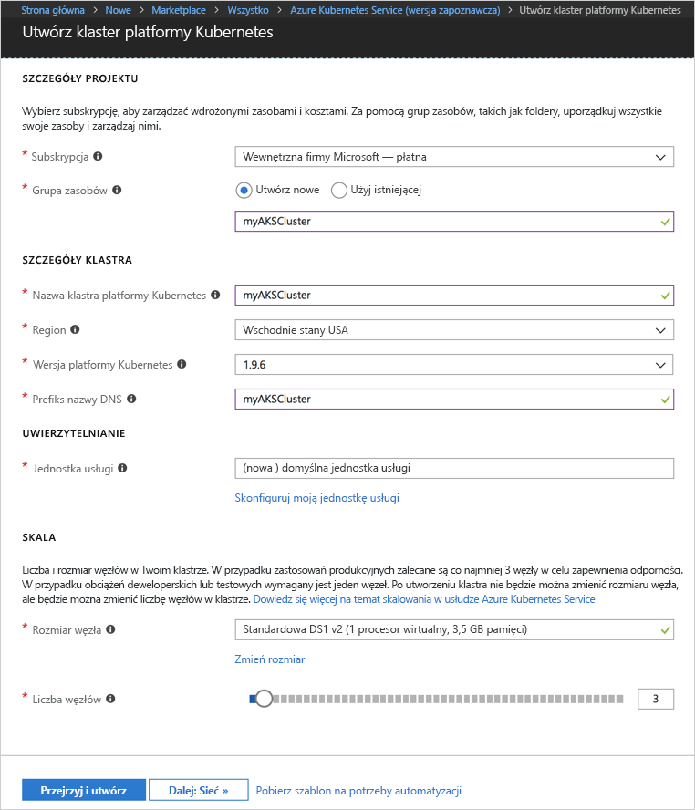
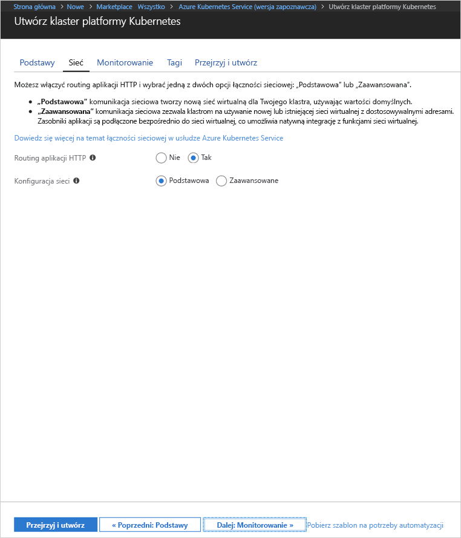
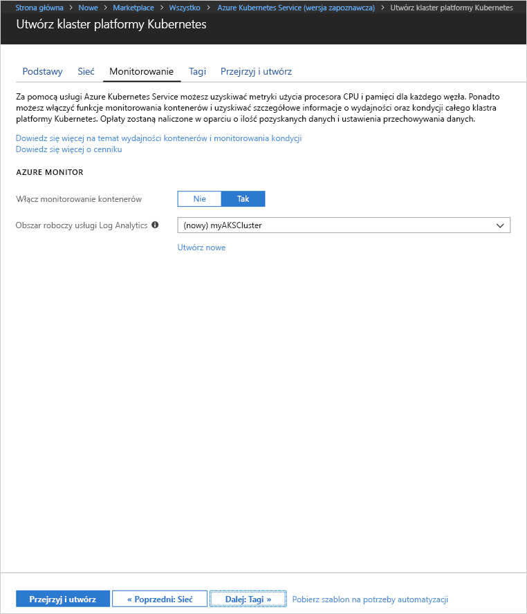
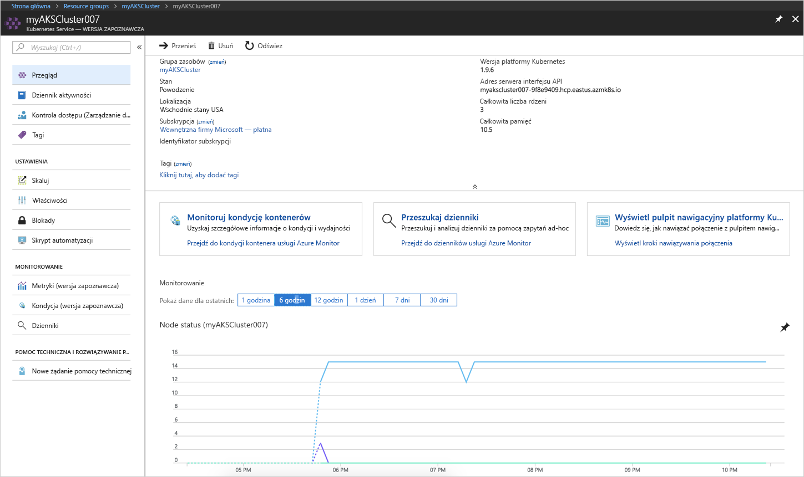
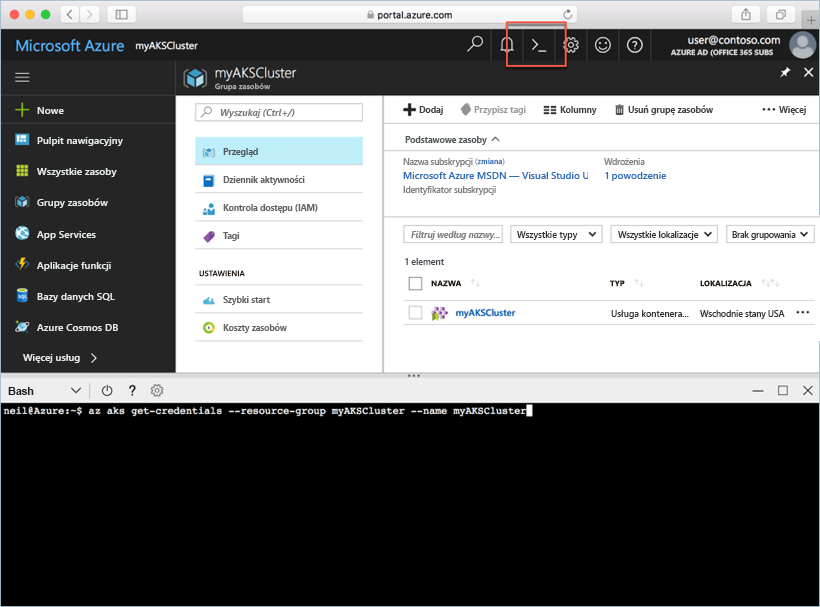
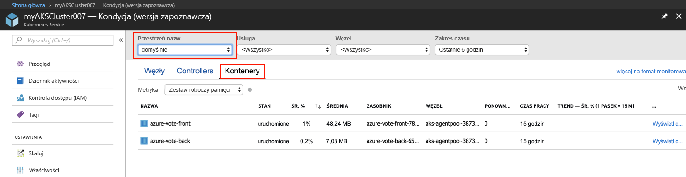
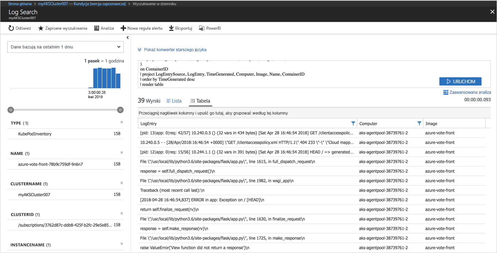

# <a name="quickstart-deploy-an-azure-kubernetes-service-aks-cluster"></a>Szybki start: wdrażanie klastra usługi Azure Kubernetes Service (AKS)

W tym przewodniku Szybki start wdrażany jest klaster AKS przy użyciu witryny Azure Portal. Następnie w klastrze jest uruchamiana aplikacja obsługująca wiele kontenerów, która składa się z frontonu internetowego i wystąpienia pamięci podręcznej Redis. Po ukończeniu aplikacja będzie dostępna w Internecie.


W tym przewodniku Szybki start założono, że masz podstawową wiedzę na temat pojęć związanych z rozwiązaniem Kubernetes. Aby uzyskać szczegółowe informacje na jego temat, zapoznaj się z [dokumentacją rozwiązania Kubernetes][kubernetes-documentation].

## <a name="sign-in-to-azure"></a>Logowanie do platformy Azure

Zaloguj się do witryny Azure Portal pod adresem http://portal.azure.com.


## <a name="create-aks-cluster"></a>Tworzenie klastra AKS

Wybierz pozycję **Utwórz zasób** > wyszukaj pozycję **Kubernetes** > wybierz pozycję **Kubernetes Service** > **Utwórz**.

Wykonaj poniższe kroki pod każdym nagłówkiem formularza tworzenia klastra AKS.

- **SZCZEGÓŁY PROJEKTU**: wybierz subskrypcję platformy Azure oraz nową lub istniejącą grupę zasobów platformy Azure.
- **SZCZEGÓŁY KLASTRA**: wprowadź nazwę, region, wersję i prefiks nazwy DNS dla klastra AKS.
- **UWIERZYTELNIANIE**: utwórz nową główną nazwę usługi lub użyj istniejącej. W przypadku korzystania z istniejącej głównej nazwy usługi należy podać identyfikator klienta i klucz tajny głównej nazwy usługi.
- **SKALA**: wybierz rozmiar maszyny wirtualnej dla węzłów AKS. Rozmiar maszyny wirtualnej **nie może** zostać zmieniony po wdrożeniu klastra AKS. Ponadto wybierz liczbę węzłów do wdrożenia w klastrze. Liczbę węzłów **można** dostosować po wdrożeniu klastra.

Po zakończeniu wybierz pozycję **Dalej: sieć**.



Skonfiguruj następujące opcje sieciowe:

- **Routing aplikacji protokołu HTTP** — konfiguruje zintegrowany kontroler danych przychodzących z automatycznym tworzeniem publicznej nazwy DNS. Aby uzyskać więcej informacji na temat routingu Http, zobacz [Routing HTTP i DNS w usłudze AKS][http-routing].
- **Konfiguracja sieci** — wybierz między podstawową konfiguracją sieci z użyciem wtyczki Kubernetes [kubenet][kubenet] a zaawansowaną konfiguracją sieci z użyciem usługi [Azure CNI ][azure-cni]. Aby uzyskać więcej informacji na temat opcji sieciowych, zobacz [Przegląd opcji sieciowych usługi AKS][aks-network].

Po zakończeniu wybierz pozycję **Dalej: monitorowanie**.



W przypadku wdrażania klastra AKS można skonfigurować usługę Azure Container Insights do monitorowania kondycji klastra AKS i zasobników uruchomionych w klastrze. Aby uzyskać więcej informacji dotyczących monitorowania kondycji kontenera, zobacz [Monitorowanie kondycji usługi Azure Kubernetes Service][aks-monitor].

Wybierz pozycję **Tak**, aby włączyć monitorowanie kontenera i wybierz istniejący obszar roboczy usługi Log Analytics lub utwórz nowy.

Wybierz pozycje **Przegląd + utwórz**, a następnie po zakończeniu wybierz pozycję **Utwórz**.



Po krótkim czasie oczekiwania klaster AKS zostanie wdrożony i będzie gotowy do użycia. Przejdź do grupy zasobów klastra AKS i wybierz zasób AKS. Powinien zostać wyświetlony pulpit nawigacyjny klastra AKS.



## <a name="connect-to-the-cluster"></a>Łączenie z klastrem

Aby zarządzać klastrem Kubernetes, należy użyć klienta wiersza polecenia usługi Kubernetes, narzędzia [kubectl][kubectl]. Klient kubectl jest preinstalowany wraz z usługą Azure Cloud Shell.

Otwórz usługę Cloud Shell za pomocą przycisku w prawym górnym rogu witryny Azure Portal.



Za pomocą polecenia [az aks get-credentials][az-aks-get-credentials] skonfiguruj narzędzie kubectl w celu nawiązania połączenia z klastrem Kubernetes.

Skopiuj poniższe polecenie i wklej je w usłudze Cloud Shell. W razie potrzeby zmodyfikuj nazwę klastra i nazwę grupy zasobów.

```azurecli-interactive
az aks get-credentials --resource-group myAKSCluster --name myAKSCluster
```

Aby sprawdzić połączenie z klastrem, użyj polecenia [kubectl get][kubectl-get], aby powrócić do listy węzłów klastra.

```azurecli-interactive
kubectl get nodes
```

Dane wyjściowe:

```
NAME                       STATUS    ROLES     AGE       VERSION
aks-agentpool-11482510-0   Ready     agent     9m        v1.9.6
aks-agentpool-11482510-1   Ready     agent     8m        v1.9.6
aks-agentpool-11482510-2   Ready     agent     9m        v1.9.6
```

## <a name="run-the-application"></a>Uruchamianie aplikacji

Pliki manifestu rozwiązania Kubernetes definiują żądany stan klastra, w tym informacje o obrazach kontenera, które powinny zostać uruchomione. W tym przykładzie manifest służy do tworzenia wszystkich obiektów potrzebnych do uruchomienia aplikacji Azure Vote. Obiekty te obejmują dwa [wdrożenia rozwiązania Kubernetes][kubernetes-deployment] — jedno dla frontonu aplikacji Azure Vote i jedno dla wystąpienia usługi Redis. Tworzone są również dwie [usługi rozwiązania Kubernetes] [ kubernetes-service] — wewnętrzna usługa dla wystąpienia usługi Redis i zewnętrzna usługa służąca do uzyskiwania dostępu do aplikacji Azure Vote z Internetu.

Utwórz plik o nazwie `azure-vote.yaml` i skopiuj go do poniższego kodu YAML. Jeśli pracujesz w usłudze Azure Cloud Shell, utwórz ten plik przy użyciu serwera vi lub Nano, tak jak podczas pracy w systemie wirtualnym lub fizycznym.

```yaml
apiVersion: apps/v1beta1
kind: Deployment
metadata:
  name: azure-vote-back
spec:
  replicas: 1
  template:
    metadata:
      labels:
        app: azure-vote-back
    spec:
      containers:
      - name: azure-vote-back
        image: redis
        ports:
        - containerPort: 6379
          name: redis
---
apiVersion: v1
kind: Service
metadata:
  name: azure-vote-back
spec:
  ports:
  - port: 6379
  selector:
    app: azure-vote-back
---
apiVersion: apps/v1beta1
kind: Deployment
metadata:
  name: azure-vote-front
spec:
  replicas: 1
  template:
    metadata:
      labels:
        app: azure-vote-front
    spec:
      containers:
      - name: azure-vote-front
        image: microsoft/azure-vote-front:v1
        ports:
        - containerPort: 80
        env:
        - name: REDIS
          value: "azure-vote-back"
---
apiVersion: v1
kind: Service
metadata:
  name: azure-vote-front
spec:
  type: LoadBalancer
  ports:
  - port: 80
  selector:
    app: azure-vote-front
```

Użyj polecenia [kubectl apply][kubectl-apply], aby uruchomić aplikację.

```azurecli-interactive
kubectl apply -f azure-vote.yaml
```

Dane wyjściowe:

```
deployment "azure-vote-back" created
service "azure-vote-back" created
deployment "azure-vote-front" created
service "azure-vote-front" created
```

## <a name="test-the-application"></a>Testowanie aplikacji

Podczas uruchamiania aplikacji tworzona jest [usługa Kubernetes][kubernetes-service], która uwidacznia aplikację w Internecie. Ten proces może potrwać kilka minut.

Aby monitorować postęp, użyj polecenia [kubectl get-service][kubectl-get] z argumentem `--watch`.

```azurecli-interactive
kubectl get service azure-vote-front --watch
```

Początkowo adres *EXTERNAL-IP* dla usługi *azure-vote-front* pojawia się jako *oczekujący*.

```
NAME               TYPE           CLUSTER-IP   EXTERNAL-IP   PORT(S)        AGE
azure-vote-front   LoadBalancer   10.0.37.27   <pending>     80:30572/TCP   6s
```

Po zmianie adresu *EXTERNAL-IP* z *oczekującego* na *adres IP*, zatrzymaj proces śledzenia narzędzia kubectl za pomocą polecenia `CTRL-C`.

```
azure-vote-front   LoadBalancer   10.0.37.27   52.179.23.131   80:30572/TCP   2m
```

Następnie przejdź do zewnętrznego adresu IP, aby wyświetlić aplikację Azure Vote.


## <a name="monitor-health-and-logs"></a>Monitorowanie kondycji i dzienników

W przypadku włączenia monitorowania szczegółowych informacji o kontenerze metryki kondycji dla klastra AKS i zasobników uruchomionych w klastrze są dostępne na pulpicie nawigacyjnym klastra usługi AKS. Aby uzyskać więcej informacji dotyczących monitorowania kondycji kontenera, zobacz [Monitorowanie kondycji usługi Azure Kubernetes Service][aks-monitor].

Aby wyświetlić bieżący stan, czas pracy i użycie zasobów dla zasobników usługi Azure Vote, przejdź wstecz do zasobu AKS, wybierz pozycję **Monitorowanie kondycji kontenera** > wybierz **domyślną** przestrzeń nazw > i wybierz **Kontenery**. Zebranie tych danych w witrynie Azure Portal może zająć kilka minut.



Aby wyświetlić dzienniki dla zasobnika `azure-vote-front`, wybierz link **Wyświetl dzienniki**. Dzienniki te obejmują strumienie stdout i stderr z kontenera.



## <a name="delete-cluster"></a>Usuwanie klastra

Gdy klaster nie będzie już potrzebny, usuń zasób klastra, co spowoduje usunięcie wszystkich skojarzonych zasobów. Tę operację można wykonać w witrynie Azure Portal, wybierając przycisk Usuń na pulpicie nawigacyjnym klastra usługi AKS. Ewentualnie można użyć polecenia [az aks delete][az-aks-delete] w usłudze Cloud Shell.

```azurecli-interactive
az aks delete --resource-group myAKSCluster --name myAKSCluster --no-wait
```

## <a name="get-the-code"></a>Uzyskiwanie kodu

W tym przewodniku Szybki start jest tworzone wdrożenie rozwiązania Kubernetes za pomocą utworzonych wcześniej obrazów kontenerów. Powiązany kod aplikacji, plik Dockerfile i plik manifestu rozwiązania Kubernetes są dostępne w serwisie GitHub.

[https://github.com/Azure-Samples/azure-voting-app-redis][azure-vote-app]

## <a name="next-steps"></a>Następne kroki

W tym przewodniku Szybki start wdrożono klaster Kubernetes oraz wdrożono w nim aplikację obsługującą wiele kontenerów.

Aby dowiedzieć się więcej o usłudze AKS i poznać dokładnie proces od kompletnego kodu do wdrożenia, przejdź do samouczka dotyczącego klastra Kubernetes.

> [!div class="nextstepaction"]
> [Samouczek usługi AKS][aks-tutorial]

<!-- LINKS - external -->
[azure-vote-app]: https://github.com/Azure-Samples/azure-voting-app-redis.git
[azure-cni]: https://github.com/Azure/azure-container-networking/blob/master/docs/cni.md
[kubectl]: https://kubernetes.io/docs/user-guide/kubectl/
[kubectl-apply]: https://kubernetes.io/docs/reference/generated/kubectl/kubectl-commands#apply
[kubectl-get]: https://kubernetes.io/docs/reference/generated/kubectl/kubectl-commands#get
[kubenet]: https://kubernetes.io/docs/concepts/cluster-administration/network-plugins/#kubenet
[kubernetes-deployment]: https://kubernetes.io/docs/concepts/workloads/controllers/deployment/
[kubernetes-documentation]: https://kubernetes.io/docs/home/
[kubernetes-service]: https://kubernetes.io/docs/concepts/services-networking/service/

<!-- LINKS - internal -->
[az-aks-get-credentials]: /cli/azure/aks?view=azure-cli-latest#az_aks_get_credentials
[az-aks-delete]: /cli/azure/aks#az-aks-delete
[aks-monitor]: ../monitoring/monitoring-container-health.md
[aks-network]: ./networking-overview.md
[aks-tutorial]: ./tutorial-kubernetes-prepare-app.md
[http-routing]: ./http-application-routing.md
