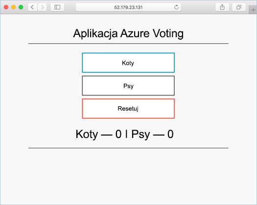

# <a name="tutorial-run-applications-in-azure-kubernetes-service-aks"></a>Samouczek: uruchamianie aplikacji w usłudze Azure Kubernetes Service (AKS)

Usługa Kubernetes zapewnia rozproszoną platformę dla konteneryzowanych aplikacji. Możesz kompilować i wdrażać własne aplikacje oraz usługi w klastrze Kubernetes, który zarządza dostępnością i łącznością. W tym samouczku (część czwarta z siedmiu) przykładowa aplikacja jest wdrażana w klastrze Kubernetes. Omawiane kwestie:

> [!div class="checklist"]
> * Aktualizowanie pliku manifestu Kubernetes
> * Uruchamianie aplikacji w usłudze Kubernetes
> * Testowanie aplikacji

W dodatkowych samouczkach ta aplikacja jest skalowana w poziomie i aktualizowana.

W tym przewodniku Szybki start założono, że masz podstawową wiedzę na temat pojęć związanych z rozwiązaniem Kubernetes. Aby uzyskać więcej informacji, zobacz [Kubernetes podstawowe pojęcia dotyczące usługi Azure Kubernetes Service (AKS)][kubernetes-concepts].

## <a name="before-you-begin"></a>Przed rozpoczęciem

W poprzednich samouczkach aplikacja została spakowana w postaci obrazu kontenera, obraz został przekazany do usługi Azure Container Registry i utworzono klaster usługi Kubernetes.

Do ukończenia tego samouczka potrzebujesz wstępnie utworzonego pliku manifestu usługi Kubernetes `azure-vote-all-in-one-redis.yaml`. Ten plik został pobrany z kodu źródłowego aplikacji w poprzednim samouczku. Sprawdź, czy został utworzony klon repozytorium oraz czy katalogi zostały zmienione na sklonowane repozytorium. Jeśli nie wykonano tych kroków, a chcesz skorzystać z [samouczka 1 — Tworzenie obrazów kontenerów][aks-tutorial-prepare-app].

Ten samouczek wymaga interfejsu wiersza polecenia platformy Azure w wersji 2.0.53 lub nowszej. Uruchom polecenie `az --version`, aby dowiedzieć się, jaka wersja jest używana. Jeśli konieczna będzie instalacja lub uaktualnienie, zobacz [Instalowanie interfejsu wiersza polecenia platformy Azure][azure-cli-install].

## <a name="update-the-manifest-file"></a>Aktualizowanie pliku manifestu

W tych samouczkach w wystąpieniu usługi Azure Container Registry (ACR) przechowywany jest obraz kontenera na potrzeby przykładowej aplikacji. W celu wdrożenia aplikacji należy zaktualizować nazwę obrazu w pliku manifestu usługi Kubernetes w taki sposób, aby uwzględniała nazwę serwera logowania usługi ACR.

Pobierz nazwę serwera logowania usługi ACR przy użyciu polecenia [AZ ACR list][az-acr-list] w następujący sposób:

```azurecli
az acr list --resource-group myResourceGroup --query "[].{acrLoginServer:loginServer}" --output table
```

Przykładowy plik manifestu z repozytorium git sklonowany w pierwszym samouczku korzysta z nazwy serwera logowania *microsoft*. Upewnij się, że jesteś w sklonowanym katalogu *azure-voting-app-redis*, a następnie otwórz plik manifestu za pomocą edytora tekstów, takiego jak `vi`:

```console
vi azure-vote-all-in-one-redis.yaml
```

Zastąp wartość *microsoft* nazwą serwera logowania usługi ACR. Nazwa obrazu znajduje się w wierszu 51 pliku manifestu. W poniższym przykładzie przedstawiono domyślną nazwę obrazu:

```yaml
containers:
- name: azure-vote-front
  image: microsoft/azure-vote-front:v1
```

Podaj własną nazwę serwera logowania usługi ACR, aby plik manifestu wyglądał podobnie jak w poniższym przykładzie:

```yaml
containers:
- name: azure-vote-front
  image: <acrName>.azurecr.io/azure-vote-front:v1
```

Zapisz i zamknij plik. W programie `vi` użyj polecenia `:wq`.

## <a name="deploy-the-application"></a>Wdrażanie aplikacji

Aby wdrożyć aplikację, użyj polecenia [polecenia kubectl Apply][kubectl-apply] . To polecenie analizuje plik manifestu i tworzy zdefiniowane obiekty usługi Kubernetes. Określ przykładowy plik manifestu, jak pokazano w poniższym przykładzie:

```console
kubectl apply -f azure-vote-all-in-one-redis.yaml
```

Następujące przykładowe dane wyjściowe przedstawiają pomyślnie utworzone zasoby w klastrze usługi AKS:

```
$ kubectl apply -f azure-vote-all-in-one-redis.yaml

deployment "azure-vote-back" created
service "azure-vote-back" created
deployment "azure-vote-front" created
service "azure-vote-front" created
```

## <a name="test-the-application"></a>Testowanie aplikacji

Podczas uruchamiania aplikacji usługa Kubernetes uwidacznia fronton aplikacji w Internecie. Ten proces może potrwać kilka minut.

Aby monitorować postęp, użyj polecenia [kubectl get-service][kubectl-get] z argumentem `--watch`.

```console
kubectl get service azure-vote-front --watch
```

Początkowo adres *EXTERNAL-IP* dla usługi *azure-vote-front* jest wyświetlany jako *oczekujący*:

```
azure-vote-front   LoadBalancer   10.0.34.242   <pending>     80:30676/TCP   5s
```

Gdy dla adresu *EXTERNAL-IP* wartość *oczekujący* zmieni się na rzeczywisty publiczny adres IP, naciśnij klawisze `CTRL-C`, aby zatrzymać proces śledzenia narzędzia `kubectl`. Następujące przykładowe dane wyjściowe przedstawiają prawidłowy publiczny adres IP przypisany do usługi:

```
azure-vote-front   LoadBalancer   10.0.34.242   52.179.23.131   80:30676/TCP   67s
```

Aby wyświetlić działającą aplikację, otwórz zewnętrzny adres IP usługi w przeglądarce internetowej:



Jeśli aplikacja nie została załadowana, może być to spowodowane problemem z autoryzacją rejestru obrazów. Aby wyświetlić stan kontenerów, użyj polecenia `kubectl get pods`. Jeśli nie można ściągnąć obrazów kontenerów, zobacz [uwierzytelnianie za pomocą Azure Container Registry z usługi Azure Kubernetes](cluster-container-registry-integration.md).

## <a name="next-steps"></a>Następne kroki

W tym samouczku przykładowa aplikacja do głosowania na platformie Azure została wdrożona w klastrze Kubernetes w usłudze AKS. W tym samouczku omówiono:

> [!div class="checklist"]
> * Aktualizowanie plików manifestu usługi Kubernetes
> * Uruchamianie aplikacji w usłudze Kubernetes
> * Testowanie aplikacji

Przejdź do następnego samouczka, aby uzyskać informacje na temat sposobu skalowania aplikacji Kubernetes i bazowej infrastruktury usługi Kubernetes.

> [!div class="nextstepaction"]
> [Skalowanie aplikacji i infrastruktury rozwiązania Kubernetes][aks-tutorial-scale]

<!-- LINKS - external -->
[kubectl-apply]: https://kubernetes.io/docs/reference/generated/kubectl/kubectl-commands#apply
[kubectl-create]: https://kubernetes.io/docs/reference/generated/kubectl/kubectl-commands#create
[kubectl-get]: https://kubernetes.io/docs/reference/generated/kubectl/kubectl-commands#get

<!-- LINKS - internal -->
[aks-tutorial-prepare-app]: ./tutorial-kubernetes-prepare-app.md
[aks-tutorial-scale]: ./tutorial-kubernetes-scale.md
[az-acr-list]: /cli/azure/acr
[azure-cli-install]: /cli/azure/install-azure-cli
[kubernetes-concepts]: concepts-clusters-workloads.md
[kubernetes-service]: concepts-network.md#services
