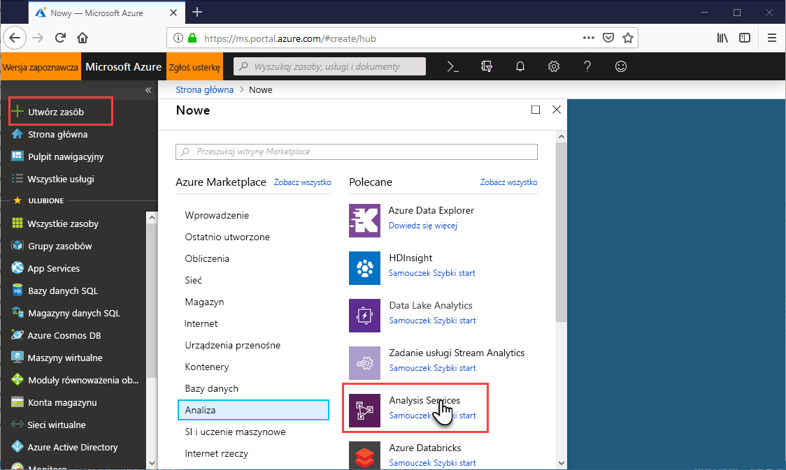
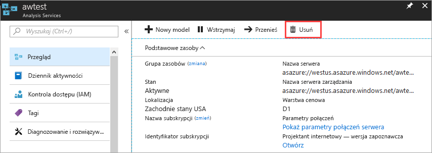

# Tworzenie serwera usług Analysis Services w portalu Azure
W tym artykule przedstawiono tworzenie zasobu serwera usług Analysis Services w ramach subskrypcji platformy Azure.

Przed rozpoczęciem należy: 

* **Subskrypcja platformy Azure**: odwiedź stronę [bezpłatnej wersji próbnej platformy Azure](https://azure.microsoft.com/offers/ms-azr-0044p/), aby utworzyć konto.
* **Usługa Azure Active Directory**: subskrypcji musi być skojarzony z dzierżawy usługi Azure Active Directory. A, musisz być zalogowany na platformie Azure przy użyciu konta w tej usłudze Azure Active Directory. Aby dowiedzieć się więcej, zobacz [Authentication and user permissions (Uwierzytelnianie i uprawnienia użytkownika)](analysis-services-manage-users.md).

## Logowanie do witryny Azure Portal 

Zaloguj się do witryny [Azure Portal](https://portal.azure.com).

## Tworzenie serwera

1. Kliknij przycisk **+ Utwórz zasób** > **dane i analiza** > **usług Analysis Services**.

    

2. W **usług Analysis Services**, wypełnij wymagane pola, a następnie naciśnij klawisz **Utwórz**.
   
    
   
   * **Nazwa serwera**: wpisz unikatową nazwę używany do serwera.
   * **Subskrypcja**: Wybierz subskrypcję tego serwera zostanie skojarzona.
   * **Grupa zasobów**: Utwórz nową grupę zasobów lub wybierz jeden już istnieje. Grupy zasobów zostały zaprojektowane ułatwiające zarządzanie kolekcją zasobów systemu Azure. Aby dowiedzieć się więcej, zobacz [grup zasobów](../azure-resource-manager/resource-group-overview.md).
   * **Lokalizacja**: Lokalizacja centrum danych Azure ten obsługuje serwer. Wybierz lokalizację najbliżej największy bazy użytkowników.
   * **Warstwa cenowa**: Wybierz warstwę cenową. Jeśli testujesz i ma zostać zainstalowana przykładowa baza danych modelu, wybierz wolnych **D1** warstwy. Aby dowiedzieć się więcej, zobacz [cennik usług Azure Analysis Services](https://azure.microsoft.com/pricing/details/analysis-services/). 
    * **Administrator**: domyślnie są to użytkownik jest zalogowany przy użyciu konta. Można wybrać inne konto w usłudze Azure Active Directory.
    * **Wykonaj kopię zapasową ustawienia magazynu**: opcjonalne. Jeśli masz już [konta magazynu](../storage/common/storage-introduction.md), możesz podać go jako domyślny dla kopii zapasowej bazy danych modelu. Można również określić [i przywracania kopii zapasowych](analysis-services-backup.md) ustawienia później.
    * **Magazyn kluczy wygaśnięcia**: opcjonalne. Określ okres ważności klucza magazynu.
3. Kliknij przycisk **Utwórz**.

Utwórz potrzebuje zazwyczaj w kilka minut. W przypadku wybrania **dodać do portalu**, przejdź do portalu w taki sposób, aby wyświetlić nowy serwer. Lub przejdź do **wszystkie usługi** > **usług Analysis Services** czy serwer jest gotowy.

## Oczyszczanie zasobów
Gdy nie są już potrzebne, można usunąć serwera. Znajdujących się na serwerze **omówienie**, kliknij przycisk **usunąć**. 

 

## Kolejne kroki

[Dodawanie modelu danych przykładowych](analysis-services-create-sample-model.md) do serwera.  
[Zainstaluj bramę danych lokalnego](analysis-services-gateway-install.md) Jeśli łączy się lokalnych źródeł danych z modelu danych.  
[Wdrażanie projektu modelu tabelarycznego](analysis-services-deploy.md) z programu Visual Studio.   

