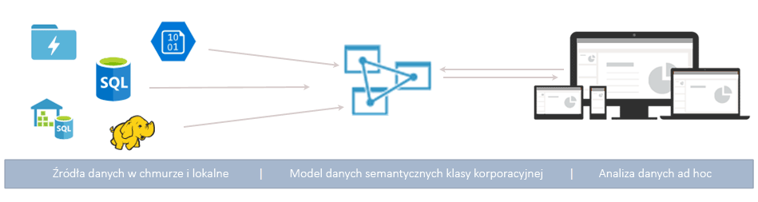
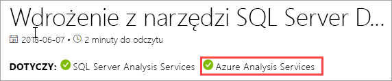
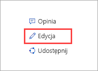

# Co to są usługi Azure Analysis Services?

Azure Analysis Services to w pełni zarządzana platforma jako usługa (PaaS), która oferuje modele danych klasy korporacyjnej w chmurze. Zaawansowane funkcje mieszania i modelowania umożliwiają łączenie danych z wielu źródeł, definiowanie metryk oraz zabezpieczanie danych w jednym zaufanym tabelarycznym modelu danych semantycznych. Model danych umożliwia użytkownikom łatwiejsze i szybsze przeglądanie ogromnych ilości danych na potrzeby analizy danych ad hoc.

**Wideo:** zapoznaj się z [omówieniem usługi Azure Analysis Services](https://sec.ch9.ms/ch9/d6dd/a1cda46b-ef03-4cea-8f11-68da23c5d6dd/AzureASoverview_high.mp4), aby dowiedzieć się, jakie miejsce usługa ta zajmuje wśród ogólnych możliwości analizy biznesowej oferowanych przez firmę Microsoft.

## Rozpocznij pracę w mgnieniu oka

W witrynie Azure Portal [serwer można utworzyć](analysis-services-create-server.md) w ciągu kilku minut. [Szablony](../azure-resource-manager/resource-manager-create-first-template.md) usługi Azure Resource Manager i program PowerShell pozwalają natomiast tworzyć serwery za pomocą szablonu deklaratywnego. Pojedynczy szablon pozwala wdrażać zasoby serwera wraz z innymi składnikami platformy Azure, takimi jak konta magazynu i usługa Azure Functions. 

**Wideo:** zapoznaj się z [automatycznym wdrażaniem](https://channel9.msdn.com/series/Azure-Analysis-Services/AzureAnalysisServicesAutomation), aby dowiedzieć się więcej na temat przyspieszania tworzenia serwera za pomocą usługi Azure Automation.

Usługi Azure Analysis Services można zintegrować z wieloma usługami platformy Azure, umożliwiając tworzenie wyrafinowanych rozwiązań analitycznych. Integracja z usługą [Azure Active Directory](../active-directory/fundamentals/active-directory-whatis.md) zapewnia bezpieczny i oparty na rolach dostęp do kluczowych danych. Jest możliwa integracja z potokami usługi [Azure Data Factory](../data-factory/introduction.md) przez uwzględnienie działania ładującego dane do modelu. Istnieje możliwość prostego organizowania modeli za pomocą usług [Azure Automation](../automation/automation-intro.md) i [Azure Functions](../azure-functions/functions-overview.md) oraz niestandardowego kodu. 

## Odpowiednia warstwa dopasowana do potrzeb

Usługa Azure Analysis Services jest dostępna w warstwach **Deweloper**, **Podstawowa** i **Standardowa**. W każdej warstwie cena planu zależy od mocy przetwarzania, jednostek QPU i rozmiaru pamięci. Plan w ramach warstwy wybiera się podczas tworzenia serwera. W ramach tej samej warstwy można zmieniać plany w górę lub w dół albo przejść na wyższą warstwę, ale nie można przejść z warstwy wyższej na niższą.

### Warstwa Deweloper

Ta warstwa jest zalecana w przypadku scenariuszy związanych z oceną, programowaniem i testowaniem. Pojedynczy plan uwzględnia wszystkie funkcje warstwy Standardowa, ale ma ograniczenia dotyczące mocy obliczeniowej, jednostek QPU i rozmiaru pamięci. Skalowanie repliki zapytania *jest niedostępne* w tej warstwie. W tej warstwie nie jest oferowana umowa SLA.

|Plan  |QPU  |Pamięć (GB)  |
|---------|---------|---------|
|D1    |    20     |    3     |

### Warstwa Basic

Warstwa polecana w przypadku rozwiązań produkcyjnych z niewielkimi modelami tabelarycznymi, ograniczoną współbieżnością użytkowników i prostymi wymaganiami dotyczącymi odświeżania danych. Skalowanie repliki zapytania *jest niedostępne* w tej warstwie. Perspektywy, wiele partycji ani funkcje modelu tabelarycznego DirectQuery *nie są obsługiwane* w tej warstwie.  

|Plan  |QPU  |Pamięć (GB)  |
|---------|---------|---------|
|B1    |    40     |    10     |
|B2    |    80     |    16     |

### Warstwa standardowa

Ta warstwa jest najlepszym rozwiązaniem w przypadku aplikacji produkcyjnych o kluczowym znaczeniu, które wymagają elastycznej współbieżności użytkowników i korzystają z szybko rozrastających się modeli danych. Obsługuje ona zaawansowane odświeżanie danych dla aktualizacji modelu danych przeprowadzanych prawie w czasie rzeczywistym i obsługuje wszystkie tabelaryczne funkcje modelowania.

|Plan  |QPU  |Pamięć (GB)  |
|---------|---------|---------|
|S0    |    40     |    10     |
|S1    |    100     |    25     |
|S2    |    200     |    50     |
|S4    |    400     |    100     |
|S8*    |    320     |    200     |
|S9*    |    640    |    400     |
|S8v2*    |    640     |    200     |
|S9v2*    |    1280    |    400     |

\* Niedostępna we wszystkich regionach.  

## Dostępność według regionów

Usługa Azure Analysis Services jest obsługiwana w regionach na całym świecie. Obsługiwane plany i dostępność repliki zapytania zależą od wybranego regionu. Plan i dostępność repliki zapytania może ulec zmianie w zależności od potrzeb i dostępnych zasobów dla każdego regionu. 

### Ameryki

|Region  | Obsługiwane plany | Repliki zapytania (tylko plany Standard) |
|---------|---------|:---------:|
|Brazylia Południowa     |    B1, B2, S0, S1, S2, S4, D1     |     1    |
|Kanada Środkowa    |     B1, B2, S0, S1, S2, S4, D1    |     1    |
|Wschodnie stany USA     |     B1, B2, S0, S1, S2, S4, D1    |    1     |
|Wschodnie stany USA 2     |     B1, B2, S0, S1, S2, S4, D1   |    7    |
|Wschodnie stany USA 2     |     S8, S9, S8v2, S9v2   |    1    |
|Północno-środkowe stany USA     |     B1, B2, S0, S1, S2, S4, D1     |    1     |
|Środkowe stany USA     |    B1, B2, S0, S1, S2, S4, D1     |    1     |
|Południowo-środkowe stany USA     |    B1, B2, S0, S1, S2, S4, D1     |    1     |
|Zachodnio-środkowe stany USA   |     B1, B2, S0, S1, S2, S4, D1    |    3     |
|Zachodnie stany USA     |    B1, B2, S0, S1, S2, S4, D1    |    7   |
|Zachodnie stany USA     |    S8, S9, S8v2, S9v2   |    2  |
|Zachodnie stany USA 2    |    B1, B2, S0, S1, S2, S4, D1    |    3   |
|Zachodnie stany USA 2    |    S8, S9, S8v2, S9v2  |    1     |

### Europa

|Region  | Obsługiwane plany | Repliki zapytania (tylko plany Standard) |
|---------|---------|:---------:|
|Europa Północna     |    B1, B2, S0, S1, S2, S4, D1      |    7     |
|Europa Północna     |    S8v2, S9v2      |    3     |
|Południowe Zjednoczone Królestwo     |    B1, B2, S0, S1, S2, S4, D1      |     1    |
|Europa Zachodnia     |    B1, B2, S0, S1, S2, S4, D1   |    7    |
|Europa Zachodnia    |   S8, S9, S8v2, S9v2  |  1  |

### Azja i Pacyfik 

|Region  | Obsługiwane plany | Repliki zapytania (tylko plany Standard) |
|---------|---------|:---------:|
|Australia Wschodnia     |    B1, B2, S0, S1, S2, S4     |    3     |
|Australia Wschodnia     |    S8, S9, S8v2, S9v2    |    1     |
|Australia Południowo-Wschodnia     | B1, B2, S0, S1, S2, S4, D1       |    1     |
|Japonia Wschodnia     |   B1, B2, S0, S1, S2, S4, D1       |    1     |
|Azja Południowo-Wschodnia     |     B1, B2, S0, S1, S2, S4, S8, S9, S8v2, S9v2, D1     |   1      |
|Indie Zachodnie     |    B1, B2, S0, S1, S2, S4, D1     |    1     |

## Skalowanie zgodnie z potrzebami

### Skalowanie w górę/dół, wstrzymywanie i wznawianie

Serwer można skalować w górę, skalować w dół lub wstrzymywać. Można do tego użyć witryny Azure Portal lub, aby mieć pełną kontrolę na bieżąco, użyć programu PowerShell. Płacisz wyłącznie za użyte zasoby.  

### Skalowanie zasobów w poziomie w celu szybkiego uzyskiwania odpowiedzi na zapytania

W przypadku skalowania w poziomie zapytania klienta są dystrybuowane między wieloma *replikami zapytania* w puli zapytania. Repliki zapytania mają zsynchronizowane kopie modeli tabelarycznych. Dzięki rozproszeniu obciążenia zapytania można zredukować czas odpowiedzi w przypadku dużych obciążeń związanych z zapytaniami. Operacje przetwarzania modelu można oddzielić od puli zapytania, dzięki czemu operacje przetwarzania nie będą wpływać negatywnie na zapytania klienta. 

Można utworzyć pulę zapytania z nawet siedmioma dodatkowymi replikami zapytania (łącznie ośmioma, wliczając serwer). Liczba replik zapytania, które można umieścić w puli, zależy od wybranego planu regionu. Repliki zapytań nie mogą być rozmieszczane poza regionem serwera. Opłaty za repliki zapytań są naliczane przy użyciu tej samej stawki, co w przypadku serwera.

Podobnie jak w przypadku zmiany warstw można skalować repliki zapytania w poziomie zgodnie z potrzebami. Konfiguracja skalowania w poziomie jest możliwa w portalu lub przy użyciu interfejsów API REST. Aby dowiedzieć się więcej, zobacz [Azure Analysis Services scale-out (Skalowanie usługi Azure Analysis Services w poziomie)](analysis-services-scale-out.md).

## Cennik

Łączny koszt zależy od wielu czynników, na przykład wybranego regionu, warstwy, replik zapytania i wstrzymywania/wznawiania. Do określenia typowych cen dla danego regionu można użyć kalkulatora [cen usługi Azure Analysis Services](https://azure.microsoft.com/pricing/details/analysis-services/). To narzędzie oblicza ceny dla wystąpienia jednego serwera w pojedynczym regionie. Pamiętaj, że opłaty za repliki zapytania są naliczane przy użyciu tej samej stawki, co w przypadku serwera. 

## Powstałe na bazie usług SQL Server Analysis Services

Usługi Azure Analysis Services są zgodne z wieloma wspaniałymi funkcjami, które już istnieją w usługach SQL Server Analysis Services Enterprise Edition. Usługa Azure Analysis Services obsługuje modele tabelaryczne na [poziomie zgodności](analysis-services-compat-level.md) 1200 lub wyższym. Modele tabelaryczne to relacyjne konstrukcje modelowania (model, tabele, kolumny) wyrażone w postaci definicji obiektów metadanych tabelarycznych w kodzie języka TMSL (Tabular Model Scripting Language) i modelu TOM (Tabular Model Object). Obsługiwane są partycje, perspektywy, zabezpieczenia na poziomie wierszy, relacje dwukierunkowe i przekształcenia\*. Modele wielowymiarowe ani dodatek PowerPivot dla programu SharePoint *nie są* obsługiwane w usłudze Azure Analysis Services.

Modele tabelaryczne w trybie w pamięci i DirectQuery są obsługiwane. Modele tabelaryczne w trybie w pamięci (tryb domyślny) obsługują wiele źródeł danych. Ponieważ model danych jest wysoce skompresowany i buforowany w pamięci, ten tryb udostępnia najszybszą odpowiedź na zapytanie dotyczące dużych ilości danych. Zapewnia on także większą elastyczność w przypadku złożonych zestawów danych i zapytań. Partycjonowanie umożliwia ładowanie przyrostowe, zwiększa możliwości przetwarzania równoległego i zmniejsza zużycie pamięci. Inne zaawansowane funkcje modelowania danych, takie jak tabele obliczeniowe, oraz wszystkie funkcje języka DAX są obsługiwane. Modele w pamięci muszą być odświeżane (przetwarzane) w celu aktualizacji informacji buforowanych na podstawie źródeł danych. Dzięki obsłudze jednostek usług platformy Azure nienadzorowane operacje odświeżania przy użyciu programu PowerShell, modelu TOM, języka TMSL i stylu REST oferują elastyczność w zakresie sprawdzania aktualności danych. 

Tryb DirectQuery* używa relacyjnej bazy danych zaplecza do magazynowania i wykonywania zapytań. Bardzo duże zestawy danych w pojedynczych źródłach danych SQL Server, SQL Server Data Warehouse, Azure SQL Database, Azure SQL Data Warehouse, Oracle i Teradata są obsługiwane. Zestawy danych zaplecza mogą przekraczać rozmiar dostępnej pamięci zasobów serwera. Złożone scenariusze odświeżania modeli danych nie są potrzebne. Istnieją również pewne ograniczenia, takie jak ograniczone typy źródeł danych, ograniczenia Formuły języka DAX i niektóre zaawansowane funkcje modelowania danych nie są obsługiwane. Przed zidentyfikowaniem odpowiadającego Ci trybu zobacz [DirectQuery mode](https://docs.microsoft.com/analysis-services/tabular-models/directquery-mode-ssas-tabular) (Tryb DirectQuery).

\* Dostępność funkcji zależy od warstwy.

## Obsługiwane źródła danych

Modele tabelaryczne w usłudze Azure Analysis Services obsługują wiele różnych źródeł danych, od prostych plików tekstowych do danych big data w usłudze Azure Data Lake Store. Aby dowiedzieć się więcej, zobacz [Data sources supported in Azure Analysis Services (Źródła danych obsługiwane w usługach Azure Analysis Services)](analysis-services-datasource.md).

## Poziom zgodności

Poziom zgodności dotyczy zachowań specyficznych dla wersji w aparacie Analysis Services. Azure Analysis Services obsługuje modele tabelaryczne na poziomach zgodności 1200 i wyższych. Aby dowiedzieć się więcej, zobacz [poziom zgodności dla modeli tabelarycznych](https://docs.microsoft.com/analysis-services/tabular-models/compatibility-level-for-tabular-models-in-analysis-services).

## Twoje dane są bezpieczne

Usługa Azure Analysis Services oferuje zabezpieczenia danych poufnych na wielu poziomach. Usługi Analysis Services, jako usługi platformy Azure, udostępniają automatycznie włączony poziom **Podstawowy** ataków typu DDoS (rozproszona odmowa usługi) w ramach platformy Azure. Aby dowiedzieć się więcej, zobacz [Azure DDoS Protection Standard overview (Omówienie usługi Azure DDoS Protection w warstwie Standardowa)](../virtual-network/ddos-protection-overview.md). 

Na poziomie serwera usługi Analysis Services oferują zaporę, uwierzytelnianie platformy Azure, role administratora serwera i szyfrowanie po stronie serwera. Na poziomie modelu danych zabezpieczenia ról użytkownika, na poziomie wiersza i na poziomie zapewniają bezpieczeństwo danych, które będą widoczne tylko dla użytkowników, którzy powinni je widzieć.

### Zapora

Zapora usługi Azure Analysis Services blokuje wszystkie połączenia klienta inne niż adresy IP określone w regułach. Domyślnie ochrona za pomocą zapory nie jest włączana w przypadku nowych serwerów. Zalecane jest włączenie ochrony za pomocą zapory i skonfigurowanie zasad w ramach skryptu inicjowania obsługi serwera lub w portalu natychmiast po utworzeniu serwera. Skonfiguruj reguły, określając dozwolone adresy IP przy użyciu poszczególnych adresów IP klientów lub zakresu. Połączenia usługi Power BI również mogą być dozwolone lub zablokowane. Zaporę i reguły należy skonfigurować w portalu lub przy użyciu programu PowerShell. Aby dowiedzieć się więcej, zobacz [Configure a server firewall](analysis-services-qs-firewall.md) (Konfigurowanie zapory serwera).

### Uwierzytelnianie

Uwierzytelnianie użytkownika jest obsługiwane przez usługę [Azure Active Directory (AAD)](../active-directory/fundamentals/active-directory-whatis.md). Podczas logowania użytkownicy korzystają z tożsamości konta organizacji z dostępem do bazy danych opartym na rolach. Tożsamości użytkowników muszą być członkami domyślnej usługi Azure Active Directory dla subskrypcji, w której znajduje się serwer. Aby dowiedzieć się więcej, zobacz [Authentication and user permissions (Uwierzytelnianie i uprawnienia użytkownika)](analysis-services-manage-users.md).

### Bezpieczeństwo danych

Usługa Azure Analysis Services używa magazynu Azure Blob Storage jako trwałego magazynu przechowania danych i metadanych dla baz danych usługi Analysis Services. Pliki danych w ramach obiektu blob są szyfrowane za pomocą [szyfrowania po stronie serwera (SSE) obiektów blob platformy Azure](../storage/common/storage-service-encryption.md). W trybie zapytania bezpośredniego przechowywane są tylko metadane. Dostęp do danych rzeczywistych za pośrednictwem protokołu szyfrowanego ze źródła danych następuje podczas przeszukiwania.

Bezpieczny dostęp do źródeł danych przechowywanych lokalnie w organizacji jest osiągany przez instalację i skonfigurowanie [lokalnej bramy danych](analysis-services-gateway.md). Bramy zapewniają dostęp do danych w trybach DirectQuery i dostępu w pamięci.

### Role

Usługa Analysis Services używa [autoryzacji opartej na rolach](https://docs.microsoft.com/analysis-services/tabular-models/roles-ssas-tabular), która polega na udzielaniu praw dostępu do serwera oraz danych, obiektów i operacji bazy danych modeli. Wszyscy użytkownicy, którzy uzyskują dostęp do serwera lub bazy danych, robią to przy użyciu konta użytkownika usługi Azure AD w ramach przypisanej roli. Rola administratora serwera znajduje się na poziomie zasobów serwera. Domyślnie konto używane podczas tworzenia serwera jest automatycznie uwzględniane w roli administratorów serwera. Dodatkowe konta użytkowników i grup są dodawane przy użyciu portalu, programu SSMS lub programu PowerShell.
  
Użytkownicy końcowi inni niż administracyjni, którzy wykonują zapytania dotyczące danych, mają przyznawane prawa dostępu za pomocą ról bazy danych. Rola bazy danych jest tworzona jako oddzielny obiekt w bazie danych i ma zastosowanie tylko do bazy danych, w której została utworzona. Role bazy danych są definiowane w oparciu o uprawnienia administratora, odczytu oraz odczytu i przetwarzania (bazy danych). Konta użytkowników i grup są dodawane przy użyciu programu SSMS lub PowerShell.

### Zabezpieczenia na poziomie wierszy

Modele tabelaryczne na wszystkich poziomach zgodności obsługują zabezpieczenia na poziomie wiersza. Zabezpieczenia na poziomie wiersza są konfigurowane w modelu przy użyciu wyrażeń języka DAX definiujących wiersze w tabeli oraz dowolne wiersze w powiązanej tabeli wielokierunkowej, dla której użytkownik może tworzyć zapytania. Filtry wiersza używające wyrażeń języka DAX są definiowane na potrzeby uprawnień odczytu oraz odczytu i przetwarzania. 

### Zabezpieczenia na poziomie obiektu 

Modele tabelaryczne na poziomie zgodności 1400 obsługują zabezpieczenia na poziomie obiektu, które obejmują zabezpieczenia na poziomie tabeli i zabezpieczenia na poziomie kolumny. Zabezpieczenia na poziomie obiektu są ustawiane w metadanych opartych na formacie JSON w pliku Model.bim przy użyciu języka TMSL lub modelu TOM. Aby dowiedzieć się więcej, zobacz [Object-level security](https://docs.microsoft.com/analysis-services/tabular-models/object-level-security) (Zabezpieczenia na poziomie obiektu).

### Automatyzacja za pośrednictwem jednostek usług

Jednostki usług to zasoby aplikacji usługi Azure Active Directory tworzone w ramach dzierżawy w celu przeprowadzania nienadzorowanych operacji na poziomie zasobu lub usługi. Jednostki usług są używane przez usługę Azure Automation, tryb nienadzorowany programu PowerShell, niestandardowe aplikacje klienckie i aplikacje internetowe do automatyzacji typowych zadań, takich jak odświeżanie danych, skalowanie w górę lub w dół oraz wstrzymywanie i wznawianie. Uprawnienia są przypisywane do jednostek usług za pośrednictwem członkostwa w rolach. Aby dowiedzieć się więcej, zobacz [Automation with service principals](analysis-services-service-principal.md) (Automatyzacja przy użyciu jednostek usługi).

### Ład na platformie Azure

Usługa Azure Analysis Services jest objęta [warunkami dotyczącymi usług online firmy Microsoft](https://www.microsoftvolumelicensing.com/DocumentSearch.aspx?Mode=3&DocumentTypeId=31) i [zasadami zachowania poufności informacji firmy Microsoft](https://privacy.microsoft.com/privacystatement).
Aby dowiedzieć się więcej na temat zabezpieczeń platformy Azure, zobacz [Microsoft Trust Center](https://www.microsoft.com/trustcenter).

## Korzystaj z narzędzi, które już znasz

### Visual Studio

Opracowywanie i wdrażanie modeli przy użyciu programu Visual Studio z projektami Analysis Services. Rozszerzenie projekty Analysis Services zawiera szablony i kreatory umożliwiające szybkie rozpoczęcie pracy. Środowisko tworzenia modelu w programie Visual Studio zawiera teraz nowoczesne zapytania dotyczące źródła danych pobieranie danych i funkcje programu mashup dla tabelarycznych modeli 1400 i wyższych. Jeśli znasz już funkcję Get Data w programach Power BI Desktop i Excel 2016, wiesz już, jak łatwo tworzy się wysoce dostosowywalne zapytania do źródeł danych. 

Projekty Analysis Services firmy Microsoft są dostępne jako bezpłatny możliwy do zainstalowania pakiet VSIX. [Pobierz z witryny Marketplace](https://marketplace.visualstudio.com/items?itemName=ProBITools.MicrosoftAnalysisServicesModelingProjects). Rozszerzenie współpracuje z dowolną wersją programu Visual Studio 2017 lub nowszą, w tym bezpłatną wersję Community.

### Sql Server Management Studio

Zarządzaj serwerami i bazami danych modeli przy użyciu [programu SQL Server Management Studio (SSMS)](https://docs.microsoft.com/sql/ssms/download-sql-server-management-studio-ssms). Łącz się ze swoimi serwerami w chmurze. Uruchamiaj skrypty TMSL bezpośrednio z okna zapytań XMLA i automatyzuj zadania za pomocą skryptów TMSL i programu PowerShell. Nowe funkcje i możliwości pojawiają się bardzo szybko — program SSMS jest aktualizowany co miesiąc.

### PowerShell

Zadania zarządzania zasobami serwerowymi, takie jak tworzenie zasobów serwera, zawieszanie lub wznawianie operacji serwerowych czy zmienianie poziomu (warstwy) serwera, korzystają z poleceń cmdlet programu Azure PowerShell. Inne zadania do zarządzania bazami danych, takie jak dodawanie lub usuwanie członków ról, przetwarzanie czy uruchamianie skryptów TMSL używają poleceń cmdlet w module SqlServer. Aby dowiedzieć się więcej, zobacz [Zarządzanie usługami Azure Analysis Services przy użyciu programu PowerShell](analysis-services-powershell.md).

### Model obiektów i obsługa skryptów

Modele tabelaryczne oferują szybkie tworzenie rozwiązań i są wysoce dostosowywalne. Modele tabelaryczne mają usługę TOM ([Tabular Object Model](https://docs.microsoft.com/bi-reference/tom/introduction-to-the-tabular-object-model-tom-in-analysis-services-amo)) do opisywania obiektów modeli. Usługa TOM jest dostępna w pakiecie JSON za pośrednictwem języka [TMSL (Tabular Model Scripting Language)](https://docs.microsoft.com/bi-reference/tmsl/tabular-model-scripting-language-tmsl-reference) oraz języka definicji danych AMO w przestrzeni nazw [Microsoft.AnalysisServices.Tabular](/dotnet/api/microsoft.analysisservices.tabular). 

## Obsługuje najnowsze narzędzia klienckie

Nowoczesne narzędzia do eksploracji i wizualizacji danych, takie jak Power BI, Excel, Reporting Services czy narzędzia innych firm, są obsługiwane i udostępniają użytkownikom wysoce interakcyjny i rozbudowany wizualnie wgląd w dane modelu. 

## Monitorowanie i diagnostyka

Usługa Azure Analysis Services została zintegrowana z metrykami platformy Azure, co zapewnia dużą liczbę metryk specyficznych dla zasobów, aby ułatwić monitorowanie wydajności i kondycji serwerów. Aby dowiedzieć się więcej, zobacz [monitorowanie metryk serwera](analysis-services-monitor.md). Rejestruj metryki przy użyciu [dzienników diagnostycznych zasobów platformy Azure](../azure-monitor/platform/resource-logs-overview.md). Monitoruj i wysyłaj dzienniki do usługi [Azure Storage](https://azure.microsoft.com/services/storage/), przesyłaj je strumieniowo do usługi [Azure Event Hubs](https://azure.microsoft.com/services/event-hubs/) i eksportuj je do [dzienników usługi Azure Monitor](https://azure.microsoft.com/services/log-analytics/) dostępnej na platformie [Azure](https://www.microsoft.com/cloud-platform/operations-management-suite). Aby dowiedzieć się więcej, zobacz [Setup diagnostic logging](analysis-services-logging.md) (Konfigurowanie rejestrowania diagnostycznego).

Usługa Azure Analysis Services obsługuje również [dynamiczne widoki zarządzania (DMV)](https://docs.microsoft.com/analysis-services/instances/use-dynamic-management-views-dmvs-to-monitor-analysis-services). W oparciu o składnię języka SQL widoki DMV współdziałają z zestawami wierszy schematu, które zwracają metadane i informacje dotyczące monitorowania wystąpienia serwera.

## Dokumentacja

W tej sekcji została przedstawiona dokumentacja dotycząca usługi Azure Analysis Services. Spis treści po lewej stronie ekranu przeglądarki umożliwia wyszukiwanie artykułów. 

Ponieważ Azure Analysis Services modele tabelaryczne są takie same jak modele tabelaryczne w SQL Server Analysis Services, istnieje obszerna biblioteka udostępnionych artykułów koncepcyjnych, proceduralnych, deweloperskich i referencyjnych w [SQL Server Analysis Services Dokumentacja](https://docs.microsoft.com/analysis-services/analysis-services-overview). Artykuły w dokumentacji usług SQL Server Analysis Services pokazują, czy mają zastosowanie również do usługi Azure Analysis Services — w tym celu pod tytułem jest dodawany baner DOTYCZY.

### Zostań współautorem!

Dokumentacja usługi Analysis Services, podobnie jak ten artykuł, to dokumentacja typu open source. Jeśli masz konto w serwisie GitHub, możesz edytować artykuł, klikając pozycję Edit (Edytuj) (ołówek) w prawym górnym rogu ekranu przeglądarki. Użyj edytora w przeglądarce, a następnie kliknij pozycję Propose file change (Zaproponuj zmianę pliku). 

Zawartość, którą utworzysz, zostanie zrecenzowana przez zespół zajmujący się dokumentacją, a po jej zatwierdzeniu Twoja nazwa konta usługi GitHub będzie wyświetlana jako współautor. Aby dowiedzieć się więcej, zobacz [Przewodnik współautora witryny Docs](https://docs.microsoft.com/contribute/).

W dokumentacji dotyczącej usługi Azure Analysis Services są używane również informacje na temat [problemów z usługą GitHub](https://docs.microsoft.com/teamblog/a-new-feedback-system-is-coming-to-docs). Użytkownik może przekazać swoją opinię na temat produktu lub dokumentacji. W tym celu należy skorzystać z sekcji **opinii** w dolnej części artykułu. Funkcja problemów z usługą GitHub nie została jeszcze włączona w dokumentacji usług SQL Server Analysis Services. 

## Blogi

Wszystko zmienia się tak szybko. Pobierz najnowsze informacje na [blogu Power BI](https://powerbi.microsoft.com/blog/category/analysis-services/) i [blogu platformy Azure](https://azure.microsoft.com/blog/).

## Społeczność

Społeczność użytkowników usług Analysis Services jest bardzo aktywna. Dołącz do konwersacji na [forum usług Azure Analysis Services](https://aka.ms/azureanalysisservicesforum).

## Następne kroki

> [!div class="nextstepaction"]
> [Utwórz konto bezpłatnej wersji próbnej](https://azure.microsoft.com/offers/ms-azr-0044p/)   

> [!div class="nextstepaction"]
> [Szybki start: tworzenie serwera — portal](analysis-services-create-server.md)   

> [!div class="nextstepaction"]
> [Szybki start: tworzenie serwera — PowerShell](analysis-services-create-powershell.md)  
