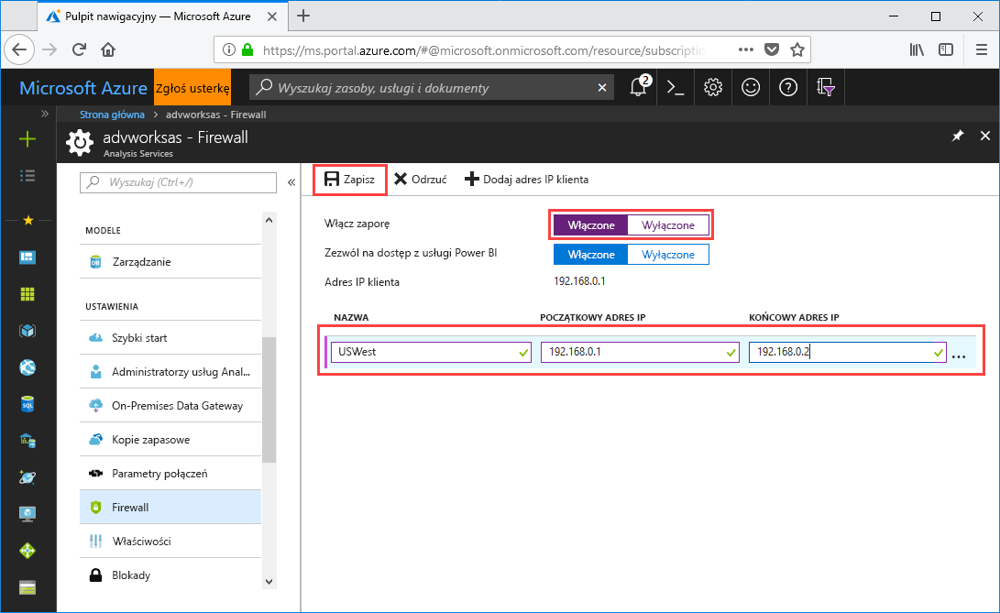

# Szybki start: konfigurowanie zapory serwera — Portal

Ten przewodnik Szybki start ułatwia konfigurowanie zapory na potrzeby serwera usług Azure Analysis Services. Włączanie zapory i konfiguracja zakresów adresów IP tylko na potrzeby komputerów uzyskujących dostęp do serwera użytkownika są ważnym elementem zabezpieczenia serwera i danych.

## Wymagania wstępne

- Serwer usług Analysis Services w ramach subskrypcji. Więcej informacji znajduje się w tematach [Quickstart: Create a server - Portal](analysis-services-create-server.md) (Szybki start: tworzenie serwera — Portal) oraz [Quickstart: Create a server - PowerShell](analysis-services-create-powershell.md) (Szybki start: tworzenie serwera — program PowerShell)
- Co najmniej jeden zakres adresów IP na potrzeby komputerów klienckich (w razie potrzeby).
- Niektóre scenariusze, w których Power BI Premium nawiązują połączenie z Azure Analysis Services, w tym do importowania danych (odświeżania) i raportów z podziałem na strony, nie są obecnie obsługiwane, nawet jeśli włączono opcję Zezwalaj na dostęp z Power BI. Bardziej typowy scenariusz korzystania z usługi Live Connect z Power BI Premium jest obsługiwany. Obsługiwane są wszystkie scenariusze Power BI Pro.

## Logowanie się do witryny Azure Portal 

[Logowanie się do portalu](https://portal.azure.com)

## Konfigurowanie zapory

1. Kliknij serwer, aby otworzyć stronę Omówienie. 
2. Wybierz opcje **USTAWIENIA** > **Zapora** > **Włącz zaporę** i kliknij przycisk **Włączone**.
3. Aby zezwolić na dostęp w trybie DirectQuery z poziomu usługi Power BI, w obszarze **Zezwalaj na dostęp z usługi Power BI** kliknij przycisk **Włączone**.  
4. (Opcjonalnie) Podaj co najmniej jeden zakres adresów IP. Wprowadź nazwę oraz początkowy i końcowy adres IP dla każdego zakresu. Nazwa reguły zapory powinna być ograniczona do 128 znaków i może zawierać tylko wielkie litery, małe litery, cyfry, znaki podkreślenia i łącznik. Odstępy i inne znaki specjalne są niedozwolone.
5. Kliknij przycisk **Save** (Zapisz).

     

## Oczyszczanie zasobów

Gdy zakresy adresów IP nie będą już potrzebne, usuń je lub wyłącz zaporę.

## Następne kroki
W tym przewodniu Szybki start opisano, jak skonfigurować zaporę dla serwera. Teraz gdy serwer został już utworzony i zabezpieczony przy użyciu zapory, możesz do niego dodać podstawowy przykładowy model danych z portalu. Przykładowy model służy do zdobywania wiedzy na temat konfigurowania ról modelowej bazy danych oraz testowania połączeń klienckich. Aby dowiedzieć się więcej, przejdź do samouczka dotyczącego dodawania przykładowego modelu.

> [!div class="nextstepaction"]
> [Tutorial: Add a sample model to your server](analysis-services-create-sample-model.md) (Samouczek: dodawanie przykładowego modelu do serwera)
