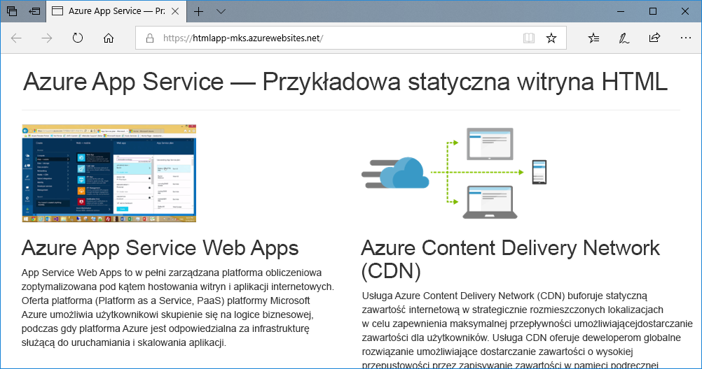
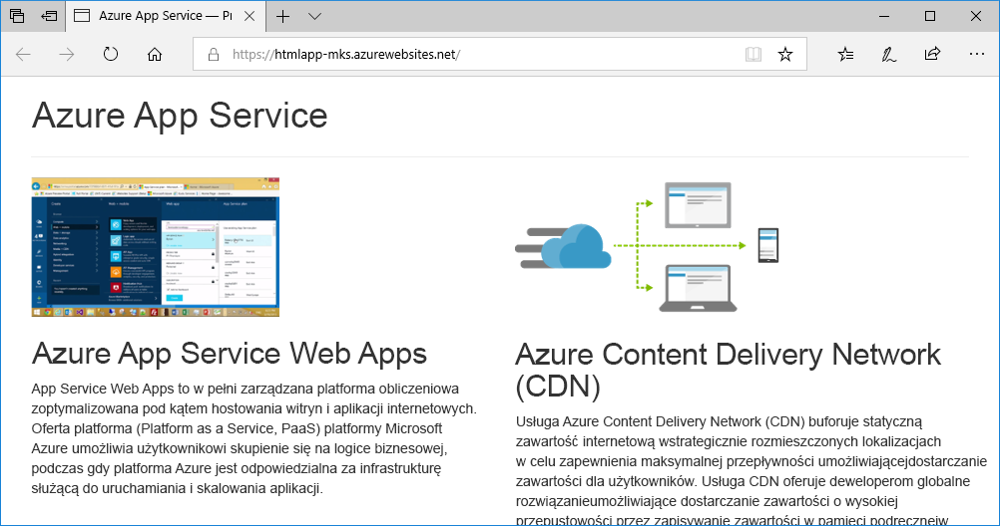
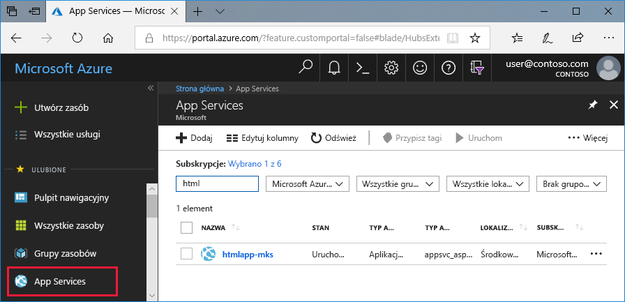
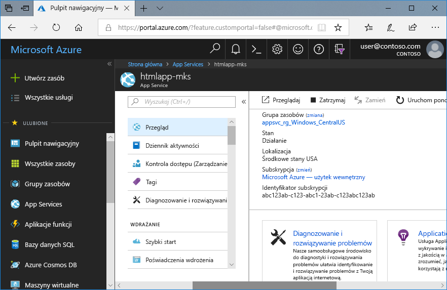

# <a name="create-a-static-html-web-app-in-azure"></a>Tworzenie statycznej aplikacji internetowej w języku HTML na platformie Azure

Usługa [Azure App Service](overview.md) oferuje wysoce skalowalną i samonaprawialną usługę hostingu w Internecie. W tym samouczku Szybki start przedstawiono sposób wdrażania podstawowej witryny HTML+CSS w usłudze Azure App Service. Ten przewodnik Szybki start można wykonać w usłudze [Cloud Shell](https://docs.microsoft.com/azure/cloud-shell/overview), ale można te polecenia uruchomić również lokalnie za pomocą [interfejsu wiersza polecenia platformy Azure](/cli/azure/install-azure-cli).



[!INCLUDE [quickstarts-free-trial-note](../../includes/quickstarts-free-trial-note.md)]

[!INCLUDE [cloud-shell-try-it.md](../../includes/cloud-shell-try-it.md)]

## <a name="download-the-sample"></a>Pobierz przykład

W usłudze Cloud Shell utwórz katalog Szybki start, a następnie przejdź do niego.

```bash
mkdir quickstart

cd $HOME/quickstart
```

Uruchom następujące polecenie, aby sklonować przykładowe repozytorium aplikacji na komputer lokalny.

```bash
git clone https://github.com/Azure-Samples/html-docs-hello-world.git
```

## <a name="create-a-web-app"></a>Utwórz aplikację internetową

Przejdź do katalogu, który zawiera przykładowy kod, i uruchom polecenie `az webapp up`.

W poniższym przykładzie zastąp ciąg <nazwa_aplikacji> unikatową nazwą aplikacji.

```bash
cd html-docs-hello-world

az webapp up --location westeurope --name <app_name>
```

Polecenie `az webapp up` wykonuje następujące akcje:

- Utwórz domyślną grupę zasobów.

- Utwórz domyślny plan usługi aplikacji.

- Utwórz aplikację z określoną nazwą.

- [Spakuj pliki](https://docs.microsoft.com/azure/app-service/deploy-zip) wdrożenia z bieżącego katalogu roboczego do aplikacji sieci Web.

Wykonanie tego polecenia może potrwać kilka minut. Podczas wykonywania polecenie wyświetli informacje podobne do następującego przykładu:

```json
{
  "app_url": "https://<app_name>.azurewebsites.net",
  "location": "westeurope",
  "name": "<app_name>",
  "os": "Windows",
  "resourcegroup": "appsvc_rg_Windows_westeurope",
  "serverfarm": "appsvc_asp_Windows_westeurope",
  "sku": "FREE",
  "src_path": "/home/<username>/quickstart/html-docs-hello-world ",
  < JSON data removed for brevity. >
}
```

Zanotuj wartość parametru `resourceGroup`. Będziesz jej potrzebować w sekcji [Oczyszczanie zasobów](#clean-up-resources).

## <a name="browse-to-the-app"></a>Przechodzenie do aplikacji

W przeglądarce przejdź do adresu URL aplikacji: `http://<app_name>.azurewebsites.net`.

Strona działa jako aplikacja internetowa usługi Azure App Service.


**Gratulacje!** Udało Ci się wdrożyć pierwszą własną aplikację w języku HTML w usłudze App Service.

## <a name="update-and-redeploy-the-app"></a>Aktualizowanie i ponowne wdrażanie aplikacji

W usłudze Cloud Shell wpisz `nano index.html`, aby otworzyć edytor tekstów nano. W tagu nagłówka `<h1>` zmień tekst „Azure App Service - Sample Static HTML Site” na „Azure App Service”, jak pokazano poniżej.


Zapisz zmiany i zamknij program nano. Użyj polecenia `^O` w celu zapisania i polecenia `^X` w celu zamknięcia programu.

Wdrożysz teraz ponownie tę aplikację za pomocą tego samego polecenia `az webapp up`.

```bash
az webapp up --location westeurope --name <app_name>
```

Po zakończeniu wdrożenia przejdź z powrotem do okna przeglądarki otwartego w kroku **przechodzenia do aplikacji**, a następnie odśwież stronę.



## <a name="manage-your-new-azure-app"></a>Zarządzanie nową aplikacją platformy Azure

Przejdź do witryny <a href="https://portal.azure.com" target="_blank">Azure Portal</a>, aby zarządzać utworzoną aplikacją internetową.

W menu po lewej stronie kliknij pozycję **App Services**, a następnie kliknij nazwę swojej aplikacji platformy Azure.



Zostanie wyświetlona strona Omówienie aplikacji internetowej. Tutaj możesz wykonywać podstawowe zadania zarządzania, takie jak przeglądanie, zatrzymywanie, uruchamianie, ponowne uruchamianie i usuwanie.



Menu po lewej stronie zawiera różne strony służące do konfigurowania aplikacji.

## <a name="clean-up-resources"></a>Oczyszczanie zasobów

W poprzednich krokach utworzono zasoby platformy Azure w grupie zasobów. Jeśli te zasoby nie będą raczej potrzebne w przyszłości, usuń grupę zasobów, uruchamiając następujące polecenie w usłudze Cloud Shell. Pamiętaj, że nazwa grupy zasobów została wygenerowana automatycznie w kroku [Tworzenie aplikacji internetowej](#create-a-web-app).

```bash
az group delete --name appsvc_rg_Windows_westeurope
```

Wykonanie tego polecenia może potrwać około minutę.

## <a name="next-steps"></a>Kolejne kroki

> [!div class="nextstepaction"]
> [Mapowanie domeny niestandardowej](app-service-web-tutorial-custom-domain.md)
