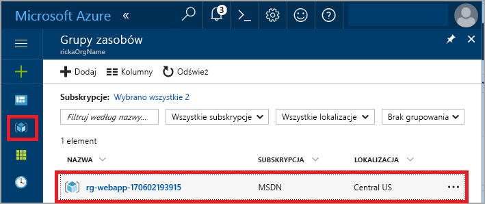
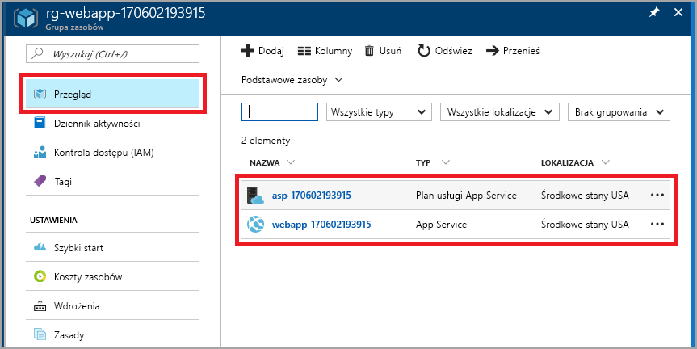

# <a name="create-your-first-java-web-app-in-azure"></a>Tworzenie pierwszej aplikacji internetowej w środowisku Java na platformie Azure

Usługa Azure App Service oferuje wysoce skalowalną i samonaprawialną usługę hostingu w Internecie. Ten przewodnik Szybki Start przedstawia sposób wdrażania aplikacji sieci web Java w usłudze App Service przy użyciu środowiska Eclipse IDE for Java EE Developers.

> [!IMPORTANT]
> Usługa Azure App Service w systemie Linux jest również opcja hostowanie aplikacji sieci web Java natywnie w systemie Linux przy użyciu zarządzanych Tomcat, Java SE i WildFly ofert. Jeśli interesuje Cię wprowadzenie do usługi App Service w systemie Linux, zobacz [Szybki Start: Tworzenie aplikacji Java w usłudze App Service w systemie Linux](containers/quickstart-java.md).

Po ukończeniu tego przewodnika Szybki start aplikacja będzie wyglądać podobnie do poniższej ilustracji podczas wyświetlania jej w przeglądarce internetowej:


[!INCLUDE [quickstarts-free-trial-note](../../includes/quickstarts-free-trial-note.md)]

> [!NOTE]
>
> Kroki tego przewodnika Szybki start pokazują, jak publikować aplikację internetową języka Java w usłudze App Service za pomocą środowiska IDE programu Eclipse, ale możesz również użyć rozwiązania IntelliJ IDEA w wersji Ultimate Edition lub Community Edition. Aby uzyskać więcej informacji, zobacz [Create a Hello World web app for Azure using IntelliJ (Tworzenie aplikacji internetowej Hello world na platformie Azure przy użyciu środowiska IntelliJ)](/java/azure/intellij/azure-toolkit-for-intellij-create-hello-world-web-app).
>

## <a name="prerequisites"></a>Wymagania wstępne

Aby ukończyć ten przewodnik Szybki Start, zainstaluj:

* Bezpłatne środowisko <a href="https://www.eclipse.org/downloads/" target="_blank">Eclipse IDE for Java EE Developers</a>. W tym przewodniku Szybki start używane jest środowisko Eclipse Neon.
* <a href="/java/azure/eclipse/azure-toolkit-for-eclipse-installation" target="_blank">Zestaw narzędzi platformy Azure dla środowiska Eclipse</a>.

> [!NOTE]
>
> Aby wykonać kroki tego przewodnika Szybki start, należy zalogować się do konta platformy Azure przy użyciu zestawu narzędzi platformy Azure dla środowiska Eclipse. W tym celu zobacz [Azure Sign In Instructions for the Azure Toolkit for Eclipse (Instrukcje logowania do platformy Azure dotyczące zestawu narzędzi platformy Azure dla środowiska Eclipse)](/java/azure/eclipse/azure-toolkit-for-eclipse-sign-in-instructions).
>

## <a name="create-a-dynamic-web-project-in-eclipse"></a>Tworzenie dynamicznego projektu internetowego w środowisku Eclipse

W środowisku Eclipse wybierz pozycję **File** > **New** > **Dynamic Web Project** (Plik > Nowy > Dynamiczny projekt internetowy).

W oknie dialogowym **New Dynamic Web Project** (Nowy dynamiczny projekt internetowy) wpisz nazwę projektu **MyFirstJavaOnAzureWebApp**, a następnie wybierz pozycję **Finish** (Zakończ).
   


### <a name="add-a-jsp-page"></a>Dodawanie strony JSP

Jeśli obszar Project Explorer (Eksplorator projektów) nie jest wyświetlany, przywróć go.


W obszarze Project Explorer (Eksplorator projektów) rozwiń projekt **MyFirstJavaOnAzureWebApp**.
Kliknij prawym przyciskiem myszy folder **WebContent**, a następnie kliknij pozycję **New** > **JSP File** (Nowy > Plik JSP).


W oknie dialogowym **New JSP File** (Nowy plik JSP):

* Jako nazwę pliku podaj wartość **index.jsp**.
* Wybierz pozycję **Finish** (Zakończ).

  

W pliku index.jsp zastąp element `<body></body>` następującym kodem:

```jsp
<body>
<h1><% out.println("Hello Azure!"); %></h1>
</body>
```

Zapisz zmiany.

> [!NOTE]
>
> Jeśli w wierszu 1 zostanie wyświetlony błąd odwołujący się do brakującej klasy serwletu języka Java, możesz go zignorować.
> 
> 
>

## <a name="publish-the-web-app-to-azure"></a>Publikowanie aplikacji internetowej na platformie Azure

W obszarze Project Explorer (Eksplorator projektów) kliknij projekt prawym przyciskiem myszy, a następnie wybierz pozycję **Azure** > **Publish as Azure Web App** (Publikuj jako aplikację internetową platformy Azure).


Jeśli zostanie wyświetlone okno dialogowe monitu **Azure Sign In** (Logowanie do platformy Azure), wykonaj kroki opisane w artykule [Azure Sign In Instructions for the Azure Toolkit for Eclipse (Instrukcje logowania do platformy Azure dotyczące zestawu narzędzi platformy Azure dla środowiska Eclipse)](/java/azure/eclipse/azure-toolkit-for-eclipse-sign-in-instructions) w celu wprowadzenia poświadczeń.

### <a name="deploy-web-app-dialog-box"></a>Okno dialogowe Deploy Web App (Wdrażanie aplikacji internetowej)

Po zalogowaniu się na koncie platformy Azure zostanie wyświetlone okno dialogowe **Deploy Web App** (Wdrażanie aplikacji internetowej).

Wybierz pozycję **Utwórz**.


### <a name="create-app-service-dialog-box"></a>Okno dialogowe Create App Service (Tworzenie usługi App Service)

Zostanie wyświetlone okno dialogowe **Create App Service** (Tworzenie usługi App Service) z wartościami domyślnymi. Liczba **170602185241** wyświetlana na poniższym obrazie będzie inna w Twoim oknie dialogowym.


W oknie dialogowym **Create App Service** (Tworzenie usługi App Service):

* Wprowadź unikatową nazwę aplikacji internetowej lub pozostaw wygenerowaną nazwę. Ta nazwa musi być unikatowa w obrębie całej platformy Azure. Nazwa jest częścią adresu URL aplikacji internetowej. Przykład: jeśli nazwa aplikacji internetowej to **MyJavaWebApp**, adres URL to *myjavawebapp.azurewebsites.net*.
* W przypadku tego przewodnika Szybki start zachowaj domyślny kontener internetowy.
* Wybierz subskrypcję platformy Azure.
* Na karcie **App service plan** (Plan usługi App Service):

  * **Utwórz nową**: zachowaj wartość domyślną, czyli nazwę planu usługi App Service.
  * **Lokalizacja**: wybierz pozycję **Europa Zachodnia** lub lokalizację w Twoim pobliżu.
  * **Warstwa cenowa**: wybierz opcję bezpłatną. Aby uzyskać informacje o funkcjach, zobacz [App Service pricing](https://azure.microsoft.com/pricing/details/app-service/?ref=microsoft.com&utm_source=microsoft.com&utm_medium=docs&utm_campaign=visualstudio) (Cennik usługi App Service).

    

[!INCLUDE [app-service-plan](../../includes/app-service-plan.md)]

### <a name="resource-group-tab"></a>Karta Resource group (Grupa zasobów)

Wybierz kartę **Resource group** (Grupa zasobów). Zachowaj domyślnie wygenerowaną wartość dla grupy zasobów.


[!INCLUDE [resource-group](../../includes/resource-group.md)]

Wybierz pozycję **Utwórz**.

<!--
### The JDK tab

Select the **JDK** tab. Keep the default, and then select **Create**.


-->

Za pomocą zestawu narzędzi platformy Azure zostanie utworzona aplikacja internetowa i wyświetlone okno dialogowe postępu.


### <a name="deploy-web-app-dialog-box"></a>Okno dialogowe Deploy Web App (Wdrażanie aplikacji internetowej)

W oknie dialogowym **Deploy Web App** (Wdrażanie aplikacji internetowej) wybierz pozycję **Deploy to root** (Wdróż w katalogu głównym). Jeśli istnieje usługa App Service w lokalizacji *wingtiptoys.azurewebsites.net* i nie wybierzesz wdrożenia w katalogu głównym, to aplikacja internetowa o nazwie **MyFirstJavaOnAzureWebApp** zostanie wdrożona w lokalizacji *wingtiptoys.azurewebsites.net/MyFirstJavaOnAzureWebApp*.


Okno dialogowe zawiera wybory dokonane dla platformy Azure, zestawu JDK i kontenera internetowego.

Wybierz pozycję **Deploy** (Wdróż), aby opublikować aplikację internetową na platformie Azure.

Po zakończeniu publikowania wybierz link **Published** (Opublikowano) w oknie dialogowym **Azure Activity Log** (Dziennik aktywności platformy Azure).


Gratulacje! Aplikacja internetowa została pomyślnie wdrożona na platformie Azure. 


## <a name="update-the-web-app"></a>Aktualizowanie aplikacji internetowej

Zmień przykładowy kod JSP na inny komunikat.

```jsp
<body>
<h1><% out.println("Hello again Azure!"); %></h1>
</body>
```

Zapisz zmiany.

W obszarze Project Explorer (Eksplorator projektów) kliknij projekt prawym przyciskiem myszy, a następnie wybierz pozycję **Azure** > **Publish as Azure Web App** (Publikuj jako aplikację internetową platformy Azure).

Zostanie wyświetlone okno dialogowe **Deploy Web App** (Wdrażanie aplikacji internetowej), w którym będzie wyświetlona wcześniej utworzona usługa App Service. 

> [!NOTE] 
> Wybieraj pozycję **Deploy to root** (Wdróż w katalogu głównym) za każdym razem, gdy ma miejsce publikowanie. 
> 

Wybierz aplikację internetową, a następnie wybierz pozycję **Deploy** (Wdróż), co spowoduje opublikowanie zmian.

Gdy zostanie wyświetlony link **Publishing** (Publikowanie), wybierz go, aby przejść do aplikacji internetowej i wyświetlić zmiany.

## <a name="manage-the-web-app"></a>Zarządzanie aplikacją internetową

Przejdź do witryny <a href="https://portal.azure.com" target="_blank">Azure Portal</a>, aby wyświetlić utworzoną aplikację internetową.

W menu po lewej stronie kliknij pozycję **Grupy zasobów**.



Wybierz grupę zasobów. Na stronie znajdują się zasoby utworzone w ramach tego przewodnika Szybki Start.



Wybierz aplikację internetową (**webapp-170602193915** na powyższym obrazie).

Zostanie wyświetlona strona **Przegląd**. Ta strona udostępnia widok sposobu działania aplikacji. Tutaj możesz wykonywać podstawowe zadania zarządzania, takie jak przeglądanie, zatrzymywanie, uruchamianie, ponowne uruchamianie i usuwanie. Na kartach po lewej stronie strony są pokazane poszczególne konfiguracje, które można otworzyć. 


[!INCLUDE [clean-up-section-portal-web-app](../../includes/clean-up-section-portal-web-app.md)]

## <a name="next-steps"></a>Kolejne kroki

> [!div class="nextstepaction"]
> [Mapowanie domeny niestandardowej](app-service-web-tutorial-custom-domain.md)
