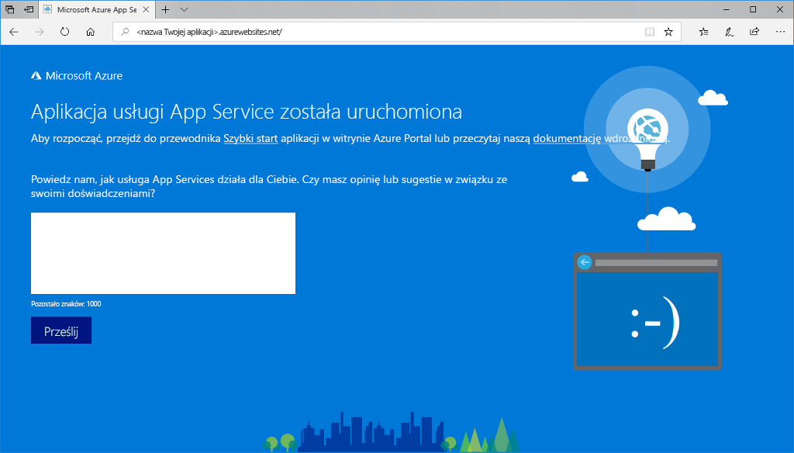

# <a name="create-a-nodejs-web-app-in-azure"></a>Tworzenie aplikacji internetowej Node.js na platformie Azure

> [!NOTE]
> W tym artykule opisano wdrażanie aplikacji w usłudze App Service w systemie Windows. Aby wdrożyć aplikację w usłudze App Service w systemie _Linux_, zobacz [Tworzenie aplikacji internetowej środowiska Node.js w usłudze Azure App Service w systemie Linux](./containers/quickstart-nodejs.md).
>

Usługa [Azure App Service](overview.md) oferuje wysoce skalowalną i samonaprawialną usługę hostingu w Internecie.  Ten samouczek Szybki start przedstawia sposób wdrażania aplikacji Node.js w usłudze Azure App Service. Aplikację internetową możesz utworzyć przy użyciu [interfejsu wiersza polecenia Azure](https://docs.microsoft.com/cli/azure/get-started-with-azure-cli), a usługa ZipDeploy umożliwia wdrażanie przykładowego kodu w języku Node.js w aplikacji internetowej.


Poniższe kroki możesz wykonać przy użyciu komputera z systemem Mac, Windows lub Linux. Po zainstalowaniu wymagań wstępnych wykonanie czynności trwa około pięciu minut.   

[!INCLUDE [quickstarts-free-trial-note](../../includes/quickstarts-free-trial-note.md)]

## <a name="prerequisites"></a>Wymagania wstępne

Aby ukończyć ten przewodnik Szybki start:

* <a href="https://nodejs.org/" target="_blank">Zainstaluj środowisko Node.js i menedżer NPM</a>

## <a name="download-the-sample"></a>Pobierz przykład

Pobierz przykładowy projekt Node.js z [https://github.com/Azure-Samples/nodejs-docs-hello-world/archive/master.zip](https://github.com/Azure-Samples/nodejs-docs-hello-world/archive/master.zip) i wyodrębnij archiwum ZIP.

Otwórz plik _index.js_ i znajdź następujący wiersz:

```javascript
const port = process.env.PORT || 1337;
```

Usługa App Service wprowadza zmienną process.env.PORT do aplikacji, a kod wykorzystuje tę zmienną do określenia, którego portu należy nasłuchiwać. 

W oknie terminalu przejdź do katalogu głównego przykładowego projektu Node.js (zawierającego plik _index.js_).

## <a name="run-the-app-locally"></a>Lokalne uruchamianie aplikacji

Uruchom aplikację lokalnie, aby zobaczyć, jak powinna ona wyglądać, gdy wdrożysz ją na platformie Azure. Otwórz okno terminala i użyj skryptu `npm start` w celu uruchomienia wbudowanego serwera HTTP środowiska Node.js.

```bash
npm start
```

Otwórz przeglądarkę internetową i przejdź do przykładowej aplikacji pod adresem `http://localhost:1337`.

Na stronie zostanie wyświetlony komunikat **Hello World** z przykładowej aplikacji.


W oknie terminalu naciśnij kombinację klawiszy **Ctrl + C**, aby zamknąć serwer sieci Web.

> [!NOTE]
> W usłudze Azure App Service aplikacja jest uruchamiana w usłudze IIS przy użyciu programu [iisnode](https://github.com/Azure/iisnode). Aby umożliwić uruchomienie aplikacji w programie iisnode, główny katalog aplikacji zawiera plik web.config. Plik jest możliwy do odczytu przez usługę IIS, a ustawienia związane z programem iisnode są udokumentowane w [repozytorium GitHub programu iisnode](https://github.com/Azure/iisnode/blob/master/src/samples/configuration/web.config).

[!INCLUDE [Create ZIP file](../../includes/app-service-web-create-zip.md)]

[!INCLUDE [cloud-shell-try-it.md](../../includes/cloud-shell-try-it.md)]

[!INCLUDE [Create resource group](../../includes/app-service-web-create-resource-group-scus.md)] 

[!INCLUDE [Create app service plan](../../includes/app-service-web-create-app-service-plan-scus.md)] 

## <a name="create-a-web-app"></a>Tworzenie aplikacji internetowej

W usłudze Cloud Shell utwórz aplikację internetową w planie usługi App Service `myAppServicePlan` za pomocą polecenia [`az webapp create`](/cli/azure/webapp?view=azure-cli-latest#az-webapp-create). 

W poniższym przykładzie zastąp ciąg `<app_name>` globalnie unikatową nazwą aplikacji (prawidłowe znaki to `a-z`, `0-9` i `-`).

```azurecli-interactive
# Bash and Powershell
az webapp create --resource-group myResourceGroup --plan myAppServicePlan --name <app_name>
```

Po utworzeniu aplikacji internetowej w interfejsie wiersza polecenia platformy Azure zostaną wyświetlone dane wyjściowe podobne do następujących:

```json
{
  "availabilityState": "Normal",
  "clientAffinityEnabled": true,
  "clientCertEnabled": false,
  "cloningInfo": null,
  "containerSize": 0,
  "dailyMemoryTimeQuota": 0,
  "defaultHostName": "<app_name>.azurewebsites.net",
  "enabled": true,
  < JSON data removed for brevity. >
}
```

### <a name="set-nodejs-runtime"></a>Ustawianie środowiska uruchomieniowego platformy Node.js

Ustaw środowisko uruchomieniowe Node na wersję 10.14.1. Aby wyświetlić wszystkie obsługiwane środowiska uruchomieniowe, uruchom polecenie [`az webapp list-runtimes`](/cli/azure/webapp?view=azure-cli-latest#az-webapp-list-runtimes).

```azurecli-interactive
# Bash and Powershell
az webapp config appsettings set --resource-group myResourceGroup --name <app_name> --settings WEBSITE_NODE_DEFAULT_VERSION=10.14.1
```

Przejdź do nowo utworzonej aplikacji internetowej. Zastąp `<app_name>` unikatową nazwą aplikacji.

```bash
http://<app_name>.azurewebsites.net
```

Tak powinna wyglądać nowa aplikacja internetowa:



[!INCLUDE [Deploy ZIP file](../../includes/app-service-web-deploy-zip.md)]

## <a name="browse-to-the-app"></a>Przechodzenie do aplikacji

Przejdź do wdrożonej aplikacji za pomocą przeglądarki sieci Web.

```
http://<app_name>.azurewebsites.net
```

Przykładowy kod w języku Node.js jest uruchamiany w aplikacji internetowej usługi Azure App Service.


**Gratulacje!** Udało Ci się wdrożyć pierwszą własną aplikację w języku Node.js w usłudze App Service.

## <a name="update-and-redeploy-the-code"></a>Aktualizowanie i ponowne wdrażanie kodu

Za pomocą edytora tekstów otwórz plik `index.js` w aplikacji Node.js i wprowadź niewielką zmianę w tekście w wywołaniu `response.end`:

```javascript
response.end("Hello Azure!");
```

W lokalnym oknie terminalu przejdź do katalogu głównego aplikacji i utwórz nowy plik ZIP dla zaktualizowanego projektu.

```azurecli-interactive
# Bash
zip -r myUpdatedAppFiles.zip .

# PowerShell
Compress-Archive -Path * -DestinationPath myUpdatedAppFiles.zip
```

Wdróż ten nowy plik ZIP w usłudze App Service, korzystając z tych samych kroków w sekcji [Wdrażanie pliku ZIP](#deploy-zip-file).

Przejdź z powrotem do okna przeglądarki otwartego w kroku **przechodzenia do aplikacji**, a następnie odśwież stronę.


## <a name="manage-your-new-azure-app"></a>Zarządzanie nową aplikacją platformy Azure

Przejdź do witryny <a href="https://portal.azure.com" target="_blank">Azure Portal</a>, aby zarządzać utworzoną aplikacją internetową.

W menu po lewej stronie kliknij pozycję **App Services**, a następnie kliknij nazwę swojej aplikacji platformy Azure.


Zostanie wyświetlona strona Omówienie aplikacji internetowej. Tutaj możesz wykonywać podstawowe zadania zarządzania, takie jak przeglądanie, zatrzymywanie, uruchamianie, ponowne uruchamianie i usuwanie. 


Menu po lewej stronie zawiera różne strony służące do konfigurowania aplikacji. 

[!INCLUDE [cli-samples-clean-up](../../includes/cli-samples-clean-up.md)]

## <a name="next-steps"></a>Kolejne kroki

> [!div class="nextstepaction"]
> [Środowisko Node.js z bazą danych MongoDB](app-service-web-tutorial-nodejs-mongodb-app.md)
