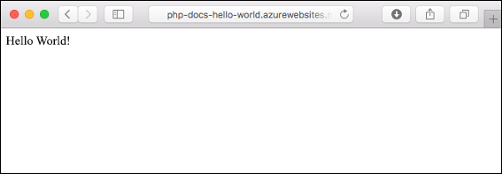
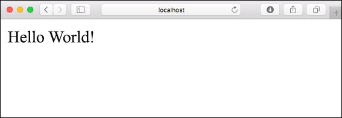
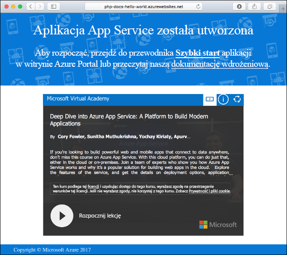
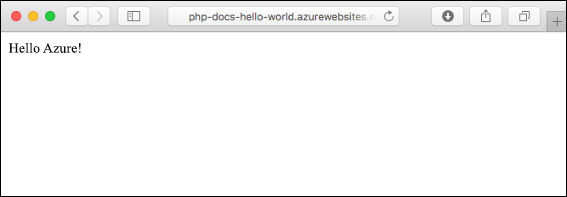
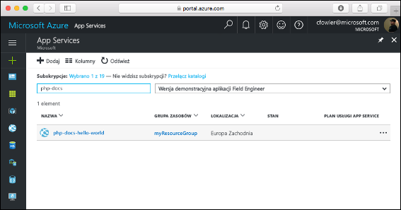
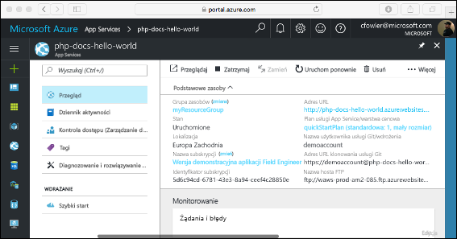

# <a name="create-a-php-web-app-in-azure"></a>Tworzenie aplikacji internetowej w języku PHP na platformie Azure

> [!NOTE]
> W tym artykule opisano wdrażanie aplikacji w usłudze App Service w systemie Windows. Aby wdrożyć aplikację w usłudze App Service w systemie _Linux_, zobacz [Tworzenie aplikacji internetowej w języku PHP w usłudze App Service w systemie Linux](./containers/quickstart-php.md).
>

Usługa [Azure App Service](overview.md) oferuje wysoce skalowalną i samonaprawialną usługę hostingu w Internecie.  Ten samouczek Szybki start przedstawia sposób wdrażania aplikacji PHP w usłudze Azure App Service. Aplikacja internetowa zostanie utworzona przy użyciu [interfejsu wiersza polecenia platformy Azure](https://docs.microsoft.com/cli/azure/get-started-with-azure-cli) w usłudze Cloud Shell, a przykład kodu w języku PHP zostanie wdrożony w aplikacji internetowej za pomocą usługi Git.



Poniższe kroki możesz wykonać przy użyciu komputera z systemem Mac, Windows lub Linux. Po zainstalowaniu wymagań wstępnych wykonanie czynności trwa około pięciu minut.

[!INCLUDE [quickstarts-free-trial-note](../../includes/quickstarts-free-trial-note.md)]

## <a name="prerequisites"></a>Wymagania wstępne

Aby ukończyć ten przewodnik Szybki start:

* <a href="https://git-scm.com/" target="_blank">Zainstaluj oprogramowanie Git</a>
* <a href="https://php.net/manual/install.php" target="_blank">Zainstaluj środowisko PHP</a>

## <a name="download-the-sample-locally"></a>Pobieranie przykładu na maszynę lokalną

W oknie terminalu uruchom następujące polecenia. Spowoduje to sklonowanie aplikacji przykładowej na maszynę lokalną, a następnie przejście do katalogu zawierającego przykład kodu. 

```bash
git clone https://github.com/Azure-Samples/php-docs-hello-world
cd php-docs-hello-world
```

## <a name="run-the-app-locally"></a>Lokalne uruchamianie aplikacji

Uruchom aplikację lokalnie, aby zobaczyć, jak powinna ona wyglądać, gdy wdrożysz ją na platformie Azure. Otwórz okno terminala i użyj polecenia `php` w celu uruchomienia wbudowanego serwera internetowego środowiska PHP.

```bash
php -S localhost:8080
```

Otwórz przeglądarkę internetową i przejdź do przykładowej aplikacji pod adresem `http://localhost:8080`.

Na stronie zostanie wyświetlony komunikat **Hello World!** z przykładowej aplikacji.



W oknie terminalu naciśnij kombinację klawiszy **Ctrl + C**, aby zamknąć serwer sieci Web.

[!INCLUDE [cloud-shell-try-it.md](../../includes/cloud-shell-try-it.md)]

[!INCLUDE [Configure deployment user](../../includes/configure-deployment-user.md)]

[!INCLUDE [Create resource group](../../includes/app-service-web-create-resource-group.md)]

[!INCLUDE [Create app service plan](../../includes/app-service-web-create-app-service-plan.md)]

## <a name="create-a-web-app"></a>Tworzenie aplikacji internetowej

W usłudze Cloud Shell utwórz aplikację internetową w planie usługi App Service `myAppServicePlan` za pomocą polecenia [`az webapp create`](/cli/azure/webapp?view=azure-cli-latest#az-webapp-create). 

W poniższym przykładzie zastąp ciąg `<app_name>` globalnie unikatową nazwą aplikacji (prawidłowe znaki to `a-z`, `0-9` i `-`). Środowisko uruchomieniowe ma ustawioną wartość `PHP|7.0`. Aby wyświetlić wszystkie obsługiwane środowiska uruchomieniowe, uruchom polecenie [`az webapp list-runtimes`](/cli/azure/webapp?view=azure-cli-latest#az-webapp-list-runtimes). 

```azurecli-interactive
# Bash
az webapp create --resource-group myResourceGroup --plan myAppServicePlan --name <app_name> --runtime "PHP|7.0" --deployment-local-git
# PowerShell
az --% webapp create --resource-group myResourceGroup --plan myAppServicePlan --name <app_name> --runtime "PHP|7.0" --deployment-local-git
```

Po utworzeniu aplikacji internetowej w interfejsie wiersza polecenia platformy Azure zostaną wyświetlone dane wyjściowe podobne do następujących:

```json
Local git is configured with url of 'https://<username>@<app_name>.scm.azurewebsites.net/<app_name>.git'
{
  "availabilityState": "Normal",
  "clientAffinityEnabled": true,
  "clientCertEnabled": false,
  "cloningInfo": null,
  "containerSize": 0,
  "dailyMemoryTimeQuota": 0,
  "defaultHostName": "<app_name>.azurewebsites.net",
  "enabled": true,
  < JSON data removed for brevity. >
}
```
Utworzona została nowa pusta aplikacja internetowa z włączonym wdrażaniem git.

> [!NOTE]
> Adres URL zdalnego repozytorium Git jest wyświetlany we właściwości `deploymentLocalGitUrl` w formacie `https://<username>@<app_name>.scm.azurewebsites.net/<app_name>.git`. Zapisz ten adres URL, ponieważ będzie on potrzebny później.
>

Przejdź do nowo utworzonej aplikacji internetowej. Zastąp element _&lt;nazwa_aplikacji>_ unikatową nazwą aplikacji utworzonej w poprzednim kroku.

```bash
http://<app name>.azurewebsites.net
```

Tak powinna wyglądać nowa aplikacja internetowa:



[!INCLUDE [Push to Azure](../../includes/app-service-web-git-push-to-azure.md)] 

```bash
Counting objects: 2, done.
Delta compression using up to 4 threads.
Compressing objects: 100% (2/2), done.
Writing objects: 100% (2/2), 352 bytes | 0 bytes/s, done.
Total 2 (delta 1), reused 0 (delta 0)
remote: Updating branch 'master'.
remote: Updating submodules.
remote: Preparing deployment for commit id '25f18051e9'.
remote: Generating deployment script.
remote: Running deployment command...
remote: Handling Basic Web Site deployment.
remote: Kudu sync from: '/home/site/repository' to: '/home/site/wwwroot'
remote: Copying file: '.gitignore'
remote: Copying file: 'LICENSE'
remote: Copying file: 'README.md'
remote: Copying file: 'index.php'
remote: Ignoring: .git
remote: Finished successfully.
remote: Running post deployment command(s)...
remote: Deployment successful.
To https://<app_name>.scm.azurewebsites.net/<app_name>.git
   cc39b1e..25f1805  master -> master
```

## <a name="browse-to-the-app"></a>Przechodzenie do aplikacji

Przejdź do wdrożonej aplikacji za pomocą przeglądarki sieci Web.

```
http://<app_name>.azurewebsites.net
```

Przykładowy kod w języku PHP jest uruchamiany w aplikacji internetowej usługi Azure App Service.


**Gratulacje!** Udało Ci się wdrożyć pierwszą własną aplikację w języku PHP w usłudze App Service.

## <a name="update-locally-and-redeploy-the-code"></a>Lokalne aktualizowanie i ponowne wdrażanie kodu

Za pomocą lokalnego edytora tekstów otwórz plik `index.php` w aplikacji w języku PHP i wprowadź niewielką zmianę w tekście ciągu obok polecenia `echo`:

```php
echo "Hello Azure!";
```

W oknie lokalnego terminala zatwierdź zmiany w usłudze Git, a następnie wypchnij zmiany kodu na platformę Azure.

```bash
git commit -am "updated output"
git push azure master
```

Po zakończeniu wdrożenia wróć do okna przeglądarki otwartego w kroku **przechodzenia do aplikacji**, a następnie odśwież stronę.



## <a name="manage-your-new-azure-app"></a>Zarządzanie nową aplikacją platformy Azure

Przejdź do witryny <a href="https://portal.azure.com" target="_blank">Azure Portal</a>, aby zarządzać utworzoną aplikacją internetową.

W menu po lewej stronie kliknij pozycję **App Services**, a następnie kliknij nazwę swojej aplikacji platformy Azure.



Zostanie wyświetlona strona Omówienie aplikacji internetowej. Tutaj możesz wykonywać podstawowe zadania zarządzania, takie jak przeglądanie, zatrzymywanie, uruchamianie, ponowne uruchamianie i usuwanie.



Menu po lewej stronie zawiera różne opcje służące do konfigurowania aplikacji. 

[!INCLUDE [cli-samples-clean-up](../../includes/cli-samples-clean-up.md)]

## <a name="next-steps"></a>Kolejne kroki

> [!div class="nextstepaction"]
> [Środowisko PHP z bazą danych MySQL](app-service-web-tutorial-php-mysql.md)
