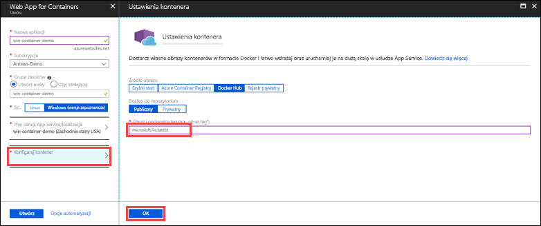

# <a name="run-a-custom-windows-container-in-azure-preview"></a>Uruchamianie niestandardowego kontenera systemu Windows na platformie Azure (wersja zapoznawcza)

[Usługa Azure App Service](app-service-web-overview.md) udostępnia wstępnie zdefiniowane stosy aplikacji w systemie Windows, takie jak ASP.NET lub Node.js, działające w usługach IIS. Wstępnie skonfigurowane środowisko systemu Windows blokuje możliwość dostępu administracyjnego, instalacji oprogramowania, zmian w globalnej pamięci podręcznej zestawów itd. w systemie operacyjnym. Zobacz [Operating system functionality on Azure App Service](web-sites-available-operating-system-functionality.md) (Funkcjonalność systemu operacyjnego w usłudze Azure App Service). Jeśli aplikacja wymaga szerszego dostępu niż ten, na który pozwala wstępnie skonfigurowane środowisko, możesz wdrożyć niestandardowy kontener systemu Windows. W tym przewodniku Szybki start przedstawiono sposób wdrażania niestandardowego obrazu IIS w usłudze Azure App Service z [usługi Docker Hub](https://hub.docker.com/).


## <a name="sign-in-to-azure"></a>Logowanie do platformy Azure

Zaloguj się do witryny Azure Portal pod adresem https://portal.azure.com.

## <a name="create-a-windows-container-app"></a>Tworzenie aplikacji kontenera systemu Windows

1. W lewym górnym rogu okna witryny Azure Portal wybierz pozycję **Utwórz zasób**.

2. W polu wyszukiwania nad listą zasobów w portalu Azure Marketplace wpisz **Web App for Containers**, aby wyszukać i wybrać tę pozycję.

3. Podaj nazwę aplikacji, na przykład *mywebapp*, zaakceptuj wartości domyślne, aby utworzyć nową grupę zasobów, a następnie kliknij pozycję **Windows (wersja zapoznawcza)** w polu **System operacyjny**.

    

4. Utwórz plan usługi App Service, klikając pozycję **Plan usługi App Service/lokalizacja** > **Utwórz nowy**. Nadaj nazwę nowemu planowi, zaakceptuj wartości domyślne, a następnie kliknij przycisk **OK**.

    

5. Kliknij pozycję **Konfiguruj kontener**, wpisz wartość _microsoft/iis:latest_ w polu **Obraz i opcjonalny tag**, a następnie kliknij przycisk **OK**.

    

    W tym artykule używany jest publiczny obraz usługi Docker Hub [microsoft / iis:latest](https://hub.docker.com/r/microsoft/iis/). Jeśli masz obraz niestandardowy dla aplikacji internetowej w innym miejscu, na przykład w [usłudze Azure Container Registry](/azure/container-registry/) lub w innym prywatnym repozytorium, możesz skonfigurować go tutaj.

6. Kliknij przycisk **Utwórz** i poczekaj na utworzenie wymaganych zasobów przez platformę Azure.

## <a name="browse-to-the-container-app"></a>Przechodzenie do aplikacji kontenera

Po zakończeniu operacji platformy Azure zostanie wyświetlone okno powiadomienia.


1. Kliknij pozycję **Przejdź do zasobu**.

2. Na stronie aplikacji kliknij link w obszarze **Adres URL**.

W przeglądarce zostanie otwarta następująca strona:


Poczekaj kilka minut i spróbuj ponownie, dopóki nie zostanie wyświetlona strona powitalna usług IIS:


**Gratulacje!** Uruchamiasz swój pierwszy niestandardowy kontener systemu Windows w usłudze Azure App Service.

## <a name="see-container-start-up-logs"></a>Wyświetlanie dzienników uruchamiania kontenera

Może upłynąć trochę czasu, zanim kontener systemu Windows zostanie załadowany. Aby wyświetlić postęp, przejdź do następującego adresu URL, zastępując ciąg *\<nazwa_aplikacji>* nazwą swojej aplikacji.
```
https://<app_name>.scm.azurewebsites.net/api/logstream
```

Przesyłane strumieniowo dzienniki wyglądają następująco:

```
2018-07-27T12:03:11  Welcome, you are now connected to log-streaming service.
27/07/2018 12:04:10.978 INFO - Site: win-container-demo - Start container succeeded. Container: facbf6cb214de86e58557a6d073396f640bbe2fdec88f8368695c8d1331fc94b
27/07/2018 12:04:16.767 INFO - Site: win-container-demo - Container start complete
27/07/2018 12:05:05.017 INFO - Site: win-container-demo - Container start complete
27/07/2018 12:05:05.020 INFO - Site: win-container-demo - Container started successfully
```

## <a name="use-a-different-docker-image"></a>Używanie innego obrazu platformy Docker

Możesz użyć innego niestandardowego obrazu platformy Docker do uruchamiania aplikacji. Musisz jednak wybrać właściwy [obraz nadrzędny](https://docs.docker.com/develop/develop-images/baseimages/) dla wybranej platformy: 

- Aby wdrożyć aplikacje platformy .NET Framework, użyj obrazu nadrzędnego opartego na wersji [Long-Term Servicing Channel (LTSC)](https://docs.microsoft.com/windows-server/get-started/semi-annual-channel-overview#long-term-servicing-channel-ltsc) systemu Windows Server Core 2016. 
- Aby wdrożyć aplikacje platformy .NET Core, użyj obrazu nadrzędnego na wersji [Long-Term Servicing Channel (LTSC)](https://docs.microsoft.com/windows-server/get-started/semi-annual-channel-overview#long-term-servicing-channel-ltsc) systemu Windows Server Nano 2016. 

Pobieranie obrazu nadrzędnego podczas uruchamiania aplikacji może zająć trochę czasu. Można jednak skrócić czas uruchamiania, korzystając z jednego z następujących obrazów nadrzędnych, które już zostały zbuforowane w usłudze Azure App Service:

- [microsoft/iis](https://hub.docker.com/r/microsoft/iis/):windowsservercore-ltsc2016, najnowszy
- [microsoft/iis](https://hub.docker.com/r/microsoft/iis/):nanoserver-sac2016
- [microsoft/aspnet](https://hub.docker.com/r/microsoft/aspnet/):4.7.2-windowsservercore-ltsc2016, 4.7.2, najnowszy
- [microsoft/dotnet](https://hub.docker.com/r/microsoft/dotnet/):2.1-aspnetcore-runtime
- [microsoft/dotnet](https://hub.docker.com/r/microsoft/dotnet/):2.1-sdk
