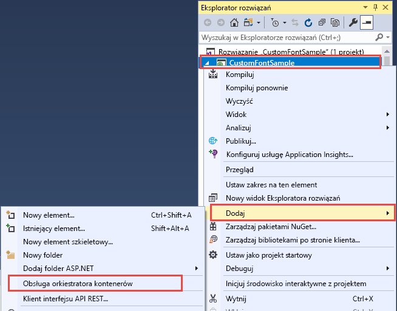
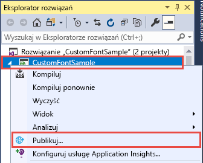
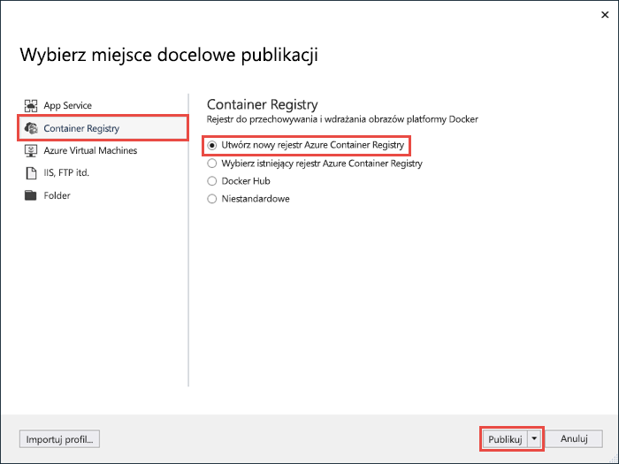
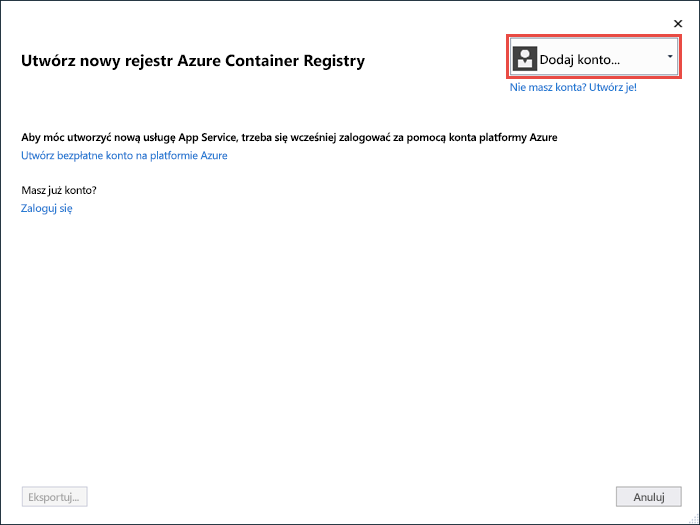
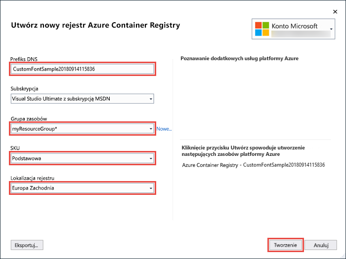
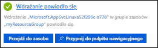

# <a name="migrate-an-aspnet-app-to-azure-app-service-using-a-windows-container-preview"></a>Migrowanie aplikacji ASP.NET do usługi Azure App Service za pomocą kontenera Windows (wersja zapoznawcza)

[Usługa Azure App Service](overview.md) udostępnia wstępnie zdefiniowane stosy aplikacji w systemie Windows, takie jak ASP.NET lub Node.js, działające w usługach IIS. Wstępnie skonfigurowane środowisko systemu Windows blokuje możliwość dostępu administracyjnego, instalacji oprogramowania, zmian w globalnej pamięci podręcznej zestawów itd. w systemie operacyjnym. Zobacz [Operating system functionality on Azure App Service](operating-system-functionality.md) (Funkcjonalność systemu operacyjnego w usłudze Azure App Service). Korzystając jednak z niestandardowego kontenera systemu Windows w usłudze App Service, można dokonać wymaganych przez aplikację zmian w systemie operacyjnym. Ułatwia to przeprowadzenie migracji lokalnych aplikacji, które wymagają niestandardowych konfiguracji systemu operacyjnego i oprogramowania. W tym samouczku pokazano, jak przeprowadzić migrację do usługi App Service aplikacji ASP.NET, która korzysta z niestandardowych czcionek zainstalowanych w bibliotece czcionek systemu Windows. Polega to na wdrożeniu skonfigurowanego w sposób niestandardowy obrazu systemu Windows z programu Visual Studio do [usługi Azure Container Registry](https://docs.microsoft.com/azure/container-registry/), a następnie uruchomieniu go w usłudze App Service.


## <a name="prerequisites"></a>Wymagania wstępne

W celu ukończenia tego samouczka:

- <a href="https://hub.docker.com/" target="_blank">Załóż konto usługi Docker Hub</a>
- <a href="https://docs.docker.com/docker-for-windows/install/" target="_blank">Zainstaluj program Docker for Windows</a>.
- <a href="https://docs.microsoft.com/virtualization/windowscontainers/quick-start/quick-start-windows-10" target="_blank">Przełącz platformę Docker na potrzeby uruchamiania kontenerów systemu Windows</a>.
- <a href="https://www.visualstudio.com/downloads/" target="_blank">Zainstaluj program Visual Studio 2019</a> przy użyciu obciążeń **ASP.NET oraz tworzenia aplikacji sieci Web** i **platformy Azure** . Jeśli zainstalowano już program Visual Studio 2019:
    - Zainstaluj najnowsze aktualizacje w programie Visual Studio, klikając pozycje **Pomoc** > **Sprawdź aktualizacje**.
    - Dodaj pakiety robocze w programie Visual Studio, klikając pozycje **Narzędzia** > **Pobierz narzędzia i funkcje**.

## <a name="set-up-the-app-locally"></a>Lokalne konfigurowanie aplikacji

### <a name="download-the-sample"></a>Pobierz przykład

Ten krok umożliwia skonfigurowanie lokalnego projektu platformy .NET.

- [Pobierz przykładowy projekt](https://github.com/Azure-Samples/custom-font-win-container/archive/master.zip).
- Wyodrębnij (rozpakuj) plik *custom-font-win-container.zip*.

Przykładowy projekt zawiera prostą aplikację platformy ASP.NET, która używa niestandardowej czcionki zainstalowanej w bibliotece czcionek systemu Windows. Instalowanie czcionek nie jest konieczne, ale jest to przykład aplikacji, która jest zintegrowana z bazowym systemem operacyjnym. Aby przeprowadzić migrację takiej aplikacji do usługi App Service, należy zmienić architekturę jej kodu w celu usunięcia integracji lub zmigrować ją w takim stanie, w jakim jest, korzystając z niestandardowego kontenera systemu Windows.

### <a name="install-the-font"></a>Instalowanie czcionki

W Eksploratorze Windows przejdź do folderu _custom-font-win-container-master/CustomFontSample_, kliknij prawym przyciskiem myszy plik _FrederickatheGreat Regular.ttf_ i wybierz pozycję **Zainstaluj**.

Ta czcionka jest dostępna publicznie w serwisie [Google Fonts](https://fonts.google.com/specimen/Fredericka+the+Great).

### <a name="run-the-app"></a>Uruchamianie aplikacji

Otwórz plik *custom-font-win-container/CustomFontSample.sln* w programie Visual Studio. 

Naciśnij klawisze `Ctrl+F5`, aby uruchomić aplikację bez debugowania. Aplikacja zostanie wyświetlona w domyślnej przeglądarce. 


Ponieważ ta aplikacja używa zainstalowanej czcionki, nie może ona działać w piaskownicy usługi App Service. Aplikację tę można jednak wdrożyć za pomocą kontenera systemu Windows, ponieważ można w nim zainstalować wymaganą czcionkę.

### <a name="configure-windows-container"></a>Konfigurowanie kontenera systemu Windows

W Eksploratorze rozwiązań kliknij prawym przyciskiem myszy projekt **CustomFontSample** i wybierz pozycję **Dodaj** > **Obsługa aranżacji kontenerów**.



Wybierz pozycję **Docker Compose** > **OK**.

Projekt jest teraz skonfigurowany do uruchamiania w kontenerze systemu Windows. Plik _Dockerfile_ został dodany do projektu **CustomFontSample**, a projekt **docker-compose** został dodany do rozwiązania. 

W Eksploratorze rozwiązań otwórz plik **Dockerfile**.

Konieczne będzie użycie [obsługiwanego obrazu nadrzędnego](app-service-web-get-started-windows-container.md#use-a-different-parent-image). Zmień obraz nadrzędny, zastępując wiersz `FROM` następującym kodem:

```Dockerfile
FROM mcr.microsoft.com/dotnet/framework/aspnet:4.7.2-windowsservercore-ltsc2019
```

Na końcu pliku dodaj następujący wiersz, a następnie zapisz plik:

```Dockerfile
RUN ${source:-obj/Docker/publish/InstallFont.ps1}
```

W projekcie **CustomFontSample** znajduje się plik _InstallFont.ps1_. Jest to prosty skrypt, który instaluje czcionkę. Bardziej złożoną wersję tego skryptu można znaleźć w witrynie [Script Center](https://gallery.technet.microsoft.com/scriptcenter/fb742f92-e594-4d0c-8b79-27564c575133).

> [!NOTE]
> Aby przetestować kontener systemu Windows lokalnie, upewnij się, że platforma Docker została uruchomiona na komputerze lokalnym.
>

## <a name="publish-to-azure-container-registry"></a>Publikowanie w usłudze Azure Container Registry

Usługa [Azure Container Registry](https://docs.microsoft.com/azure/container-registry/) może przechowywać obrazy na potrzeby wdrożeń kontenerów. Usługę App Service można tak skonfigurować, aby używała obrazów hostowanych w usłudze Azure Container Registry.

### <a name="open-publish-wizard"></a>Otwieranie kreatora publikacji

W Eksploratorze rozwiązań kliknij prawym przyciskiem myszy projekt **CustomFontSample** i wybierz polecenie **Publikuj**.



### <a name="create-registry-and-publish"></a>Tworzenie rejestru i publikowanie

W kreatorze publikacji wybierz kolejno pozycje **Container Registry** > **Utwórz nowy rejestr Azure Container Registry** > **Publikuj**.



### <a name="sign-in-with-azure-account"></a>Logowanie się za pomocą konta platformy Azure

W oknie dialogowym **Utwórz nowy rejestr Azure Container Registry** wybierz pozycję **Dodaj konto** i zaloguj się do swojej subskrypcji platformy Azure. Po zalogowaniu wybierz z listy rozwijanej konto zawierające odpowiednią subskrypcję.



### <a name="configure-the-registry"></a>Konfigurowanie rejestru

Skonfiguruj nowy rejestr kontenerów, korzystając z sugerowanych wartości z poniższej tabeli. Po zakończeniu kliknij pozycję **Gotowe**.

| Ustawienie  | Sugerowana wartość | Więcej informacji |
| ----------------- | ------------ | ----|
|**Prefiks DNS**| Zachowaj wygenerowaną nazwę rejestru lub zmień ją na inną unikatową nazwę. |  |
|**Grupa zasobów**| Kliknij pozycję **Nowy**, wpisz **myResourceGroup** i kliknij przycisk **OK**. |  |
|**SKU**| Basic | [Warstwy cenowe](https://azure.microsoft.com/pricing/details/container-registry/)|
|**Lokalizacja rejestru**| Europa Zachodnia | |



Zostanie otwarte okno terminalu z wyświetlonym postępem wdrażania obrazu. Zaczekaj na zakończenie wdrożenia.

## <a name="sign-in-to-azure"></a>Zaloguj się w usłudze Azure

Zaloguj się do witryny Azure Portal pod adresem https://portal.azure.com.

## <a name="create-a-web-app"></a>Tworzenie aplikacji internetowej

Z menu po lewej stronie wybierz kolejno pozycje **Utwórz zasób** > **Internet** > **Web App for Containers**.

### <a name="configure-app-basics"></a>Konfigurowanie podstaw aplikacji

Na karcie **podstawy** Skonfiguruj ustawienia zgodnie z poniższą tabelą, a następnie kliknij przycisk **Dalej: Docker**.

| Ustawienie  | Sugerowana wartość | Więcej informacji |
| ----------------- | ------------ | ----|
|**Subskrypcja**| Upewnij się, że wybrano poprawną subskrypcję. |  |
|**Grupa zasobów**| Wybierz pozycję **Utwórz nowy**, wpisz pozycję Moja **zasobów**i kliknij przycisk **OK**. |  |
|**Nazwa**| Wpisz unikatową nazwę. | Adres URL aplikacji internetowej to `http://<app-name>.azurewebsites.net`, gdzie `<app-name>` to nazwa aplikacji. |
|**Publikowanie**| Kontener platformy Docker | |
|**System operacyjny**| Windows | |
|**Region**| Europa Zachodnia | |
|**Plan systemu Windows**| Wybierz pozycję **Utwórz nowy**, wpisz **myAppServicePlan**, a następnie kliknij przycisk **OK**. | |

Twoja karta **podstawy** powinna wyglądać następująco:


### <a name="configure-windows-container"></a>Konfigurowanie kontenera systemu Windows

Na karcie **Docker** Skonfiguruj niestandardowy kontener systemu Windows, jak pokazano w poniższej tabeli, a następnie wybierz kolejno pozycje **Recenzja + Utwórz**.

| Ustawienie  | Sugerowana wartość |
| ----------------- | ------------ |
|**Źródło obrazu**| Rejestr kontenerów platformy Azure |
|**Secret**| Wybierz [utworzony wcześniej rejestr](#publish-to-azure-container-registry). |
|**Obraz**| customfontsample |
|**Tag**| najnowsza |

### <a name="complete-app-creation"></a>Kończenie tworzenia aplikacji

Kliknij przycisk **Utwórz** i poczekaj na utworzenie wymaganych zasobów przez platformę Azure.

## <a name="browse-to-the-web-app"></a>Przechodzenie do aplikacji internetowej

Po zakończeniu operacji platformy Azure zostanie wyświetlone okno powiadomienia.



1. Kliknij pozycję **Przejdź do zasobu**.

2. Na stronie aplikacji kliknij link w obszarze **Adres URL**.

W przeglądarce zostanie otwarta następująca strona:


Poczekaj kilka minut i spróbuj ponownie. Powinna zostać wyświetlona strona główna z oczekiwaną piękną czcionką:


**Gratulacje!** Przeprowadzono migrację aplikacji ASP.NET do usługi Azure App Service w kontenerze systemu Windows.

## <a name="see-container-start-up-logs"></a>Wyświetlanie dzienników uruchamiania kontenera

Może upłynąć trochę czasu, zanim kontener systemu Windows zostanie załadowany. Aby zobaczyć postęp, przejdź do poniższego adresu URL, zastępując *\<App-name >* nazwą aplikacji.
```
https://<app-name>.scm.azurewebsites.net/api/logstream
```

Przesyłane strumieniowo dzienniki wyglądają następująco:

```
14/09/2018 23:16:19.889 INFO - Site: fonts-win-container - Creating container for image: customfontsample20180914115836.azurecr.io/customfontsample:latest.
14/09/2018 23:16:19.928 INFO - Site: fonts-win-container - Create container for image: customfontsample20180914115836.azurecr.io/customfontsample:latest succeeded. Container Id 329ecfedbe370f1d99857da7352a7633366b878607994ff1334461e44e6f5418
14/09/2018 23:17:23.405 INFO - Site: fonts-win-container - Start container succeeded. Container: 329ecfedbe370f1d99857da7352a7633366b878607994ff1334461e44e6f5418
14/09/2018 23:17:28.637 INFO - Site: fonts-win-container - Container ready
14/09/2018 23:17:28.637 INFO - Site: fonts-win-container - Configuring container
14/09/2018 23:18:03.823 INFO - Site: fonts-win-container - Container ready
14/09/2018 23:18:03.823 INFO - Site: fonts-win-container - Container start-up and configuration completed successfully
```

