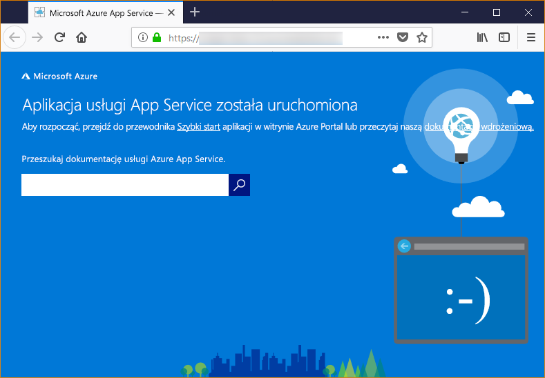

# <a name="configure-a-linux-python-app-for-azure-app-service"></a>Konfigurowanie aplikacji systemu Linux w języku Python dla Azure App Service

W tym artykule opisano, jak usługa [Azure App Service](app-service-linux-intro.md) uruchamia aplikacje języka Python i jak można dostosować zachowanie usługi App Service w razie potrzeby. Aplikacje języka Python muszą zostać wdrożone ze wszystkimi wymaganymi modułami [PIP](https://pypi.org/project/pip/) .

Aparat wdrażania App Service automatycznie aktywuje środowisko wirtualne i uruchamia `pip install -r requirements.txt` podczas wdrażania [repozytorium git](../deploy-local-git.md?toc=%2fazure%2fapp-service%2fcontainers%2ftoc.json)lub [pakiet ZIP](../deploy-zip.md?toc=%2fazure%2fapp-service%2fcontainers%2ftoc.json) z procesami kompilacji, które zostały włączone.

Ten przewodnik zawiera najważniejsze pojęcia i instrukcje dla deweloperów języka Python, którzy używają wbudowanego kontenera systemu Linux w App Service. Jeśli nie korzystasz z Azure App Service, musisz najpierw wykonać samouczek [przewodnika Szybki Start](quickstart-python.md) i [Python z programem PostgreSQL](tutorial-python-postgresql-app.md) .

> [!NOTE]
> System Linux jest obecnie zalecaną opcją uruchamiania aplikacji w języku Python w App Service. Aby uzyskać informacje na temat opcji systemu Windows, zobacz [Python w systemie windows App Service](https://docs.microsoft.com/visualstudio/python/managing-python-on-azure-app-service).
>

## <a name="show-python-version"></a>Wyświetlanie wersji języka Python

Aby wyświetlić bieżącą wersję języka Python, uruchom następujące polecenie w usłudze [Cloud Shell](https://shell.azure.com):

```azurecli-interactive
az webapp config show --resource-group <resource-group-name> --name <app-name> --query linuxFxVersion
```

Aby wyświetlić wszystkie obsługiwane wersje języka Python, uruchom następujące polecenie w usłudze [Cloud Shell](https://shell.azure.com):

```azurecli-interactive
az webapp list-runtimes --linux | grep PYTHON
```

Możesz uruchomić nieobsługiwaną wersję języka Python, kompilując w zamian własny obraz kontenera. Aby uzyskać więcej informacji, zobacz [Używanie niestandardowego obrazu platformy Docker](tutorial-custom-docker-image.md).

## <a name="set-python-version"></a>Ustawianie wersji języka Python

Uruchom następujące polecenie w usłudze [Cloud Shell](https://shell.azure.com), aby ustawić środowisko Python na wersję 3.7:

```azurecli-interactive
az webapp config set --resource-group <resource-group-name> --name <app-name> --linux-fx-version "PYTHON|3.7"
```

## <a name="customize-build-automation"></a>Dostosuj automatyzację kompilacji

Jeśli aplikacja zostanie wdrożona za pomocą usługi Git lub zip z włączonym automatyzacją kompilacji, App Service kroki automatyzacji kompilacji w następującej kolejności:

1. Uruchom skrypt niestandardowy, jeśli został określony przez `PRE_BUILD_SCRIPT_PATH`.
1. Uruchom polecenie `pip install -r requirements.txt`.
1. Jeśli *manage.py* znajduje się w katalogu głównym repozytorium, uruchom *manage.py collectstatic*. Jeśli jednak `DISABLE_COLLECTSTATIC` jest ustawiona na `true`, ten krok zostanie pominięty.
1. Uruchom skrypt niestandardowy, jeśli został określony przez `POST_BUILD_SCRIPT_PATH`.

`PRE_BUILD_COMMAND`, `POST_BUILD_COMMAND`i `DISABLE_COLLECTSTATIC` są zmiennymi środowiskowymi, które są domyślnie puste. Aby uruchomić polecenia przed kompilacją, zdefiniuj `PRE_BUILD_COMMAND`. Aby uruchomić polecenia po kompilacji, zdefiniuj `POST_BUILD_COMMAND`. Aby wyłączyć uruchamianie collectstatic podczas kompilowania aplikacji Django, ustaw `DISABLE_COLLECTSTATIC=true`.

W poniższym przykładzie określono dwie zmienne do szeregu poleceń, oddzielone przecinkami.

```azurecli-interactive
az webapp config appsettings set --name <app-name> --resource-group <resource-group-name> --settings PRE_BUILD_COMMAND="echo foo, scripts/prebuild.sh"
az webapp config appsettings set --name <app-name> --resource-group <resource-group-name> --settings POST_BUILD_COMMAND="echo foo, scripts/postbuild.sh"
```

Aby uzyskać dodatkowe zmienne środowiskowe umożliwiające dostosowanie automatyzacji kompilacji, zobacz [Konfiguracja Oryx](https://github.com/microsoft/Oryx/blob/master/doc/configuration.md).

Aby uzyskać więcej informacji na temat sposobu uruchamiania App Service i tworzenia aplikacji w języku Python w systemie Linux, zobacz [dokumentację Oryx: sposób wykrywania i kompilowania aplikacji w języku Python](https://github.com/microsoft/Oryx/blob/master/doc/runtimes/python.md).

## <a name="container-characteristics"></a>Właściwości kontenera

Aplikacje języka Python wdrożone w celu App Service w systemie Linux działają w kontenerze platformy Docker, który jest zdefiniowany w [repozytorium usługi GitHub App Service Python](https://github.com/Azure-App-Service/python). Konfiguracje obrazów można znaleźć w katalogach specyficznych dla danej wersji.

Ten kontener ma następujące cechy:

- Aplikacje są uruchamiane przy użyciu [serwera HTTP Gunicorn WSGI](https://gunicorn.org/) z dodatkowymi argumentami `--bind=0.0.0.0 --timeout 600`.

- Domyślnie obraz podstawowy zawiera platformę internetową Flask, ale kontener obsługuje inne platformy zgodne z interfejsem WSGI i językiem Python 3.7, takie jak Django.

- Aby zainstalować dodatkowe pakiety, takie jak Django, utwórz plik [*requirements.txt*](https://pip.pypa.io/en/stable/user_guide/#requirements-files) w katalogu głównym projektu, używając polecenia `pip freeze > requirements.txt`. Następnie opublikuj projekt w usłudze App Service przy użyciu wdrożenia narzędzia Git, co spowoduje automatyczne uruchomienie polecenia `pip install -r requirements.txt` w kontenerze w celu zainstalowania zależności aplikacji.

## <a name="container-startup-process"></a>Proces uruchamiania kontenera

Podczas uruchamiania kontener usługi App Service w systemie Linux wykonuje następujące kroki:

1. Użyj [niestandardowego polecenia uruchomienia](#customize-startup-command), jeśli zostało udostępnione.
2. Sprawdź istnienie [aplikacji Django](#django-app), a następnie uruchom dla niej serwer Gunicorn, jeśli zostanie wykryta.
3. Sprawdź istnienie [aplikacji Flask](#flask-app), a następnie uruchom dla niej serwer Gunicorn, jeśli zostanie wykryta.
4. Jeśli nie została znaleziona żadna inna aplikacja, uruchomienie domyślnej aplikacji wbudowanej w kontener.

Poniższe sekcje zawierają dodatkowe szczegóły dla każdej z tych opcji.

### <a name="django-app"></a>Aplikacja platformy Django

W przypadku aplikacji Django usługa App Service szuka pliku o nazwie `wsgi.py` w kodzie aplikacji, a następnie uruchamia serwer Gunicorn przy użyciu następującego polecenia:

```bash
# <module> is the path to the folder that contains wsgi.py
gunicorn --bind=0.0.0.0 --timeout 600 <module>.wsgi
```

Jeśli chcesz mieć większą kontrolę nad poleceniem uruchamiania, użyj [niestandardowego polecenia uruchamiania](#customize-startup-command) i zamień wartość `<module>` na nazwę modułu zawierającego plik *wsgi.py*.

### <a name="flask-app"></a>Aplikacja Flask

W przypadku aplikacji Flask usługa App Service szuka pliku o nazwie *application.py* lub *app.py* i uruchamia serwer Gunicorn w następujący sposób:

```bash
# If application.py
gunicorn --bind=0.0.0.0 --timeout 600 application:app
# If app.py
gunicorn --bind=0.0.0.0 --timeout 600 app:app
```

Jeśli główny moduł aplikacji znajduje się w innym pliku, użyj innej nazwy dla obiektu aplikacji, a jeśli chcesz podać dodatkowe argumenty dla serwera Gunicorn, użyj [niestandardowego polecenia uruchamiania](#customize-startup-command).

### <a name="default-behavior"></a>Zachowanie domyślne

Jeśli usługa App Service nie znajdzie polecenia niestandardowego, aplikacji Django ani aplikacji Flask, uruchomi domyślną aplikację dostępną tylko do odczytu, która znajduje się w folderze _opt/defaultsite_. Aplikacja domyślna wygląda następująco:



## <a name="customize-startup-command"></a>Dostosowywanie polecenia uruchamiania

Aby kontrolować zachowanie kontenera podczas uruchamiania, możesz podać niestandardowe polecenie uruchamiania serwera Gunicorn. W tym celu należy uruchomić następujące polecenie w [Cloud Shell](https://shell.azure.com):

```azurecli-interactive
az webapp config set --resource-group <resource-group-name> --name <app-name> --startup-file "<custom-command>"
```

Na przykład jeśli masz aplikację z kolbą, której moduł główny to *Hello.py* , a obiekt aplikacji do kolby w tym pliku ma nazwę `myapp`, wówczas *\<> niestandardowe polecenie* jest następujące:

```bash
gunicorn --bind=0.0.0.0 --timeout 600 hello:myapp
```

Jeśli moduł główny znajduje się w podfolderze, takim jak `website`, określ ten folder za pomocą argumentu `--chdir`:

```bash
gunicorn --bind=0.0.0.0 --timeout 600 --chdir website hello:myapp
```

Możesz również dodać wszelkie dodatkowe argumenty dla Gunicorn, aby *\<> niestandardowego-polecenia*, takich jak `--workers=4`. Aby uzyskać więcej informacji, zobacz [Running Gunicorn](https://docs.gunicorn.org/en/stable/run.html) (Uruchamianie serwera Gunicorn) (docs.gunicorn.org).

Aby użyć serwera innego niż Gunicorn, takiego jak [aiohttp](https://aiohttp.readthedocs.io/en/stable/web_quickstart.html), można zamienić *\<niestandardowe-polecenie >* , tak jak to:

```bash
python3.7 -m aiohttp.web -H localhost -P 8080 package.module:init_func
```

> [!Note]
> Usługa App Service ignoruje wszelkie błędy występujące podczas przetwarzania pliku polecenia niestandardowego oraz kontynuuje proces uruchamiania, wyszukując aplikacje Django i Flask. Jeśli nie widzisz oczekiwanego zachowania, sprawdź, czy plik startowy jest wdrożony w usłudze App Service i czy nie zawiera błędów.

## <a name="access-environment-variables"></a>Uzyskiwanie dostępu do zmiennych środowiskowych

W App Service można [ustawić ustawienia aplikacji](../configure-common.md?toc=%2fazure%2fapp-service%2fcontainers%2ftoc.json#configure-app-settings) poza kodem aplikacji. Następnie można uzyskiwać do nich dostęp przy użyciu standardowego wzorca [os.environ](https://docs.python.org/3/library/os.html#os.environ). Aby na przykład uzyskać dostęp do ustawienia aplikacji o nazwie `WEBSITE_SITE_NAME`, użyj następującego kodu:

```python
os.environ['WEBSITE_SITE_NAME']
```

## <a name="detect-https-session"></a>Wykrywanie sesji protokołu HTTPS

W usłudze App Service [kończenie żądań SSL](https://wikipedia.org/wiki/TLS_termination_proxy) odbywa się w modułach równoważenia obciążenia sieciowego, dzięki czemu wszystkie żądania HTTPS docierają do aplikacji jako niezaszyfrowane żądania HTTP. Jeśli logika aplikacji musi sprawdzać, czy żądania użytkownika są szyfrowane, czy nie, zbadaj nagłówek `X-Forwarded-Proto`.

```python
if 'X-Forwarded-Proto' in request.headers and request.headers['X-Forwarded-Proto'] == 'https':
# Do something when HTTPS is used
```

Popularne platformy internetowe umożliwiają dostęp do informacji `X-Forwarded-*` w standardowym wzorcu aplikacji. Na platformie [CodeIgniter](https://codeigniter.com/) element [is_https()](https://github.com/bcit-ci/CodeIgniter/blob/master/system/core/Common.php#L338-L365) domyślnie sprawdza wartość `X_FORWARDED_PROTO`.

## <a name="access-diagnostic-logs"></a>Uzyskiwanie dostępu do dzienników diagnostycznych

[!INCLUDE [Access diagnostic logs](../../../includes/app-service-web-logs-access-no-h.md)]

## <a name="open-ssh-session-in-browser"></a>Otwórz sesję SSH w przeglądarce

[!INCLUDE [Open SSH session in browser](../../../includes/app-service-web-ssh-connect-builtin-no-h.md)]

## <a name="troubleshooting"></a>Rozwiązywanie problemów

- **Po wdrożeniu własnego kodu aplikacji wyświetlana jest aplikacja domyślna.** Aplikacja domyślna jest wyświetlana dlatego, że kod Twojej aplikacji nie został wdrożony w usłudze App Service albo usługa App Service nie znalazła kodu aplikacji i zamiast niej uruchomiła aplikację domyślną.
- Uruchom ponownie usługę App Service, poczekaj 15–20 sekund i sprawdź ponownie aplikację.
- Upewnij się, że używasz usługi App Service dla systemu Linux, a nie wystąpienia opartego na systemie Windows. W interfejsie wiersza polecenia platformy Azure uruchom polecenie `az webapp show --resource-group <resource_group_name> --name <app_service_name> --query kind`, zastępując zmienne `<resource_group_name>` i `<app_service_name>` odpowiednimi wartościami. Powinny zostać wyświetlone dane wyjściowe `app,linux`. W przeciwnym razie ponownie utwórz usługę App Service i wybierz system Linux.
- Połącz się bezpośrednio z usługą App Service przy użyciu konsoli SSH lub Kudu, a następnie sprawdź, czy Twoje pliki znajdują się w katalogu *site/wwwroot*. Jeśli pliki nie istnieją, sprawdź proces wdrażania i ponownie wdróż aplikację.
- Jeśli pliki istnieją, oznacza to, że usługa App Service nie mogła zidentyfikować określonego pliku startowego. Sprawdź, czy aplikacja ma strukturę zgodną z oczekiwaniami usługi App Service dla platformy [Django](#django-app) lub [Flask](#flask-app), albo użyj [niestandardowego polecenia uruchamiania](#customize-startup-command).
- **W przeglądarce jest wyświetlany komunikat „Usługa niedostępna”.** W przeglądarce upłynął limit czasu oczekiwania na odpowiedź usługi App Service, co wskazuje, że usługa App Service uruchomiła serwer Gunicorn, ale argumenty określające kod aplikacji są niepoprawne.
- Odśwież okno przeglądarki, zwłaszcza jeśli korzystasz z niższych warstw cenowych w planie usługi App Service. Na przykład podczas korzystania z warstw bezpłatnych aplikacja może być uruchamiana dłużej i zacznie odpowiadać po odświeżeniu okna przeglądarki.
- Sprawdź, czy aplikacja ma strukturę zgodną z oczekiwaniami usługi App Service dla platformy [Django](#django-app) lub [Flask](#flask-app), albo użyj [niestandardowego polecenia uruchamiania](#customize-startup-command).
- [Dostęp do strumienia dzienników](#access-diagnostic-logs).

## <a name="next-steps"></a>Następne kroki

> [!div class="nextstepaction"]
> [Samouczek: aplikacja w języku Python z PostgreSQL](tutorial-python-postgresql-app.md)

> [!div class="nextstepaction"]
> [Samouczek: wdrażanie z repozytorium kontenera prywatnego](tutorial-custom-docker-image.md)

> [!div class="nextstepaction"]
> [App Service Linux — często zadawane pytania](app-service-linux-faq.md)
