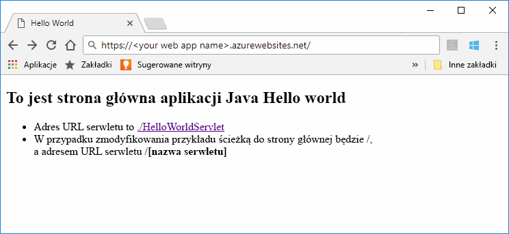
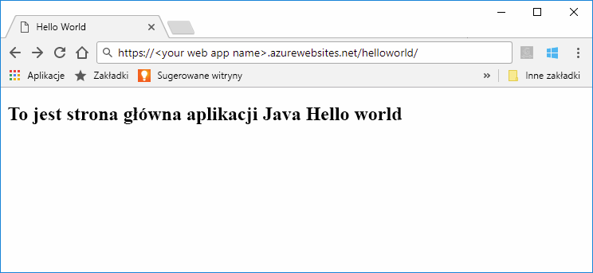

# <a name="quickstart-create-a-java-app-in-app-service-on-linux"></a>Szybki start: tworzenie aplikacji w języku Java w usłudze App Service w systemie Linux

Usługa [App Service w systemie Linux](app-service-linux-intro.md) oferuje wysoce skalowalną i samonaprawialną usługę hostingu w Internecie przy użyciu systemu operacyjnego Linux. Ten przewodnik Szybki Start przedstawia sposób użycia [wiersza polecenia platformy Azure](https://docs.microsoft.com/cli/azure/get-started-with-azure-cli) z [wtyczka Maven Plugin for Azure App Service](https://github.com/Microsoft/azure-maven-plugins/tree/develop/azure-webapp-maven-plugin) do wdrożenia pliku archiwum (WAR) w sieci web Java.
> [!NOTE]
>
> To samo można również wykonać przy użyciu popularnych środowisk IDE, takie jak IntelliJ oraz Eclipse. Zapoznaj się z naszym podobne dokumenty w [Azure Toolkit for IntelliJ Przewodnik Szybki Start](/java/azure/intellij/azure-toolkit-for-intellij-create-hello-world-web-app) lub [Azure Toolkit for Eclipse Przewodnik Szybki Start](/java/azure/eclipse/azure-toolkit-for-eclipse-create-hello-world-web-app).
>


[!INCLUDE [quickstarts-free-trial-note](../../../includes/quickstarts-free-trial-note.md)]

[!INCLUDE [cloud-shell-try-it.md](../../../includes/cloud-shell-try-it.md)]

## <a name="create-a-java-app"></a>Tworzenie aplikacji w języku Java

Wykonaj następujące polecenie narzędzia Maven w wierszu polecenia usługi Cloud Shell, aby utworzyć nową aplikację o nazwie `helloworld`:

```bash
mvn archetype:generate -DgroupId=example.demo -DartifactId=helloworld -DarchetypeArtifactId=maven-archetype-webapp
```

## <a name="configure-the-maven-plugin"></a>Konfigurowanie wtyczki Maven

Aby dokonać wdrożenia z systemu Maven, użyj edytora kodu w usłudze Cloud Shell, aby otworzyć plik `pom.xml` projektu w katalogu `helloworld`. 

```bash
code pom.xml
```

Następnie dodaj następującą definicję wtyczki w elemencie `<build>` pliku `pom.xml`.

```xml
<plugins>
    <!--*************************************************-->
    <!-- Deploy to Tomcat in App Service Linux           -->
    <!--*************************************************-->
    <plugin>
        <groupId>com.microsoft.azure</groupId>
        <artifactId>azure-webapp-maven-plugin</artifactId>
        <version>1.5.4</version>
        <configuration>
            <!-- Specify v2 schema -->
            <schemaVersion>v2</schemaVersion>
            <!-- App information -->
            <subscriptionId>${SUBSCRIPTION_ID}</subscriptionId>
            <resourceGroup>${RESOURCEGROUP_NAME}</resourceGroup>
            <appName>${WEBAPP_NAME}</appName>
            <region>${REGION}</region>
   
            <!-- Java Runtime Stack for App on Linux-->
            <runtime>
                <os>linux</os>
                <javaVersion>jre8</javaVersion>
                <webContainer>tomcat 8.5</webContainer>
            </runtime> 
            <deployment>
                <resources>
                    <resource>
                        <directory>${project.basedir}/target</directory>
                        <includes>
                            <include>*.war</include>
                        </includes>
                    </resource>
                </resources>
            </deployment>
        </configuration>
    </plugin>
</plugins>
```    


> [!NOTE] 
> W tym artykule pracujemy tylko z aplikacjami w języku Java umieszczonych w pakietach w postaci plików WAR. Wtyczka obsługuje również aplikacje internetowe JAR. Odwiedź stronę [Deploy a Java SE JAR file to App Service on Linux](https://docs.microsoft.com/java/azure/spring-framework/deploy-spring-boot-java-app-with-maven-plugin?toc=%2fazure%2fapp-service%2fcontainers%2ftoc.json) (Wdrażanie pliku JAR języka Java SE do usługi App Service w systemie Linux), aby wypróbować tę funkcję.


Zaktualizuj następujące symbole zastępcze w konfiguracji wtyczki:

| Symbol zastępczy | Opis |
| ----------- | ----------- |
| `SUBSCRIPTION_ID` | Unikatowy identyfikator subskrypcję, którą chcesz wdrożyć aplikację. Identyfikator domyślnej subskrypcji można znaleźć w usłudze Cloud Shell lub interfejsu wiersza polecenia przy użyciu `az account show` polecenia. Dla wszystkich dostępnych subskrypcji, użyj `az account list` polecenia.|
| `RESOURCEGROUP_NAME` | Nazwa nowej grupy zasobów, w której ma zostać utworzona aplikacja. Dzięki wprowadzeniu wszystkich zasobów dla aplikacji do grupy można nimi zarządzać jednocześnie. Na przykład usunięcie grupy zasobów spowodowałoby usunięcie wszystkich zasobów skojarzonych z aplikacją. Zaktualizuj tę wartość przy użyciu unikatowej nazwy nowej grupy zasobów, na przykład *TestResources*. Za pomocą tej nazwy grupy zasobów wyczyścisz wszystkie zasoby platformy Azure w późniejszej sekcji. |
| `WEBAPP_NAME` | Nazwa aplikacji będzie częścią nazwy hosta aplikacji po wdrożeniu na platformie Azure (APLIKACJA_INTERNETOWA.azurewebsites.net). Zaktualizuj tę wartość przy użyciu unikatowej nazwy nowej aplikacji usługi App Service, która będzie hostem aplikacji Java, na przykład *contoso*. |
| `REGION` | Region platformy Azure, w którym jest hostowana aplikacja internetowa, na przykład `westus2`. Listę regionów można uzyskać z usługi Cloud Shell lub interfejsu wiersza polecenia przy użyciu polecenia `az account list-locations`. |

## <a name="deploy-the-app"></a>Wdrażanie aplikacji

Wdróż aplikację Java na platformie Azure za pomocą następującego polecenia:

```bash
mvn package azure-webapp:deploy
```

Po zakończeniu wdrażania w przeglądarce internetowej przejdź do wdrożonej aplikacji, używając następującego adresu URL, na przykład `http://<webapp>.azurewebsites.net`. 



**Gratulacje!** Udało Ci się wdrożyć pierwszą własną aplikację w języku Java w usłudze App Service w systemie Linux.

[!INCLUDE [cli-samples-clean-up](../../../includes/cli-samples-clean-up.md)]

## <a name="next-steps"></a>Kolejne kroki

> [!div class="nextstepaction"]
> [Samouczek: Aplikacja przedsiębiorstwa Java z bazą danych PostgreSQL](tutorial-java-enterprise-postgresql-app.md)

> [!div class="nextstepaction"]
> [Konfigurowanie aplikacji Java](configure-custom-container.md)

> [!div class="nextstepaction"]
> [Ciągła integracja/ciągłe wdrażanie przy użyciu narzędzia Jenkins](/azure/jenkins/deploy-jenkins-app-service-plugin)

> [!div class="nextstepaction"]
> [Inne oferty Azure for Zasoby deweloperów języka Java](/java/azure/)
