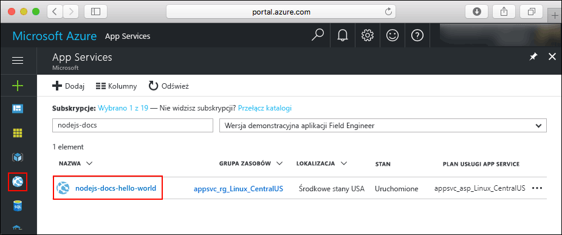
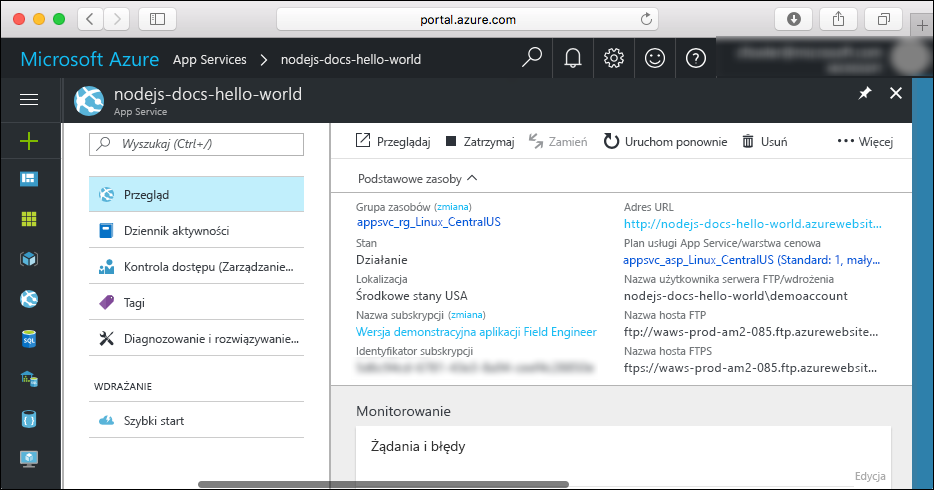

# <a name="create-a-nodejs-app-in-azure-app-service-on-linux"></a>Tworzenie aplikacji platformy Node.js w usłudze Azure App Service dla systemu Linux

> [!NOTE]
> W tym artykule opisano wdrażanie aplikacji w usłudze App Service w systemie Linux. Aby wdrożyć aplikację w usłudze App Service w systemie _Windows_, zobacz artykuł [Tworzenie aplikacji platformy Node.js na platformie Azure](../app-service-web-get-started-nodejs.md).
>

Usługa [App Service w systemie Linux](app-service-linux-intro.md) oferuje wysoce skalowalną i samonaprawialną usługę hostingu w Internecie przy użyciu systemu operacyjnego Linux. W tym przewodniku Szybki start przedstawiono, jak wdrożyć aplikację platformy Node.js w usłudze App Service w systemie Linux przy użyciu usługi [Cloud Shell](https://docs.microsoft.com/azure/cloud-shell/overview).

Ten przewodnik Szybki start można wykonać w usłudze Cloud Shell, ale można te polecenia uruchomić również lokalnie za pomocą [interfejsu wiersza polecenia platformy Azure](/cli/azure/install-azure-cli).


[!INCLUDE [quickstarts-free-trial-note](../../../includes/quickstarts-free-trial-note.md)]

[!INCLUDE [cloud-shell-try-it.md](../../../includes/cloud-shell-try-it.md)]

## <a name="download-the-sample"></a>Pobierz przykład

W usłudze Cloud Shell utwórz katalog Szybki start, a następnie przejdź do niego.

```bash
mkdir quickstart

cd quickstart
```

Uruchom następujące polecenie, aby sklonować przykładowe repozytorium aplikacji na komputer lokalny.

```bash
git clone https://github.com/Azure-Samples/nodejs-docs-hello-world
```

Podczas wykonywania polecenie wyświetli informacje podobne do następującego przykładu:

```bash
Cloning into 'nodejs-docs-hello-world'...
remote: Counting objects: 40, done.
remote: Total 40 (delta 0), reused 0 (delta 0), pack-reused 40
Unpacking objects: 100% (40/40), done.
Checking connectivity... done.
```

> [!NOTE]
> Przykładowy plik index.js ustawia wartość process.env.PORT dla portu nasłuchiwania. Ta zmienna środowiskowa jest przypisana przez usługę App Service.
>

## <a name="create-a-web-app"></a>Tworzenie aplikacji internetowej

Przejdź do katalogu, który zawiera przykładowy kod, i uruchom polecenie `az webapp up`.

W poniższym przykładzie zastąp ciąg <nazwa_aplikacji> unikatową nazwą aplikacji.

```bash
cd nodejs-docs-hello-world

az webapp up -n <app_name>
```

Wykonanie tego polecenia może potrwać kilka minut. Podczas wykonywania polecenie wyświetli informacje podobne do następującego przykładu:

```json
Creating Resource group 'appsvc_rg_Linux_CentralUS' ...
Resource group creation complete
Creating App service plan 'appsvc_asp_Linux_CentralUS' ...
App service plan creation complete
Creating app '<app_name>' ....
Webapp creation complete
Updating app settings to enable build after deployment
Creating zip with contents of dir /home/username/quickstart/nodejs-docs-hello-world ...
Preparing to deploy and build contents to app.
Fetching changes.

Generating deployment script.
Generating deployment script.
Generating deployment script.
Running deployment command...
Running deployment command...
Running deployment command...
Deployment successful.
All done.
{
  "app_url": "https://<app_name>.azurewebsites.net",
  "location": "Central US",
  "name": "<app_name>",
  "os": "Linux",
  "resourcegroup": "appsvc_rg_Linux_CentralUS ",
  "serverfarm": "appsvc_asp_Linux_CentralUS",
  "sku": "STANDARD",
  "src_path": "/home/username/quickstart/nodejs-docs-hello-world ",
  "version_detected": "6.9",
  "version_to_create": "node|6.9"
}
```

Polecenie `az webapp up` wykonuje następujące akcje:

- Utwórz domyślną grupę zasobów.

- Utwórz domyślny plan usługi aplikacji.

- Utwórz aplikację z określoną nazwą.

- [Spakuj pliki](https://docs.microsoft.com/azure/app-service/deploy-zip) wdrożenia z bieżącego katalogu roboczego do aplikacji.

## <a name="browse-to-the-app"></a>Przechodzenie do aplikacji

Przejdź do wdrożonej aplikacji za pomocą przeglądarki sieci Web. Zastąp ciąg <app_name> nazwą swojej aplikacji.

```bash
http://<app_name>.azurewebsites.net
```

Przykładowy kod Node.js jest uruchamiany w usłudze App Service w systemie Linux z wbudowanym obrazem.


**Gratulacje!** Udało Ci się wdrożyć pierwszą własną aplikację platformy Node.js w usłudze App Service w systemie Linux.

## <a name="update-and-redeploy-the-code"></a>Aktualizowanie i ponowne wdrażanie kodu

W usłudze Cloud Shell wpisz `nano index.js`, aby otworzyć edytor tekstów nano.


 Wprowadź niewielką zmianę w tekście w wywołaniu metody `response.end`:

```nodejs
response.end("Hello Azure!");
```

Zapisz zmiany i zakończ program nano. Użyj polecenia `^O` do zapisania i `^X`, aby zakończyć program.

Teraz aplikacja zostanie ponownie wdrożona. Zastąp `<app_name>` swoją aplikacją.

```bash
az webapp up -n <app_name>
```

Po zakończeniu wdrożenia przejdź z powrotem do okna przeglądarki otwartego w kroku **przechodzenia do aplikacji**, a następnie odśwież stronę.


## <a name="manage-your-new-azure-app"></a>Zarządzanie nową aplikacją platformy Azure

Przejdź do witryny <a href="https://portal.azure.com" target="_blank">Azure Portal</a>, aby zarządzać utworzoną aplikacją.

W menu po lewej stronie kliknij pozycję **App Services**, a następnie kliknij nazwę swojej aplikacji platformy Azure.



Zostanie wyświetlona strona Przegląd aplikacji. Tutaj możesz wykonywać podstawowe zadania zarządzania, takie jak przeglądanie, zatrzymywanie, uruchamianie, ponowne uruchamianie i usuwanie.



Menu po lewej stronie zawiera różne strony służące do konfigurowania aplikacji.

## <a name="clean-up-resources"></a>Oczyszczanie zasobów

W poprzednich krokach utworzono zasoby platformy Azure w grupie zasobów. Jeśli nie będziesz już potrzebować tych zasobów w przyszłości, usuń grupę zasobów z usługi Cloud Shell. W przypadku zmiany regionu zaktualizuj nazwę grupy zasobów `appsvc_rg_Linux_CentralUS` do grupy zasobów specyficznych dla aplikacji.

```azurecli-interactive
az group delete --name appsvc_rg_Linux_CentralUS
```

Wykonanie tego polecenia może potrwać około minutę.

## <a name="next-steps"></a>Kolejne kroki

> [!div class="nextstepaction"]
> [Samouczek: Aplikacja node.js z bazą danych MongoDB](tutorial-nodejs-mongodb-app.md)

> [!div class="nextstepaction"]
> [Konfigurowanie aplikacji Node.js](configure-language-nodejs.md)
