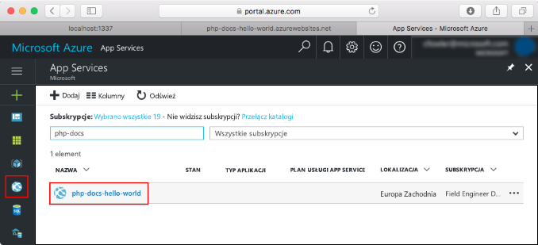
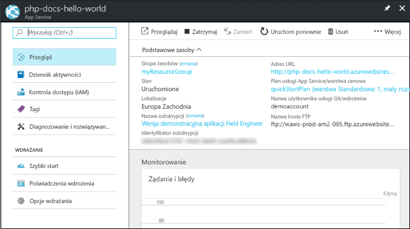

# <a name="create-a-python-app-in-azure-app-service-on-linux"></a>Tworzenie aplikacji w języku Python w Azure App Service w systemie Linux

W tym przewodniku szybki start wdrożono prostą aplikację w języku Python do [App Service w systemie Linux](app-service-linux-intro.md), która zapewnia wysoce skalowalną, samoobsługową usługę hostingu w Internecie. Korzystając z interfejsu wiersza polecenia platformy Azure ( [CLI](/cli/azure/install-azure-cli)) za pośrednictwem interakcyjnego, opartego na przeglądarce Azure Cloud Shell, można wykonać kroki opisane w sekcji Korzystanie z komputera Mac, Linux lub Windows.


[!INCLUDE [quickstarts-free-trial-note](../../../includes/quickstarts-free-trial-note.md)]

[!INCLUDE [cloud-shell-try-it.md](../../../includes/cloud-shell-try-it.md)]

## <a name="download-the-sample"></a>Pobierz przykład

W usłudze Cloud Shell utwórz katalog Szybki start, a następnie przejdź do niego.

```bash
mkdir quickstart

cd $HOME/quickstart
```

Uruchom następujące polecenie, aby sklonować przykładowe repozytorium aplikacji na komputer lokalny.

```bash
git clone https://github.com/Azure-Samples/python-docs-hello-world
```

Podczas wykonywania polecenie wyświetli informacje podobne do następującego przykładu:

```bash
Cloning into 'python-docs-hello-world'...
remote: Enumerating objects: 43, done.
remote: Total 43 (delta 0), reused 0 (delta 0), pack-reused 43
Unpacking objects: 100% (43/43), done.
Checking connectivity... done.
```

## <a name="create-a-web-app"></a>Tworzenie aplikacji internetowej

Przejdź do katalogu, który zawiera przykładowy kod, i uruchom polecenie `az webapp up`.

W poniższym przykładzie zastąp ciąg *\<nazwa_aplikacji>* globalnie unikatową nazwą aplikacji (prawidłowe znaki to `a-z`, `0-9` i `-`).

```bash
cd python-docs-hello-world

az webapp up -n <app_name>
```

Wykonanie tego polecenia może potrwać kilka minut. Podczas wykonywania polecenie wyświetli informacje podobne do następującego przykładu:

```json
The behavior of this command has been altered by the following extension: webapp
Creating Resource group 'appsvc_rg_Linux_CentralUS' ...
Resource group creation complete
Creating App service plan 'appsvc_asp_Linux_CentralUS' ...
App service plan creation complete
Creating app '<app_name>' ....
Webapp creation complete
Creating zip with contents of dir /home/username/quickstart/python-docs-hello-world ...
Preparing to deploy contents to app.
All done.
{
  "app_url": "https:/<app_name>.azurewebsites.net",
  "location": "Central US",
  "name": "<app_name>",
  "os": "Linux",
  "resourcegroup": "appsvc_rg_Linux_CentralUS ",
  "serverfarm": "appsvc_asp_Linux_CentralUS",
  "sku": "BASIC",
  "src_path": "/home/username/quickstart/python-docs-hello-world ",
  "version_detected": "-",
  "version_to_create": "python|3.7"
}
```

Polecenie `az webapp up` wykonuje następujące akcje:

- Utwórz domyślną grupę zasobów.

- Utwórz domyślny plan usługi aplikacji.

- Utwórz aplikację z określoną nazwą.

- [Spakuj pliki](https://docs.microsoft.com/azure/app-service/deploy-zip) wdrożenia z bieżącego katalogu roboczego do aplikacji.

## <a name="browse-to-the-app"></a>Przechodzenie do aplikacji

Przejdź do wdrożonej aplikacji za pomocą przeglądarki sieci Web.

```bash
http://<app_name>.azurewebsites.net
```

Przykładowy kod w języku Python jest uruchamiany w usłudze App Service dla systemu Linux z wbudowanym obrazem.


**Gratulacje!** Udało Ci się wdrożyć pierwszą własną aplikację w języku Python w usłudze App Service w systemie Linux.

## <a name="update-and-redeploy-the-code"></a>Aktualizowanie i ponowne wdrażanie kodu

W usłudze Cloud Shell wpisz `code application.py`, aby otworzyć edytor usługi Cloud Shell.


 Wprowadź niewielką zmianę w tekście w wywołaniu metody `return`:

```python
return "Hello Azure!"
```

Zapisz zmiany i zamknij edytor. Użyj polecenia `^S` w celu zapisania i polecenia `^Q` w celu zamknięcia programu.

Teraz aplikacja zostanie ponownie wdrożona. Zastąp `<app_name>` swoją aplikacją.

```bash
az webapp up -n <app_name>
```

Po zakończeniu wdrożenia przejdź z powrotem do okna przeglądarki otwartego w kroku **przechodzenia do aplikacji**, a następnie odśwież stronę.


## <a name="manage-your-new-azure-app"></a>Zarządzanie nową aplikacją platformy Azure

Przejdź do witryny <a href="https://portal.azure.com" target="_blank">Azure Portal</a>, aby zarządzać utworzoną aplikacją.

W menu po lewej stronie kliknij pozycję **App Services**, a następnie kliknij nazwę swojej aplikacji platformy Azure.



Zostanie wyświetlona strona omówienia aplikacji. Tutaj możesz wykonywać podstawowe zadania zarządzania, takie jak przeglądanie, zatrzymywanie, uruchamianie, ponowne uruchamianie i usuwanie.



Menu po lewej stronie zawiera różne strony służące do konfigurowania aplikacji. 

[!INCLUDE [cli-samples-clean-up](../../../includes/cli-samples-clean-up.md)]

## <a name="next-steps"></a>Następne kroki

> [!div class="nextstepaction"]
> [Samouczek: aplikacja w języku Python z PostgreSQL](tutorial-python-postgresql-app.md)

> [!div class="nextstepaction"]
> [Konfigurowanie aplikacji języka Python](how-to-configure-python.md)

> [!div class="nextstepaction"]
> [Samouczek: wdrażanie z repozytorium kontenera prywatnego](tutorial-custom-docker-image.md)
