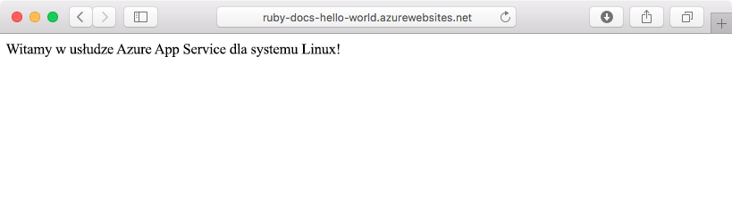
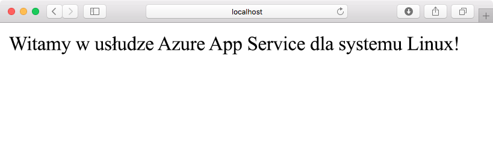
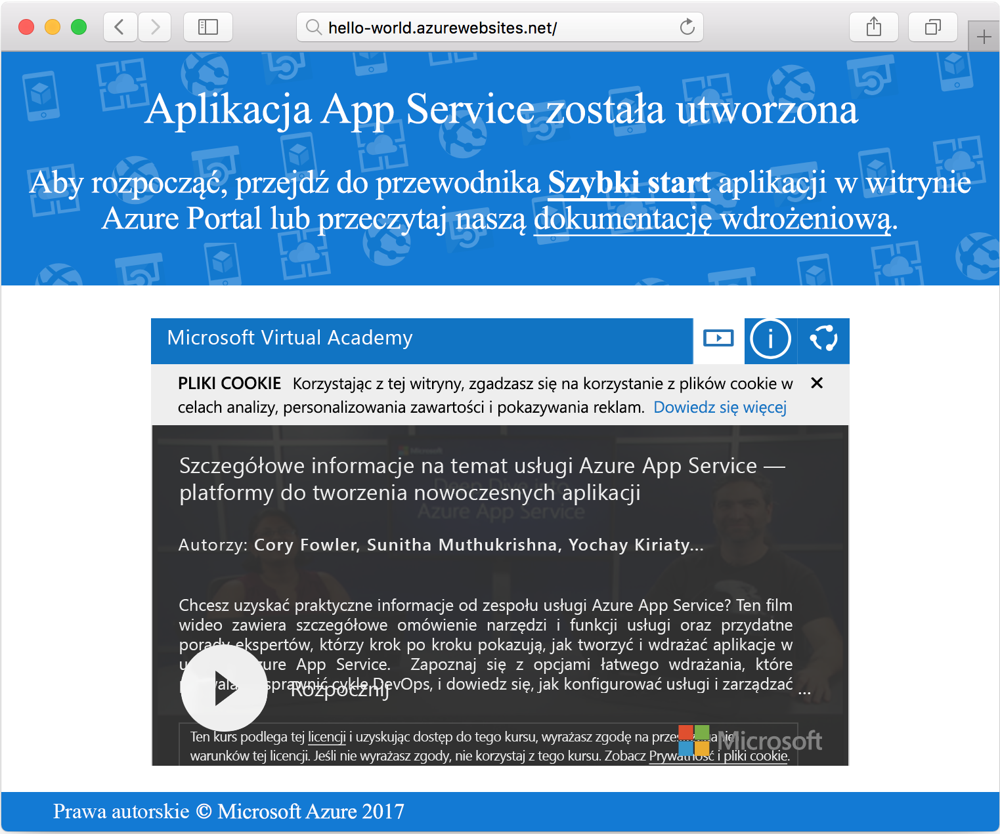

# <a name="create-a-ruby-on-rails-app-in-app-service-on-linux"></a>Informacje na temat tworzenia aplikacji Ruby on Rails w usłudze App Service w systemie Linux

Usługa [App Service w systemie Linux](app-service-linux-intro.md) oferuje wysoce skalowalną i samonaprawialną usługę hostingu w Internecie przy użyciu systemu operacyjnego Linux. Ten samouczek szybki start przedstawia sposób wdrażania aplikacji języka Ruby on-Szyns w celu Azure App Service w systemie Linux przy użyciu [Cloud Shell](https://docs.microsoft.com/azure/cloud-shell/overview).

> [!NOTE]
> Obecnie stos programistyczny Ruby obsługuje jedynie aplikację Ruby on Rails. Jeśli chcesz użyć innej platformy, takiej jak Sinatra, lub jeśli chcesz użyć nieobsługiwanej [wersji języka Ruby](app-service-linux-intro.md), musisz [uruchomić ją w kontenerze](quickstart-docker-go.md)niestandardowym.



[!INCLUDE [quickstarts-free-trial-note](../../../includes/quickstarts-free-trial-note.md)]

## <a name="prerequisites"></a>Wymagania wstępne

* <a href="https://www.ruby-lang.org/en/documentation/installation/#rubyinstaller" target="_blank">Zainstaluj język Ruby 2,6 lub nowszy</a>
* <a href="https://git-scm.com/" target="_blank">Zainstaluj oprogramowanie Git</a>

## <a name="download-the-sample"></a>Pobierz przykład

W oknie terminala uruchom następujące polecenie, aby sklonować przykładowe repozytorium aplikacji na maszynę lokalną:

```bash
git clone https://github.com/Azure-Samples/ruby-docs-hello-world
```

## <a name="run-the-application-locally"></a>Uruchamianie aplikacji lokalnie

Uruchom aplikację lokalnie, aby zobaczyć, jak powinna ona wyglądać, gdy wdrożysz ją na platformie Azure. Otwórz okno terminala, zmień katalog na `hello-world` i użyj polecenia `rails server`, aby uruchomić serwer.

Pierwszym krokiem jest zainstalowanie wymaganych rozwiązań Gem. `Gemfile` Znajduje się w próbce, więc po prostu uruchom następujące polecenie:

```bash
bundle install
```

Po zainstalowaniu rozwiązań Gem użyjemy do uruchomienia aplikacji programu instalującego niezamówione pakiety oprogramowania:

```bash
bundle exec rails server
```

Przy użyciu przeglądarki internetowej przejdź pod adres `http://localhost:3000`, aby przetestować aplikację lokalnie.



[!INCLUDE [Try Cloud Shell](../../../includes/cloud-shell-try-it.md)]

[!INCLUDE [Configure deployment user](../../../includes/configure-deployment-user.md)]

[!INCLUDE [Create resource group](../../../includes/app-service-web-create-resource-group-linux.md)]

[!INCLUDE [Create app service plan](../../../includes/app-service-web-create-app-service-plan-linux.md)]

## <a name="create-a-web-app"></a>Tworzenie aplikacji sieci web

[!INCLUDE [Create web app](../../../includes/app-service-web-create-web-app-ruby-linux-no-h.md)] 

Przejdź do aplikacji, aby zobaczyć nowo utworzoną aplikację internetową z wbudowanym obrazem. Zastąp ciąg _&lt;nazwa aplikacji>_ nazwą swojej aplikacji internetowej.

```bash
http://<app_name>.azurewebsites.net
```

Tak powinna wyglądać nowa aplikacja internetowa:



## <a name="deploy-your-application"></a>Wdrażanie aplikacji

Uruchom następujące polecenia, aby wdrożyć aplikację lokalną w aplikacji sieci Web platformy Azure:

```bash
git remote add azure <Git deployment URL from above>
git push azure master
```

Upewnij się, że operacje zdalnego wdrażania raportują powodzenie. Polecenia tworzą dane wyjściowe podobne do następującego tekstu:

```bash
remote: Using turbolinks 5.2.0
remote: Using uglifier 4.1.20
remote: Using web-console 3.7.0
remote: Bundle complete! 18 Gemfile dependencies, 78 gems now installed.
remote: Bundled gems are installed into `/tmp/bundle`
remote: Zipping up bundle contents
remote: .......
remote: ~/site/repository
remote: Finished successfully.
remote: Running post deployment command(s)...
remote: Deployment successful.
remote: App container will begin restart within 10 seconds.
To https://<app-name>.scm.azurewebsites.net/<app-name>.git
   a6e73a2..ae34be9  master -> master
```

Po zakończeniu wdrożenia Poczekaj około 10 sekund na ponowne uruchomienie aplikacji sieci Web, a następnie przejdź do aplikacji sieci Web i sprawdź wyniki.

```bash
http://<app-name>.azurewebsites.net
```


> [!NOTE]
> Po ponownym uruchomieniu aplikacji można obserwować kod `Error 503 Server unavailable` stanu HTTP w przeglądarce lub na `Hey, Ruby developers!` stronie domyślnej. Ponowne uruchomienie aplikacji może potrwać kilka minut.
>

[!INCLUDE [Clean-up section](../../../includes/cli-script-clean-up.md)]

## <a name="next-steps"></a>Następne kroki

> [!div class="nextstepaction"]
> [Samouczek: Język Ruby na szynach z Postgres](tutorial-ruby-postgres-app.md)

> [!div class="nextstepaction"]
> [Konfigurowanie aplikacji Ruby](configure-language-ruby.md)
