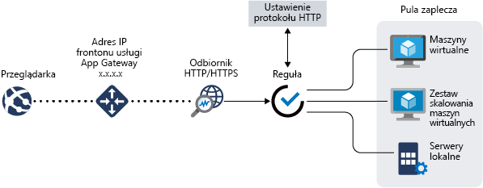
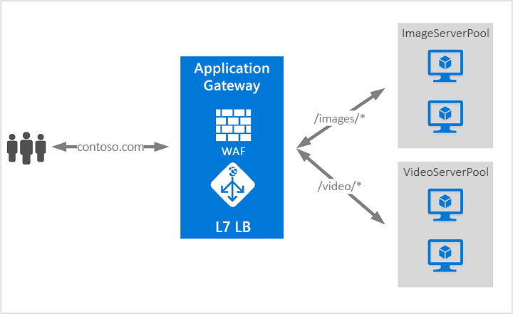

# Co to jest Azure Application Gateway?

Azure Application Gateway to moduł równoważenia obciążenia ruchu internetowego, który umożliwia zarządzanie ruchem kierowanym do aplikacji internetowych. Tradycyjne moduły równoważenia obciążenia działają w warstwie transportu (warstwie OSI 4 — TCP i UDP) i kierują ruch na podstawie źródłowego adresu IP i portu do docelowego adresu IP i portu.

Za pomocą Application Gateway można podejmować decyzje dotyczące routingu na podstawie dodatkowych atrybutów żądania HTTP, takich jak ścieżka identyfikatora URI lub nagłówki hosta. Na przykład można kierować ruch na podstawie przychodzącego adresu URL. Jeśli w przychodzącym adresie URL jest element `/images`, można kierować ruch do określonego zestawu serwerów (nazywanego pulą) skonfigurowanego na potrzeby obrazów. Jeśli `/video` znajduje się w adresie URL, ten ruch jest kierowany do innej puli, która jest zoptymalizowana pod kątem filmów wideo.

Ten typ routingu jest nazywany równoważeniem obciążenia warstwy aplikacji (warstwy OSI 7). Usługa Azure Application Gateway może wykonywać routing oparty na adresach URL i nie tylko.

W usłudze Azure Application Gateway są dostępne następujące funkcje:

## Zakończenie SSL (SSL/TLS)

Brama Application Gateway obsługuje zakończenie protokołu SSL/TLS w bramie, po czym ruch przeważnie jest przenoszony do serwerów zaplecza. Ta funkcja umożliwia odciążenie serwerów sieci Web z nadmiaru kosztownych operacji szyfrowania i odszyfrowywania. Jednak czasami nieszyfrowana komunikacja z serwerami jest opcją niemożliwą do zaakceptowania. Może to być spowodowane wymaganiami dotyczącymi zabezpieczeń, wymaganiami dotyczącymi zgodności lub zastosowaniem tylko bezpiecznego połączenia. W przypadku tych aplikacji Brama Application Gateway obsługuje kompleksowe szyfrowanie SSL/TLS.

## Skalowanie automatyczne

Wdrożenia Application Gateway lub WAF w ramach jednostki SKU Standard_v2 lub WAF_v2 obsługują Skalowanie automatyczne i można skalować w górę lub w dół w zależności od zmiany wzorców obciążenia ruchu sieciowego. Dzięki skalowaniu automatycznemu nie trzeba również wybierać rozmiaru wdrożenia ani liczby wystąpień podczas aprowizowania usługi. Aby uzyskać więcej informacji na temat Application Gateway funkcji Standard_v2 i WAF_v2, zobacz [skalowanie jednostki SKU w wersji 2](application-gateway-autoscaling-zone-redundant.md).

## Nadmiarowość stref

Wdrożenie Application Gateway lub WAF w ramach jednostki SKU Standard_v2 lub WAF_v2 może obejmować wiele Strefy dostępności, co zapewnia lepszą odporność na uszkodzenia i eliminuje konieczność udostępniania osobnych bram aplikacji w każdej strefie.

## Statyczny adres VIP

Adres VIP bramy aplikacji w jednostce SKU Standard_v2 lub WAF_v2 obsługuje wyłącznie statyczny typ adresu VIP. Dzięki temu wirtualne adresy IP skojarzone z bramą aplikacji nie zmieniają się nawet w okresie istnienia Application Gateway.

## Zapora aplikacji internetowej

Zapora aplikacji internetowej (WAF) to funkcja usługi Application Gateway, która zapewnia scentralizowaną ochronę aplikacji internetowych przed typowymi programami wykorzystującymi luki i lukami w zabezpieczeniach. WAF opiera się na regułach z [OWASP (Open Web Application Security Project) podstawowych zestawów reguł](https://www.owasp.org/index.php/Category:OWASP_ModSecurity_Core_Rule_Set_Project) 3,1 (tylko WAF_v2), 3,0 i 2.2.9. 

Aplikacje internetowe coraz częściej stają się obiektami złośliwych ataków wykorzystujących znane luki w zabezpieczeniach. Wśród nich często zdarzają się np. ataki polegające na iniekcji SQL i ataki z użyciem skryptów wykorzystywanych w wielu witrynach. Zapobieganie takim atakom z poziomu kodu aplikacji może być trudne. Może też wymagać rygorystycznego przestrzegania harmonogramu konserwacji, poprawek i monitorowania na wielu warstwach topologii aplikacji. Scentralizowana zapora aplikacji internetowej ułatwia zarządzanie zabezpieczeniami oraz zapewnia lepszą ochronę administratorów aplikacji przed zagrożeniami i intruzami. Zapora aplikacji internetowej może reagować na zagrożenia bezpieczeństwa szybciej — poprzez wdrażanie poprawek zapobiegających wykorzystaniu znanych luk w zabezpieczeniach w centralnej lokalizacji zamiast w poszczególnych aplikacjach internetowych. Istniejące bramy Application Gateway można łatwo przekonwertować na bramę Application Gateway obsługującą zaporę aplikacji internetowej.

Aby uzyskać więcej informacji, zobacz [Zapora aplikacji sieci Web (WAF) w Application Gateway](https://docs.microsoft.com/azure/application-gateway/waf-overview).

## Routing oparty na adresach URL

Routing oparty na ścieżkach URL umożliwia kierowanie ruchu do pul serwerów zaplecza na podstawie ścieżek URL żądania. Jeden ze scenariuszy polega na kierowaniu żądań dla różnych typów zawartości do różnych pul.

Na przykład żądania dotyczące adresu `http://contoso.com/video/*` są kierowane do puli VideoServerPool, a żądania dotyczące adresu `http://contoso.com/images/*` — do puli ImageServerPool. Pula DefaultServerPool jest wybierana, jeśli żaden z wzorców ścieżki nie pasuje.

Aby uzyskać więcej informacji, zobacz [routing oparty na adresach URL za pomocą Application Gateway](https://docs.microsoft.com/azure/application-gateway/url-route-overview).

## Hostowanie wielu witryn

Hostowanie wielu witryn pozwala na skonfigurowanie więcej niż jednej witryny internetowej w tym samym wystąpieniu bramy aplikacji. Ta funkcja umożliwia skonfigurowanie bardziej wydajnej topologii dla wdrożeń przez dodanie do 100 witryn sieci Web do jednego Application Gateway lub 40 dla WAF (w celu uzyskania optymalnej wydajności). Każdą witrynę internetową można skierować do jej własnej puli. Na przykład brama aplikacji może obsługiwać ruch dla witryn `contoso.com` i `fabrikam.com` z dwóch pul serwerów o nazwie ContosoServerPool i FabrikamServerPool.

Żądania dotyczące adresu `http://contoso.com` są kierowane do puli ContosoServerPool, a żądania dotyczące adresu `http://fabrikam.com` — do puli FabrikamServerPool.

Podobnie dwie domeny podrzędne tej samej domeny nadrzędnej mogą być hostowane w ramach tego samego wdrożenia usługi Application Gateway. Przykłady użycia domen podrzędnych mogą obejmować domeny podrzędne `http://blog.contoso.com` i `http://app.contoso.com` hostowane w ramach jednego wdrożenia usługi Application Gateway.

Aby uzyskać więcej informacji, zobacz [hosting z wieloma lokacjami za pomocą Application Gateway](https://docs.microsoft.com/azure/application-gateway/multiple-site-overview).

## Przekierowania

Typowy scenariusz dla wielu aplikacji internetowych obejmuje obsługę automatycznego przekierowania protokołu HTTP do HTTPS, aby zagwarantować, że cała komunikacja między aplikacją a jej użytkownikami odbywa się za pośrednictwem ścieżki szyfrowanej.

W przeszłości można było użyć technik takich jak tworzenie dedykowanej puli, których jedynym celem jest przekierowanie żądań odbieranych przez protokół HTTP do protokołu HTTPS. Usługa Application Gateway obsługuje możliwość przekierowywania ruchu sieciowego w tej usłudze. Upraszcza to konfigurację aplikacji, optymalizuje wykorzystanie zasobów i umożliwia obsługę nowych scenariuszy przekierowania, w tym przekierowania globalnego i opartego na ścieżce. Obsługa przekierowań Application Gateway nie jest ograniczona do samego przekierowania protokołu HTTP do protokołu HTTPS. Jest to ogólny mechanizm przekierowania, dzięki czemu możliwe jest przekierowanie z i do dowolnego portu zdefiniowanego przy użyciu reguł. Obsługiwane jest również przekierowanie do zewnętrznej witryny.

Obsługa przekierowania dla usługi Application Gateway oferuje następujące możliwości:

- Globalne przekierowanie z jednego portu do innego portu w bramie. Umożliwia to przekierowanie protokołu HTTP do HTTPS w witrynie.
- Przekierowanie na podstawie ścieżki. Ten typ przekierowania umożliwia przekierowanie protokołu HTTP do HTTPS tylko w określonym obszarze witryny, na przykład obszarze koszyka określonym przez element `/cart/*`.
- Przekierowanie do zewnętrznej witryny.

Aby uzyskać więcej informacji, zobacz [przekierowywanie ruchu](https://docs.microsoft.com/azure/application-gateway/redirect-overview) za pomocą Application Gateway.

## Koligacja sesji

Funkcja koligacji sesji na podstawie plików cookie jest przydatna, gdy chcesz zachować sesję użytkownika na tym samym serwerze. Używając plików cookie zarządzanych przez bramę, usługa Application Gateway może kierować dalszy ruch z sesji użytkownika na ten sam serwer w celu przetwarzania. Jest to ważne w przypadkach, w których stan sesji jest zapisywany lokalnie na serwerze dla sesji użytkownika.

## Ruch protokołów WebSocket i HTTP/2

Usługa Application Gateway zapewnia natywną obsługę protokołów WebSocket i HTTP/2. Nie ma żadnych ustawień konfigurowanych przez użytkownika umożliwiających selektywne włączenie lub wyłączenie obsługi protokołu WebSocket.

Protokoły WebSocket i HTTP/2 umożliwiają pełnodupleksową komunikację między serwerem i klientem przez długotrwałe połączenie TCP. Pozwala to na bardziej interaktywną komunikację między serwerem internetowym a klientem, która może być dwukierunkowa bez konieczności sondowania, co jest wymagane w implementacjach opartych na protokole HTTP. Te protokoły mają niewielkie obciążenie, w przeciwieństwie do protokołu HTTP i mogą ponownie używać tego samego połączenia TCP dla wielu żądań/odpowiedzi, co zwiększa efektywność użycia zasobów. Te protokoły są przeznaczone do pracy z użyciem tradycyjnych portów HTTP, tj. 80 i 443.

Aby uzyskać więcej informacji, zobacz [Obsługa protokołu WebSocket](https://docs.microsoft.com/azure/application-gateway/application-gateway-websocket) i [Obsługa protokołu HTTP/2](https://docs.microsoft.com/azure/application-gateway/configuration-overview#http2-support).

## Kontroler ruchu przychodzącego w usłudze Azure Kubernetes Service (AKS) — wersja zapoznawcza 

Kontroler ruchu przychodzącego w usłudze Application Gateway jest uruchamiany jako zasobnik w ramach klastra usługi AKS i umożliwia usłudze Application Gateway obsługę ruchu przychodzącego do klastra usługi AKS. Jest to obsługiwane tylko w Application Gateway v2.

Aby uzyskać więcej informacji, zobacz [Azure Application Gateway Ingress Controller (Kontroler ruchu przychodzącego w usłudze Azure Application Gateway)](https://azure.github.io/application-gateway-kubernetes-ingress/).

## Opróżnianie połączeń

Opróżnianie połączeń umożliwia bezproblemowe usunięcie członków puli zaplecza podczas planowanych aktualizacji usługi. To ustawienie jest włączane za pośrednictwem ustawienia http zaplecza i można je zastosować do wszystkich członków puli zaplecza podczas tworzenia reguły. Po włączeniu Application Gateway zapewnia wszystkie żądania wyrejestrowania puli zaplecza nie otrzymają żadnego nowego żądania, zezwalając na ukończenie istniejących żądań w skonfigurowanym limicie czasu. Dotyczy to zarówno wystąpień zaplecza, które są jawnie usuwane z puli zaplecza przez wywołanie interfejsu API, jak i wystąpienia zaplecza, które są zgłaszane jako w złej kondycji określone przez sondy kondycji.

Aby uzyskać więcej informacji, zobacz sekcję opróżnianie połączenia w temacie [Omówienie konfiguracji Application Gateway](https://docs.microsoft.com/azure/application-gateway/configuration-overview#connection-draining).

## Strony błędów niestandardowych

Usługa Application Gateway umożliwia tworzenie niestandardowych stron błędów wyświetlanych zamiast domyślnych strony błędów. W przypadku niestandardowych stron błędów możesz użyć własnych oznakowań i układu.

Aby uzyskać więcej informacji, zobacz [Błędy niestandardowe](custom-error.md).

## Ponowne zapisywanie nagłówków HTTP

Nagłówki HTTP umożliwiają klientowi i serwerowi przekazywanie dodatkowych informacji z żądaniem lub odpowiedzią. Ponowne Zapisywanie tych nagłówków HTTP pomaga wykonać kilka ważnych scenariuszy, takich jak:

- Dodawanie pól nagłówków związanych z zabezpieczeniami, takich jak HSTS/X-XSS-Protection.
- Usuwanie pól nagłówka odpowiedzi, które mogą ujawniać poufne informacje.
- Usuwanie informacji o porcie z X-Forwarded-For Headers.

Application Gateway obsługuje możliwość dodawania, usuwania lub aktualizowania nagłówków żądań i odpowiedzi HTTP, podczas gdy pakiety żądań i odpowiedzi przechodzą między klientami a pulami zaplecza. Zapewnia także możliwość dodawania warunków, aby upewnić się, że określone nagłówki są zapisywane tylko wtedy, gdy są spełnione określone warunki.

Aby uzyskać więcej informacji, zobacz [Zapisywanie nagłówków HTTP](rewrite-http-headers.md).

## Zmiany rozmiaru

Jednostki SKU Application Gateway Standard_v2 i WAF_v2 można skonfigurować na potrzeby wdrożeń skalowania automatycznego lub stałego rozmiaru. Te jednostki SKU nie oferują różnych rozmiarów wystąpień. Aby uzyskać więcej informacji na temat wydajności i cen w wersji 2, zobacz Automatyczne [skalowanie jednostki SKU w wersji 2](https://docs.microsoft.com/azure/application-gateway/application-gateway-autoscaling-zone-redundant#pricing).

Jednostka SKU Application Gateway Standard i WAF jest obecnie oferowana w trzech rozmiarach: małym (**Small**), średnim (**Medium**) i dużym (**Large**). Rozmiary małych wystąpień są przeznaczone na potrzeby programowania i scenariuszy testowania.

Pełna lista limitów usługi Application Gateway znajduje się na stronie [ograniczeń usługi Application Gateway](../azure-subscription-service-limits.md?toc=%2fazure%2fapplication-gateway%2ftoc.json#application-gateway-limits).

W poniższej tabeli przedstawiono średnią przepływność wydajności dla każdego wystąpienia usługi Application Gateway V1 z włączonym odciążeniem SSL:

| Średni rozmiar odpowiedzi strony zaplecza | Małe | Średni | Duże |
| --- | --- | --- | --- |
| 6 KB |7,5 Mb/s |13 Mb/s |50 Mb/s |
| 100 KB |35 Mb/s |100 Mb/s |200 Mb/s |

> [!NOTE]
> Są to przybliżone wartości przepływności bramy aplikacji. Rzeczywista przepływność zależy od różnorodnych szczegółów środowiska, takich jak średni rozmiar strony, lokalizacja wystąpień zaplecza i czas przetwarzania potrzebny do obsługi strony. Aby uzyskać dokładne wartości wydajności, należy przeprowadzić własne testy. Te wartości są podane tylko jako wskazówki na potrzeby planowania pojemności.

## Następne kroki

W zależności od wymagań i środowiska możesz utworzyć testową usługę Application Gateway przy użyciu witryny Azure Portal, programu Azure PowerShell lub interfejsu wiersza polecenia platformy Azure:

- [Szybki start: Bezpośredni ruch internetowy za pomocą usługi Azure Application Gateway — Azure Portal](quick-create-portal.md)
- [Szybki start: bezpośredni ruch internetowy w usłudze Azure Application Gateway — Azure PowerShell](quick-create-powershell.md)
- [Szybki start: bezpośredni ruch internetowy w usłudze Azure Application Gateway — interfejs wiersza polecenia platformy Azure](quick-create-cli.md)
