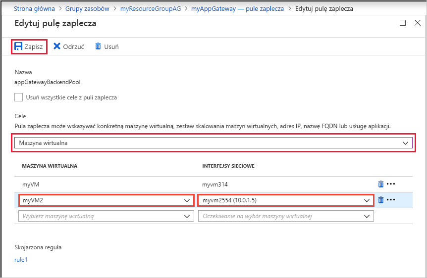
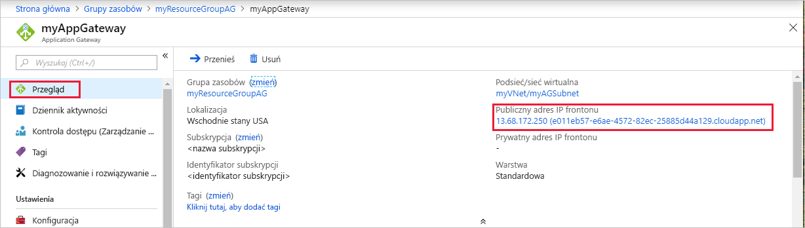

# <a name="quickstart-direct-web-traffic-with-azure-application-gateway---azure-portal"></a>Szybki start: bezpośredni ruch internetowy w usłudze Azure Application Gateway — Azure Portal

W tym przewodniku szybki start pokazano, jak utworzyć bramę aplikacji przy użyciu Azure Portal.  Po utworzeniu bramy aplikacji przetestuj ją, aby upewnić się, że działa prawidłowo. Dzięki usłudze Azure Application Gateway kierowanie ruchu sieci Web aplikacji do określonych zasobów przez przypisanie odbiorników do portów, tworzenie reguł i Dodawanie zasobów do puli zaplecza. Dla uproszczenia w tym artykule użyto prostej konfiguracji z publicznym adresem IP frontonu, podstawowego odbiornika do hostowania pojedynczej lokacji w tej bramie aplikacji, dwóch maszyn wirtualnych używanych dla puli zaplecza i podstawowej reguły routingu żądań.

Jeśli nie masz subskrypcji platformy Azure, przed rozpoczęciem utwórz [bezpłatne konto](https://azure.microsoft.com/free/?WT.mc_id=A261C142F).


[!INCLUDE [updated-for-az](../../includes/updated-for-az.md)]

## <a name="sign-in-to-azure"></a>Logowanie do platformy Azure

Zaloguj się do [witryny Azure Portal](https://portal.azure.com) przy użyciu danych konta Azure.

## <a name="create-an-application-gateway"></a>Tworzenie bramy aplikacji

1. W menu Azure Portal lub na stronie **głównej** wybierz pozycję **Utwórz zasób**. Zostanie wyświetlone okno **Nowe**.

2. Wybierz pozycję **Sieć**, a następnie wybierz pozycję **Application Gateway** z listy **Polecane**.

### <a name="basics-tab"></a>Karta podstawy

1. Na karcie **podstawowe** wprowadź następujące wartości następujących ustawień bramy aplikacji:

   - **Grupa zasobów**: wybierz pozycję **myResourceGroupAG** dla grupy zasobów. Jeśli ta grupa nie istnieje, wybierz pozycję **Utwórz nową** w celu jej utworzenia.
   - **Nazwa bramy aplikacji**: wprowadź *myAppGateway* jako nazwę bramy aplikacji.

     

2. Do komunikacji między tworzonymi zasobami platforma Azure potrzebuje sieci wirtualnej. Można utworzyć nową sieć wirtualną lub użyć istniejącej. W tym przykładzie utworzysz nową sieć wirtualną w tym samym czasie, podczas tworzenia bramy aplikacji. Wystąpienia Application Gateway są tworzone w różnych podsieciach. W tym przykładzie tworzysz dwie podsieci: jedną dla bramy aplikacji i drugą dla serwerów zaplecza.

    W obszarze **Konfigurowanie sieci wirtualnej**Utwórz nową sieć wirtualną, wybierając pozycję **Utwórz nową**. W otwartym oknie **Tworzenie sieci wirtualnej** wprowadź następujące wartości, aby utworzyć sieć wirtualną i dwie podsieci:

    - **Nazwa**: wprowadź *myVNet* dla nazwy sieci wirtualnej.

    - **Nazwa podsieci** (Application Gateway podsieć): w siatce **podsieci** zostanie wyświetlona podsieć o nazwie *default*. Zmień nazwę tej podsieci na *myAGSubnet*.<br>Podsieć bramy aplikacji może zawierać tylko bramy aplikacji. Inne zasoby nie są dozwolone.

    - **Nazwa podsieci** (podsieć serwera wewnętrznej bazy danych): w drugim wierszu siatki **podsieci** wprowadź *myBackendSubnet* w kolumnie **Nazwa podsieci** .

    - **Zakres adresów** (podsieć serwera wewnętrznej bazy danych): w drugim wierszu siatki **podsieci** Wprowadź zakres adresów, który nie nakłada się na zakres adresów *myAGSubnet*. Na przykład jeśli zakres adresów *myAGSubnet* jest równy 10.0.0.0/24, wprowadź *10.0.1.0/24* dla zakresu adresów *myBackendSubnet*.

    Wybierz **przycisk OK** , aby zamknąć okno **Tworzenie sieci wirtualnej** i zapisać ustawienia sieci wirtualnej.

     
    
3. Na karcie **podstawy** zaakceptuj wartości domyślne pozostałych ustawień, a następnie wybierz pozycję **Dalej: frontony**.

### <a name="frontends-tab"></a>Karta frontonów

1. Na karcie **frontony** Sprawdź, czy **Typ adresu IP frontonu** jest ustawiony na wartość **Public**. <br>Adres IP frontonu można skonfigurować tak, aby był publiczny lub prywatny jak w przypadku użycia. W tym przykładzie wybrano publiczny adres IP frontonu.
   > [!NOTE]
   > W przypadku jednostki SKU Application Gateway v2 można wybrać tylko **publiczną** konfigurację adresu IP frontonu. Dla tej jednostki SKU w wersji 2 nie jest obecnie włączona tylko konfiguracja prywatnego adresu IP frontonu. Można skonfigurować publiczną i prywatną konfigurację adresu IP frontonu.

2. Wybierz opcję **Utwórz nowy** dla **publicznego adresu IP** i wprowadź *MYAGPUBLICIPADDRESS* dla nazwy publicznego adresu IP, a następnie wybierz przycisk **OK**. 

     

3. Wybierz pozycję **Dalej: nadkończenie**.

### <a name="backends-tab"></a>Karta zakończyła się

Pula zaplecza służy do kierowania żądań do serwerów zaplecza, które obsługują żądanie. Pule zaplecza mogą składać się z kart sieciowych, zestawów skalowania maszyn wirtualnych, publicznych adresów IP, wewnętrznych adresów IP, w pełni kwalifikowanych nazw domen (FQDN) i wielodostępnych zapleczy, takich jak Azure App Service. W tym przykładzie utworzysz pustą pulę zaplecza z bramą aplikacji, a następnie dodasz cele zaplecza do puli zaplecza.

1. Na karcie **nadkończenie** wybierz pozycję **+ Dodaj pulę zaplecza**.

2. W otwartym oknie **Dodawanie puli zaplecza** wprowadź następujące wartości, aby utworzyć pustą pulę zaplecza:

    - **Nazwa**: wprowadź *myBackendPool* jako nazwę puli zaplecza.
    - **Dodaj pulę zaplecza bez elementów docelowych**: wybierz opcję **tak** , aby utworzyć pulę zaplecza, która nie ma elementów docelowych. Po utworzeniu bramy aplikacji należy dodać cele zaplecza.

3. W oknie **Dodawanie puli zaplecza** wybierz pozycję **Dodaj** , aby zapisać konfigurację puli zaplecza i powrócić **do karty** zaplecze.

     

4. Na karcie **zakończyło** się wybierz pozycję **Dalej: Konfiguracja**.

### <a name="configuration-tab"></a>Karta Konfiguracja

Na karcie **Konfiguracja** zostanie nawiązane połączenie frontonu i puli zaplecza utworzonej przy użyciu reguły routingu.

1. Wybierz pozycję **Dodaj regułę** w kolumnie **reguły routingu** .

2. W otwartym oknie **Dodawanie reguły routingu** wpisz *MyRoutingRule* dla **nazwy reguły**.

3. Reguła routingu wymaga odbiornika. Na karcie **odbiornik** w oknie **Dodawanie reguły routingu** wprowadź następujące wartości dla odbiornika:

    - **Nazwa odbiornika** *: Wprowadź nazwę* odbiornika.
    - **Adres IP frontonu**: wybierz opcję **publiczny** , aby wybrać publiczny adres IP utworzony dla frontonu.
  
      Zaakceptuj wartości domyślne pozostałych ustawień na karcie **odbiornik** , a następnie wybierz kartę **cele zaplecza** , aby skonfigurować resztę reguły routingu.

   

4. Na karcie **cele zaplecza** wybierz pozycję **myBackendPool** dla **elementu docelowego zaplecza**.

5. Dla **Ustawienia http**wybierz pozycję **Utwórz nowy** , aby utworzyć nowe ustawienie http. Ustawienie HTTP określi zachowanie reguły routingu. W oknie **Dodawanie ustawienia protokołu HTTP** , które zostanie otwarte, wprowadź *myHTTPSetting* dla **nazwy ustawienia http**. Zaakceptuj wartości domyślne pozostałych ustawień w oknie **Dodawanie ustawienia protokołu HTTP** , a następnie wybierz pozycję **Dodaj** , aby powrócić do okna **Dodawanie reguły routingu** . 

     

6. W oknie **Dodawanie reguły routingu** wybierz pozycję **Dodaj** , aby zapisać regułę routingu, i wróć do karty **Konfiguracja** .

     

7. Wybierz pozycję **Dalej: Tagi** , a następnie kliknij przycisk **Dalej: przegląd + Utwórz**.

### <a name="review--create-tab"></a>Przejrzyj i Utwórz kartę

Przejrzyj ustawienia na karcie **Przegląd + tworzenie** , a następnie wybierz pozycję **Utwórz** , aby utworzyć sieć wirtualną, publiczny adres IP i bramę aplikacji. Tworzenie bramy aplikacji na platformie Azure może potrwać kilka minut. Zaczekaj na pomyślne zakończenie wdrożenia, zanim przejdziesz do kolejnej sekcji.

## <a name="add-backend-targets"></a>Dodaj cele zaplecza

W tym przykładzie użyjesz maszyn wirtualnych jako zaplecza docelowego. Możesz użyć istniejących maszyn wirtualnych lub utworzyć nowe. Utworzysz dwie maszyny wirtualne używane przez platformę Azure jako serwery zaplecza dla bramy aplikacji.

W tym celu wykonaj następujące czynności:

1. Utwórz dwie nowe maszyny wirtualne, *myVM* i *myVM2*, które będą używane jako serwery zaplecza.
2. Zainstaluj usługi IIS na maszynach wirtualnych, aby sprawdzić, czy Brama aplikacji została utworzona pomyślnie.
3. Dodaj serwery zaplecza do puli zaplecza.

### <a name="create-a-virtual-machine"></a>Tworzenie maszyny wirtualnej

1. W menu Azure Portal lub na stronie **głównej** wybierz pozycję **Utwórz zasób**. Zostanie wyświetlone okno **Nowe**.
2. Wybierz pozycję **obliczenia** , a następnie wybierz pozycję **Windows Server 2016 Datacenter** na **popularnej** liście. Zostanie wyświetlona strona **Tworzenie maszyny wirtualnej**.<br>Application Gateway może kierować ruch do dowolnego typu maszyny wirtualnej używanej w puli zaplecza. W tym przykładzie używane jest centrum danych systemu Windows Server 2016.
3. Wprowadź następujące wartości na karcie **Podstawy** dla poniższych ustawień maszyny wirtualnej:

    - **Grupa zasobów**: wybierz pozycję **myResourceGroupAG** dla nazwy grupy zasobów.
    - **Nazwa maszyny wirtualnej**: wprowadź *myVM* dla nazwy maszyny wirtualnej.
    - **Nazwa**użytkownika: wprowadź *azureuser* dla nazwy administratora.
    - **Hasło**: wprowadź *Azure123456!* jako hasło administratora.
4. Zaakceptuj inne wartości domyślne, a następnie wybierz pozycję **Dalej: dyski**.  
5. Zaakceptuj ustawienia domyślne karty **dyski** , a następnie wybierz pozycję **Dalej: sieć**.
6. Na karcie **Sieć** sprawdź, czy wybrano pozycję **myVNet** w obszarze **Sieć wirtualna** oraz czy pozycja **Podsieć** została ustawiona na wartość **myBackendSubnet**. Zaakceptuj inne wartości domyślne, a następnie wybierz pozycję **Dalej: Zarządzanie**.<br>Application Gateway może komunikować się z wystąpieniami poza siecią wirtualną, w której znajduje się, ale należy upewnić się, że połączenie IP jest nawiązywane.
7. Na karcie **Zarządzanie** ustaw pozycję **Diagnostyka rozruchu** na **Wył.** Zaakceptuj pozostałe wartości domyślne, a następnie wybierz pozycję **Przeglądanie + tworzenie**.
8. Na karcie **Przeglądanie + tworzenie** przejrzyj ustawienia, usuń wszystkie błędy walidacji, a następnie wybierz pozycję **Utwórz**.
9. Poczekaj na ukończenie tworzenia maszyny wirtualnej, zanim przejdziesz dalej.

### <a name="install-iis-for-testing"></a>Zainstaluj usługi IIS do testowania

W tym przykładzie należy zainstalować usługi IIS tylko na maszynach wirtualnych, aby sprawdzić, czy platforma Azure utworzyła bramę aplikacji pomyślnie.

1. Otwórz program [Azure PowerShell](https://docs.microsoft.com/azure/cloud-shell/quickstart-powershell). W tym celu wybierz pozycję **Cloud Shell** na górnym pasku nawigacyjnym w witrynie Azure Portal, a następnie wybierz pozycję **PowerShell** z listy rozwijanej. 

    

2. Uruchom następujące polecenie, aby zainstalować usługi IIS na maszynie wirtualnej: 

    ```azurepowershell-interactive
    Set-AzVMExtension `
      -ResourceGroupName myResourceGroupAG `
      -ExtensionName IIS `
      -VMName myVM `
      -Publisher Microsoft.Compute `
      -ExtensionType CustomScriptExtension `
      -TypeHandlerVersion 1.4 `
      -SettingString '{"commandToExecute":"powershell Add-WindowsFeature Web-Server; powershell Add-Content -Path \"C:\\inetpub\\wwwroot\\Default.htm\" -Value $($env:computername)"}' `
      -Location EastUS
    ```

3. Utwórz drugą maszynę wirtualną i zainstaluj usługi IIS, wykonując kroki ukończone wcześniej. Użyj *myVM2* dla nazwy maszyny wirtualnej i ustawienia **VMName** polecenia cmdlet **Set-AzVMExtension** .

### <a name="add-backend-servers-to-backend-pool"></a>Dodawanie serwerów zaplecza do puli zaplecza

1. W menu Azure Portal wybierz pozycję **wszystkie zasoby** lub Wyszukaj, a następnie wybierz pozycję *wszystkie zasoby*. Następnie wybierz pozycję **myAppGateway**.

2. Wybierz pozycję **Pule zaplecza** w menu po lewej stronie.

3. Wybierz pozycję **myBackendPool**.

4. W obszarze **Cele** wybierz pozycję **Maszyna wirtualna** z listy rozwijanej.

5. W obszarach **MASZYNA WIRTUALNA** i **INTERFEJSY SIECIOWE** wybierz maszyny wirtualne **myVM** i **myVM2** oraz ich skojarzone interfejsy sieciowe z list rozwijanych.

    

6. Wybierz pozycję **Zapisz**.

7. Przed przejściem do następnego kroku poczekaj na zakończenie wdrożenia.

## <a name="test-the-application-gateway"></a>Testowanie bramy aplikacji

Mimo że zainstalowanie usług IIS nie jest wymagane do utworzenia bramy aplikacji, zainstalowano je w ramach tego przewodnika Szybki start, aby sprawdzić, czy platforma Azure pomyślnie utworzyła bramę aplikacji. Użyj usług do przetestowania bramy aplikacji:

1. Znajdź publiczny adres IP bramy aplikacji. **a stronie**  przeglądowej  wybierz pozycję **wszystkie zasoby**, wpisz *myAGPublicIPAddress* w polu wyszukiwania, a następnie wybierz go w wynikach wyszukiwania. Platforma Azure wyświetla publiczny adres IP na stronie **Omówienie**.
2. Skopiuj publiczny adres IP, a następnie wklej go na pasku adresu przeglądarki.
3. Sprawdź odpowiedź. Prawidłowa odpowiedź weryfikuje, czy Brama aplikacji została pomyślnie utworzona i może pomyślnie nawiązać połączenie z zapleczem.

## <a name="clean-up-resources"></a>Oczyszczanie zasobów

Jeśli nie potrzebujesz już zasobów utworzonych za pomocą bramy aplikacji, usuń grupę zasobów. Usuwając grupę zasobów, usuwasz również bramę aplikacji i wszystkie powiązane z nią zasoby. 

Aby usunąć grupę zasobów:

1. W menu Azure Portal wybierz pozycję **grupy zasobów** lub Wyszukaj, a następnie wybierz pozycję *grupy zasobów*.
2. Na stronie **Grupy zasobów** wyszukaj pozycję **myResourceGroupAG** na liście i wybierz ją.
3. Na **stronie grupy zasobów** wybierz pozycję **Usuń grupę zasobów**.
4. Wprowadź ciąg *myResourceGroupAG* w polu **WPISZ NAZWĘ GRUPY ZASOBÓW**, a następnie wybierz pozycję **Usuń**

## <a name="next-steps"></a>Następne kroki

> [!div class="nextstepaction"]
> [Zarządzanie ruchem internetowym przy użyciu bramy aplikacji za pomocą interfejsu wiersza polecenia platformy Azure](./tutorial-manage-web-traffic-cli.md)
