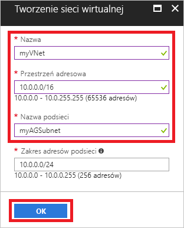
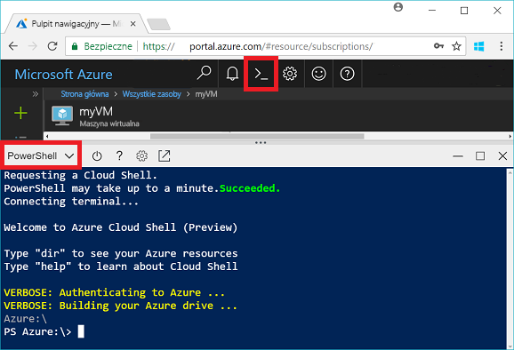
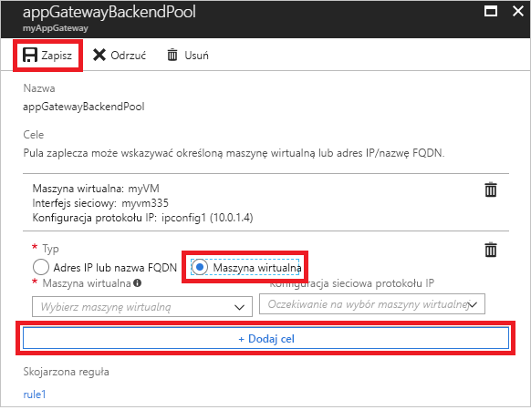
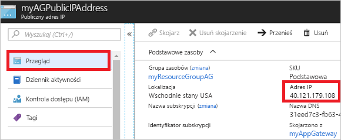

# <a name="quickstart-direct-web-traffic-with-azure-application-gateway---azure-portal"></a>Szybki start: bezpośredni ruch internetowy w usłudze Azure Application Gateway — Azure Portal

Dzięki usłudze Azure Application Gateway można kierować ruch internetowy aplikacji do określonych zasobów, przypisując odbiorniki do portów, tworząc reguły i dodając zasoby do puli zaplecza.

W tym przewodniku Szybki start przedstawiono sposób użycia witryny Azure Portal do tworzenia bramy aplikacji z dwiema maszynami wirtualnymi w puli zaplecza. Następnie będzie można ją przetestować, aby sprawdzić, czy działa prawidłowo.

Jeśli nie masz subskrypcji platformy Azure, przed rozpoczęciem utwórz [bezpłatne konto](https://azure.microsoft.com/free/?WT.mc_id=A261C142F).

## <a name="log-in-to-azure"></a>Zaloguj się do platformy Azure.

Zaloguj się do witryny Azure Portal pod adresem [http://portal.azure.com](http://portal.azure.com)

## <a name="create-an-application-gateway"></a>Tworzenie bramy aplikacji

Aby brama aplikacji mogła komunikować się z innymi zasobami, należy utworzyć sieć wirtualną. Sieć wirtualną można utworzyć podczas tworzenia bramy aplikacji. W tym przykładzie są tworzone dwie podsieci: jedna dla bramy aplikacji i druga dla innych maszyn wirtualnych. 

1. W lewym górnym rogu witryny Azure Portal kliknij przycisk **Utwórz zasób**.
2. Wybierz pozycję **Sieć**, a następnie z listy Polecane wybierz pozycję **Application Gateway**.
3. Wprowadź następujące wartości dla bramy aplikacji:

    - *myAppGateway* — jako nazwę bramy aplikacji.
    - *myResourceGroupAG* — jako nową grupę zasobów.

    

4. Zaakceptuj wartości domyślne dla innych ustawień, a następnie kliknij przycisk **OK**.
5. Kliknij pozycję **Wybierz sieć wirtualną** > **Utwórz nową**, a następnie wprowadź te wartości dla sieci wirtualnej:

    - *myVNet* — jako nazwę sieci wirtualnej.
    - *10.0.0.0/16* — jako przestrzeń adresową sieci wirtualnej.
    - *myAGSubnet* — jako nazwę podsieci.
    - *10.0.0.0/24* — jako przestrzeń adresową podsieci.

    

6. Kliknij przycisk **OK**, aby utworzyć sieć wirtualną i podsieć.
6. Kliknij pozycję **Wybierz publiczny adres IP** > **Utwórz nowy**, a następnie wprowadź nazwę publicznego adresu IP. W tym przykładzie publiczny adres IP nosi nazwę *myAGPublicIPAddress*. Zaakceptuj wartości domyślne dla innych ustawień, a następnie kliknij przycisk **OK**.
8. Zaakceptuj wartości domyślne konfiguracji odbiornika, pozostaw wyłączoną zaporę aplikacji internetowych i kliknij przycisk **OK**.
9. Przejrzyj ustawienia na stronie podsumowania, a następnie kliknij przycisk **OK**, aby utworzyć sieć wirtualną, publiczny adres IP i bramę aplikacji. Tworzenie bramy aplikacji może potrwać do 30 minut. Zanim przejdziesz do następnej sekcji, zaczekaj na pomyślne zakończenie wdrażania.

### <a name="add-a-subnet"></a>Dodawanie podsieci

1. W menu po lewej stronie kliknij pozycję **Wszystkie zasoby**, a następnie na liście zasobów kliknij pozycję **myVNet**.
2. Kliknij pozycję **Podsieci** > **Podsieć**.

    

3. Wprowadź *myBackendSubnet* jako nazwę podsieci, a następnie kliknij przycisk **OK**.

## <a name="create-backend-servers"></a>Tworzenie serwerów zaplecza

W tym przykładzie utworzysz dwie maszyny wirtualne, które będą używane jako serwery zaplecza dla bramy aplikacji. 

### <a name="create-a-virtual-machine"></a>Tworzenie maszyny wirtualnej

1. Kliknij przycisk **Nowy**.
2. Wybierz pozycję **Compute**, a następnie z listy Polecane wybierz pozycję **Windows Server 2016 Datacenter**.
3. Wprowadź poniższe wartości dla maszyny wirtualnej:

    - *myVM* — jako nazwę maszyny wirtualnej.
    - *azureuser* — jako nazwę użytkownika administratora.
    - *Azure123456!* jako hasło.
    - Wybierz pozycję **Użyj istniejącej** i wybierz grupę *myResourceGroupAG*.

4. Kliknij przycisk **OK**.
5. Wybierz **DS1_V2** jako rozmiar maszyny wirtualnej, a następnie kliknij pozycję **Wybierz**.
6. Upewnij się, że wybrano sieć wirtualną **myVNet** i podsieć **myBackendSubnet**. 
7. Kliknij pozycję **Wyłączone**, aby wyłączyć diagnostykę rozruchu.
8. Kliknij przycisk **OK**, przejrzyj ustawienia na stronie podsumowania, a następnie kliknij przycisk **Utwórz**.

### <a name="install-iis"></a>Instalowanie usług IIS

Zainstaluj usługi IIS na maszynach wirtualnych, aby sprawdzić, czy brama aplikacji została pomyślnie utworzona.

1. Otwórz powłokę interaktywną i upewnij się, że jest ustawiona na program **PowerShell**.

    

2. Uruchom następujące polecenie, aby zainstalować usługi IIS na maszynie wirtualnej: 

    ```azurepowershell-interactive
    Set-AzureRmVMExtension `
      -ResourceGroupName myResourceGroupAG `
      -ExtensionName IIS `
      -VMName myVM `
      -Publisher Microsoft.Compute `
      -ExtensionType CustomScriptExtension `
      -TypeHandlerVersion 1.4 `
      -SettingString '{"commandToExecute":"powershell Add-WindowsFeature Web-Server; powershell Add-Content -Path \"C:\\inetpub\\wwwroot\\Default.htm\" -Value $($env:computername)"}' `
      -Location EastUS
    ```

3. Utwórz drugą maszynę wirtualną i zainstaluj usługi IIS, wykonując kroki, które właśnie ukończono. Wprowadź wartość *myVM2* dla jej nazwy i dla parametru VMName polecenia Set-AzureRmVMExtension.

### <a name="add-backend-servers"></a>Dodawanie serwerów zaplecza

Po utworzeniu maszyn wirtualnych należy je dodać do puli zaplecza bramy aplikacji.

1. Kliknij pozycję **Wszystkie zasoby** > **myAppGateway**.
2. Kliknij pozycję **Pule zaplecza**. Domyślna pula została utworzona automatycznie podczas tworzenia bramy aplikacji. Kliknij pozycję **appGatewayBackendPool**.
3. Kliknij pozycję **Dodaj miejsce docelowe** > **Maszyna wirtualna**, a następnie wybierz pozycję *myVM*. Wybierz pozycję **Dodaj miejsce docelowe** > **Maszyna wirtualna**, a następnie wybierz pozycję *myVM2*.

    

4. Kliknij pozycję **Zapisz**.

## <a name="test-the-application-gateway"></a>Testowanie bramy aplikacji

Zainstalowanie usług IIS nie jest wymagane do utworzenia bramy aplikacji, ale zainstalowano je w ramach tego przewodnika Szybki start, aby sprawdzić, czy brama aplikacji została pomyślnie utworzona.

1. Na ekranie Przegląd znajdź publiczny adres IP bramy aplikacji. Kliknij pozycję **Wszystkie zasoby** > **myAGPublicIPAddress**.

    

2. Skopiuj publiczny adres IP, a następnie wklej go na pasku adresu przeglądarki.

    

Po odświeżeniu przeglądarki powinna zostać wyświetlona nazwa drugiej maszyny wirtualnej.

## <a name="clean-up-resources"></a>Oczyszczanie zasobów

Najpierw zapoznaj się z zasobami, które zostały utworzone przy użyciu bramy aplikacji, a następnie — gdy te elementy nie będą już potrzebne — możesz usunąć grupę zasobów, bramę aplikacji i wszystkie powiązane zasoby. Aby to zrobić, wybierz grupę zasobów zawierającą bramę aplikacji, a następnie kliknij przycisk **Usuń**.

## <a name="next-steps"></a>Następne kroki

> [!div class="nextstepaction"]
> [Zarządzanie ruchem internetowym przy użyciu bramy aplikacji za pomocą interfejsu wiersza polecenia platformy Azure](./tutorial-manage-web-traffic-cli.md)
