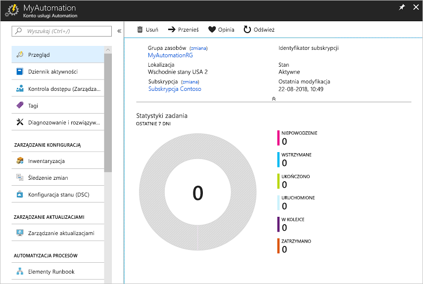
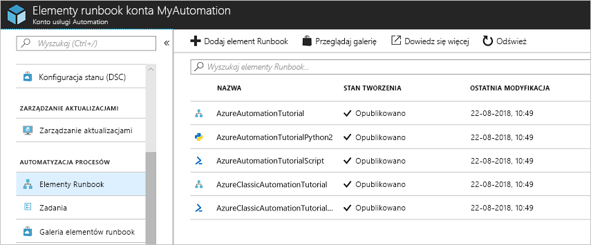
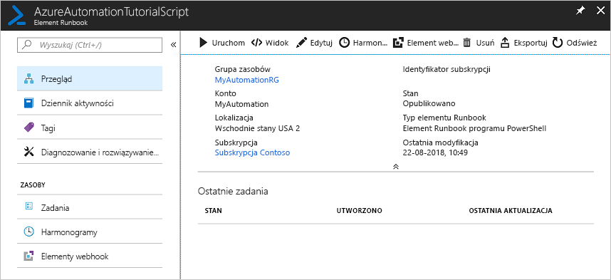
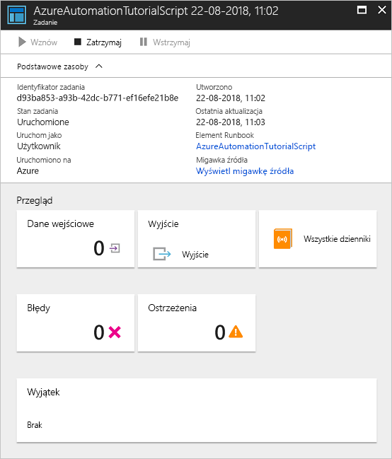

# Tworzenie konta usługi Azure Automation

Konta usługi Azure Automation można tworzyć za pośrednictwem platformy Azure. Ta metoda zapewnia oparty na przeglądarce interfejs użytkownika umożliwiający tworzenie i konfigurowanie kont usługi Automation oraz pokrewnych zasobów. W tym przewodniku Szybki start opisano tworzenie konta usługi Automation i uruchamianie elementu runbook w ramach tego konta.

Jeśli nie masz subskrypcji platformy Azure, przed rozpoczęciem utwórz [bezpłatne konto platformy Azure](https://azure.microsoft.com/free/?WT.mc_id=A261C142F).

## Logowanie do platformy Azure

Zaloguj się do platformy Azure w witrynie https://portal.azure.com

## Tworzenie konta usługi Automation

1. Kliknij przycisk **Utwórz zasób** znajdujący się w lewym górnym rogu okna witryny Azure Portal.

1. Wybierz pozycję **Narzędzia do zarządzania**, a następnie wybierz pozycję **Automatyzacja**.

1. Wprowadź informacje o koncie. W obszarze **Utwórz konto Uruchom jako platformy Azure** wybierz pozycję **Tak**, aby artefakty upraszczające uwierzytelnianie zostały automatycznie włączone. Należy pamiętać, że po wybraniu nazwy konta usługi Automation nie można jej zmienić. *Nazwy kont usługi Automation są unikatowe w każdym regionie i grupie zasobów. Nazwy kont usługi Automation, które zostały usunięte, mogą nie być natychmiast dostępne.* Jedno konto usługi Automation może zarządzać zasobami we wszystkich regionach i subskrypcjach dla danej dzierżawy. Po zakończeniu kliknij przycisk **Utwórz**, aby rozpocząć wdrażanie konta usługi Automation.

      

    > [!NOTE]
    > Aby uzyskać zaktualizowaną listę lokalizacji, w których można wdrożyć konto usługi Automation, zobacz [Dostępność produktów według regionów](https://azure.microsoft.com/global-infrastructure/services/?products=automation&regions=all).

1. Po zakończeniu wdrożenia kliknij pozycję **Wszystkie usługi**, wybierz pozycję **Konta usługi Automation**, a następnie wybierz utworzone konto usługi Automation.

    

## Uruchamianie elementu runbook

Uruchom jeden z elementów runbook z samouczka.

1. Kliknij pozycję **Elementy runbook** w obszarze **AUTOMATYZACJA PROCESÓW**. Zostanie wyświetlona lista elementów runbook. Domyślnie na koncie włączonych jest kilka elementów runbook z samouczka.

    

1. Wybierz element runbook **AzureAutomationTutorialScript**. Ta akcja spowoduje otwarcie strony przeglądu elementu runbook.

    

1. Kliknij pozycję **Uruchom**, a na stronie **Uruchamianie elementu runbook** kliknij przycisk **OK**, aby uruchomić element runbook.

    

1. Gdy **Stan zadania** będzie miał wartość **Uruchomione**, kliknij pozycję **Dane wyjściowe** lub **Wszystkie dzienniki**, aby wyświetlić dane wyjściowe zadania elementu runbook. W przypadku tego elementu runbook z samouczka danymi wyjściowymi jest lista Twoich zasobów platformy Azure.

## Kolejne kroki

W tym przewodniku Szybki start wdrożono konto usługi Automation, uruchomiono element runbook i wyświetlono wyniki zadania. Aby dowiedzieć się więcej na temat usługi Azure Automation, przejdź do przewodnika Szybki start dotyczącego tworzenia pierwszego elementu runbook.

> [!div class="nextstepaction"]
> [Przewodnik Szybki start usługi Automation — tworzenie elementu runbook](./automation-quickstart-create-runbook.md)

