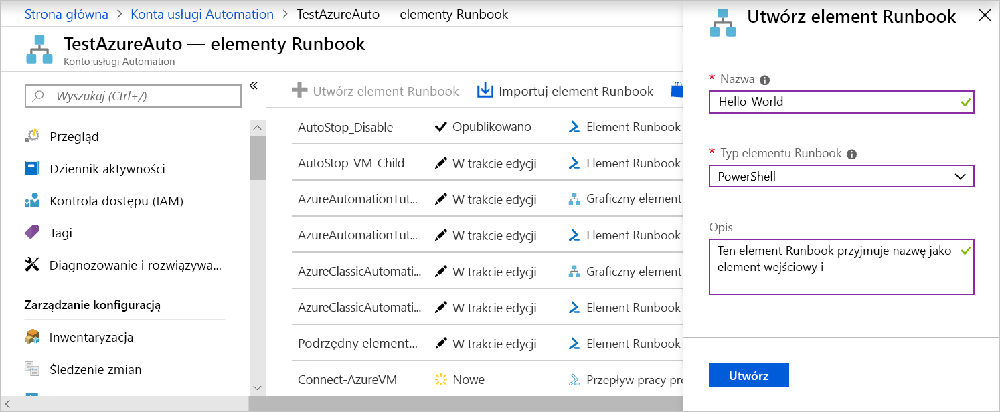
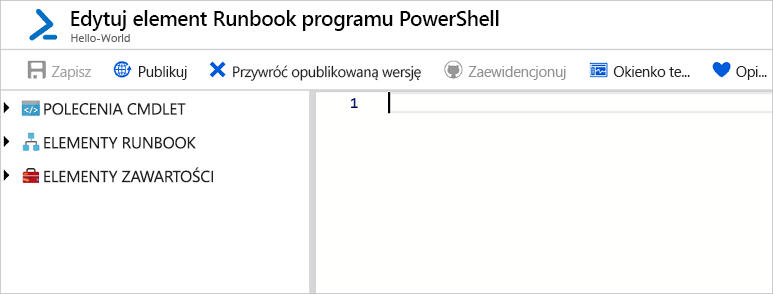
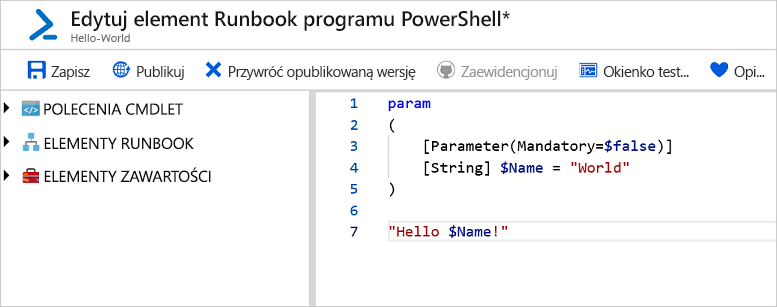
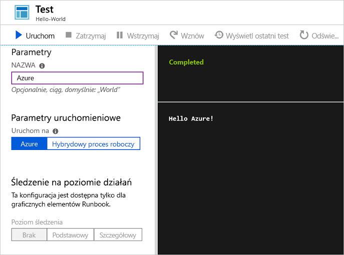
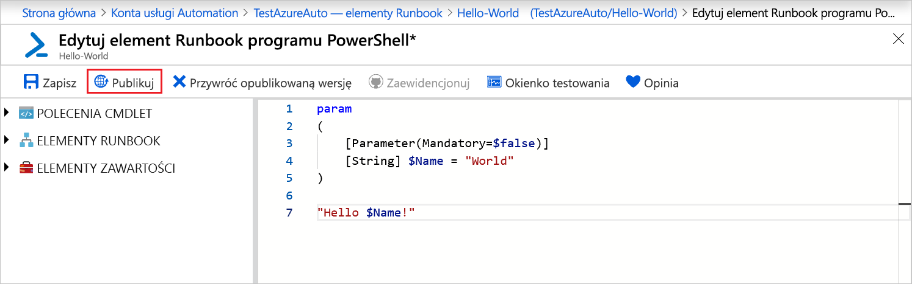
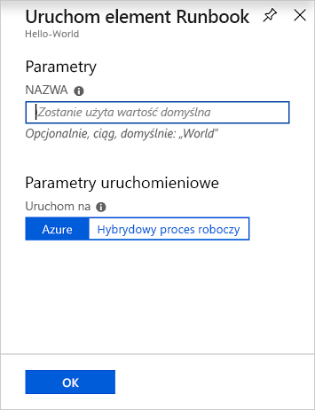
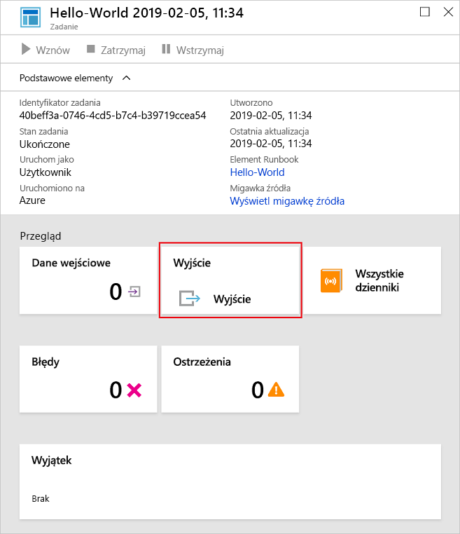
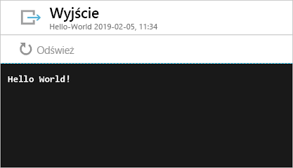

# <a name="create-an-azure-automation-runbook"></a>Tworzenie elementu runbook usługi Azure Automation

Elementy runbook usługi Azure Automation można tworzyć za pośrednictwem platformy Azure. Ta metoda zapewnia oparty na przeglądarce interfejs użytkownika przeznaczony do tworzenia elementów runbook usługi Automation. W tym przewodniku Szybki start opisano tworzenie, edytowanie, testowanie i publikowanie elementu runbook programu PowerShell usługi Automation.

Jeśli nie masz subskrypcji platformy Azure, utwórz [bezpłatne konto platformy Azure](https://azure.microsoft.com/free/?WT.mc_id=A261C142F) przed rozpoczęciem.

## <a name="sign-in-to-azure"></a>Logowanie do platformy Azure

Zaloguj się do platformy Azure w witrynie https://portal.azure.com

## <a name="create-runbook"></a>Tworzenie elementu runbook

Najpierw utwórz element runbook. Przykładowy element runbook tworzony w tym przewodniku Szybki start domyślnie wyświetla tekst `Hello World`.

1. Otwórz konto usługi Automation.

1. Kliknij pozycję **Elementy runbook** w obszarze **AUTOMATYZACJA PROCESÓW**. Zostanie wyświetlona lista elementów runbook.

1. Kliknij przycisk **Utwórz podręcznik runbook** znajdujący się u góry listy

1. W polu **Nazwa** elementu runbook wpisz „Hello World”, a w obszarze **Typ elementu runbook** wybierz pozycję **PowerShell**. Kliknij przycisk **Utwórz**.

   

1. Element runbook zostanie utworzony i zostanie otworzona strona **Edytuj element runbook programu PowerShell**.

    

1. Wpisz lub skopiuj i wklej następujący kod do okienka edycji. Spowoduje to utworzenie dodatkowego parametru wejściowego o nazwie „Name” o domyślnej wartości „World” oraz wyświetlenie ciągu używającego następującej wartości wejściowej:

   ```powershell-interactive
   param
   (
       [Parameter(Mandatory=$false)]
       [String] $Name = "World"
   )

   "Hello $Name!"
   ```

1. Kliknij pozycję **Zapisz**, aby zapisać kopię roboczą elementu runbook.

    

## <a name="test-the-runbook"></a>Testowanie elementu runbook

Po utworzeniu elementu runbook należy go przetestować, aby upewnić się, że działa.

1. Kliknij pozycję **Okienko testowania**, aby otworzyć stronę **Testowanie**.

1. Wprowadź wartość w polu **Nazwa** i kliknij pozycję **Uruchom**. Zadanie testowania zostanie uruchomione oraz zostaną wyświetlone stan zadania i danej wyjściowe.

    

1. Aby zamknąć okno **Testowanie**, kliknij znak **X** w prawym górnym rogu. Wybierz przycisk **OK** w wyświetlonym oknie podręcznym.

1. Na stronie **Edytuj element runbook programu PowerShell** kliknij pozycję **Publikuj**, aby opublikować element runbook jako oficjalną wersję elementu runboook na koncie.

   

## <a name="run-the-runbook"></a>Uruchamianie elementu runbook

Po opublikowaniu elementu runbook zostanie wyświetlona strona przeglądu.

1. Na stronie przeglądu elementu runbook kliknij pozycję **Uruchom**, aby otworzyć stronę konfiguracji **Uruchamianie elementu Runbook** dla tego elementu runbook.

   

1. Zostaw pole **Nazwa** puste, aby została użyta wartość domyślna, i kliknij przycisk **OK**. Element runbook zostanie przesłany i zostanie wyświetlona strona zadania.

   

1. Gdy **Stan zadania** będzie miał wartość **Uruchomione** lub **Ukończone**, kliknij pozycję **Dane wyjściowe**, aby otworzyć okienko **Dane wyjściowe** i wyświetlić dane wyjściowe elementu runbook.

   

## <a name="clean-up-resources"></a>Oczyszczanie zasobów

Gdy element runbook nie będzie już potrzebny, usuń go. Aby to zrobić, zaznacz element runbook na liście i kliknij pozycję **Usuń**.

## <a name="next-steps"></a>Następne kroki

W tym przewodniku Szybki start utworzono, edytowano, przetestowano i opublikowano element runbook oraz uruchomiono zadanie elementu runbook. Aby dowiedzieć się więcej o elementach runbook usługi Automation, przejdź do artykułu opisującego różne typy elementów runbook, które można tworzyć i z nich korzystać w usłudze Automation.

> [!div class="nextstepaction"]
> [Instrukcje dotyczące usługi Automation — typy elementów runbook](./automation-runbook-types.md)
