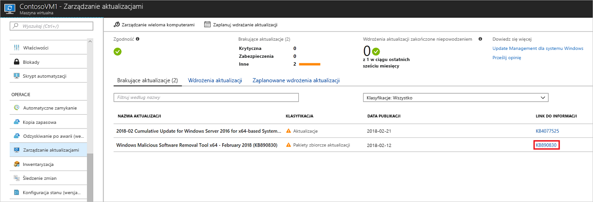
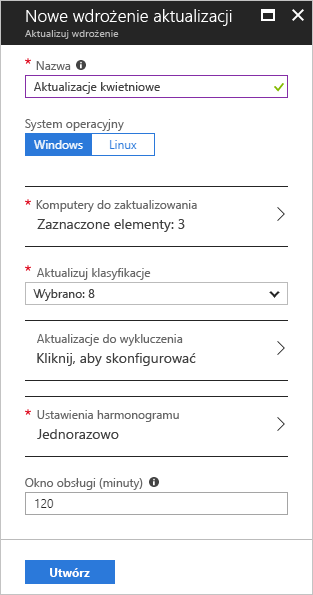

# Zarządzanie aktualizacjami i poprawkami dla maszyn wirtualnych platformy Azure

Przy użyciu rozwiązania Update Management można zarządzać aktualizacjami i poprawkami dla maszyn wirtualnych. Z tym samouczku dowiesz się, jak szybko ocenić stan dostępnych aktualizacji, zaplanować instalację wymaganych aktualizacji, przejrzeć wyniki wdrożenia oraz utworzyć alert sprawdzający, czy aktualizacje zostały pomyślnie zastosowane.

Aby uzyskać informacje o cenach, zobacz [cennik usługi Automation dla rozwiązania Update Management](https://azure.microsoft.com/pricing/details/automation/).

Ten samouczek zawiera informacje na temat wykonywania następujących czynności:

> [!div class="checklist"]
> * Wyświetlanie oceny aktualizacji
> * Konfigurowanie alertów
> * Planowanie wdrożenia aktualizacji
> * Wyświetlanie wyników wdrożenia

## Wymagania wstępne

Do ukończenia tego samouczka niezbędne są następujące elementy:

* Rozwiązanie [Update Management](automation-update-management.md) włączone dla co najmniej jednej maszyny wirtualnej.
* [Maszyna wirtualna](../virtual-machines/windows/quick-create-portal.md) do dołączenia.

## Logowanie do platformy Azure

Zaloguj się do witryny Azure Portal pod adresem https://portal.azure.com.

## Wyświetlanie oceny aktualizacji

Po włączeniu rozwiązania Update Management zostanie otwarte okienko **Update Management**. Jeśli jakieś aktualizacje zostały zidentyfikowane jako brakujące, na karcie **brakujące aktualizacje** zostanie wyświetlona lista brakujących aktualizacji.

W obszarze **link do informacji**wybierz łącze Aktualizuj, aby otworzyć artykuł pomocy technicznej dla aktualizacji. Możesz poznać ważne informacje o aktualizacji.

Kliknij w dowolnym miejscu w obszarze aktualizacji, aby otworzyć okienko **przeszukiwania dzienników** dla wybranej aktualizacji. Zapytanie dotyczące przeszukiwania dzienników jest wstępnie zdefiniowane dla tej określonej aktualizacji. Możesz zmodyfikować to zapytanie lub utworzyć własne zapytanie, aby wyświetlić szczegółowe informacje o aktualizacjach wdrożonych lub brakujących we własnym środowisku.

## Konfigurowanie alarmów

W tym kroku dowiesz się, jak skonfigurować alert powiadamiający o stanie wdrożenia aktualizacji.

### Warunki alertu

Na koncie usługi Automation w obszarze **Monitorowanie** przejdź do pozycji **Alerty**, a następnie kliknij przycisk **+ Nowa reguła alertu**.

Konto usługi Automation zostało już wybrane jako zasób. Jeśli chcesz je zmienić, możesz kliknąć pozycję **Wybierz**, a następnie na stronie **Wybierz zasób** wybrać pozycję **Konta usługi Automation** na liście rozwijanej **Filtruj według typu zasobu**. Wybierz swoje konto usługi Automation, a następnie wybierz pozycję **Gotowe**.

Kliknij pozycję **Dodaj warunek**, aby wybrać odpowiedni sygnał dla wdrożenia aktualizacji. W poniższej tabeli przedstawiono szczegółowe informacje o dwóch dostępnych sygnałach dla wdrożeń aktualizacji:

|Nazwa sygnału|Wymiary|Opis|
|---|---|---|
|**Łączna liczba przebiegów wdrażania aktualizacji**|— Nazwa wdrażania aktualizacji — Stan|Sygnał ten jest używany, aby poinformować o ogólnym stanie wdrożenia aktualizacji.|
|**Łączna liczba przebiegów wdrażania aktualizacji maszyny**|— Nazwa wdrażania aktualizacji — Stan — Komputer docelowy -Aktualizacja identyfikatora uruchomienia wdrożenia|Ten sygnał jest używany, aby poinformować o stanie wdrożenia aktualizacji dotyczącej konkretnych maszyn|

Ab uzyskać wartości wymiarów, wybierz prawidłową wartość na liście. Jeśli wartość, której szukasz, nie znajduje się na liście, kliknij znak **\+** obok wymiaru i wpisz nazwę niestandardową. Następnie możesz wybrać wartość, którą chcesz znaleźć. Jeśli chcesz wybrać wszystkie wartości w ramach wymiaru, kliknij przycisk **Wybierz\*** . Jeśli nie wybierzesz wartości wymiaru, ten wymiar nie będzie brany pod uwagę podczas oceny.

W obszarze **Logika alertu** w polu **Próg** wprowadź **1**. Po zakończeniu wybierz pozycję **Gotowe**.

### Szczegóły alertu

W obszarze **2. Zdefiniuj szczegóły alertu**, wprowadź nazwę i opis alertu. Ustaw opcję **Ważność** na **Informacyjny (ważność 2)** w przypadku pomyślnego przebiegu lub **Informacyjny (ważność 1)** w przypadku nieudanego przebiegu.

W obszarze **Grupy akcji** wybierz pozycję **Utwórz nową**. Grupa akcji to grupa składająca się z akcji, których można używać w wielu alertach. Akcje mogą obejmować powiadomienia e-mail, elementy runbook i webhook oraz wiele innych. Aby dowiedzieć się więcej o grupach akcji, zobacz [Create and manage action groups (Tworzenie grup akcji i zarządzanie nimi)](../azure-monitor/platform/action-groups.md).

W polu **Nazwa grupy akcji** wprowadź nazwę alertu oraz krótką nazwę. Krótka nazwa jest używana zamiast pełnej nazwy grupy akcji podczas przesyłania powiadomień przy użyciu danej grupy.

W obszarze **Akcje**wprowadź nazwę akcji, na przykład **powiadomienia e-mail**. W obszarze **Typ akcji**wybierz pozycję **poczta e-mail/SMS/wypychanie/głos**. W obszarze **szczegóły**wybierz pozycję **Edytuj szczegóły**.

W okienku **E-mail/SMS/Push/Głos** wprowadź nazwę. Zaznacz pole wyboru **E-mail**, a następnie wprowadź prawidłowy adres e-mail.

W okienku **wiadomości e-mail/SMS/wypychanie/głos** wybierz pozycję **OK**. W okienku **Dodaj grupę akcji** wybierz **przycisk OK**.

Aby dostosować temat wiadomości e-mail dotyczącej alertu, w obszarze **Tworzenie reguły**w obszarze **Dostosuj akcje**wybierz pozycję **temat wiadomości e-mail**. Po zakończeniu wybierz pozycję **Utwórz regułę alertu**. Alert informuje użytkownika o pomyślnym wdrożeniu aktualizacji oraz o maszynach będących elementami danego uruchomienia wdrożenia aktualizacji.

## Planowanie wdrożenia aktualizacji

Następnie zaplanuj wdrożenie zgodnie z harmonogramem wydawania i oknem obsługi, aby zainstalować aktualizacje. Możesz wybrać typy aktualizacji, które mają zostać uwzględnione we wdrożeniu. Możesz na przykład uwzględnić aktualizacje krytyczne lub aktualizacje zabezpieczeń i wykluczyć pakiety zbiorcze aktualizacji.

>[!NOTE]
>Zaplanowanie wdrożenia aktualizacji powoduje utworzenie zasobu [harmonogramu](shared-resources/schedules.md) połączonego z elementem Runbook **MicrosoftOMSComputers poprawek** , który obsługuje wdrożenie aktualizacji na komputerach docelowych. W przypadku usunięcia zasobu harmonogramu z Azure Portal lub przy użyciu programu PowerShell po utworzeniu wdrożenia zostanie ono przerwane i zostanie wyświetlony komunikat o błędzie podczas próby ponownego skonfigurowania go z poziomu portalu. Zasób harmonogramu można usunąć tylko przez usunięcie odpowiedniego harmonogramu wdrażania.  
>

Aby zaplanować nowe wdrożenie aktualizacji dla maszyny wirtualnej, przejdź do rozwiązania **Update Management**, a następnie wybierz pozycję **Zaplanuj wdrażanie aktualizacji**.

W obszarze **Nowe wdrożenie aktualizacji** podaj następujące informacje:

* **Nazwa**: wprowadź unikatową nazwę wdrożenia aktualizacji.

* **System operacyjny**: wybierz docelowy system operacyjny do wdrażania aktualizacji.

* **Grupy do zaktualizowania (wersja zapoznawcza)** : zdefiniuj zapytanie na podstawie kombinacji subskrypcji, grup zasobów, lokalizacji i tagów, aby utworzyć dynamiczną grupę maszyn wirtualnych platformy Azure, które chcesz uwzględnić w swoim wdrożeniu. Aby dowiedzieć się więcej, zobacz [Grupy dynamiczne](automation-update-management-groups.md)

* **Maszyny do zaktualizowania**: wybierz zapisane wyszukiwanie bądź zaimportowaną grupę lub wybierz maszynę z listy rozwijanej, a następnie wybierz poszczególne maszyny. W przypadku wybrania opcji **maszyny**gotowość komputera zostanie wyświetlona w kolumnie **Aktualizowanie gotowości agenta** . Aby dowiedzieć się więcej na temat różnych metod tworzenia grup komputerów w dziennikach usługi Azure Monitor, zobacz [Computer groups in Azure Monitor logs (Grupy komputerów w dziennikach usługi Azure Monitor)](../azure-monitor/platform/computer-groups.md)

* **Klasyfikacja aktualizacji**: Wybierz obsługiwane klasyfikacje aktualizacji dostępne dla każdego produktu, które mogą zostać uwzględnione we wdrożeniu aktualizacji. W tym samouczku pozostaw wszystkie typy wybranymi.

  Dostępne są następujące typy klasyfikacji:

   |System operacyjny  |Typ  |
   |---------|---------|
   |Windows     | Aktualizacje krytyczne Aktualizacje zabezpieczeń Pakiety zbiorcze aktualizacji Pakiety funkcji Dodatki Service Pack Aktualizacje definicji Narzędzia Aktualizacje        |
   |Linux     | Aktualizacje krytyczne i zabezpieczeń Inne aktualizacje       |

   Opis typów klasyfikacji znajduje się w [klasyfikacjach aktualizacji](automation-view-update-assessments.md#update-classifications).

* **Aktualizacje do uwzględnienia/wykluczenia** — spowoduje to otwarcie strony **Uwzględnij/Wyklucz**. Aktualizacje, które mają zostać uwzględnione lub wykluczone, znajdują się na osobnych kartach.

> [!NOTE]
> Ważne jest, aby wiedzieć, że wykluczenia zastępują dołączenia. Na przykład, jeśli zdefiniujesz regułę wykluczania `*`, żadne poprawki ani pakiety nie zostaną zainstalowane, ponieważ są wykluczone. Wykluczone poprawki nadal są wyświetlane jako brakujące na komputerze. W przypadku maszyn z systemem Linux, jeśli pakiet został uwzględniony, ale jego pakiet zależny został wykluczony, pakiet nie jest zainstalowany.

> [!NOTE]
> Nie można określić aktualizacji, które zostały zastąpione w celu włączenia ich do wdrożenia aktualizacji.
>

* **Ustawienia harmonogramu**: spowoduje otwarcie okienka **Ustawienia harmonogramu**. Domyślny czas rozpoczęcia to 30 minut po bieżącej godzinie. Czas rozpoczęcia można ustawić na dowolny czas od 10 minut w przyszłości.

   Możesz też określić, czy wdrożenie ma występować raz, czy zgodnie z ustawionym harmonogramem cyklicznym. W obszarze **Cykl** wybierz pozycję **Raz**. Pozostaw wartość domyślną na 1 dzień, a następnie wybierz pozycję **OK**. Konfiguruje to harmonogram cykliczny.

* **Skrypty wstępne i końcowe**: wybierz skrypty do uruchomienia przed i po wdrożeniu. Aby dowiedzieć się więcej, zobacz [Zarządzanie skryptami wstępnymi i końcowymi](pre-post-scripts.md).

* **Okno konserwacji (w minutach)** : pozostaw wartość domyślną. Okna obsługi kontrolują ilość czasu dozwoloną dla aktualizacji do zainstalowania. Podczas określania okna obsługi należy wziąć pod uwagę następujące informacje.

  * Okna obsługi kontrolują liczbę aktualizacji, które mają zostać zainstalowane.
  * Update Management nie zatrzymuje instalowania nowych aktualizacji, jeśli zbliża się koniec okna obsługi.
  * W przypadku przekroczenia okna obsługi program Update Management nie kończy wykonywania aktualizacji w toku.
  * W przypadku przekroczenia okna obsługi w systemie Windows często trwa Instalowanie aktualizacji dodatku Service Pack.

  > [!NOTE]
  > Aby uniknąć stosowania aktualizacji poza oknem obsługi w programie Ubuntu, należy ponownie skonfigurować pakiet nienadzorowany do uaktualnienia, aby wyłączyć aktualizacje automatyczne. Informacje o sposobie konfigurowania pakietu programu znajdują się [w temacie Aktualizacje automatyczne w przewodniku po serwerze Ubuntu](https://help.ubuntu.com/lts/serverguide/automatic-updates.html).

* **Opcje ponownego uruchomiania**: to ustawienie określa sposób obsługi ponownego uruchamiania. Dostępne opcje:
  * Ponowne uruchomienie, jeśli jest to wymagane (ustawienie domyślne)
  * Zawsze uruchamiaj ponownie
  * Nigdy nie uruchamiaj ponownie
  * Tylko ponowne uruchomienie — aktualizacje nie zostaną zainstalowane

> [!NOTE]
> Klucze rejestru wymienione w obszarze [klucze rejestru służące do zarządzania ponownym uruchomieniem](/windows/deployment/update/waas-restart#registry-keys-used-to-manage-restart) mogą spowodować zdarzenie ponownego uruchomienia, jeśli dla **kontrolki ponownego uruchamiania** ustawiono wartość **nigdy nie uruchamiaj ponownie**.

Po zakończeniu konfigurowania harmonogramu wybierz pozycję **Utwórz**.

Nastąpi powrót do pulpitu nawigacyjnego stanu. Wybierz pozycję **Wdrożenia zaplanowanych aktualizacji**, aby pokazać utworzony harmonogram wdrażania.

> [!NOTE]
> Rozwiązanie Update Management obsługuje wdrażanie aktualizacji tej samej firmy i wstępne pobieranie poprawek. Wymaga to zmian w systemach, w których są stosowane poprawki. Zobacz sekcję [First party and pre-download support (Obsługa poprawek tej samej firmy i pobierania wstępnego)](automation-configure-windows-update.md), aby dowiedzieć się, jak skonfigurować te ustawienia w swoich systemach.

**Wdrożenia aktualizacji** można także tworzyć programowo. Aby dowiedzieć się, jak utworzyć **wdrożenie aktualizacji** za pomocą interfejsu API REST, zobacz [konfiguracje aktualizacji oprogramowania — tworzenie](/rest/api/automation/softwareupdateconfigurations/create). Istnieje również przykładowy element Runbook, który może służyć do tworzenia tygodniowego **wdrożenia aktualizacji**. Aby dowiedzieć się więcej na temat tego elementu Runbook, zobacz [Tworzenie tygodniowego wdrożenia aktualizacji dla co najmniej jednej maszyny wirtualnej w grupie zasobów](https://gallery.technet.microsoft.com/scriptcenter/Create-a-weekly-update-2ad359a1).

## Wyświetlanie wyników wdrażania aktualizacji

Po rozpoczęciu zaplanowanego wdrażania stan tego wdrożenia można sprawdzić na karcie **Wdrożenia aktualizacji** w obszarze rozwiązania **Update Management**. Wyświetlany stan **W toku** oznacza, że wdrożenie jest aktualnie uruchomione. Jeśli wdrożenie zakończy się pomyślnie, jego stan zmieni się na **Powodzenie**. Gdy istnieją błędy w co najmniej jednej aktualizacji w ramach wdrożenia, jest wyświetlany stan **Częściowe niepowodzenie**.

Kliknij ukończone wdrożenie aktualizacji, aby wyświetlić pulpit nawigacyjny tego wdrożenia.

Obszar **Wyniki aktualizacji** zawiera podsumowanie z łączną liczbą aktualizacji i wynikami wdrożenia na maszynie wirtualnej. Tabela po prawej stronie pokazuje szczegółowy podział każdej aktualizacji i wyniki instalacji.

Na poniższej liście przedstawiono dostępne wartości:

* **Nie podjęto próby**: nie zainstalowano aktualizacji z powodu niewystarczającego czasu w zdefiniowanym oknie konserwacji.
* **Powodzenie**: aktualizacja powiodła się.
* **Niepowodzenie**: aktualizacja nie powiodła się.

Aby wyświetlić wszystkie wpisy dziennika utworzone przez wdrożenie, wybierz opcję **Wszystkie dzienniki**.

Wybierz kafelek **Dane wyjściowe**, aby wyświetlić strumień zadań elementu runbook odpowiedzialnego za zarządzanie wdrożeniem aktualizacji na docelowej maszynie wirtualnej.

Aby wyświetlić szczegółowe informacje o błędach związanych z wdrożeniem, wybierz pozycję **Błędy**.

Po pomyślnym wdrożeniu aktualizacji zostanie wysłana wiadomość e-mail podobna do poniższego przykładu z informacją o powodzeniu tego wdrożenia:

## Następne kroki

W niniejszym samouczku zawarto informacje na temat wykonywania następujących czynności:

> [!div class="checklist"]
> * Dołączanie maszyny wirtualnej dla rozwiązania Update Management
> * Wyświetlanie oceny aktualizacji
> * Konfigurowanie alertów
> * Planowanie wdrożenia aktualizacji
> * Wyświetlanie wyników wdrożenia

Kontynuowanie omawiania rozwiązania Update Management.

> [!div class="nextstepaction"]
> [Update Management solution](../operations-management-suite/oms-solution-update-management.md?toc=%2fazure%2fautomation%2ftoc.json) (Rozwiązanie Update Management)

