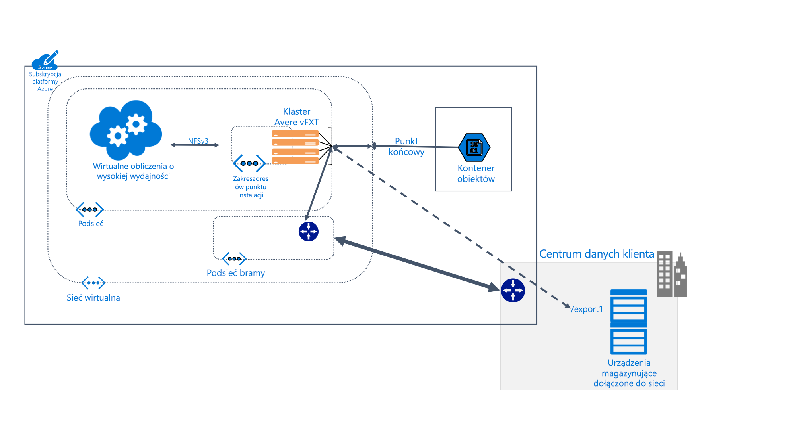

# Co to jest system Avere vFXT for Azure?

System Avere vFXT for Azure to rozwiązanie pamięci podręcznej systemu plików na potrzeby zadań obliczeń o wysokiej wydajności (HPC) intensywnie korzystających z danych. System ten pozwala wykorzystać zalety skalowalności chmury obliczeniowej w celu udostępnienia danych w wymaganym miejscu i czasie — dotyczy to nawet danych przechowywanych na sprzęcie lokalnym.

System Avere vFXT obsługuje następujące typowe scenariusze obliczeniowe:

* Architektura chmury hybrydowej — avere vFXT dla platformy Azure może współdziałać z systemem magazynu sprzętowego, który zapewnia korzyści obliczeniowe w chmurze bez konieczności przenoszenia plików.

* Przemieszczanie w chmurze — avere vFXT for Azure może pomóc w przenoszeniu danych do chmury dla jednego projektu lub "Unieś" i przesunąć cały przepływ pracy na stałe.

Avere vFXT for Azure najlepiej nadaje się w następujących sytuacjach:

* Operacje z dużą liczbą odczytów dla obciążeń HPC
* Aplikacje korzystające ze wspólnego protokołu systemu plików NFS
* Farmy obliczeniowe składające się z od 1000 do 40 000 rdzeni procesorów CPU
* Integracja z lokalnym, sprzętowym magazynem NAS, usługą Azure Blob Storage lub oboma tymi rozwiązaniami

Aby uzyskać więcej informacji, zobacz <https://azure.microsoft.com/services/storage/avere-vfxt/>

## Kto używa systemu Avere vFXT for Azure?

System Avere vFXT może być przydatny w przypadku wszelkiego rodzaju zadań z dużą liczbą odczytów:

### Renderowanie efektów wizualnych

W branży multimediów i rozrywki klaster Avere vFXT może przyspieszyć dostęp do danych dla projektów renderowania, w przypadku których czas ma kluczowe znaczenie. Ponieważ na platformie Azure można zwiększyć obszar pamięci podręcznej oraz dodać więcej węzłów obliczeniowych, pozwala to w sposób wydajny i elastyczny obsługiwać duże projekty.

### Nauki przyrodnicze

Avere vFXT umożliwia naukowcom uruchamianie pomocniczych przepływów pracy analizy w usłudze Azure COMPUTE i dostęp do danych genomiki bez względu na ich lokalizację.

W badaniach farmaceutycznych avere klastry vFXT mogą przyspieszyć odnajdywanie narkotyków, pomagając badaczom w przewidywaniu interakcji narkotyków i analizowaniu danych badawczych.

### Analiza usług finansowych

Klaster Avere vFXT może przyspieszyć obliczenia analizy ilościowej, co daje firmom świadczącym usługi finansowe szczegółowe informacje ułatwiające podejmowanie strategicznych decyzji.

## Funkcje i specyfikacje

System Avere vFXT składa się z co najmniej trzech wirtualnych brzegowych węzłów nadzorczych skonfigurowanych w klastrze. Może on znajdować się w pobliżu maszyn klienckich, na których instalowany jest klaster zamiast instalowania magazynu bezpośrednio.

Klaster Avere vFXT umieszcza pliki w pamięci podręcznej w momencie ich żądania. Ponowne żądania mogą być obsługiwane z pamięci podręcznej przez ponad 80% czasu.

### Zgodność

* Zgodny ze sprzętowymi systemami NAS platformy NetApp lub Dell EMC Isilon
* Zgodny z obiektami blob platformy Azure
* Używa protokołu NFSv3 lub SMB2

Avere vFXT for Azure używa następujących zasobów platformy Azure:

|Składnik platformy Azure|   |
|----------|-----------|
|Maszyny wirtualne|3 lub więcej E32s_v3|
|Magazyn SSD w warstwie Premium|200 GB na system operacyjny i od 1 TB do 4 TB miejsca obszaru pamięci podręcznej na węzeł |
|Konto magazynu (opcjonalnie) |v2|
|Magazyn zaplecza danych (opcjonalnie) | Jeden pusty kontener obiektów blob magazynu lokalnie nadmiarowego |

## Następne kroki

Zapoznaj się z tymi artykułami, aby zaplanować i utworzyć własne avere vFXT dla wdrożenia platformy Azure.

* [Planowanie systemu](avere-vfxt-deploy-plan.md)
* [Omówienie wdrażania](avere-vfxt-deploy-overview.md)
* [Tworzenie systemu vFXT](avere-vfxt-deploy.md)
