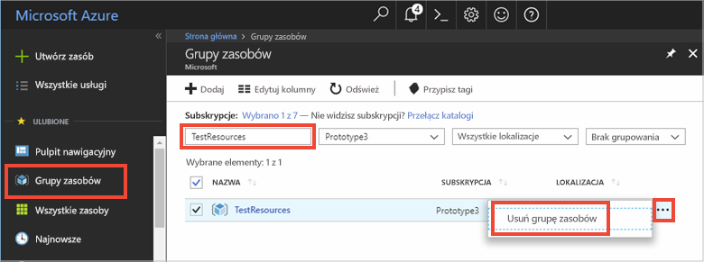

# <a name="quickstart-use-azure-cache-for-redis-with-a-net-framework-application"></a>Szybki Start: korzystanie z usługi Azure cache for Redis z aplikacją .NET Framework

W tym przewodniku szybki start dodaliśmy usługę Azure cache for Redis do aplikacji .NET Framework, aby uzyskać dostęp do bezpiecznej, dedykowanej pamięci podręcznej dostępnej z dowolnej aplikacji na platformie Azure. Należy używać klienta [stackexchange. Redis](https://github.com/StackExchange/StackExchange.Redis) z C# kodem w aplikacji konsolowej platformy .NET.

## <a name="prerequisites"></a>Wymagania wstępne

- Subskrypcja platformy Azure — [Utwórz ją bezpłatnie](https://azure.microsoft.com/free/)
- [Visual Studio 2019](https://www.visualstudio.com/downloads/)
- [.NET Framework 4 lub więcej](https://www.microsoft.com/net/download/dotnet-framework-runtime), co jest wymagane przez klienta stackexchange. Redis.

## <a name="create-a-cache"></a>Tworzenie pamięci podręcznej
[!INCLUDE [redis-cache-create](../../includes/redis-cache-create.md)]

[!INCLUDE [redis-cache-access-keys](../../includes/redis-cache-access-keys.md)]

Utwórz na swoim komputerze plik o nazwie *CacheSecrets.config* i umieść go w lokalizacji, gdzie nie zostanie zaewidencjonowany za pomocą kodu źródłowego przykładowej aplikacji. W tym przewodniku Szybki start plik *CacheSecrets.config* znajduje się tu: *C:\AppSecrets\CacheSecrets.config*.

Edytuj plik *CacheSecrets.config* i dodaj następującą zawartość:

```xml
<appSettings>
    <add key="CacheConnection" value="<cache-name>.redis.cache.windows.net,abortConnect=false,ssl=true,password=<access-key>"/>
</appSettings>
```

Zastąp element `<cache-name>` nazwą hosta pamięci podręcznej.

Zastąp element `<access-key>` kluczem podstawowym pamięci podręcznej.


## <a name="create-a-console-app"></a>Tworzenie aplikacji konsolowej

W programie Visual Studio kliknij kolejno pozycje **Plik** > **Nowy** > **Projekt**.

W obszarze **Visual C#** kliknij pozycję **Klasyczny pulpit systemu Windows**, a następnie kliknij pozycję **Aplikacja konsolowa** i przycisk **OK**, aby utworzyć nową aplikację konsolową.


<a name="configure-the-cache-clients"></a>

## <a name="configure-the-cache-client"></a>Konfigurowanie klienta pamięci podręcznej

W tej sekcji skonfigurujesz aplikację konsolową umożliwiającą korzystanie z klienta [StackExchange.Redis](https://github.com/StackExchange/StackExchange.Redis) na platformie .NET.

W programie Visual Studio kliknij pozycję **Narzędzia** > **Menedżer pakietów NuGet** > **Konsola menedżera pakietów** i uruchom poniższe polecenie w oknie Konsola menedżera pakietów.

```powershell
Install-Package StackExchange.Redis
```

Po ukończeniu instalacji klient pamięci podręcznej *StackExchange.Redis* będzie dostępny do użycia z projektem.


## <a name="connect-to-the-cache"></a>Łączenie z pamięcią podręczną

W programie Visual Studio otwórz plik *App.config* i zaktualizuj go, aby uwzględnić atrybut `appSettings` `file`, który odwołuje się do pliku *CacheSecrets.config*.

```xml
<?xml version="1.0" encoding="utf-8" ?>
<configuration>
    <startup> 
        <supportedRuntime version="v4.0" sku=".NETFramework,Version=v4.7.1" />
    </startup>

    <appSettings file="C:\AppSecrets\CacheSecrets.config"></appSettings>  

</configuration>
```

W Eksploratorze rozwiązań kliknij prawym przyciskiem myszy pozycję **Odwołania** i kliknij pozycję **Dodaj odwołanie**. Dodaj odwołanie do zestawu **System.Configuration**.

Dodaj następujące instrukcje `using` do pliku *Program.cs*:

```csharp
using StackExchange.Redis;
using System.Configuration;
```

Połączenie z usługą Azure Cache for Redis jest zarządzane przez klasę `ConnectionMultiplexer`. Ta klasa powinna być udostępniana i wielokrotnie używana w aplikacji klienta. Nie należy tworzyć nowego połączenia dla każdej operacji. 

Nigdy nie należy przechowywać poświadczeń w kodzie źródłowym. Aby przykład był prosty, używam tylko pliku konfiguracji zewnętrznych wpisów tajnych. Lepszym rozwiązaniem byłoby użycie [usługi Azure Key Vault z certyfikatami](https://docs.microsoft.com/rest/api/keyvault/certificate-scenarios).

W pliku *Program.cs* dodaj następujące elementy członkowskie do klasy `Program` aplikacji konsolowej:

```csharp
        private static Lazy<ConnectionMultiplexer> lazyConnection = new Lazy<ConnectionMultiplexer>(() =>
        {
            string cacheConnection = ConfigurationManager.AppSettings["CacheConnection"].ToString();
            return ConnectionMultiplexer.Connect(cacheConnection);
        });

        public static ConnectionMultiplexer Connection
        {
            get
            {
                return lazyConnection.Value;
            }
        }
```


W tym podejściu do udostępniania wystąpienia klasy `ConnectionMultiplexer` w aplikacji użyto właściwości statycznej, która zwraca połączone wystąpienie. Ten kod zapewnia bezpieczny wątkowo sposób inicjowania tylko jednego połączonego wystąpienia klasy `ConnectionMultiplexer`. Parametr `abortConnect` ma wartość false, co oznacza, że wywołanie zostanie wykonane pomyślnie, nawet jeśli połączenie z usługą Azure Cache for Redis nie zostanie nawiązane. Kluczowa funkcja klasy `ConnectionMultiplexer` polega na automatycznym przywracaniu łączności z pamięcią podręczną po rozwiązaniu problemu z siecią lub usunięciu innych przyczyn.

Wartość ustawienia appSetting *CacheConnection* jest używana do odwoływania się do parametrów połączenia pamięci podręcznej z witryny Azure Portal jako parametru hasła.

## <a name="executing-cache-commands"></a>Wykonywanie poleceń pamięci podręcznej

Dodaj następujący kod do procedury `Main` klasy `Program` aplikacji konsolowej:

```csharp
        static void Main(string[] args)
        {
            // Connection refers to a property that returns a ConnectionMultiplexer
            // as shown in the previous example.
            IDatabase cache = lazyConnection.Value.GetDatabase();

            // Perform cache operations using the cache object...

            // Simple PING command
            string cacheCommand = "PING";
            Console.WriteLine("\nCache command  : " + cacheCommand);
            Console.WriteLine("Cache response : " + cache.Execute(cacheCommand).ToString());

            // Simple get and put of integral data types into the cache
            cacheCommand = "GET Message";
            Console.WriteLine("\nCache command  : " + cacheCommand + " or StringGet()");
            Console.WriteLine("Cache response : " + cache.StringGet("Message").ToString());

            cacheCommand = "SET Message \"Hello! The cache is working from a .NET console app!\"";
            Console.WriteLine("\nCache command  : " + cacheCommand + " or StringSet()");
            Console.WriteLine("Cache response : " + cache.StringSet("Message", "Hello! The cache is working from a .NET console app!").ToString());

            // Demonstrate "SET Message" executed as expected...
            cacheCommand = "GET Message";
            Console.WriteLine("\nCache command  : " + cacheCommand + " or StringGet()");
            Console.WriteLine("Cache response : " + cache.StringGet("Message").ToString());

            // Get the client list, useful to see if connection list is growing...
            cacheCommand = "CLIENT LIST";
            Console.WriteLine("\nCache command  : " + cacheCommand);
            Console.WriteLine("Cache response : \n" + cache.Execute("CLIENT", "LIST").ToString().Replace("id=", "id="));

            lazyConnection.Value.Dispose();
        }
```

Usługa Azure Cache for Redis ma konfigurowalną liczbę baz danych (domyślnie 16), których można użyć do logicznego odseparowania danych w tej usłudze. Kod łączy się z domyślną bazą danych DB 0. Aby uzyskać więcej informacji, zobacz [What are Redis databases?](cache-faq.md#what-are-redis-databases) (Co to są bazy danych Redis?) i [Default Redis server configuration](cache-configure.md#default-redis-server-configuration) (Domyślna konfiguracja serwera Redis).

Elementy pamięci podręcznej można zapisywać i pobierać za pomocą metod `StringSet` i `StringGet`.

Usługa Redis przechowuje większość danych w formie ciągów Redis, ale ciągi te mogą zawierać wiele typów danych, w tym serializowane dane binarne, które mogą być używane podczas przechowywania obiektów platformy .NET w pamięci podręcznej.

Naciśnij klawisze **Ctrl+F5**, aby skompilować i uruchomić aplikację konsolową.

W poniższym przykładzie widać, że klucz `Message` miał już w pamięci podręcznej wartość, która została ustawiona za pomocą konsoli Redis w witrynie Azure Portal. Aplikacja zaktualizowała tę wartość w pamięci podręcznej. Aplikacja również wykonała polecenia `PING` i `CLIENT LIST`.


## <a name="work-with-net-objects-in-the-cache"></a>Praca z obiektami platformy .NET w pamięci podręcznej

Usługa Azure Cache for Redis może buforować obiekty platformy .NET oraz pierwotne typy danych, ale zanim będzie możliwe buforowanie obiektu platformy .NET, trzeba go serializować. Odpowiedzialność za serializację obiektu .NET spoczywa na deweloperze aplikacji, który ma możliwość wybrania serializatora.

Prostym sposobem na wykonanie serializacji obiektów jest użycie metod serializacji `JsonConvert` w środowisku [Newtonsoft.Json](https://www.nuget.org/packages/Newtonsoft.Json/) oraz serializacja do i z formatu JSON. W tej sekcji dodasz obiekt platformy .NET do pamięci podręcznej.

W programie Visual Studio kliknij pozycję **Narzędzia** > **Menedżer pakietów NuGet** > **Konsola menedżera pakietów** i uruchom poniższe polecenie w oknie Konsola menedżera pakietów.

```powershell
Install-Package Newtonsoft.Json
```

Dodaj następującą instrukcję `using` na początku pliku *Program.cs*:

```csharp
using Newtonsoft.Json;
```

Dodaj następującą definicję klasy `Employee` do pliku *Program.cs*:

```csharp
        class Employee
        {
            public string Id { get; set; }
            public string Name { get; set; }
            public int Age { get; set; }

            public Employee(string EmployeeId, string Name, int Age)
            {
                this.Id = EmployeeId;
                this.Name = Name;
                this.Age = Age;
            }
        }
```

W dolnej części procedury `Main()` w pliku *Program.cs* i przed wywołaniem do `Dispose()` dodaj następujące wiersze kodu do pamięci podręcznej i pobierz serializowany obiekt platformy .NET:

```csharp
            // Store .NET object to cache
            Employee e007 = new Employee("007", "Davide Columbo", 100);
            Console.WriteLine("Cache response from storing Employee .NET object : " + 
                cache.StringSet("e007", JsonConvert.SerializeObject(e007)));

            // Retrieve .NET object from cache
            Employee e007FromCache = JsonConvert.DeserializeObject<Employee>(cache.StringGet("e007"));
            Console.WriteLine("Deserialized Employee .NET object :\n");
            Console.WriteLine("\tEmployee.Name : " + e007FromCache.Name);
            Console.WriteLine("\tEmployee.Id   : " + e007FromCache.Id);
            Console.WriteLine("\tEmployee.Age  : " + e007FromCache.Age + "\n");
```

Naciśnij klawisze **Ctrl+F5**, aby skompilować i uruchomić aplikację konsolową na potrzeby testowania serializacji obiektów platformy .NET. 


## <a name="clean-up-resources"></a>Oczyszczanie zasobów

Jeśli zamierzasz przejść do kolejnego samouczka, możesz zachować zasoby utworzone w tym przewodniku Szybki start i użyć ich ponownie.

W przeciwnym razie po zakończeniu pracy z przykładową aplikacją poradnika Szybki start możesz usunąć zasoby platformy Azure utworzone w tym poradniku Szybki start, aby uniknąć naliczania opłat. 

> [!IMPORTANT]
> Usunięcie grupy zasobów jest nieodwracalne i grupa zasobów oraz wszystkie zawarte w niej zasoby zostaną trwale usunięte. Uważaj, aby nie usunąć przypadkowo niewłaściwych zasobów lub grupy zasobów. Jeśli zasoby do hostowania tego przykładu zostały utworzone wewnątrz istniejącej grupy zasobów zawierającej zasoby, które chcesz zachować, możesz usunąć każdy zasób oddzielnie z odpowiadającego mu bloku zamiast usuwać całą grupę zasobów.
>

Zaloguj się do witryny [Azure Portal](https://portal.azure.com) i kliknij pozycję **Grupy zasobów**.

W polu tekstowym **Filtruj według nazwy...** wpisz nazwę grupy zasobów. Instrukcje w tym artykule używają grupy zasobów o nazwie *TestResources*. Dla grupy zasobów na liście wyników kliknij pozycję **...** , a następnie kliknij pozycję **Usuń grupę zasobów**.



Zobaczysz prośbę o potwierdzenie usunięcia grupy zasobów. Wpisz nazwę grupy zasobów w celu potwierdzenia, a następnie kliknij pozycję **Usuń**.

Po krótkim czasie grupa zasobów i wszystkie zawarte w niej zasoby zostaną usunięte.


<a name="next-steps"></a>

## <a name="next-steps"></a>Następne kroki

W tym przewodniku Szybki start przedstawiono sposób użycia usługi Azure Cache for Redis z poziomu aplikacji platformy .NET. Przejdź do kolejnego Szybkiego startu, w którym wyjaśniono użycie usługi Microsoft Azure Cache for Redis z poziomu aplikacji internetowej ASP.NET.

> [!div class="nextstepaction"]
> [Tworzenie na platformie ASP.NET aplikacji internetowej, która korzysta z usługi Microsoft Azure Cache for Redis.](./cache-web-app-howto.md)


