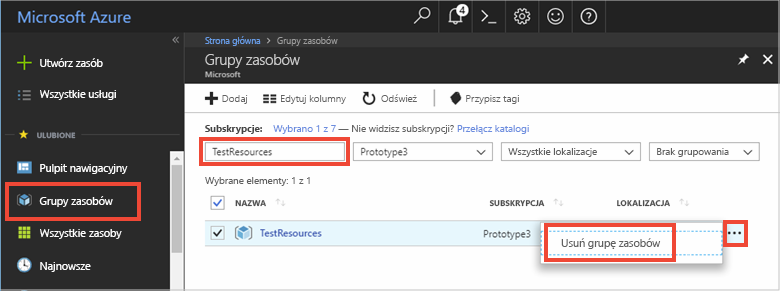

# <a name="quickstart-how-to-use-azure-cache-for-redis-with-java"></a>Szybki start: Jak używać usługi Azure Cache for Redis za pomocą języka Java


Usługa Azure Cache for Redis daje dostęp do dedykowanej usługi Azure Cache for Redis, którą zarządza firma Microsoft. Pamięć podręczna jest dostępna z poziomu dowolnej aplikacji na platformie Microsoft Azure.

W tym artykule przedstawiono rozpoczynanie pracy z usługą Azure Cache for Redis za pomocą klienta Redis [Jedis](https://github.com/xetorthio/jedis) dla języka Java.


Do wykonania kroków tego przewodnika Szybki start możesz użyć dowolnego edytora kodu. Doskonałym wyborem jest program [Visual Studio Code](https://code.visualstudio.com/), dostępny na platformach Windows, macOS i Linux.

[!INCLUDE [quickstarts-free-trial-note](../../includes/quickstarts-free-trial-note.md)]


## <a name="prerequisites"></a>Wymagania wstępne

[Apache Maven](https://maven.apache.org/)


## <a name="create-an-azure-cache-for-redis"></a>Tworzenie usługi Azure Cache for Redis

[!INCLUDE [redis-cache-create](../../includes/redis-cache-create.md)]

[!INCLUDE [redis-cache-access-keys](../../includes/redis-cache-access-keys.md)]

Dodaj zmienne środowiskowe dla **NAZWY HOSTA** i **podstawowego** klucza dostępu. Użyj zmiennych z kodu, nie dodawaj wrażliwych informacji bezpośrednio w kodzie.

```
set REDISCACHEHOSTNAME=contosoCache.redis.cache.windows.net
set REDISCACHEKEY=XXXXXXXXXXXXXXXXXXXXXXXXXXXXXXXXXXXXXXXXXXXX
```

## <a name="create-a-new-java-app"></a>Tworzenie nowej aplikacji Java

Za pomocą programu Maven wygeneruj nową aplikację przewodnika Szybki Start:

```
mvn archetype:generate -DarchetypeGroupId=org.apache.maven.archetypes -DarchetypeArtifactId=maven-archetype-quickstart -DarchetypeVersion=1.3 -DgroupId=example.demo -DartifactId=redistest -Dversion=1.0
```

Zmień katalog projektu *redistest* na nowy.

Otwórz plik *pom.xml* i dodaj zależność dla [Jedis](https://github.com/xetorthio/jedis):

```xml
    <dependency>
        <groupId>redis.clients</groupId>
        <artifactId>jedis</artifactId>
        <version>2.9.0</version>
        <type>jar</type>
        <scope>compile</scope>
    </dependency>
```

Zapisz plik *pom.xml*.

Otwórz plik *App.java* i zastąp kod następującym:

```java
package example.demo;

import redis.clients.jedis.Jedis;
import redis.clients.jedis.JedisShardInfo;

/**
 * Redis test
 *
 */
public class App 
{
    public static void main( String[] args )
    {

        boolean useSsl = true;
        String cacheHostname = System.getenv("REDISCACHEHOSTNAME");
        String cachekey = System.getenv("REDISCACHEKEY");

        // Connect to the Azure Cache for Redis over the SSL port using the key.
        JedisShardInfo shardInfo = new JedisShardInfo(cacheHostname, 6380, useSsl);
        shardInfo.setPassword(cachekey); /* Use your access key. */
        Jedis jedis = new Jedis(shardInfo);      

        // Perform cache operations using the cache connection object...

        // Simple PING command        
        System.out.println( "\nCache Command  : Ping" );
        System.out.println( "Cache Response : " + jedis.ping());

        // Simple get and put of integral data types into the cache
        System.out.println( "\nCache Command  : GET Message" );
        System.out.println( "Cache Response : " + jedis.get("Message"));

        System.out.println( "\nCache Command  : SET Message" );
        System.out.println( "Cache Response : " + jedis.set("Message", "Hello! The cache is working from Java!"));

        // Demonstrate "SET Message" executed as expected...
        System.out.println( "\nCache Command  : GET Message" );
        System.out.println( "Cache Response : " + jedis.get("Message"));

        // Get the client list, useful to see if connection list is growing...
        System.out.println( "\nCache Command  : CLIENT LIST" );
        System.out.println( "Cache Response : " + jedis.clientList());

        jedis.close();
    }
}
```

W tym kodzie pokazano sposób podłączania do wystąpienia usługi Azure Cache for Redis przy użyciu nazwy hosta w pamięci podręcznej i kluczowych zmiennych środowiskowych. W kodzie jest również przechowywana i pobierana wartość ciągu w pamięci podręcznej. Następuje wykonanie poleceń `PING` i `CLIENT LIST`. 

Zapisz plik *App.java*.

## <a name="build-and-run-the-app"></a>Kompilowanie i uruchamianie aplikacji

Wykonaj następujące polecenie narzędzia Maven, aby skompilować i uruchomić aplikację:

```
mvn compile
mvn exec:java -D exec.mainClass=example.demo.App
```

W poniższym przykładzie widać, że klucz `Message` miał już w pamięci podręcznej wartość, która została ustawiona za pomocą konsoli Redis w witrynie Azure Portal. Aplikacja zaktualizowała tę wartość w pamięci podręcznej. Aplikacja również wykonała polecenia `PING` i `CLIENT LIST`.


## <a name="clean-up-resources"></a>Oczyszczanie zasobów

Jeśli zamierzasz przejść do kolejnego samouczka, możesz zachować zasoby utworzone w tym przewodniku Szybki start i użyć ich ponownie.

W przeciwnym razie po zakończeniu pracy z przykładową aplikacją poradnika Szybki start możesz usunąć zasoby platformy Azure utworzone w tym poradniku Szybki start, aby uniknąć naliczania opłat. 

> [!IMPORTANT]
> Usunięcie grupy zasobów jest nieodwracalne i grupa zasobów oraz wszystkie zawarte w niej zasoby zostaną trwale usunięte. Uważaj, aby nie usunąć przypadkowo niewłaściwych zasobów lub grupy zasobów. Jeśli zasoby do hostowania tego przykładu zostały utworzone wewnątrz istniejącej grupy zasobów zawierającej zasoby, które chcesz zachować, możesz usunąć każdy zasób oddzielnie z odpowiadającego mu bloku zamiast usuwać całą grupę zasobów.
>

Zaloguj się do witryny [Azure Portal](https://portal.azure.com) i kliknij pozycję **Grupy zasobów**.

W polu tekstowym **Filtruj według nazwy...** wpisz nazwę grupy zasobów. Instrukcje w tym artykule używają grupy zasobów o nazwie *TestResources*. Dla grupy zasobów na liście wyników kliknij pozycję **...**, a następnie kliknij pozycję **Usuń grupę zasobów**.



Zobaczysz prośbę o potwierdzenie usunięcia grupy zasobów. Wpisz nazwę grupy zasobów w celu potwierdzenia, a następnie kliknij pozycję **Usuń**.

Po krótkim czasie grupa zasobów i wszystkie zawarte w niej zasoby zostaną usunięte.


## <a name="next-steps"></a>Kolejne kroki

W tym przewodniku Szybki start pokazano, jak korzystać z usługi Azure Cache for Redis z poziomu aplikacji Java. Przejdź do kolejnego Szybkiego startu, w którym wyjaśniono, jak używać usługi Microsoft Azure Cache for Redis z poziomu aplikacji internetowej ASP.NET.

> [!div class="nextstepaction"]
> [Tworzenie na platformie ASP.NET aplikacji internetowej, która korzysta z usługi Microsoft Azure Cache for Redis.](./cache-web-app-howto.md)


