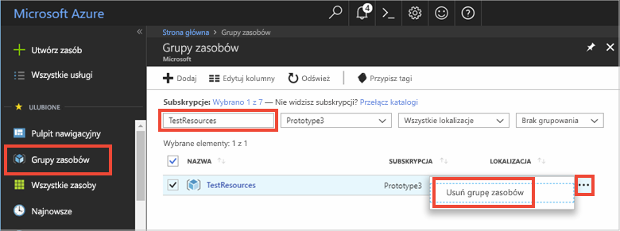

# <a name="quickstart-how-to-use-azure-cache-for-redis-with-nodejs"></a>Szybki start: Jak używać usługi Azure Cache for Redis w środowisku Node.js


Usługa Azure Cache for Redis daje dostęp do bezpiecznej, dedykowanej pamięci podręcznej Azure Cache for Redis, którą zarządza firma Microsoft. Pamięć podręczna jest dostępna z poziomu dowolnej aplikacji na platformie Microsoft Azure.

W tym temacie opisano sposób rozpoczęcia pracy z pamięcią podręczną Azure Cache for Redis w środowisku Node.js. 

Do wykonania kroków tego przewodnika Szybki start możesz użyć dowolnego edytora kodu. Doskonałym wyborem jest program [Visual Studio Code](https://code.visualstudio.com/), dostępny na platformach Windows, macOS i Linux.


[!INCLUDE [quickstarts-free-trial-note](../../includes/quickstarts-free-trial-note.md)]


## <a name="prerequisites"></a>Wymagania wstępne
Zainstaluj klienta [node_redis](https://github.com/mranney/node_redis):

    npm install redis

W tym samouczku jest używany klient [node_redis](https://github.com/mranney/node_redis). Przykłady użycia innych klientów Node.js można znaleźć w dokumentacji poszczególnych klientów Node.js wymienionych na stronie [klientów Node.js usługi Redis](https://redis.io/clients#nodejs).


## <a name="create-a-cache"></a>Tworzenie pamięci podręcznej
[!INCLUDE [redis-cache-create](../../includes/redis-cache-create.md)]

[!INCLUDE [redis-cache-access-keys](../../includes/redis-cache-access-keys.md)]


Dodaj zmienne środowiskowe dla **NAZWY HOSTA** i **podstawowego** klucza dostępu. Użyj zmiennych z kodu, nie dodawaj wrażliwych informacji bezpośrednio w kodzie.

```
set REDISCACHEHOSTNAME=contosoCache.redis.cache.windows.net
set REDISCACHEKEY=XXXXXXXXXXXXXXXXXXXXXXXXXXXXXXXXXXXXXXXXXXXX
```


## <a name="connect-to-the-cache"></a>Łączenie z pamięcią podręczną

Najnowsze kompilacje klienta [node_redis](https://github.com/mranney/node_redis) umożliwiają łączenie się z usługą Azure Cache for Redis przy użyciu protokołu SSL. Poniższy przykład przedstawia, jak nawiązać połączenie z usługą Azure Cache for Redis przy użyciu punktu końcowego 6380 protokołu SSL. 

```js
var redis = require("redis");

// Add your cache name and access key.
var client = redis.createClient(6380, process.env.REDISCACHEHOSTNAME,
    {auth_pass: process.env.REDISCACHEKEY, tls: {servername: process.env.REDISCACHEHOSTNAME}});
```

Nie należy tworzyć nowych połączeń dla każdej operacji w kodzie. Zamiast tego należy w miarę możliwości używać połączeń ponownie. 

## <a name="create-a-new-nodejs-app"></a>Tworzenie nowej aplikacji na platformie Node.js

Utwórz nowy plik skryptu o nazwie *redistest.js*.

Dodaj do pliku poniższy przykład kodu JavaScript. W tym kodzie pokazano sposób podłączania do wystąpienia usługi Azure Cache for Redis przy użyciu nazwy hosta pamięci podręcznej i kluczowych zmiennych środowiskowych. W kodzie jest również przechowywana i pobierana wartość ciągu w pamięci podręcznej. Następuje wykonanie poleceń `PING` i `CLIENT LIST`. Aby uzyskać więcej przykładów użycia usługi Redis z klientem [node_redis](https://github.com/mranney/node_redis), zobacz [https://redis.js.org/](https://redis.js.org/).

```js
var redis = require("redis");
var bluebird = require("bluebird");

bluebird.promisifyAll(redis.RedisClient.prototype);
bluebird.promisifyAll(redis.Multi.prototype);

async function testCache() {

    // Connect to the Azure Cache for Redis over the SSL port using the key.
    var cacheConnection = redis.createClient(6380, process.env.REDISCACHEHOSTNAME, 
        {auth_pass: process.env.REDISCACHEKEY, tls: {servername: process.env.REDISCACHEHOSTNAME}});
        
    // Perform cache operations using the cache connection object...

    // Simple PING command
    console.log("\nCache command: PING");
    console.log("Cache response : " + await cacheConnection.pingAsync());

    // Simple get and put of integral data types into the cache
    console.log("\nCache command: GET Message");
    console.log("Cache response : " + await cacheConnection.getAsync("Message"));    

    console.log("\nCache command: SET Message");
    console.log("Cache response : " + await cacheConnection.setAsync("Message",
        "Hello! The cache is working from Node.js!"));    

    // Demonstrate "SET Message" executed as expected...
    console.log("\nCache command: GET Message");
    console.log("Cache response : " + await cacheConnection.getAsync("Message"));    

    // Get the client list, useful to see if connection list is growing...
    console.log("\nCache command: CLIENT LIST");
    console.log("Cache response : " + await cacheConnection.clientAsync("LIST"));    
}

testCache();
```

Uruchom skrypt języka Node.js.

```
node redistest.js
```

W poniższym przykładzie widać, że klucz `Message` miał już w pamięci podręcznej wartość, która została ustawiona za pomocą konsoli Redis w witrynie Azure Portal. Aplikacja zaktualizowała tę wartość w pamięci podręcznej. Aplikacja również wykonała polecenia `PING` i `CLIENT LIST`.


## <a name="clean-up-resources"></a>Oczyszczanie zasobów

Jeśli zamierzasz przejść do kolejnego samouczka, możesz zachować zasoby utworzone w tym przewodniku Szybki start i użyć ich ponownie.

W przeciwnym razie po zakończeniu pracy z przykładową aplikacją poradnika Szybki start możesz usunąć zasoby platformy Azure utworzone w tym poradniku Szybki start, aby uniknąć naliczania opłat. 

> [!IMPORTANT]
> Usunięcie grupy zasobów jest nieodwracalne i grupa zasobów oraz wszystkie zawarte w niej zasoby zostaną trwale usunięte. Uważaj, aby nie usunąć przypadkowo niewłaściwych zasobów lub grupy zasobów. Jeśli zasoby do hostowania tego przykładu zostały utworzone wewnątrz istniejącej grupy zasobów zawierającej zasoby, które chcesz zachować, możesz usunąć każdy zasób oddzielnie z odpowiadającego mu bloku zamiast usuwać całą grupę zasobów.
>

Zaloguj się do witryny [Azure Portal](https://portal.azure.com) i kliknij pozycję **Grupy zasobów**.

W polu tekstowym **Filtruj według nazwy...** wpisz nazwę grupy zasobów. Instrukcje w tym artykule używają grupy zasobów o nazwie *TestResources*. Dla grupy zasobów na liście wyników kliknij pozycję **...**, a następnie kliknij pozycję **Usuń grupę zasobów**.



Zobaczysz prośbę o potwierdzenie usunięcia grupy zasobów. Wpisz nazwę grupy zasobów w celu potwierdzenia, a następnie kliknij pozycję **Usuń**.

Po krótkim czasie grupa zasobów i wszystkie zawarte w niej zasoby zostaną usunięte.


## <a name="next-steps"></a>Kolejne kroki

W tym przewodniku Szybki start przedstawiono sposób użycia usługi Azure Cache for Redis z poziomu aplikacji platformy Node.js. Przejdź do kolejnego Szybkiego startu, w którym wyjaśniono użycie usługi Microsoft Azure Cache for Redis z poziomu aplikacji internetowej ASP.NET.

> [!div class="nextstepaction"]
> [Tworzenie na platformie ASP.NET aplikacji internetowej, która korzysta z usługi Microsoft Azure Cache for Redis.](./cache-web-app-howto.md)


