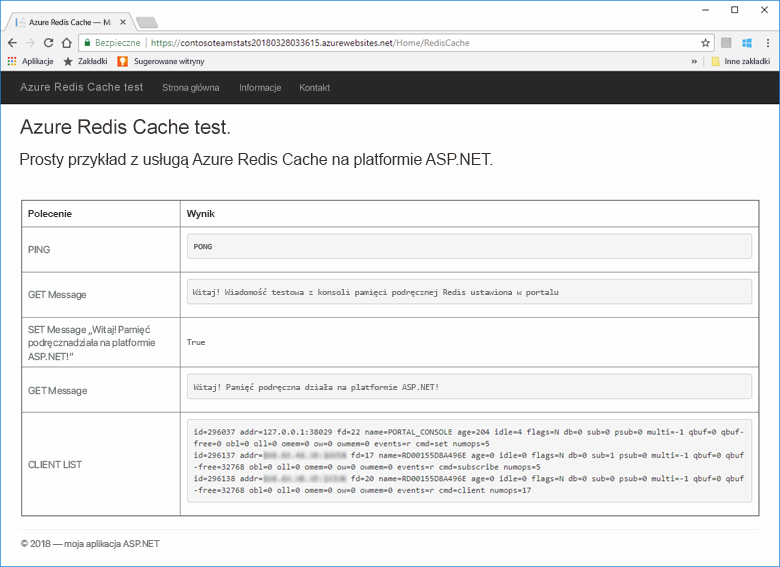
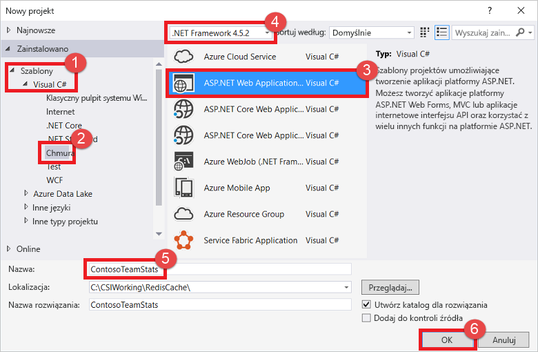
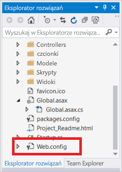
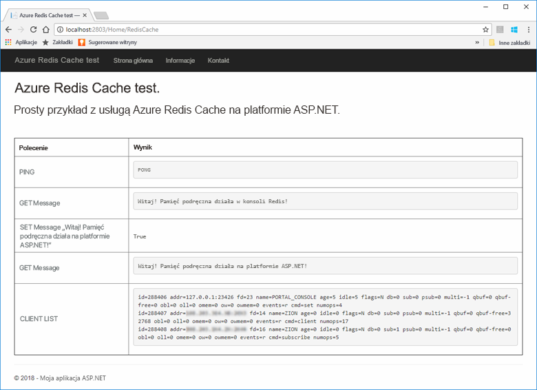
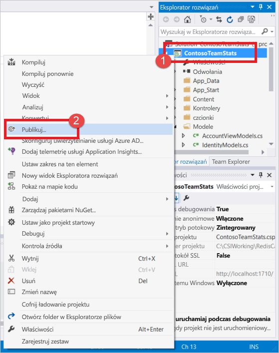
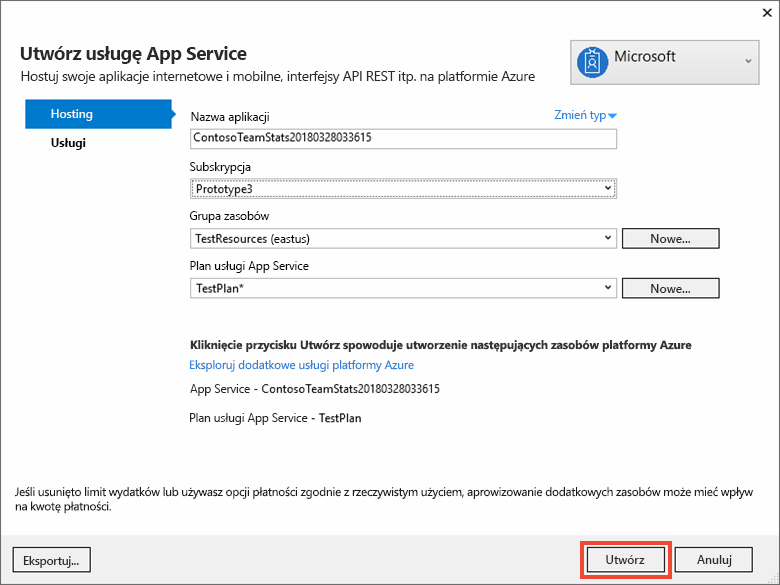
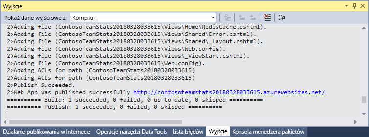
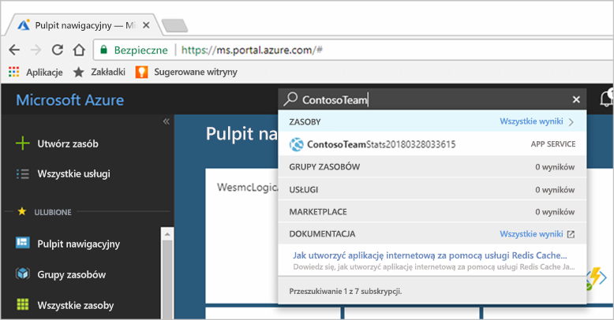
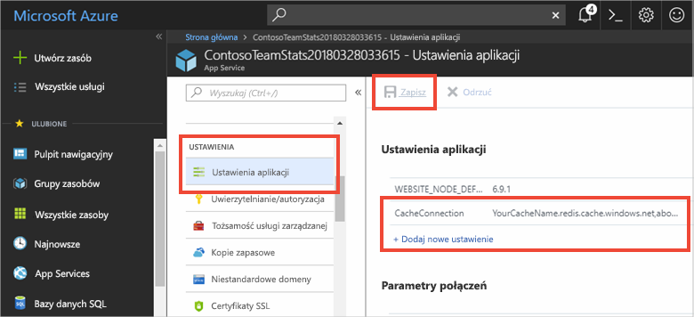
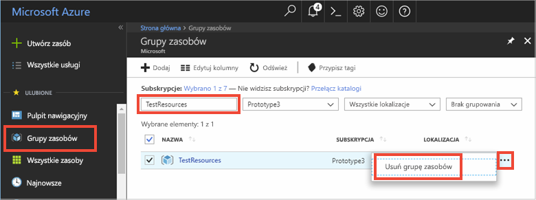

# <a name="quickstart-create-an-aspnet-web-app"></a>Szybki start: Tworzenie aplikacji internetowej platformy ASP.NET 

## <a name="introduction"></a>Wprowadzenie

W tym przewodniku Szybki start przedstawiono sposób tworzenia i wdrażania aplikacji internetowej platformy ASP.NET w usłudze Azure App Service przy użyciu programu Visual Studio 2017. Przykładowa aplikacja nawiązuje połączenie z usługą Azure Cache for Redis w celu zapisywania i pobierania danych z pamięci podręcznej. Po zakończeniu przewodnika Szybki start otrzymasz uruchomioną aplikację internetową hostowaną na platformie Azure, która odczytuje i zapisuje dane w usłudze Azure Cache for Redis.



[!INCLUDE [quickstarts-free-trial-note](../../includes/quickstarts-free-trial-note.md)]

## <a name="prerequisites"></a>Wymagania wstępne

Aby ukończyć ten przewodnik Szybki start, musisz zainstalować program [Visual Studio 2017](https://www.visualstudio.com/downloads/) z następującymi środowiskami:
* Tworzenie aplikacji na platformie ASP.NET i aplikacji internetowych
* Tworzenie aplikacji na platformie Azure

## <a name="create-the-visual-studio-project"></a>Tworzenie projektu programu Visual Studio

1. Otwórz program Visual Studio, a następnie wybierz pozycję **Plik** >**Nowy** > **Projekt**.

2. W oknie dialogowym **Nowy projekt** wykonaj następujące kroki:

    

    a. Na liście **Szablony** rozwiń węzeł **Visual C#**.

    b. Wybierz pozycję **Chmura**.

    c. Wybierz pozycję **Aplikacja internetowa platformy ASP.NET**.

    d. Upewnij się, że został wybrany program **.NET Framework 4.5.2** lub nowszy.

    e. W polu **Nazwa** podaj nazwę projektu. W tym przykładzie użyliśmy nazwy **ContosoTeamStats**.

    f. Kliknij przycisk **OK**.
   
3. Wybierz **MVC** jako typ projektu.

4. Upewnij się, że dla ustawienia **Uwierzytelnianie** wybrano pozycję **Bez uwierzytelniania**. Domyślne ustawienie **Uwierzytelnianie** może być różne w różnych wersjach programu Visual Studio. Aby je zmienić, wybierz pozycję **Zmień uwierzytelnianie**, a następnie pozycję **Bez uwierzytelniania**.

5. Wybierz przycisk **OK**, aby utworzyć projekt.

## <a name="create-a-cache"></a>Tworzenie pamięci podręcznej

Następnie utworzysz pamięć podręczną dla aplikacji.

[!INCLUDE [redis-cache-create](../../includes/redis-cache-create.md)]

[!INCLUDE [redis-cache-access-keys](../../includes/redis-cache-access-keys.md)]

#### <a name="to-edit-the-cachesecretsconfig-file"></a>Aby edytować plik *CacheSecrets.config*

1. Utwórz na swoim komputerze plik o nazwie *CacheSecrets.config*. Umieść go w lokalizacji, gdzie nie zostanie zaewidencjonowany z kodem źródłowym przykładowej aplikacji. W tym przewodniku Szybki start plik *CacheSecrets.config* znajduje się w lokalizacji *C:\AppSecrets\CacheSecrets.config*.

1. Edytuj plik *CacheSecrets.config*. Następnie dodaj następującą zawartość:

    ```xml
    <appSettings>
        <add key="CacheConnection" value="<cache-name>.redis.cache.windows.net,abortConnect=false,ssl=true,password=<access-key>"/>
    </appSettings>
    ```

1. Zastąp element `<cache-name>` nazwą hosta pamięci podręcznej.

1. Zastąp element `<access-key>` kluczem podstawowym pamięci podręcznej.

    > [!TIP]
    > Podczas wymiany klucza można użyć pomocniczego klucza dostępu jako klucza alternatywnego, gdy następuje ponowne generowanie podstawowego klucza dostępu.
   >
1. Zapisz plik.

## <a name="update-the-mvc-application"></a>Aktualizowanie aplikacji MVC

W tej sekcji zaktualizujesz aplikację do obsługi nowego widoku, który wyświetla prosty test dla usługi Azure Cache for Redis.

* [Aktualizacja pliku web.config ustawieniem aplikacji dla pamięci podręcznej](#update-the-webconfig-file-with-an-app-setting-for-the-cache)
* Konfigurowanie aplikacji do korzystania z klienta programu StackExchange.Redis
* Aktualizowanie plików HomeController i Layout
* Dodawanie nowego widok RedisCache

### <a name="update-the-webconfig-file-with-an-app-setting-for-the-cache"></a>Aktualizacja pliku web.config ustawieniem aplikacji dla pamięci podręcznej

Jeśli aplikacja jest uruchamiana lokalnie, informacje w pliku *CacheSecrets.config* są używane do łączenia z wystąpieniem usługi Azure Cache for Redis. Później wdrożysz tę aplikację na platformie Azure. W tym czasie skonfigurujesz na platformie Azure ustawienie aplikacji, którego aplikacja używa do pobierania informacji o połączeniu pamięci podręcznej zamiast tego pliku. 

Ponieważ plik *CacheSecrets.config* nie został wdrożony na platformie Azure za pomocą aplikacji, możesz go używać tylko podczas lokalnego testowania aplikacji. Aby zapobiec złośliwemu dostępowi do danych w pamięci podręcznej, maksymalnie zabezpiecz te informacje.

#### <a name="to-update-the-webconfig-file"></a>Aktualizowanie pliku *web.config*
1. W **Eksploratorze rozwiązań** kliknij dwukrotnie plik *web.config*, aby go otworzyć.

    

2. W pliku *web.config* znajdź element `<appSetting>`. Następnie dodaj następujący atrybut `file`. Jeśli wcześniej używana była inna nazwa pliku lub lokalizacja, podstaw te wartości w miejsce pokazanych w przykładzie.

* Przed: `<appSettings>`
* Po:  `<appSettings file="C:\AppSecrets\CacheSecrets.config">`

Środowisko uruchomieniowe ASP.NET scala zawartość pliku zewnętrznego ze znacznikami w elemencie `<appSettings>`. Środowisko uruchomieniowe ignoruje atrybut pliku, jeśli nie można odnaleźć określonego pliku. Wpisy tajne (parametry połączenia z pamięcią podręczną) nie są dołączone jako część kodu źródłowego aplikacji. Podczas wdrażania aplikacji internetowej na platformie Azure plik *CacheSecrets.config* nie jest wdrażany.

### <a name="to-configure-the-application-to-use-stackexchangeredis"></a>Aby skonfigurować aplikację do korzystania z programu StackExchange.Redis

1. Aby skonfigurować aplikację do używania pakietu NuGet [StackExchange.Redis](https://github.com/StackExchange/StackExchange.Redis) dla programu Visual Studio, wybierz pozycje **Narzędzia > Menedżer pakietów NuGet > Konsola menedżera pakietów**.

2. W oknie `Package Manager Console` uruchom następujące polecenie:

    ```powershell
    Install-Package StackExchange.Redis
    ```

3. Pakiet NuGet pobiera i dodaje wymagane odwołania do zestawu umożliwiające aplikacji klienta uzyskanie dostępu do usługi Azure Cache for Redis przy użyciu klienta usługi Azure Cache for Redis StackExchange. Jeśli wolisz użyć wersji biblioteki klienckiej `StackExchange.Redis` o silnej nazwie, zainstaluj pakiet `StackExchange.Redis.StrongName`.

### <a name="to-update-the-homecontroller-and-layout"></a>Aby zaktualizować pliki HomeController i Layout

1. W **Eksploratorze rozwiązań** rozwiń folder **Kontrolery**, a następnie otwórz plik *HomeController.cs*.

2. Dodaj następujące dwie instrukcje `using` w górnej części pliku, aby obsłużyć klienta pamięci podręcznej i ustawienia aplikacji.

    ```csharp
    using System.Configuration;
    using StackExchange.Redis;
    ```

3. Dodaj następującą metodę do klasy `HomeController` w celu obsługi nowej akcji `RedisCache` uruchamiającej niektóre polecenia w stosunku do nowej pamięci podręcznej.

    ```csharp
        public ActionResult RedisCache()
        {
            ViewBag.Message = "A simple example with Azure Cache for Redis on ASP.NET.";

            var lazyConnection = new Lazy<ConnectionMultiplexer>(() =>
            {
                string cacheConnection = ConfigurationManager.AppSettings["CacheConnection"].ToString();
                return ConnectionMultiplexer.Connect(cacheConnection);
            });

            // Connection refers to a property that returns a ConnectionMultiplexer
            // as shown in the previous example.
            IDatabase cache = lazyConnection.Value.GetDatabase();

            // Perform cache operations using the cache object...

            // Simple PING command
            ViewBag.command1 = "PING";
            ViewBag.command1Result = cache.Execute(ViewBag.command1).ToString();

            // Simple get and put of integral data types into the cache
            ViewBag.command2 = "GET Message";
            ViewBag.command2Result = cache.StringGet("Message").ToString();

            ViewBag.command3 = "SET Message \"Hello! The cache is working from ASP.NET!\"";
            ViewBag.command3Result = cache.StringSet("Message", "Hello! The cache is working from ASP.NET!").ToString();

            // Demonstrate "SET Message" executed as expected...
            ViewBag.command4 = "GET Message";
            ViewBag.command4Result = cache.StringGet("Message").ToString();

            // Get the client list, useful to see if connection list is growing...
            ViewBag.command5 = "CLIENT LIST";
            ViewBag.command5Result = cache.Execute("CLIENT", "LIST").ToString().Replace(" id=", "\rid=");

            lazyConnection.Value.Dispose();

            return View();
        }
    ```

4. W **Eksploratorze rozwiązań** rozwiń folder **Widoki** > **Udostępnione**. Następnie otwórz plik *_Layout.cshtml*

    Zastąp:
    
    ```csharp
    @Html.ActionLink("Application name", "Index", "Home", new { area = "" }, new { @class = "navbar-brand" })
    ```

    tym:

    ```csharp
    @Html.ActionLink("Azure Cache for Redis Test", "RedisCache", "Home", new { area = "" }, new { @class = "navbar-brand" })
    ```

### <a name="to-add-a-new-rediscache-view"></a>Aby dodać nowy widok RedisCache

1. W **Eksploratorze rozwiązań** rozwiń folder **Widoki**, a następnie kliknij prawym przyciskiem myszy folder **Główny**. Wybierz pozycje **Dodaj** > **Widok...**.

2. W oknie dialogowym **Dodawanie widoku** wprowadź **RedisCache** jako nazwę widoku. Następnie wybierz pozycję **Dodaj**.

3. Zastąp kod w pliku *RedisCache.cshtml* następującym kodem:

    ```csharp
    @{
        ViewBag.Title = "Azure Cache for Redis Test";
    }

    <h2>@ViewBag.Title.</h2>
    <h3>@ViewBag.Message</h3>
    <br /><br />
    <table border="1" cellpadding="10">
        <tr>
            <th>Command</th>
            <th>Result</th>
        </tr>
        <tr>
            <td>@ViewBag.command1</td>
            <td><pre>@ViewBag.command1Result</pre></td>
        </tr>
        <tr>
            <td>@ViewBag.command2</td>
            <td><pre>@ViewBag.command2Result</pre></td>
        </tr>
        <tr>
            <td>@ViewBag.command3</td>
            <td><pre>@ViewBag.command3Result</pre></td>
        </tr>
        <tr>
            <td>@ViewBag.command4</td>
            <td><pre>@ViewBag.command4Result</pre></td>
        </tr>
        <tr>
            <td>@ViewBag.command5</td>
            <td><pre>@ViewBag.command5Result</pre></td>
        </tr>
    </table>
    ```

## <a name="run-the-app-locally"></a>Lokalne uruchamianie aplikacji

Domyślnie projekt jest konfigurowany do lokalnego hostowania aplikacji w usługach [IIS Express](https://docs.microsoft.com/iis/extensions/introduction-to-iis-express/iis-express-overview) na potrzeby testowania i debugowania.

### <a name="to-run-the-app-locally"></a>Uruchamianie aplikacji lokalnie
1. W programie Visual Studio wybierz pozycje **Debugowanie** > **Rozpocznij debugowanie**, aby lokalnie skompilować i uruchomić aplikację na potrzeby testowania i debugowania.

2. W przeglądarce wybierz pozycję **Test usługi Azure Cache for Redis** na pasku nawigacyjnym.

3. W poniższym przykładzie klucz `Message` miał już w pamięci podręcznej wartość, która została ustawiona za pomocą konsoli usługi Azure Cache for Redis w portalu. Aplikacja zaktualizowała tę wartość w pamięci podręcznej. Aplikacja również wykonała polecenia `PING` i `CLIENT LIST`.

    

## <a name="publish-and-run-in-azure"></a>Publikowanie i uruchamianie na platformie Azure

Po pomyślnym przetestowaniu aplikacji lokalnie możesz wdrożyć ją na platformie Azure i uruchomić w chmurze.

### <a name="to-publish-the-app-to-azure"></a>Aby opublikować aplikację na platformie Azure

1. W programie Visual Studio kliknij prawym przyciskiem myszy węzeł projektu w Eksploratorze rozwiązań. Następnie wybierz pozycję **Opublikuj**.

    

2. Wybierz pozycję **Microsoft Azure App Service**, wybierz opcję **Utwórz nowy**, a następnie wybierz pozycję **Opublikuj**.

    

3. W oknie dialogowym **Tworzenie usługi App Service** wprowadź następujące zmiany:

    | Ustawienie | Zalecana wartość | Opis |
    | ------- | :---------------: | ----------- |
    | **Nazwa aplikacji** | Użyj wartości domyślnej. | Nazwa aplikacji będzie nazwą hosta dla aplikacji po wdrożeniu na platformie Azure. Nazwa może mieć dodany sufiks znacznika czasu, aby zapewnić jej unikatowość w razie potrzeby. |
    | **Subskrypcja** | Wybierz subskrypcję platformy Azure. | Dla tej subskrypcji zostanie naliczona opłata za wszelkie powiązane koszty hostingu. Jeśli masz wiele subskrypcji platformy Azure, sprawdź, czy została wybrana odpowiednia subskrypcja.|
    | **Grupa zasobów** | Użyj tej samej grupy zasobów, w której została utworzona pamięć podręczna (na przykład *TestResourceGroup*). | Grupa zasobów pomaga zarządzać wszystkimi zasobami jako grupą. Później, gdy zechcesz usunąć aplikację, wystarczy tylko usunąć grupę. |
    | **Plan usługi App Service** | Wybierz pozycję **Nowy**, a następnie utwórz nowy plan usługi App Service o nazwie *TestingPlan*. <br />Użyj tej samej **lokalizacji**, która była używana podczas tworzenia pamięci podręcznej. <br />Jako rozmiar wybierz wartość **Bezpłatny**. | Plan usługi App Service definiuje zestaw zasobów obliczeniowych dla aplikacji internetowej używanych podczas jej uruchamiania. |

    

4. Po skonfigurowaniu ustawień hostingu usługi App Service wybierz pozycję **Utwórz**.

5. Monitoruj okno **Dane wyjściowe** w programie Visual Studio, aby zobaczyć stan publikowania. Po opublikowaniu aplikacji zostaje zarejestrowany jej adres URL:

    

### <a name="add-the-app-setting-for-the-cache"></a>Dodawanie ustawienia aplikacji dla pamięci podręcznej

Po opublikowaniu nowej aplikacji dodaj nowe ustawienie aplikacji. To ustawienie jest używane do zapisywania informacji o połączeniu z pamięcią podręczną. 

#### <a name="to-add-the-app-setting"></a>Aby dodać ustawienie aplikacji 

1. Wpisz nazwę aplikacji na pasku wyszukiwania w górnej części witryny Azure Portal, aby znaleźć nową utworzoną aplikację.

    

2. Dodaj ustawienie nowej aplikacji o nazwie **CacheConnection** dla aplikacji, aby jej używać do łączenia się z pamięcią podręczną. Użyj tej samej wartości, która została skonfigurowana dla `CacheConnection` w pliku *CacheSecrets.config*. Wartość zawiera nazwę hosta pamięci podręcznej i klucz dostępu.

    

### <a name="run-the-app-in-azure"></a>Uruchamianie aplikacji na platformie Azure

W przeglądarce przejdź do adresu URL aplikacji. Adres URL jest wyświetlany w wynikach operacji publikowania w oknie danych wyjściowych programu Visual Studio. Jest on również udostępniany w witrynie Azure Portal na stronie omówienia utworzonej przez Ciebie aplikacji.

Wybierz pozycję **Test usługi Azure Cache for Redis** na pasku nawigacyjnym, aby przetestować dostęp do pamięci podręcznej.


## <a name="clean-up-resources"></a>Oczyszczanie zasobów

Jeśli zamierzasz przejść do kolejnego samouczka, możesz zachować zasoby utworzone w tym przewodniku Szybki start i użyć ich ponownie.

W przeciwnym razie po zakończeniu pracy z przykładową aplikacją poradnika Szybki start możesz usunąć zasoby platformy Azure utworzone w tym poradniku Szybki start, aby uniknąć naliczania opłat. 

> [!IMPORTANT]
> Usunięcie grupy zasobów jest nieodwracalne. Jeśli usuniesz grupę zasobów, wszystkie zawarte w niej zasoby zostaną trwale usunięte. Uważaj, aby nie usunąć przypadkowo niewłaściwych zasobów lub grupy zasobów. Jeśli zasoby do hostowania tego przykładu zostały utworzone wewnątrz istniejącej grupy zasobów zawierającej zasoby, które chcesz zachować, możesz usunąć każdy zasób oddzielnie z odpowiadającego mu bloku zamiast usuwać całą grupę zasobów.

### <a name="to-delete-a-resource-group"></a>Aby usunąć grupę zasobów

1. Zaloguj się do witryny [Azure Portal](https://portal.azure.com), a następnie wybierz pozycję **Grupy zasobów**.

2. W polu **Filtruj według nazwy...** wpisz nazwę grupy zasobów. Instrukcje w tym artykule używają grupy zasobów o nazwie *TestResources*. Dla grupy zasobów na liście wyników kliknij pozycję **...**, a następnie wybierz pozycję **Usuń grupę zasobów**.

    

Zobaczysz prośbę o potwierdzenie usunięcia grupy zasobów. Wpisz nazwę grupy zasobów w celu potwierdzenia, a następnie wybierz pozycję **Usuń**.

Po krótkim czasie grupa zasobów i wszystkie jej zasoby zostaną usunięte.

## <a name="next-steps"></a>Kolejne kroki

W następnym samouczku użyjesz usługi Azure Cache for Redis w scenariuszu bardziej zbliżonym do rzeczywistego, aby poprawić wydajność aplikacji. Zaktualizujesz tę aplikację tak, aby buforowała wyniki rankingu przy użyciu wzorca odkładania do pamięci podręcznej za pomocą platformy ASP.NET i bazy danych.

> [!div class="nextstepaction"]
> [Tworzenie rankingu z odkładaniem do pamięci podręcznej na platformie ASP.NET](cache-web-app-cache-aside-leaderboard.md)
