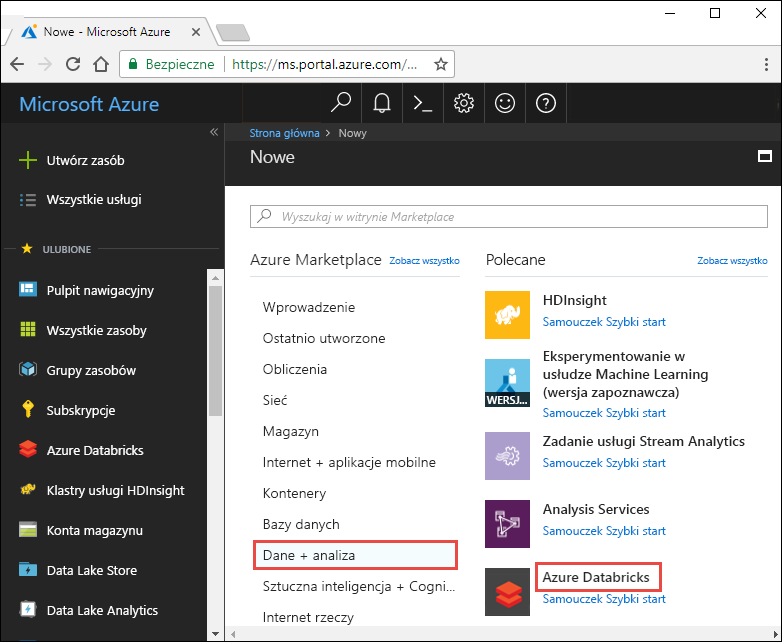
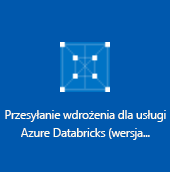
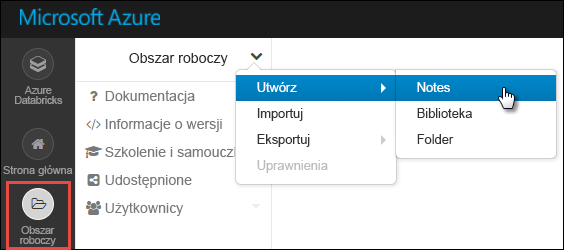

# <a name="tutorial-stream-data-into-azure-databricks-using-event-hubs"></a>Samouczek: Przesyłanie strumieniowe danych do usługi Azure Databricks przy użyciu usługi Event Hubs

> [!IMPORTANT]
> Tworzenie aplikacji usługi Twitter nie jest już dostępna za pośrednictwem [apps.twitter.com](https://apps.twitter.com/). W tym samouczku jest w trakcie aktualizowana w celu uwzględnienia nowego interfejsu API usługi Twitter.

W tym samouczku połączysz system pozyskiwania danych z usługą Azure Databricks w celu przesyłania strumieniowego danych do klastra Apache Spark w czasie niemal rzeczywistym. Przy użyciu usługi Azure Event Hubs skonfigurujesz system pozyskiwania danych, a następnie połączysz go z usługą Azure Databricks w celu przetwarzania przesyłanych komunikatów. Aby uzyskać dostęp do strumienia danych, musisz użyć interfejsów API usługi Twitter umożliwiających przesyłanie tweetów do usługi Event Hubs. Zadania analityczne umożliwiają dalszą analizę danych w usłudze Azure Databricks. 

Wykonanie kroków tego samouczka pozwoli Ci przesłać strumieniowo tweety (zawierające termin „Azure”) i przeczytać je w usłudze Azure Databricks.

Poniższa ilustracja przedstawia przepływ aplikacji:


Ten samouczek obejmuje następujące zadania:

> [!div class="checklist"]
> * Tworzenie obszaru roboczego usługi Azure Databricks
> * Tworzenie klastra Spark w usłudze Azure Databricks
> * Tworzenie aplikacji usługi Twitter w celu uzyskania dostępu do danych strumienia
> * Tworzenie notesów w usłudze Azure Databricks
> * Dołączanie bibliotek usługi Event Hubs oraz interfejsu API usługi Twitter
> * Wysyłanie tweetów do usługi Event Hubs
> * Odczytywanie tweetów z usługi Event Hubs

Jeśli nie masz subskrypcji platformy Azure, przed rozpoczęciem [utwórz bezpłatne konto](https://azure.microsoft.com/free/).

> [!Note]
> W tym samouczku nie może być przeprowadzone przy użyciu **subskrypcji bezpłatnej wersji próbnej platformy Azure**.
> Aby użyć bezpłatnego konta do utworzenia klastra usługi Azure Databricks, przed utworzeniem klastra przejdź do swojego profilu i zmień swoją subskrypcję na **płatność zgodnie z rzeczywistym użyciem**. Aby uzyskać więcej informacji, zobacz [Bezpłatne konto platformy Azure](https://azure.microsoft.com/free/).

## <a name="prerequisites"></a>Wymagania wstępne

Przed rozpoczęciem pracy z tym samouczkiem upewnij się, że zostały spełnione następujące wymagania:
- Przestrzeń nazw usługi Azure Event Hubs.
- Centrum zdarzeń w przestrzeni nazw.
- Parametry połączenia umożliwiające dostęp do przestrzeni nazw usługi Event Hubs. Parametry połączenia powinny mieć mniej więcej taki format: `Endpoint=sb://<namespace>.servicebus.windows.net/;SharedAccessKeyName=<key name>;SharedAccessKey=<key value>`.
- Nazwa zasad dostępu współdzielonego i klucz zasad dla usługi Event Hubs.

Aby spełnić te wymagania, wystarczy wykonać kroki opisane w artykule [Create an Azure Event Hubs namespace and event hub (Tworzenie przestrzeni nazw i centrum zdarzeń usługi Azure Event Hubs)](../event-hubs/event-hubs-create.md).

## <a name="log-in-to-the-azure-portal"></a>Logowanie do witryny Azure Portal

Zaloguj się do witryny [Azure Portal](https://portal.azure.com/).

## <a name="create-an-azure-databricks-workspace"></a>Tworzenie obszaru roboczego usługi Azure Databricks

W tej sekcji utworzysz obszar roboczy usługi Azure Databricks przy użyciu witryny Azure Portal.

1. W witrynie Azure Portal wybierz pozycję **Utwórz zasób** > **Dane i analiza** > **Azure Databricks**.

    

3. W obszarze **Usługa Azure Databricks** podaj wartości umożliwiające utworzenie obszaru roboczego usługi Databricks.

    

    Podaj następujące wartości:

    |Właściwość  |Opis  |
    |---------|---------|
    |**Nazwa obszaru roboczego**     | Podaj nazwę obszaru roboczego usługi Databricks.        |
    |**Subskrypcja**     | Z listy rozwijanej wybierz subskrypcję platformy Azure.        |
    |**Grupa zasobów**     | Określ, czy chcesz utworzyć nową grupę zasobów, czy użyć istniejącej grupy. Grupa zasobów to kontener, który zawiera powiązane zasoby dla rozwiązania platformy Azure. Aby uzyskać więcej informacji, zobacz [Omówienie usługi Azure Resource Manager](../azure-resource-manager/resource-group-overview.md). |
    |**Lokalizacja**     | Wybierz pozycję **East US 2** (Wschodnie stany USA 2). Inne dostępne regiony podano na stronie [dostępności usług platformy Azure według regionów](https://azure.microsoft.com/regions/services/).        |
    |**Warstwa cenowa**     |  Wybierz warstwę **Standardowa** lub **Premium**. Aby uzyskać więcej informacji o tych warstwach, zobacz [stronę usługi Databricks](https://azure.microsoft.com/pricing/details/databricks/).       |

    Wybierz pozycję **Przypnij do pulpitu nawigacyjnego**, a następnie pozycję **Utwórz**.

4. Tworzenie konta potrwa kilka minut. Podczas tworzenia konta po prawej stronie portalu jest wyświetlany kafelek **Przesyłanie wdrożenia dla usługi Azure Databricks**. Aby go zobaczyć, być może trzeba będzie przesunąć pulpit nawigacyjny w prawo. W górnej części ekranu jest również wyświetlany pasek postępu. Postęp można obserwować w dowolnym z tych obszarów.

    

## <a name="create-a-spark-cluster-in-databricks"></a>Tworzenie klastra Spark w usłudze Databricks

1. W witrynie Azure Portal przejdź do utworzonego obszaru roboczego usługi Databricks, a następnie wybierz pozycję **Uruchom obszar roboczy**.

2. Nastąpi przekierowanie do portalu usługi Azure Databricks. W portalu wybierz pozycję **Klaster**.

    

3. Na stronie **Nowy klaster** podaj wartości, aby utworzyć klaster.

    

    Zaakceptuj pozostałe wartości domyślne poza następującymi:

   * Wprowadź nazwę klastra.
   * W tym artykule należy utworzyć klaster ze środowiskiem uruchomieniowym **4.0**.
   * Upewnij się, że jest zaznaczone pole wyboru **Zakończ po \_\_ min nieaktywności**. Podaj czas (w minutach), po jakim działanie klastra ma zostać zakończone, jeśli nie jest używany.

     Wybierz pozycję **Utwórz klaster**. Po uruchomieniu klastra możesz dołączyć do niego notesy i uruchamiać zadania Spark.

## <a name="create-a-twitter-application"></a>Tworzenie aplikacji usługi Twitter

Aby otrzymywać strumień tweetów, musisz utworzyć aplikację w usłudze Twitter. Wykonaj poniższe instrukcje, aby utworzyć aplikację usługi Twitter i zarejestrować wartości potrzebne do ukończenia tego samouczka.

1. W przeglądarce internetowej przejdź do strony [Twitter Application Management (Zarządzanie aplikacjami usługi Twitter)](https://apps.twitter.com/) i wybierz pozycję **Create New App (Utwórz nową aplikację)**.

    

2. Na stronie **Create an application (Tworzenie aplikacji)** podaj szczegóły nowej aplikacji, a następnie wybierz pozycję **Create your Twitter application (Utwórz aplikację usługi Twitter)**.

    

3. Na stronie aplikacji wybierz kartę **Keys and Access Tokens (Klucze i tokeny dostępu)** i skopiuj wartości pól **Consume Key (Klucz klienta)** i **Consumer Secret (Klucz tajny klienta)**. Zaznacz również pole **Create my access token (Utwórz mój token dostępu)**, aby wygenerować tokeny dostępu. Skopiuj wartości pól **Access Token (Token dostępu)** i **Access Token Secret (Klucz tajny tokenu dostępu)**.

    

Zapisz wartości dotyczące aplikacji usługi Twitter. Będą one potrzebne w dalszej części tego samouczka.

## <a name="attach-libraries-to-spark-cluster"></a>Dołączanie bibliotek do klastra Spark

W tym samouczku tweety są wysyłane do usługi Event Hubs za pomocą interfejsów API usługi Twitter. Ponadto dane są odczytywane i zapisywane w usłudze Azure Event Hubs za pomocą [łącznika Event Hubs platformy Apache Spark](https://github.com/Azure/azure-event-hubs-spark). Aby korzystać z tych interfejsów API w ramach klastra, dodaj je jako biblioteki do usługi Azure Databricks, a następnie je skojarz z klastrem Spark. Poniżej przedstawiono, jak dodać bibliotekę do folderu **Udostępnione** w obszarze roboczym.

1. W obszarze roboczym usługi Azure Databricks wybierz pozycję **Obszar roboczy**, a następnie kliknij prawym przyciskiem myszy pozycję **Udostępnione**. Z menu kontekstowego wybierz polecenie **Utwórz** > **Biblioteka**.

   

2. Na stronie Nowa biblioteka w polu **Źródło** wybierz pozycję **Współrzędna Maven**. W polu **Współrzędna** wprowadź współrzędną pakietu, który chcesz dodać. Oto współrzędne Maven bibliotek używanych w tym samouczku:

   * Łącznik Event Hubs platformy Spark — `com.microsoft.azure:azure-eventhubs-spark_2.11:2.3.1`
   * Interfejs API usługi Twitter — `org.twitter4j:twitter4j-core:4.0.6`

     

3. Wybierz pozycję **Utwórz bibliotekę**.

4. Wybierz folder, do którego dodano bibliotekę, a następnie wybierz nazwę biblioteki.

    

5. Na stronie biblioteki wybierz klaster, w którym chcesz używać biblioteki. Po pomyślnym skojarzeniu biblioteki z klastrem stan natychmiast zmienia się na wartość **Dołączone**.

    

6. Powtórz te kroki dla pakietu Twitter: `twitter4j-core:4.0.6`.

## <a name="create-notebooks-in-databricks"></a>Tworzenie notesów w usłudze Databricks

W tej sekcji w obszarze roboczym usługi Databricks zostaną utworzone dwa notesy o następujących nazwach:

- **SendTweetsToEventHub** — notes producenta służący do pobierania tweetów z usługi Twitter i przesyłania ich w strumieniu do usługi Event Hubs.
- **ReadTweetsFromEventHub** — notes użytkownika służący do odczytywania tweetów z usługi Event Hubs.

1. W lewym okienku wybierz pozycję **Obszar roboczy**. Z listy rozwijanej **Obszar roboczy** wybierz pozycję **Utwórz** > **Notes**.

    

2. W oknie dialogowym **Tworzenie notesu** wpisz **SendTweetsToEventHub**, jako język wybierz pozycję **Scala** i wybierz utworzony wcześniej klaster Spark.

    

    Wybierz pozycję **Utwórz**.

3. Powtórz te kroki, aby utworzyć notes **ReadTweetsFromEventHub**.

## <a name="send-tweets-to-event-hubs"></a>Wysyłanie tweetów do usługi Event Hubs

W notesie **SendTweetsToEventHub** wklej następujący kod i zastąp symbole zastępcze utworzonymi wcześniej wartościami przestrzeni nazw usługi Event Hubs i aplikacji usługi Twitter. Ten notes przesyła w czasie rzeczywistym strumień tweetów ze słowem kluczowym „Azure” do usługi Event Hubs.

```scala
    import java.util._
    import scala.collection.JavaConverters._
    import com.microsoft.azure.eventhubs._
    import java.util.concurrent._

    val namespaceName = "<EVENT HUBS NAMESPACE>"
    val eventHubName = "<EVENT HUB NAME>"
    val sasKeyName = "<POLICY NAME>"
    val sasKey = "<POLICY KEY>"
    val connStr = new ConnectionStringBuilder()
                .setNamespaceName(namespaceName)
                .setEventHubName(eventHubName)
                .setSasKeyName(sasKeyName)
                .setSasKey(sasKey)

    val pool = Executors.newFixedThreadPool(1)
    val eventHubClient = EventHubClient.create(connStr.toString(), pool)

    def sendEvent(message: String) = {
      val messageData = EventData.create(message.getBytes("UTF-8"))
      eventHubClient.get().send(messageData)
      System.out.println("Sent event: " + message + "\n")
    }

    import twitter4j._
    import twitter4j.TwitterFactory
    import twitter4j.Twitter
    import twitter4j.conf.ConfigurationBuilder

    // Twitter configuration!
    // Replace values below with yours

    val twitterConsumerKey = "<CONSUMER KEY>"
    val twitterConsumerSecret = "<CONSUMER SECRET>"
    val twitterOauthAccessToken = "<ACCESS TOKEN>"
    val twitterOauthTokenSecret = "<TOKEN SECRET>"

    val cb = new ConfigurationBuilder()
      cb.setDebugEnabled(true)
      .setOAuthConsumerKey(twitterConsumerKey)
      .setOAuthConsumerSecret(twitterConsumerSecret)
      .setOAuthAccessToken(twitterOauthAccessToken)
      .setOAuthAccessTokenSecret(twitterOauthTokenSecret)

    val twitterFactory = new TwitterFactory(cb.build())
    val twitter = twitterFactory.getInstance()

    // Getting tweets with keyword "Azure" and sending them to the Event Hub in realtime!

    val query = new Query(" #Azure ")
    query.setCount(100)
    query.lang("en")
    var finished = false
    while (!finished) {
      val result = twitter.search(query)
      val statuses = result.getTweets()
      var lowestStatusId = Long.MaxValue
      for (status <- statuses.asScala) {
        if(!status.isRetweet()){
          sendEvent(status.getText())
        }
        lowestStatusId = Math.min(status.getId(), lowestStatusId)
        Thread.sleep(2000)
      }
      query.setMaxId(lowestStatusId - 1)
    }

    // Closing connection to the Event Hub
    eventHubClient.get().close()
```

Aby uruchomić notes, naciśnij klawisze **SHIFT + ENTER**. Powinny pojawić się dane wyjściowe podobne do następującego fragmentu kodu. Każde zdarzenie w danych wyjściowych jest tweetem zawierającym termin „Azure”, pobieranym do usługi Event Hubs.

    Sent event: @Microsoft and @Esri launch Geospatial AI on Azure https://t.co/VmLUCiPm6q via @geoworldmedia #geoai #azure #gis #ArtificialIntelligence

    Sent event: Public preview of Java on App Service, built-in support for Tomcat and OpenJDK
    https://t.co/7vs7cKtvah
    #cloudcomputing #Azure

    Sent event: 4 Killer #Azure Features for #Data #Performance https://t.co/kpIb7hFO2j by @RedPixie

    Sent event: Migrate your databases to a fully managed service with Azure SQL Database Managed Instance | #Azure | #Cloud https://t.co/sJHXN4trDk

    Sent event: Top 10 Tricks to #Save Money with #Azure Virtual Machines https://t.co/F2wshBXdoz #Cloud

    ...
    ...

## <a name="read-tweets-from-event-hubs"></a>Odczytywanie tweetów z usługi Event Hubs

W notesie **ReadTweetsFromEventHub** wklej następujący kod i zastąp symbol zastępczy utworzonymi wcześniej wartościami dotyczącymi usługi Azure Event Hubs. Ten notes umożliwia odczyt tweetów przesłanych strumieniowo do usługi Event Hubs przy użyciu notesu **SendTweetsToEventHub**.

```scala
    import org.apache.spark.eventhubs._

    // Build connection string with the above information
    val connectionString = ConnectionStringBuilder("<EVENT HUBS CONNECTION STRING>")
      .setEventHubName("<EVENT HUB NAME>")
      .build

    val customEventhubParameters =
      EventHubsConf(connectionString)
      .setMaxEventsPerTrigger(5)

    val incomingStream = spark.readStream.format("eventhubs").options(customEventhubParameters.toMap).load()

    incomingStream.printSchema

    // Sending the incoming stream into the console.
    // Data comes in batches!
    incomingStream.writeStream.outputMode("append").format("console").option("truncate", false).start().awaitTermination()
```

Dane wyjściowe są następujące:


    root
     |-- body: binary (nullable = true)
     |-- offset: long (nullable = true)
     |-- seqNumber: long (nullable = true)
     |-- enqueuedTime: long (nullable = true)
     |-- publisher: string (nullable = true)
     |-- partitionKey: string (nullable = true)

    -------------------------------------------
    Batch: 0
    -------------------------------------------
    +------+------+--------------+---------------+---------+------------+
    |body  |offset|sequenceNumber|enqueuedTime   |publisher|partitionKey|
    +------+------+--------------+---------------+---------+------------+
    |[50 75 62 6C 69 63 20 70 72 65 76 69 65 77 20 6F 66 20 4A 61 76 61 20 6F 6E 20 41 70 70 20 53 65 72 76 69 63 65 2C 20 62 75 69 6C 74 2D 69 6E 20 73 75 70 70 6F 72 74 20 66 6F 72 20 54 6F 6D 63 61 74 20 61 6E 64 20 4F 70 65 6E 4A 44 4B 0A 68 74 74 70 73 3A 2F 2F 74 2E 63 6F 2F 37 76 73 37 63 4B 74 76 61 68 20 0A 23 63 6C 6F 75 64 63 6F 6D 70 75 74 69 6E 67 20 23 41 7A 75 72 65]                              |0     |0             |2018-03-09 05:49:08.86 |null     |null        |
    |[4D 69 67 72 61 74 65 20 79 6F 75 72 20 64 61 74 61 62 61 73 65 73 20 74 6F 20 61 20 66 75 6C 6C 79 20 6D 61 6E 61 67 65 64 20 73 65 72 76 69 63 65 20 77 69 74 68 20 41 7A 75 72 65 20 53 51 4C 20 44 61 74 61 62 61 73 65 20 4D 61 6E 61 67 65 64 20 49 6E 73 74 61 6E 63 65 20 7C 20 23 41 7A 75 72 65 20 7C 20 23 43 6C 6F 75 64 20 68 74 74 70 73 3A 2F 2F 74 2E 63 6F 2F 73 4A 48 58 4E 34 74 72 44 6B]            |168   |1             |2018-03-09 05:49:24.752|null     |null        |
    +------+------+--------------+---------------+---------+------------+

    -------------------------------------------
    Batch: 1
    -------------------------------------------
    ...
    ...

Ponieważ dane wyjściowe są przedstawione w trybie binarnym, przy użyciu następującego fragmentu kodu można je przekształcić w ciąg.

```scala
    import org.apache.spark.sql.types._
    import org.apache.spark.sql.functions._

    // Event Hub message format is JSON and contains "body" field
    // Body is binary, so we cast it to string to see the actual content of the message
    val messages =
      incomingStream
      .withColumn("Offset", $"offset".cast(LongType))
      .withColumn("Time (readable)", $"enqueuedTime".cast(TimestampType))
      .withColumn("Timestamp", $"enqueuedTime".cast(LongType))
      .withColumn("Body", $"body".cast(StringType))
      .select("Offset", "Time (readable)", "Timestamp", "Body")

    messages.printSchema

    messages.writeStream.outputMode("append").format("console").option("truncate", false).start().awaitTermination()
```

Dane wyjściowe są teraz podobne do następującego fragmentu kodu:

    root
     |-- Offset: long (nullable = true)
     |-- Time (readable): timestamp (nullable = true)
     |-- Timestamp: long (nullable = true)
     |-- Body: string (nullable = true)

    -------------------------------------------
    Batch: 0
    -------------------------------------------
    +------+-----------------+----------+-------+
    |Offset|Time (readable)  |Timestamp |Body
    +------+-----------------+----------+-------+
    |0     |2018-03-09 05:49:08.86 |1520574548|Public preview of Java on App Service, built-in support for Tomcat and OpenJDK
    https://t.co/7vs7cKtvah
    #cloudcomputing #Azure          |
    |168   |2018-03-09 05:49:24.752|1520574564|Migrate your databases to a fully managed service with Azure SQL Database Managed Instance | #Azure | #Cloud https://t.co/sJHXN4trDk    |
    |0     |2018-03-09 05:49:02.936|1520574542|@Microsoft and @Esri launch Geospatial AI on Azure https://t.co/VmLUCiPm6q via @geoworldmedia #geoai #azure #gis #ArtificialIntelligence|
    |176   |2018-03-09 05:49:20.801|1520574560|4 Killer #Azure Features for #Data #Performance https://t.co/kpIb7hFO2j by @RedPixie                                                    |
    +------+-----------------+----------+-------+
    -------------------------------------------
    Batch: 1
    -------------------------------------------
    ...
    ...

Gotowe. Za pomocą usługi Azure Databricks udało się przesłać strumień danych do usługi Azure Event Hubs w czasie niemal rzeczywistym. Następnie został on pobrany przy użyciu łącznika usługi Event Hubs dla platformy Apache Spark. Aby uzyskać więcej informacji na temat sposobu korzystania z łącznika usługi Event Hubs dla platformy Spark, zobacz [dokumentację łącznika](https://github.com/Azure/azure-event-hubs-spark/tree/master/docs).

## <a name="clean-up-resources"></a>Oczyszczanie zasobów

Po ukończeniu tego samouczka możesz zakończyć działanie klastra. Aby to zrobić, w obszarze roboczym usługi Azure Databricks wybierz pozycję **Klastry** w lewym okienku. W obszarze klastra, którego działanie chcesz zakończyć, przesuń kursor na wielokropek w kolumnie **Akcje**, a następnie wybierz ikonę **Zakończ**.


Jeśli nie zakończysz działania klastra ręcznie, zostanie on automatycznie zatrzymany, o ile podczas tworzenia klastra zaznaczono pole wyboru **Zakończ po \_\_ min nieaktywności**. W takim przypadku nieaktywny klaster zostanie automatycznie zatrzymany po określonym czasie.

## <a name="next-steps"></a>Kolejne kroki
W niniejszym samouczku zawarto informacje na temat wykonywania następujących czynności:

> [!div class="checklist"]
> * Tworzenie obszaru roboczego usługi Azure Databricks
> * Tworzenie klastra Spark w usłudze Azure Databricks
> * Tworzenie aplikacji usługi Twitter generującej dane strumienia
> * Tworzenie notesów w usłudze Azure Databricks
> * Dodawanie bibliotek usługi Event Hubs oraz interfejsu API usługi Twitter
> * Wysyłanie tweetów do usługi Event Hubs
> * Odczytywanie tweetów z usługi Event Hubs

Przejdź do kolejnego samouczka, aby dowiedzieć się więcej o przeprowadzaniu analizy tonacji na strumieniu danych za pomocą usługi Azure Databricks oraz [interfejsu API usług Microsoft Cognitive Services](../cognitive-services/text-analytics/overview.md).

> [!div class="nextstepaction"]
>[Analiza tonacji na strumieniu danych przy użyciu usługi Azure Databricks](databricks-sentiment-analysis-cognitive-services.md)
