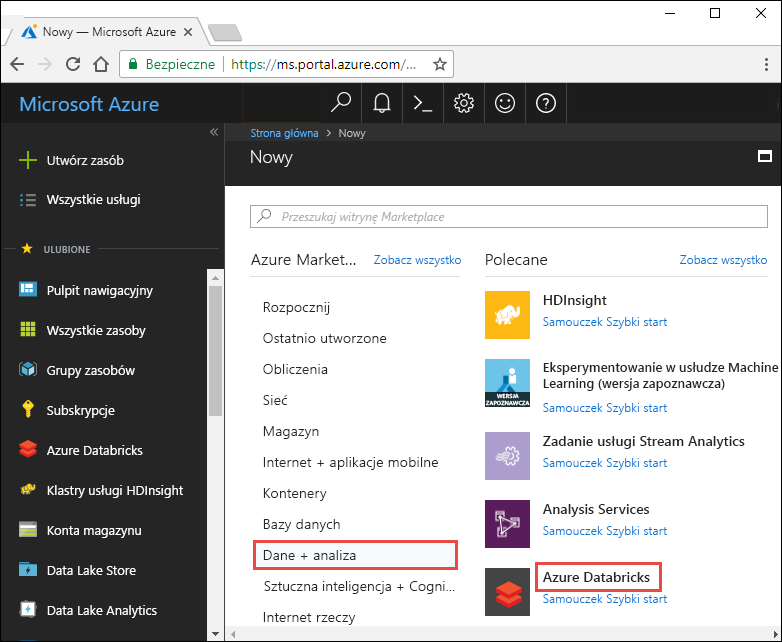
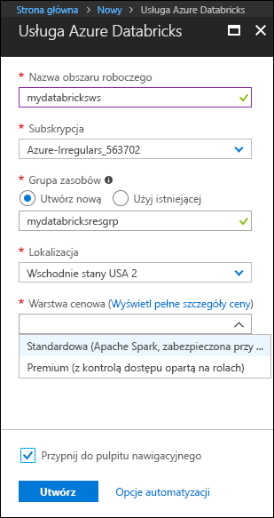
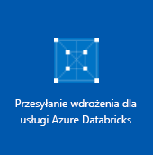
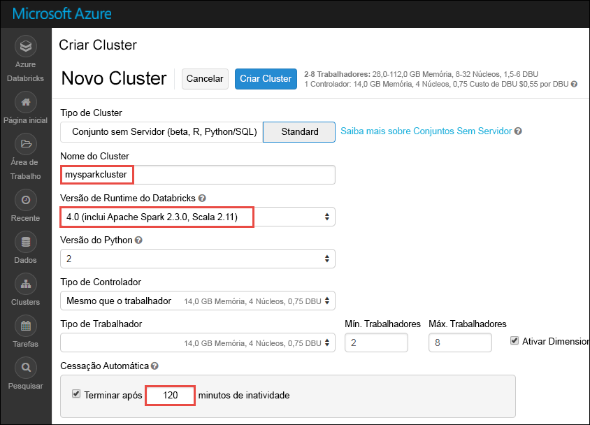

# <a name="quickstart-run-a-spark-job-on-azure-databricks-using-the-azure-portal"></a>Szybki start: uruchamianie zadania Spark w usłudze Azure Databricks przy użyciu witryny Azure Portal

W tym przewodniku szybki start użyjesz Azure Portal, aby utworzyć obszar roboczy Azure Databricks z klastrem Apache Spark. Uruchamiasz zadanie w klastrze i używasz niestandardowych wykresów do tworzenia raportów w czasie rzeczywistym na podstawie danych o bezpieczeństwie Boston.

## <a name="prerequisites"></a>Wymagania wstępne

- Subskrypcja platformy Azure — [Utwórz ją bezpłatnie](https://azure.microsoft.com/free/)

## <a name="sign-in-to-the-azure-portal"></a>Logowanie się do witryny Azure Portal

Zaloguj się w witrynie [Azure Portal](https://portal.azure.com).

> [!Note]
> Tego samouczka nie można przeprowadzić za pomocą **subskrypcji bezpłatnej wersji próbnej platformy Azure**.
> Jeśli masz bezpłatne konto, przejdź do swojego profilu i Zmień subskrypcję na **płatność zgodnie z rzeczywistym**użyciem. Aby uzyskać więcej informacji, zobacz [Bezpłatne konto platformy Azure](https://azure.microsoft.com/free/). Następnie [Usuń limit wydatków](https://docs.microsoft.com/azure/billing/billing-spending-limit#why-you-might-want-to-remove-the-spending-limit)i [Poproś o zwiększenie limitu przydziału](https://docs.microsoft.com/azure/azure-supportability/resource-manager-core-quotas-request) dla procesorów wirtualnych vCPU w Twoim regionie. Podczas tworzenia obszaru roboczego Azure Databricks możesz wybrać warstwę cenową **wersji próbnej (Premium-14-Days Free dBu)** , aby umożliwić dostęp do obszaru roboczego bezpłatnie Azure Databricks DBU przez 14 dni.

## <a name="create-an-azure-databricks-workspace"></a>Tworzenie obszaru roboczego usługi Azure Databricks

W tej sekcji utworzysz obszar roboczy usługi Azure Databricks przy użyciu witryny Azure Portal.

1. W witrynie Azure Portal wybierz pozycję **Utwórz zasób** > **Analiza** > **Azure Databricks**.

    

2. W obszarze **Usługa Azure Databricks** podaj wartości umożliwiające utworzenie obszaru roboczego usługi Databricks.

    

    Podaj następujące wartości:
    
    |Właściwość  |Opis  |
    |---------|---------|
    |**Nazwa obszaru roboczego**     | Podaj nazwę obszaru roboczego usługi Databricks.        |
    |**Subskrypcja**     | Z listy rozwijanej wybierz subskrypcję platformy Azure.        |
    |**Grupa zasobów**     | Określ, czy chcesz utworzyć nową grupę zasobów, czy użyć istniejącej grupy. Grupa zasobów to kontener, który zawiera powiązane zasoby dla rozwiązania platformy Azure. Aby uzyskać więcej informacji, zobacz [Omówienie usługi Azure Resource Manager](../azure-resource-manager/resource-group-overview.md). |
    |**Lokalizacja**     | Wybierz pozycję **Zachodnie stany USA 2**. Inne dostępne regiony podano na stronie [dostępności usług platformy Azure według regionów](https://azure.microsoft.com/regions/services/).        |
    |**Warstwa cenowa**     |  Wybierz warstwę **standardowa**, **Premium**lub **wersja próbna**. Aby uzyskać więcej informacji o tych warstwach, zobacz [stronę usługi Databricks](https://azure.microsoft.com/pricing/details/databricks/).       |
    |**Virtual Network**     |  Wybierz wdrożenie obszaru roboczego Azure Databricks we własnym Virtual Network (VNet). Aby uzyskać więcej informacji, zobacz [wdrażanie Azure Databricks w Virtual Network platformy Azure (iniekcja sieci wirtualnej)](/azure/databricks/administration-guide/cloud-configurations/azure/vnet-inject).        |

    Wybierz pozycję **Utwórz**.

4. Tworzenie obszaru roboczego trwa kilka minut. Podczas tworzenia obszaru roboczego można wyświetlić stan wdrożenia w obszarze **powiadomienia**.

    

## <a name="create-a-spark-cluster-in-databricks"></a>Tworzenie klastra Spark w usłudze Databricks

> [!NOTE]
> Aby użyć bezpłatnego konta do utworzenia klastra usługi Azure Databricks, przed utworzeniem klastra przejdź do swojego profilu i zmień swoją subskrypcję na **płatność zgodnie z rzeczywistym użyciem**. Aby uzyskać więcej informacji, zobacz [Bezpłatne konto platformy Azure](https://azure.microsoft.com/free/).

1. W witrynie Azure Portal przejdź do utworzonego obszaru roboczego usługi Databricks, a następnie kliknij pozycję **Uruchom obszar roboczy**.

2. Nastąpi przekierowanie do portalu usługi Azure Databricks. W portalu kliknij pozycję **nowy klaster**.

    

3. Na stronie **Nowy klaster** podaj wartości, aby utworzyć klaster.

    

    Zaakceptuj pozostałe wartości domyślne poza następującymi:

   * Wprowadź nazwę klastra.
   * W tym artykule należy utworzyć klaster ze środowiskiem uruchomieniowym **5,3** .
   * Upewnij się, że jest zaznaczone pole wyboru **Zakończ po \_\_ min nieaktywności**. Podaj czas (w minutach), po jakim działanie klastra ma zostać zakończone, jeśli nie jest używany.
    
     Wybierz pozycję **Utwórz klaster**. Po uruchomieniu klastra możesz dołączyć do niego notesy i uruchamiać zadania Spark.

Aby uzyskać więcej informacji na temat tworzenia klastrów, zobacz [Create a Spark cluster in Azure Databricks](/azure/databricks/clusters/create) (Tworzenie klastra Spark w usłudze Azure Databricks).

## <a name="run-a-spark-sql-job"></a>Uruchamianie zadania Spark SQL

Wykonaj następujące zadania, aby utworzyć Notes w kostkach danych, skonfigurować Notes, aby odczytywać dane z otwartych zestawów danych platformy Azure, a następnie uruchomić zadanie Spark SQL na danych.

1. W lewym okienku wybierz pozycję **Azure Databricks**. Ze **wspólnych zadań**wybierz pozycję **Nowy Notes**.

    

2. W oknie dialogowym **Tworzenie notesu** wprowadź nazwę, wybierz opcję **Python** jako język i wybierz utworzony wcześniej klaster Spark.

    

    Wybierz pozycję **Utwórz**.

3. W tym kroku utworzysz ramkę Dataframe o bezpieczeństwie Boston z poziomu [otwartych zestawów danych platformy Azure](https://azure.microsoft.com/services/open-datasets/catalog/boston-safety-data/#AzureDatabricks)i używasz języka SQL do wykonywania zapytań dotyczących danych.

   Następujące polecenie ustawia informacje o dostępie do usługi Azure Storage. Wklej ten kod PySpark w pierwszej komórce i Użyj **klawiszy SHIFT + ENTER** , aby uruchomić kod.

   ```python
   blob_account_name = "azureopendatastorage"
   blob_container_name = "citydatacontainer"
   blob_relative_path = "Safety/Release/city=Boston"
   blob_sas_token = r"?st=2019-02-26T02%3A34%3A32Z&se=2119-02-27T02%3A34%3A00Z&sp=rl&sv=2018-03-28&sr=c&sig=XlJVWA7fMXCSxCKqJm8psMOh0W4h7cSYO28coRqF2fs%3D"
   ```

   Następujące polecenie umożliwia platformie Spark odczytywanie danych z magazynu obiektów BLOB zdalnie. Wklej ten kod PySpark do następnej komórki i Użyj **klawiszy SHIFT + ENTER** , aby uruchomić kod.

   ```python
   wasbs_path = 'wasbs://%s@%s.blob.core.windows.net/%s' % (blob_container_name, blob_account_name, blob_relative_path)
   spark.conf.set('fs.azure.sas.%s.%s.blob.core.windows.net' % (blob_container_name, blob_account_name), blob_sas_token)
   print('Remote blob path: ' + wasbs_path)
   ```

   Następujące polecenie tworzy ramkę danych. Wklej ten kod PySpark do następnej komórki i Użyj **klawiszy SHIFT + ENTER** , aby uruchomić kod.

   ```python
   df = spark.read.parquet(wasbs_path)
   print('Register the DataFrame as a SQL temporary view: source')
   df.createOrReplaceTempView('source')
   ```

4. Uruchom instrukcję SQL zwracającą 10 najważniejszych wierszy danych z widoku tymczasowego o nazwie **Źródło**. Wklej ten kod PySpark do następnej komórki i Użyj **klawiszy SHIFT + ENTER** , aby uruchomić kod.

   ```python
   print('Displaying top 10 rows: ')
   display(spark.sql('SELECT * FROM source LIMIT 10'))
   ```

5. Pojawią się tabelaryczne dane wyjściowe, takie jak pokazano na poniższym zrzucie ekranu (przedstawiono tu tylko niektóre kolumny):

    

6. Teraz utworzysz wizualną reprezentację tych danych, aby pokazać, ile zdarzeń związanych z bezpieczeństwem jest raportowanych za pomocą aplikacji do łączenia się z aplikacjami i pracownikami, a nie innymi źródłami. W dolnej części danych wyjściowych tabelarycznych wybierz ikonę **wykresu słupkowego** , a następnie kliknij pozycję **Opcje**wykresów.

    

8. W obszarze **Dostosowywanie wykresu** przeciągnij i upuść wartości, jak pokazano na zrzucie ekranu.

    

   * Ustaw **klucze** na **Źródło**.
   * Ustaw **wartości** na **< \id >** .
   * W obszarze **Agregacja** ustaw wartość **LICZBA**.
   * Ustaw **Typ wyświetlania** na **Wykres kołowy**.

     Kliknij przycisk **zastosować**.

## <a name="clean-up-resources"></a>Oczyszczanie zasobów

Gdy skończysz korzystać z tego artykułu, możesz zakończyć działanie klastra. Aby to zrobić, w obszarze roboczym usługi Azure Databricks wybierz pozycję **Klastry** w lewym okienku. W obszarze klastra, którego działanie chcesz zakończyć, przesuń kursor na wielokropek w kolumnie **Akcje**, a następnie wybierz ikonę **Zakończ**.


Jeśli nie zakończysz działania klastra ręcznie, zostanie on automatycznie zatrzymany, o ile podczas tworzenia klastra zaznaczono pole wyboru **Zakończ po \_\_ min nieaktywności**. W takim przypadku nieaktywny klaster automatycznie zatrzymuje się po określonym czasie.

## <a name="next-steps"></a>Następne kroki

W tym artykule został utworzony klaster Spark w Azure Databricks i uruchomiono zadanie Spark przy użyciu danych z usługi Azure Open DataSets. Aby dowiedzieć się, jak zaimportować dane z innych źródeł danych do usługi Azure Databricks, zobacz [Spark data sources](/azure/databricks/data/data-sources/index) (Źródła danych platformy Spark). Przejdź do następnego artykułu, aby dowiedzieć się, jak wykonać operację ETL (wyodrębnianie, przekształcanie i ładowanie danych) przy użyciu usługi Azure Databricks.

> [!div class="nextstepaction"]
>[Wyodrębnianie, przekształcanie i ładowanie danych przy użyciu usługi Azure Databricks](databricks-extract-load-sql-data-warehouse.md)
