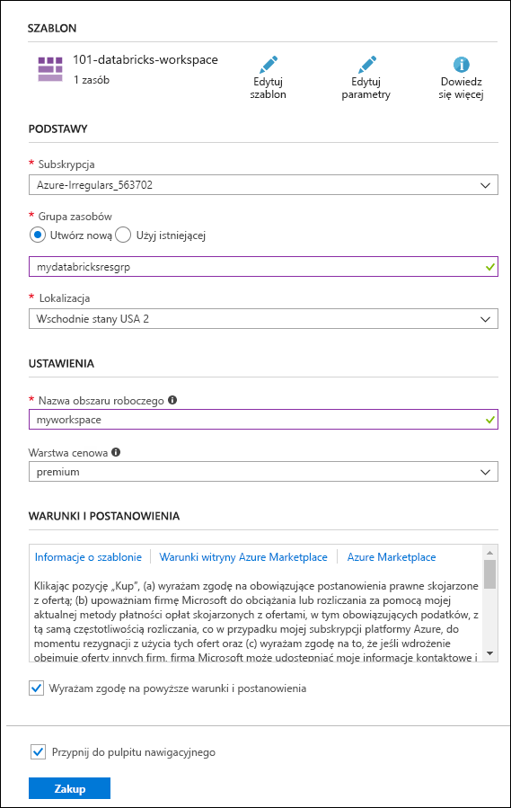

# <a name="quickstart-run-a-spark-job-on-azure-databricks-using-the-azure-resource-manager-template"></a>Szybki start: Uruchamianie zadania Spark w usłudze Azure Databricks przy użyciu szablonu usługi Resource Manager

W tym przewodniku szybki start użyjesz szablonu Azure Resource Manager, aby utworzyć obszar roboczy Azure Databricks z klastrem Apache Spark. Uruchamiasz zadanie w klastrze i korzystasz z wykresów niestandardowych do tworzenia raportów w czasie rzeczywistym na podstawie bezpłatnych i płatnych zastosowań na mocy demograficznej.

## <a name="prerequisites"></a>Wymagania wstępne

- Subskrypcja platformy Azure — [Utwórz ją bezpłatnie](https://azure.microsoft.com/free/)

## <a name="sign-in-to-the-azure-portal"></a>Logowanie się do witryny Azure Portal

Zaloguj się do [portalu Azure](https://portal.azure.com). 

> [!Note]
> Tego samouczka nie można przeprowadzić za pomocą **subskrypcji bezpłatnej wersji próbnej platformy Azure**.
> Jeśli masz bezpłatne konto, przejdź do swojego profilu i Zmień subskrypcję na **płatność zgodnie z rzeczywistym**użyciem. Aby uzyskać więcej informacji, zobacz [Bezpłatne konto platformy Azure](https://azure.microsoft.com/free/). Następnie [Usuń limit wydatków](https://docs.microsoft.com/azure/billing/billing-spending-limit#why-you-might-want-to-remove-the-spending-limit)i [Poproś o zwiększenie limitu przydziału](https://docs.microsoft.com/azure/azure-portal/supportability/resource-manager-core-quotas-request) dla procesorów wirtualnych vCPU w Twoim regionie. Podczas tworzenia obszaru roboczego Azure Databricks możesz wybrać warstwę cenową **wersji próbnej (Premium-14-Days Free dBu)** , aby umożliwić dostęp do obszaru roboczego bezpłatnie Azure Databricks DBU przez 14 dni.

## <a name="create-an-azure-databricks-workspace"></a>Tworzenie obszaru roboczego usługi Azure Databricks

W tej sekcji utworzysz obszar roboczy usługi Azure Databricks przy użyciu szablonu usługi Azure Resource Manager.

1. Kliknij poniższy obraz, aby otworzyć szablon w usłudze Azure Portal.

   <a href="https://portal.azure.com/#create/Microsoft.Template/uri/https%3A%2F%2Fraw.githubusercontent.com%2FAzure%2Fazure-quickstart-templates%2Fmaster%2F101-databricks-workspace%2Fazuredeploy.json" target="_blank"></a>

2. Podaj wymagane wartości, aby utworzyć obszar roboczy usługi Azure Databricks.

   

   Podaj następujące wartości:

   |Właściwość  |Opis  |
   |---------|---------|
   |**Subskrypcja**     | Z listy rozwijanej wybierz subskrypcję platformy Azure.        |
   |**Grupa zasobów**     | Określ, czy chcesz utworzyć nową grupę zasobów, czy użyć istniejącej grupy. Grupa zasobów to kontener, który zawiera powiązane zasoby dla rozwiązania platformy Azure. Aby uzyskać więcej informacji, zobacz [Omówienie usługi Azure Resource Manager](../azure-resource-manager/management/overview.md). |
   |**Lokalizacja**     | Wybierz pozycję **East US 2** (Wschodnie stany USA 2). Inne dostępne regiony podano na stronie [dostępności usług platformy Azure według regionów](https://azure.microsoft.com/regions/services/).        |
   |**Nazwa obszaru roboczego**     | Podaj nazwę obszaru roboczego usługi Databricks.        |
   |**Warstwa cenowa**     |  Wybierz warstwę **Standardowa** lub **Premium**. Aby uzyskać więcej informacji o tych warstwach, zobacz [stronę usługi Databricks](https://azure.microsoft.com/pricing/details/databricks/).       |

3. Wybierz pozycję **Wyrażam zgodę na powyższe warunki i postanowienia** i pozycję **Przypnij do pulpitu nawigacyjnego**, a następnie kliknij przycisk **Kup**.

4. Tworzenie obszaru roboczego trwa kilka minut. Podczas tworzenia obszaru roboczego po prawej stronie portalu jest wyświetlany kafelek **Przesyłanie wdrożenia dla usługi Azure Databricks**. Aby go zobaczyć, być może trzeba będzie przesunąć pulpit nawigacyjny w prawo. W górnej części ekranu jest również wyświetlany pasek postępu. Postęp można obserwować w dowolnym z tych obszarów.

   

## <a name="create-a-spark-cluster-in-databricks"></a>Tworzenie klastra Spark w usłudze Databricks

1. W witrynie Azure Portal przejdź do utworzonego obszaru roboczego usługi Databricks, a następnie kliknij pozycję **Uruchom obszar roboczy**.

2. Nastąpi przekierowanie do portalu usługi Azure Databricks. W portalu kliknij pozycję **Klaster**.

   

3. Na stronie **Nowy klaster** podaj wartości, aby utworzyć klaster.

   

   Zaakceptuj pozostałe wartości domyślne poza następującymi:

   * Wprowadź nazwę klastra.
   * W tym artykule należy utworzyć klaster ze środowiskiem uruchomieniowym **4.0**.
   * Upewnij się, że jest zaznaczone pole wyboru **Zakończ po \_\_ min nieaktywności**. Podaj czas (w minutach), po jakim działanie klastra ma zostać zakończone, jeśli nie jest używany.

   Wybierz pozycję **Utwórz klaster**. Po uruchomieniu klastra możesz dołączyć do niego notesy i uruchamiać zadania Spark.

Aby uzyskać więcej informacji na temat tworzenia klastrów, zobacz [Create a Spark cluster in Azure Databricks](/azure/databricks/clusters/create) (Tworzenie klastra Spark w usłudze Azure Databricks).

## <a name="run-a-spark-sql-job"></a>Uruchamianie zadania Spark SQL

Przed przystąpieniem do pracy z tą sekcją musisz zapewnić spełnienie następujących wymagań wstępnych:

* [Utwórz konto usługi Azure Blob Storage](../storage/common/storage-quickstart-create-account.md).
* Pobierz przykładowy plik JSON [z usługi GitHub](https://github.com/Azure/usql/blob/master/Examples/Samples/Data/json/radiowebsite/small_radio_json.json).
* Przekaż ten przykładowy plik JSON na utworzone konto usługi Azure Blob Storage. Do przekazywania plików możesz używać [Eksploratora usługi Microsoft Azure Storage](../vs-azure-tools-storage-manage-with-storage-explorer.md).

Wykonaj poniższe kroki, aby utworzyć notes w usłudze Databricks, skonfigurować odczytywanie za jego pomocą danych z konta usługi Azure Blob Storage, a następnie uruchomić zadanie Spark SQL na tych danych.

1. W okienku po lewej stronie kliknij pozycję **Obszar roboczy**. Na liście rozwijanej **Obszar roboczy** kliknij pozycję **Utwórz**, a następnie kliknij pozycję **Notes**.

   

2. W oknie dialogowym **Tworzenie notesu** wpisz nazwę, wybierz jako język pozycję **Scala** i wybierz utworzony wcześniej klaster Spark.

   

   Kliknij przycisk **Utwórz**.

3. W tym kroku skojarz konto usługi Azure Storage z klastrem Spark usługi Databricks. Istnieją dwa sposoby osiągnięcia tego: zainstalowanie konta usługi Azure Storage w systemie plików usługi Databricks (DBFS) lub bezpośredni dostęp do konta usługi Azure Storage z utworzonej aplikacji.

   > [!IMPORTANT]
   >W tym artykule wykorzystano podejście **instalowania magazynu z systemem plików DBFS**. Takie podejście zapewnia, że zainstalowany magazyn zostanie skojarzony z samym systemem plików klastra. W związku z tym każda aplikacja uzyskująca dostęp do klastra jest również w stanie skorzystać ze skojarzonego magazynu. Podejście bezpośredniego dostępu jest ograniczone do aplikacji, z poziomu której został skonfigurowany dostęp.
   >
   > Aby użyć podejścia instalowania, musisz utworzyć klaster Spark z wersją środowiska uruchomieniowego usługi Databricks **4.0**, które zostało wybrane w tym artykule.

   W poniższym fragmencie kodu zastąp `{YOUR CONTAINER NAME}`, `{YOUR STORAGE ACCOUNT NAME}` i `{YOUR STORAGE ACCOUNT ACCESS KEY}` odpowiednimi wartościami dla konta usługi Azure Storage. Wklej ten fragment w pustej komórce w notesie, a następnie naciśnij klawisze SHIFT+ENTER, aby uruchomić komórkę kodu.

   * **Zainstaluj konto magazynu z DBFS (zalecane)** . W tym fragmencie kodu ścieżka konta usługi Azure Storage jest instalowana w `/mnt/mypath`. Dlatego we wszystkich przyszłych wystąpieniach, gdzie uzyskujesz dostęp do konta usługi Azure Storage, nie trzeba podawać pełnej ścieżki. Wystarczy użyć `/mnt/mypath`.

          dbutils.fs.mount(
            source = "wasbs://{YOUR CONTAINER NAME}@{YOUR STORAGE ACCOUNT NAME}.blob.core.windows.net/",
            mountPoint = "/mnt/mypath",
            extraConfigs = Map("fs.azure.account.key.{YOUR STORAGE ACCOUNT NAME}.blob.core.windows.net" -> "{YOUR STORAGE ACCOUNT ACCESS KEY}"))

   * **Bezpośredni dostęp do konta magazynu**

          spark.conf.set("fs.azure.account.key.{YOUR STORAGE ACCOUNT NAME}.blob.core.windows.net", "{YOUR STORAGE ACCOUNT ACCESS KEY}")

     Aby uzyskać informacje na temat pobierania kluczy dostępu do konta magazynu, zobacz [Zarządzanie kluczami dostępu do konta magazynu](../storage/common/storage-account-keys-manage.md).

   > [!NOTE]
   > Z klastrem Spark w usłudze Azure Databricks można również używać usługi Azure Data Lake Store. Aby uzyskać instrukcje, zobacz [Use Data Lake Store with Azure Databricks](/azure/databricks/data/data-sources/azure/azure-datalake-gen2) (Używanie usługi Data Lake Store z usługą Azure Databricks).

4. Uruchom instrukcję SQL, aby utworzyć tabelę tymczasową przy użyciu danych z przykładowego pliku danych JSON, **small_radio_json.json**. W poniższym fragmencie kodu zamień wartości symboli zastępczych na właściwe nazwy kontenera i konta magazynu. Wklej ten fragment w komórce kodu w notesie, a następnie naciśnij klawisze SHIFT+ENTER. W tym fragmencie element `path` wskazuje lokalizację przykładowego pliku JSON przekazanego na konto usługi Azure Storage.

   ```sql
   %sql
   DROP TABLE IF EXISTS radio_sample_data;
   CREATE TABLE radio_sample_data
   USING json
   OPTIONS (
    path "/mnt/mypath/small_radio_json.json"
   )
   ```

   Po pomyślnym wykonaniu polecenia wszystkie dane z pliku JSON znajdą się w tabeli w klastrze usługi Databricks.

   Magiczne polecenie języka `%sql` umożliwia uruchamianie kodu SQL z notesu, nawet jeśli notes jest innego typu. Aby uzyskać więcej informacji, zobacz [Mixing languages in a notebook](/azure/databricks/notebooks/index) (Łączenie języków w notesie).

5. Przyjrzyjmy się migawce przykładowych danych JSON, aby lepiej zrozumieć uruchamiane zapytanie. Wklej poniższy fragment kodu w komórce kodu i naciśnij klawisze **SHIFT+ENTER**.

   ```sql
   %sql
   SELECT * from radio_sample_data
   ```

6. Pojawią się tabelaryczne dane wyjściowe, takie jak pokazano na poniższym zrzucie ekranu (przedstawiono tu tylko niektóre kolumny):

   

   W danych przykładowych jest rejestrowana między innymi płeć odbiorców kanału radiowego (nazwa kolumny **gender** — „płeć”) i informacja o tym, czy subskrypcja jest bezpłatna, czy płatna (nazwa kolumny **level** — „poziom”).

7. Teraz utworzysz reprezentację wizualną tych danych w celu pokazania, ilu użytkowników każdej płci ma konta bezpłatne, a ilu opłaca subskrypcję. U dołu tabelarycznych danych wyjściowych kliknij ikonę **Wykres słupkowy**, a następnie pozycję **Opcje wykresu**.

   

8. W obszarze **Dostosowywanie wykresu** przeciągnij i upuść wartości, jak pokazano na zrzucie ekranu.

   

   * W obszarze **Klucze** ustaw wartość **gender** (płeć).
   * W obszarze **Grupowania serii** ustaw wartość **level** (poziom).
   * W obszarze **Wartości** ustaw wartość **level** (poziom).
   * W obszarze **Agregacja** ustaw wartość **LICZBA**.

   Kliknij przycisk **Zastosuj**.

9. Wynikiem będzie reprezentacja wizualna przedstawiona na zrzucie ekranu:

   

## <a name="clean-up-resources"></a>Oczyszczanie zasobów

Gdy skończysz korzystać z tego artykułu, możesz zakończyć działanie klastra. Aby to zrobić, w obszarze roboczym usługi Azure Databricks wybierz pozycję **Klastry** w lewym okienku. W obszarze klastra, którego działanie chcesz zakończyć, przesuń kursor na wielokropek w kolumnie **Akcje**, a następnie wybierz ikonę **Zakończ**.


Jeśli nie zakończysz działania klastra ręcznie, zostanie on automatycznie zatrzymany, o ile podczas tworzenia klastra zaznaczono pole wyboru **Zakończ po \_\_ min nieaktywności**. W takim przypadku nieaktywny klaster automatycznie zatrzymuje się po określonym czasie.

## <a name="next-steps"></a>Następne kroki

W tym artykule został utworzony klaster Spark w usłudze Azure Databricks i przy użyciu danych w usłudze Azure Storage zostało uruchomione zadanie Spark. Aby dowiedzieć się, jak zaimportować dane z innych źródeł danych do usługi Azure Databricks, zobacz [Spark data sources](/azure/databricks/data/data-sources/index) (Źródła danych platformy Spark). Możesz również przyjrzeć się szablonowi usługi Resource Manager, aby [utworzyć obszar roboczy usługi Azure Databricks z niestandardowym adresem sieci wirtualnej](https://github.com/Azure/azure-quickstart-templates/tree/master/101-databricks-workspace-with-custom-vnet-address). Aby zapoznać się z właściwościami i składnią języka JSON, których należy użyć w szablonie, zobacz odwołanie do szablonu [Microsoft.Databricks/workspaces](/azure/templates/microsoft.databricks/workspaces).

Przejdź do następnego artykułu, aby dowiedzieć się, jak wykonać operację ETL (wyodrębnianie, przekształcanie i ładowanie danych) przy użyciu usługi Azure Databricks.

> [!div class="nextstepaction"]
> [Wyodrębnianie, przekształcanie i ładowanie danych przy użyciu usługi Azure Databricks](databricks-extract-load-sql-data-warehouse.md)
