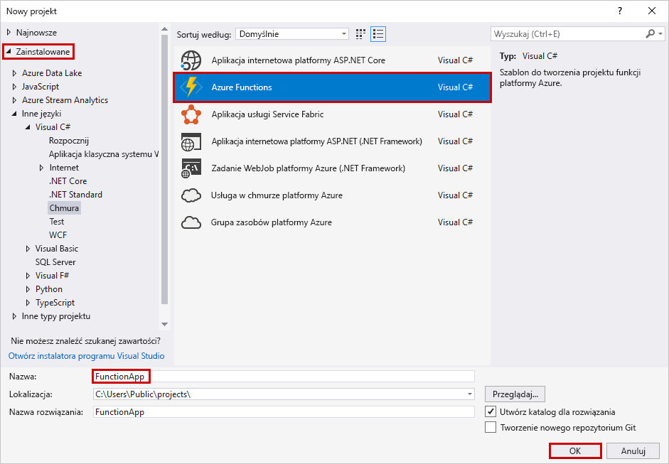
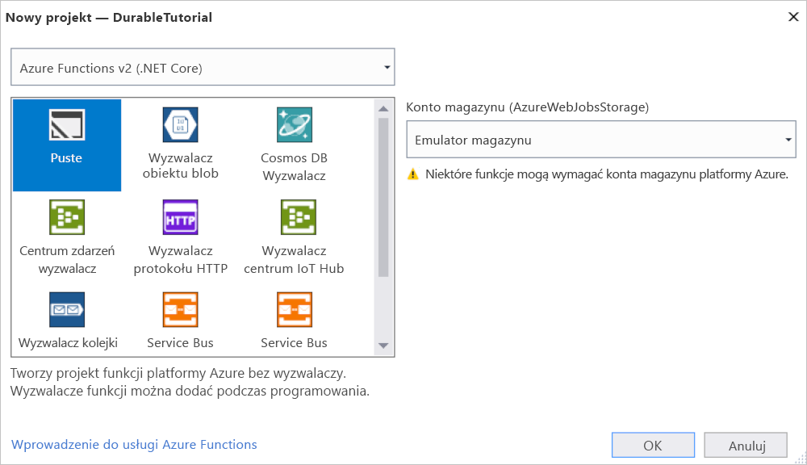
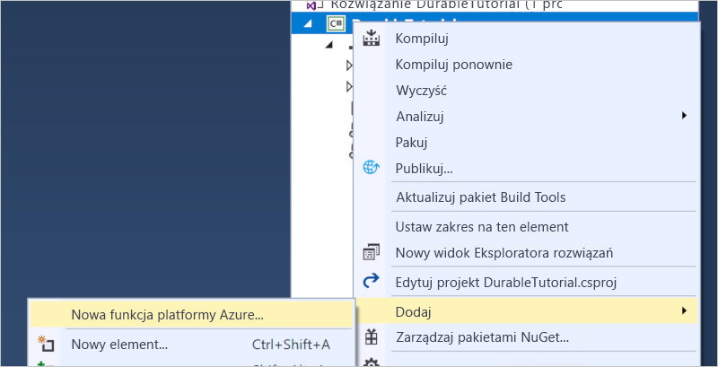
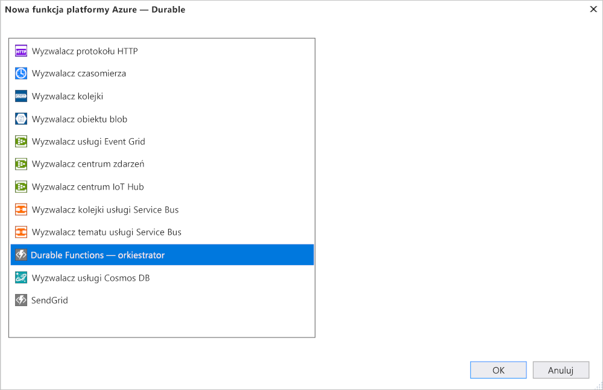

# <a name="create-your-first-durable-function-in-c"></a>Tworzenie pierwszej funkcji trwałej w języku C\#

*Durable Functions* to rozszerzenie usługi [Azure Functions](../functions-overview.md) umożliwiające zapisywanie funkcji stanowych w środowisku bezserwerowym. Rozszerzenie zarządza stanem, punktami kontrolnymi i ponownym uruchamianiem.

[!INCLUDE [v1-note](../../../includes/functions-durable-v1-tutorial-note.md)]

W tym artykule dowiesz się, jak używać programu Visual Studio 2019 do lokalnego tworzenia i testowania trwałej funkcji "Hello World".  Ta funkcja aranżuje i łączy w łańcuchy wywołania do innych funkcji. Kod funkcji zostanie następnie opublikowany na platformie Azure. Te narzędzia są dostępne w ramach obciążeń programistycznych platformy Azure w programie Visual Studio 2019.


## <a name="prerequisites"></a>Wymagania wstępne

W celu ukończenia tego samouczka:

* Zainstaluj [program Visual Studio 2019](https://visualstudio.microsoft.com/vs/). Upewnij się, że obciążenie **programowanie na platformie Azure** jest również instalowane. Program Visual Studio 2017 obsługuje także programowanie Durable Functions, ale interfejs użytkownika i kroki różnią się.

* Sprawdź, czy zainstalowano i uruchomiono [emulator magazynu Azure](../../storage/common/storage-use-emulator.md).

[!INCLUDE [quickstarts-free-trial-note](../../../includes/quickstarts-free-trial-note.md)]

## <a name="create-a-function-app-project"></a>Tworzenie projektu aplikacji funkcji

Szablon projektu usługi Azure Functions umożliwia utworzenie projektu, który można opublikować w aplikacji funkcji na platformie Azure. Aplikacja funkcji umożliwia grupowanie funkcji w jednostki logiczne, co ułatwia wdrażanie i udostępnianie zasobów oraz zarządzanie nimi.

1. W programie Visual Studio wybierz pozycję **Nowy** > **Projekt** z menu **Plik**.

1. W oknie dialogowym **Dodawanie nowego projektu** Wyszukaj `functions`, wybierz szablon **Azure Functions** i wybierz przycisk **dalej**. 

    

1. Wpisz **nazwę projektu** , a następnie wybierz **przycisk OK**. Nazwa projektu musi być prawidłowa jako C# przestrzeń nazw, dlatego nie należy używać podkreśleń, łączników ani żadnych innych znaków niealfanumerycznych.

1. W obszarze **Utwórz nową aplikację Azure Functions**Użyj ustawień określonych w tabeli, która następuje po obrazie.

    

    | Ustawienie      | Sugerowana wartość  | Opis                      |
    | ------------ |  ------- |----------------------------------------- |
    | **Wersja** | Azure Functions 2,0 <br />(.NET Core) | Tworzy projekt funkcji, który używa środowiska uruchomieniowego w wersji 2,0 dla Azure Functions, który obsługuje program .NET Core. Azure Functions 1,0 obsługuje .NET Framework. Aby uzyskać więcej informacji, zobacz [How to target Azure Functions runtime version (Wybieranie wersji środowiska uruchomieniowego usługi Azure Functions)](../functions-versions.md).   |
    | **Szablon** | Pusty | Tworzy pustą aplikację funkcji. |
    | **Konto magazynu**  | Emulator magazynu | Konto magazynu jest wymagane do zarządzania stanem funkcji trwałej. |

4. Wybierz pozycję **Utwórz** , aby utworzyć pusty projekt funkcji. Ten projekt zawiera pliki konfiguracji podstawowej wymagane do uruchomienia Twoich funkcji.

## <a name="add-functions-to-the-app"></a>Dodawanie funkcji do aplikacji

Poniższe kroki używają szablonu do tworzenia trwałego kodu funkcji w projekcie.

1. Kliknij prawym przyciskiem myszy projekt w programie Visual Studio i wybierz polecenie **Dodaj** > **Nowa funkcja platformy Azure**.

    

1. Sprawdź, czy **Funkcja platformy Azure** została wybrana z menu Dodaj, wpisz nazwę C# pliku, a następnie wybierz pozycję **Dodaj**.

1. Wybierz szablon **Durable Functions aranżacji** , a następnie wybierz przycisk **OK** .

      

> [!NOTE]
> Ten szablon obecnie tworzy funkcję trwałą przy użyciu starszej wersji 1. x rozszerzenia. Zobacz artykuł dotyczący [wersji Durable Functions](durable-functions-versions.md) , aby uzyskać informacje na temat uaktualniania do nowszej wersji programu Durable Functions. x.

Nowa trwała funkcja jest dodawana do aplikacji.  Otwórz nowy plik cs, aby wyświetlić jego zawartość. Ta trwała funkcja jest prostym przykładem łączenia funkcji w łańcuch przy użyciu następujących metod:  

| Metoda | FunctionName | Opis |
| -----  | ------------ | ----------- |
| **`RunOrchestrator`** | `<file-name>` | Zarządza trwałą aranżacją. W tym przypadku aranżacja się rozpoczyna, tworzy listę i dodaje wynik trzech wywołań funkcji do listy.  Po ukończeniu trzech wywołań funkcji zwraca listę. |
| **`SayHello`** | `<file-name>_Hello` | Funkcja zwraca hello. Jest to funkcja, która zawiera logikę biznesową, która jest poddana aranżacji. |
| **`HttpStart`** | `<file-name>_HttpStart` | [Funkcja wyzwalana przez protokół HTTP](../functions-bindings-http-webhook.md), która uruchamia wystąpienie aranżacji i zwraca odpowiedź stanu kontroli. |

Po utworzeniu projektu funkcji i funkcji trwałej można ją przetestować na komputerze lokalnym.

## <a name="test-the-function-locally"></a>Lokalne testowanie funkcji

Podstawowe narzędzia usługi Azure Functions umożliwiają uruchamianie projektu usługi Azure Functions na lokalnym komputerze deweloperskim. Monit o zainstalowanie tych narzędzi pojawia się przy pierwszym uruchomieniu funkcji w programie Visual Studio.

1. Aby przetestować funkcję, naciśnij klawisz F5. Po wyświetleniu monitu zaakceptuj żądanie programu Visual Studio dotyczące pobrania i zainstalowania podstawowych narzędzi usługi Azure Functions (CLI). Może także być konieczne włączenie wyjątku zapory, aby umożliwić narzędziom obsługę żądań HTTP.

2. Skopiuj adres URL funkcji z danych wyjściowych środowiska uruchomieniowego usługi Azure Functions.

    

3. Wklej adres URL żądania HTTP w pasku adresu przeglądarki i wykonaj żądanie. Na poniższym obrazie przedstawiono wyświetloną w przeglądarce odpowiedź na lokalne żądanie GET zwróconą przez funkcję:

    

    Odpowiedź to początkowy wynik z funkcji HTTP informujący o pomyślnym uruchomieniu aranżacji trwałej.  Nie jest to jeszcze końcowy wynik aranżacji.  Odpowiedź zawiera kilka przydatnych adresów URL.  Na razie wykonajmy zapytanie o stan aranżacji.

4. Skopiuj wartość adresu URL z właściwości `statusQueryGetUri`, wklej ją w pasku adresu przeglądarki i wykonaj żądanie.

    Żądanie wykona zapytanie o stan wystąpienia aranżacji. W końcu powinna zostać zwrócona odpowiedź podobna do następującej.  Dane wyjściowe pokazują, że wystąpienie zostało zakończone i zawiera dane wyjściowe lub wyniki funkcji trwałej.

    ```json
    {
        "instanceId": "d495cb0ac10d4e13b22729c37e335190",
        "runtimeStatus": "Completed",
        "input": null,
        "customStatus": null,
        "output": [
            "Hello Tokyo!",
            "Hello Seattle!",
            "Hello London!"
        ],
        "createdTime": "2019-11-02T07:07:40Z",
        "lastUpdatedTime": "2019-11-02T07:07:52Z"
    }
    ```

5. Aby zatrzymać debugowanie, naciśnij klawisze **Shift+F5**.

Gdy będziesz mieć pewność, że funkcja działa poprawnie na komputerze lokalnym, możesz opublikować projekt na platformie Azure.

## <a name="publish-the-project-to-azure"></a>Publikowanie projektu na platformie Azure

Aby opublikować projekt, musisz mieć aplikację funkcji w swojej subskrypcji platformy Azure. Aplikację funkcji możesz utworzyć bezpośrednio w programie Visual Studio.

[!INCLUDE [Publish the project to Azure](../../../includes/functions-vstools-publish.md)]

## <a name="test-your-function-in-azure"></a>Testowanie funkcji na platformie Azure

1. Skopiuj podstawowy adres URL aplikacji funkcji ze strony profilu publikowania. Część `localhost:port` adresu URL używaną podczas lokalnego testowania funkcji zastąp nowym podstawowym adresem URL.

    Adres URL, który wywołuje wyzwalacz HTTP funkcji trwałej, powinien mieć następujący format:

        http://<APP_NAME>.azurewebsites.net/api/<FUNCTION_NAME>_HttpStart

2. Wklej nowy adres URL żądania HTTP na pasku adresu przeglądarki. Podczas korzystania z opublikowanej aplikacji powinna zostać zwrócona taka sama odpowiedź dotycząca stanu.

## <a name="next-steps"></a>Następne kroki

Utworzono i opublikowano aplikację funkcji trwałej w języku C# za pomocą programu Visual Studio.

> [!div class="nextstepaction"]
> [Dowiedz się więcej na temat typowych wzorców funkcji trwałej](durable-functions-overview.md#application-patterns)