# Tworzenie funkcji wyzwalanej przez usługę Azure Cosmos DB

Dowiedz się, jak utworzyć funkcję wyzwalaną w przypadku dodania lub zmiany danych w usłudze Azure Cosmos DB. Aby uzyskać więcej informacji o usłudze Azure Cosmos DB, zobacz [Azure Cosmos DB: Serverless database computing using Azure Functions](../cosmos-db/serverless-computing-database.md) (Azure Cosmos DB: przetwarzanie danych w bazie danych bez użycia serwera dzięki usłudze Azure Functions).

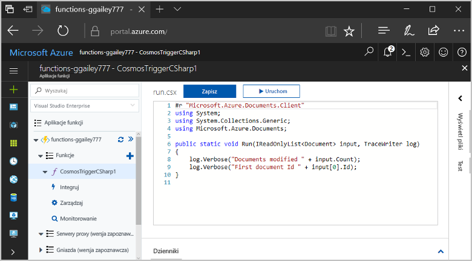

## Wymagania wstępne

W celu ukończenia tego samouczka:

+ Jeśli nie masz subskrypcji platformy Azure, przed rozpoczęciem utwórz [bezpłatne konto](https://azure.microsoft.com/free/?WT.mc_id=A261C142F).

> [!NOTE]
> [!INCLUDE [SQL API support only](../../includes/functions-cosmosdb-sqlapi-note.md)]

## Tworzenie konta usługi Azure Cosmos DB

Do utworzenia wyzwalacza konieczne jest posiadanie konta usługi Azure Cosmos DB, które używa interfejsu API SQL.

[!INCLUDE [cosmos-db-create-dbaccount](../../includes/cosmos-db-create-dbaccount.md)]

## Tworzenie aplikacji funkcji platformy Azure

[!INCLUDE [Create function app Azure portal](../../includes/functions-create-function-app-portal.md)]

Następnie należy utworzyć funkcję w nowej aplikacji funkcji.

## Tworzenie wyzwalacza usługi Azure Cosmos DB

1. Rozwiń aplikację funkcji i kliknij przycisk **+** obok pozycji **Funkcje**. Jeśli jest to pierwsza funkcja w aplikacji funkcji, wybierz pozycję **W portalu**, a następnie opcję **Kontynuuj**. W przeciwnym razie przejdź do kroku trzeciego.

   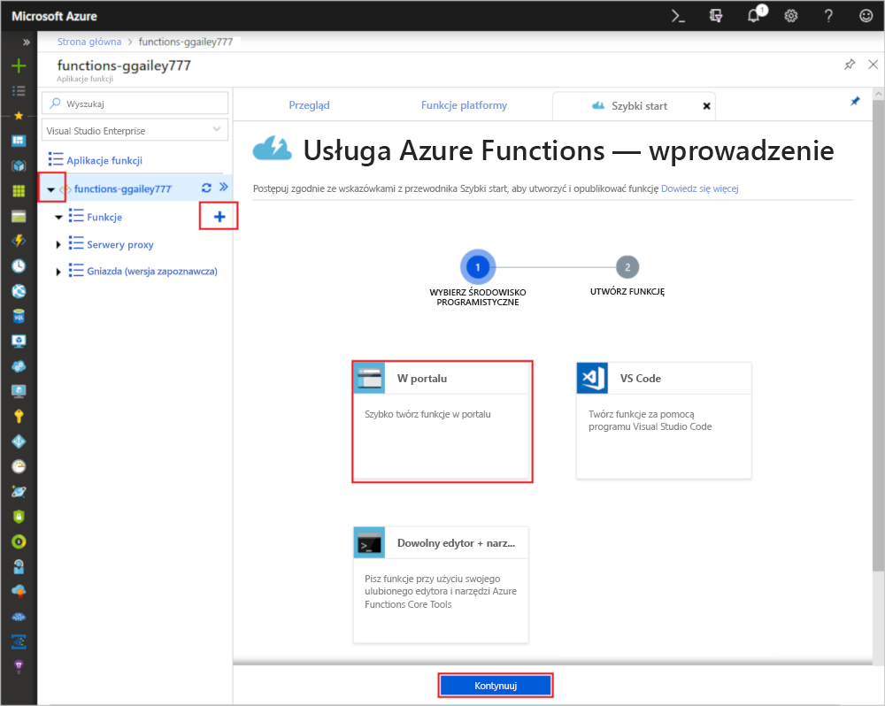

1. Wybierz pozycję **Więcej szablonów**, a następnie pozycję **Zakończ i wyświetl szablony**.

    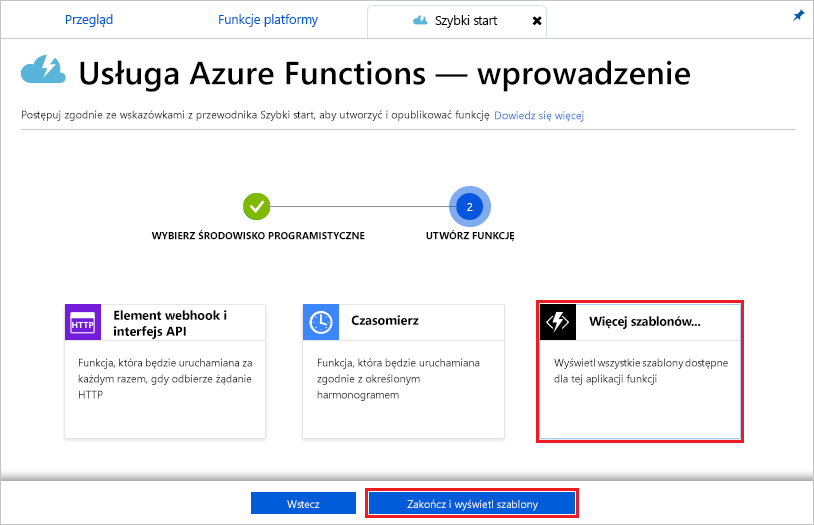

1. W polu wyszukiwania wpisz `cosmos`, a następnie wybierz szablon **Wyzwalacz usługi Azure Cosmos DB**.

1. If prompted, select **Install** to install the Azure Cosmos DB extension in the function app. Po pomyślnym zakończeniu instalacji wybierz pozycję **Kontynuuj**.

    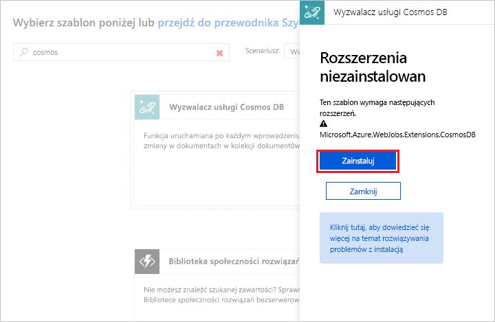

1. Skonfiguruj nowy wyzwalacz, wprowadzając ustawienia określone w tabeli znajdującej się poniżej obrazu.

    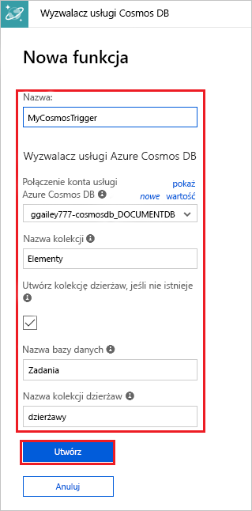

    | Ustawienie      | Sugerowana wartość  | Opis                                |
    | ------------ | ---------------- | ------------------------------------------ |
    | **Nazwa** | Domyślne | Użyj domyślnej nazwy funkcji sugerowanej przez szablon.|
    | **Połączenie konta usługi Azure Cosmos DB** | Nowe ustawienie | Wybierz pozycję **Nowy**, swoją **subskrypcję**, utworzone wcześniej **konto bazy danych** i polecenie **Wybierz**. Spowoduje to utworzenie ustawienia aplikacji na potrzeby połączenia konta. To ustawienie jest używane przez powiązanie do nawiązywania połączenia z bazą danych. |
    | **Nazwa kolekcji** | Items | Nazwa monitorowanej kolekcji. |
    | **Utwórz kolekcję dzierżaw, jeśli nie istnieje** | Zaznaczone | Kolekcja jeszcze nie istnieje, więc należy ją utworzyć. |
    | **Nazwa bazy danych** | Zadania | Nazwa bazy danych zawierającej monitorowaną kolekcję. |

1. Kliknij pozycję **Utwórz**, aby utworzyć funkcję wyzwalaną usługi Azure Cosmos DB. Po utworzeniu funkcji zostanie wyświetlony kod funkcji oparty na szablonie.  

    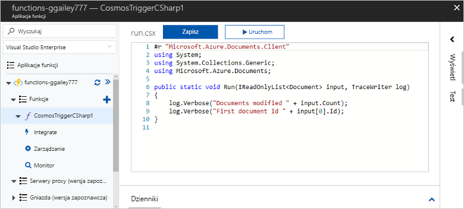

    Ten szablon funkcji zapisuje w dziennikach liczbę dokumentów oraz identyfikator pierwszego dokumentu.

Następnie należy połączyć się z kontem usługi Azure Cosmos DB i utworzyć kolekcję `Items` w bazie danych `Tasks`.

## Tworzenie kolekcji Elementy

1. Otwórz drugie wystąpienie witryny [Azure Portal](https://portal.azure.com) w nowej karcie przeglądarki.

1. Rozwiń pasek ikon po lewej stronie portalu, wpisz ciąg `cosmos` w polu wyszukiwania, a następnie wybierz pozycję **Azure Cosmos DB**.

    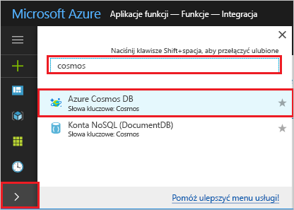

1. Wybierz konto usługi Azure Cosmos DB, a następnie wybierz pozycję **Eksplorator danych**. 

1. W obszarze **Kolekcje** wybierz pozycję **taskDatabase**, a następnie **Nowa kolekcja**.

    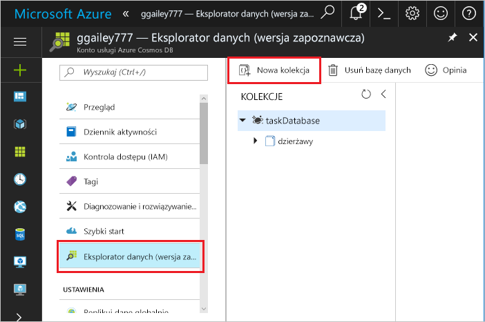

1. W obszarze **Dodawanie kolekcji** wprowadź ustawienia wymienione w tabeli pod ilustracją. 

    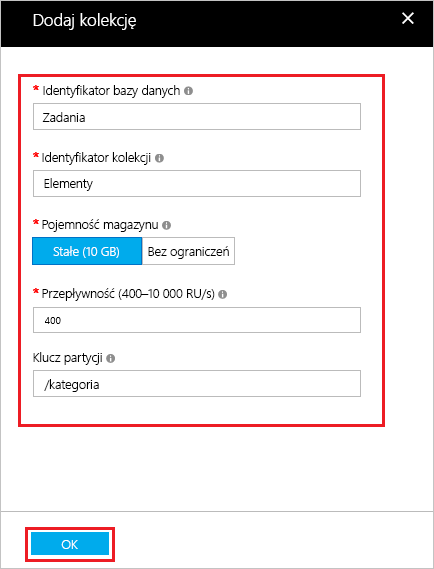

    | Ustawienie|Sugerowana wartość|Opis |
    | ---|---|--- |
    | **Identyfikator bazy danych** | Zadania |Nazwa nowej bazy danych. Musi być zgodna z nazwą zdefiniowaną w powiązaniu funkcji. |
    | **Identyfikator kolekcji** | Items | Nazwa nowej kolekcji. Musi być zgodna z nazwą zdefiniowaną w powiązaniu funkcji.  |
    | **Pojemność magazynu** | Stała (10 GB)|Użyj wartości domyślnej. Ta wartość to pojemność magazynu bazy danych. |
    | **Przepływność** |400 RU| Użyj wartości domyślnej. Jeśli chcesz zmniejszyć opóźnienie, możesz później przeskalować przepływność w górę. |
    | **[Klucz partycji](../cosmos-db/partition-data.md)** | /category|Klucz partycji służący do równomiernego dystrybuowania danych do każdej partycji. Wybór odpowiedniego klucza partycji jest ważny w celu utworzenia wydajnej kolekcji. | 

1. Kliknij przycisk **OK**, aby utworzyć kolekcję Items (Elementy). Tworzenie kolekcji może chwilę potrwać.

Po utworzeniu kolekcji wskazanej w powiązaniu funkcji możesz przetestować funkcję, dodając dokumenty do nowej kolekcji.

## Testowanie funkcji

1. Rozwiń nową kolekcję **taskCollection** w Eksploratorze danych, a następnie wybierz kolejno pozycje **Dokumenty** i **Nowy dokument**.

    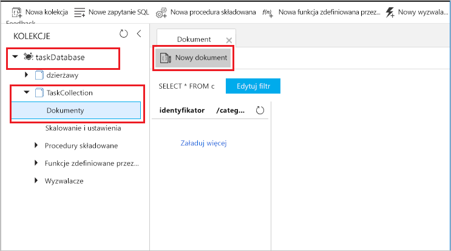

1. Zastąp zawartość nowego dokumentu następującą zawartością, a następnie wybierz pozycję **Zapisz**.

        {
            "id": "task1",
            "category": "general",
            "description": "some task"
        }

1. Przejdź do pierwszej karty przeglądarki, zawierającej funkcję w portalu. Rozwiń dzienniki funkcji i sprawdź, czy nowy dokument spowodował wyzwolenie funkcji. Zobaczysz, że wartość identyfikatora dokumentu `task1` jest zapisana w dziennikach. 

    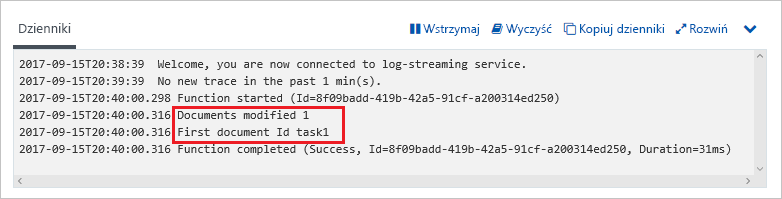

1. (Opcjonalnie) Wróć do dokumentu, wprowadź zmianę i kliknij pozycję **Aktualizuj**. Następnie wróć do dzienników funkcji i sprawdź, czy aktualizacja również spowodowała wyzwolenie funkcji.

## Oczyszczanie zasobów

[!INCLUDE [Next steps note](../../includes/functions-quickstart-cleanup.md)]

## Następne kroki

Utworzono funkcję uruchamianą w przypadku dodania lub zmodyfikowania dokumentu w usłudze Azure Cosmos DB. Aby uzyskać więcej informacji na temat wyzwalaczy bazy danych Azure Cosmos DB, zobacz [Azure Cosmos DB bindings for Azure Functions](functions-bindings-cosmosdb.md) (Powiązania bazy danych Azure Cosmos DB na potrzeby usługi Azure Functions).

[!INCLUDE [Next steps note](../../includes/functions-quickstart-next-steps.md)]
