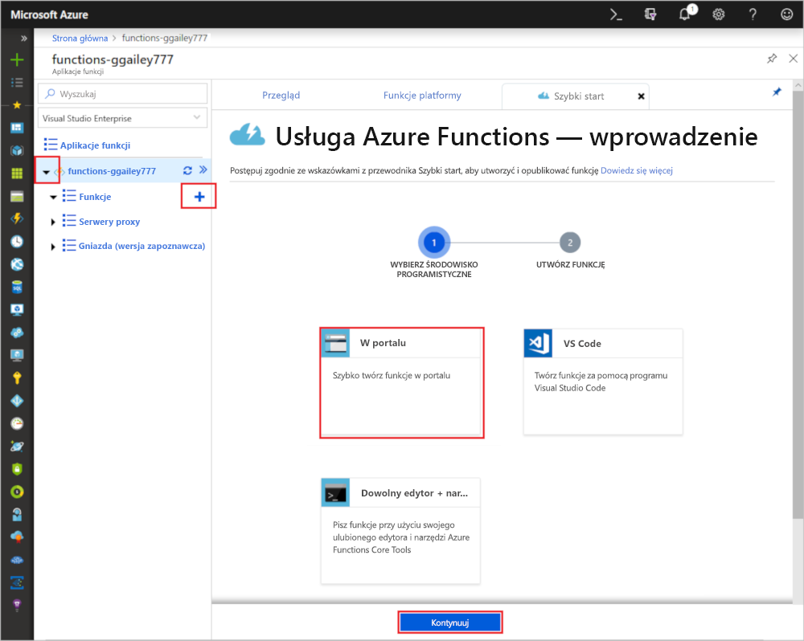
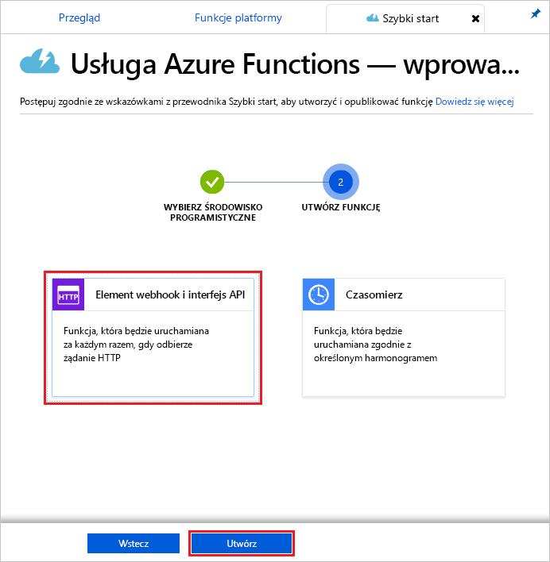
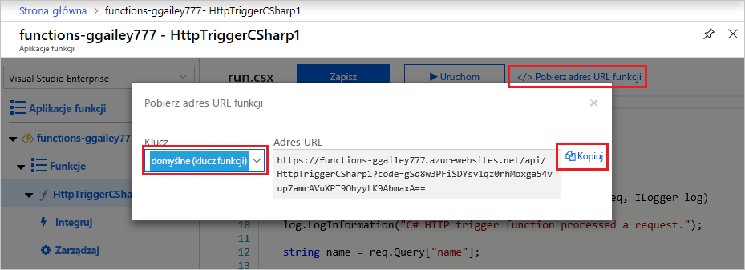
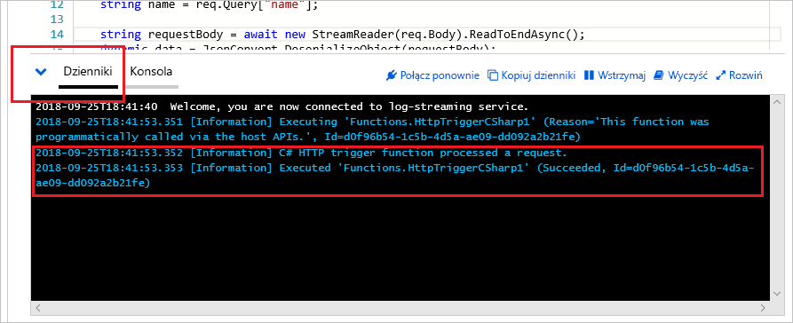

# Tworzenie pierwszej funkcji w witrynie Azure Portal

Usługa Azure Functions umożliwia wykonywanie kodu w środowisku [bezserwerowym](https://azure.microsoft.com/solutions/serverless/) bez konieczności uprzedniego tworzenia maszyny wirtualnej lub publikowania aplikacji internetowej. W tym temacie opisano tworzenie funkcji „hello world” w witrynie Azure Portal przy użyciu usługi Functions.

[!INCLUDE [quickstarts-free-trial-note](../../includes/quickstarts-free-trial-note.md)]

> [!NOTE]
> Deweloperzy języka C# powinni rozważyć [utworzenie pierwszej funkcji w programie Visual Studio 2017](functions-create-your-first-function-visual-studio.md) zamiast w portalu. 

## Zaloguj się do platformy Azure.

Zaloguj się do witryny Azure Portal pod adresem <https://portal.azure.com> przy użyciu danych konta Azure.

## Tworzenie aplikacji funkcji

Do obsługi wykonywania funkcji potrzebna jest aplikacja funkcji. Aplikacja funkcji umożliwia grupowanie funkcji jako jednostki logicznej, co ułatwia wdrażanie i udostępnianie zasobów oraz zarządzanie nimi. 

[!INCLUDE [Create function app Azure portal](../../includes/functions-create-function-app-portal.md)]

Następnie należy utworzyć funkcję w nowej aplikacji funkcji.

## Tworzenie funkcji wyzwalanej przez protokół HTTP

1. Rozwiń nową aplikację funkcji, a następnie wybierz przycisk **+** obok opcji **Functions**, wybierz opcję **W portalu** i wybierz opcję **Kontynuuj**.

    

1. Wybierz opcję **Element WebHook + interfejs API**, a następnie wybierz opcję **Utwórz**.

    

Funkcja zostanie utworzona przy użyciu szablonu funkcji wyzwalanej przez protokół HTTP właściwego dla danego języka.

Możesz teraz uruchomić nową funkcję, wysyłając żądanie HTTP.

## Testowanie funkcji

1. W nowej funkcji kliknij pozycję **</> Pobierz adres URL funkcji** w prawym górnym rogu, wybierz pozycję **domyślne (klawisz funkcji)**, a następnie kliknij pozycję **Kopiuj**. 

    

2. Wklej adres URL funkcji do paska adresu przeglądarki. Dodaj wartość ciągu zapytania `&name=<yourname>` na końcu tego adresu URL, a następnie naciśnij klawisz `Enter` na klawiaturze, aby wykonać żądanie. W przeglądarce powinna zostać wyświetlona odpowiedź zwrócona przez funkcję.  

    Poniższy przykład przedstawia odpowiedź w przeglądarce:

    

    Adres URL żądania zawiera klucz, który domyślnie jest wymagany do uzyskania dostępu do funkcji za pośrednictwem protokołu HTTP.

3. Gdy funkcja działa, informacje o śledzeniu są zapisywane w dziennikach. Aby wyświetlić dane wyjściowe śledzenia z poprzedniego wykonania, wróć do funkcji w portalu, a następnie kliknij strzałkę w dół w dolnej części ekranu, aby rozwinąć pozycję **Dzienniki**.

   

## Oczyszczanie zasobów

[!INCLUDE [Clean-up resources](../../includes/functions-quickstart-cleanup.md)]

## Kolejne kroki

Utworzono aplikację funkcji z prostą funkcją wyzwalaną przez protokół HTTP.  

[!INCLUDE [Next steps note](../../includes/functions-quickstart-next-steps.md)]

Aby uzyskać więcej informacji, zobacz [Powiązania protokołu HTTP w usłudze Azure Functions](functions-bindings-http-webhook.md).
