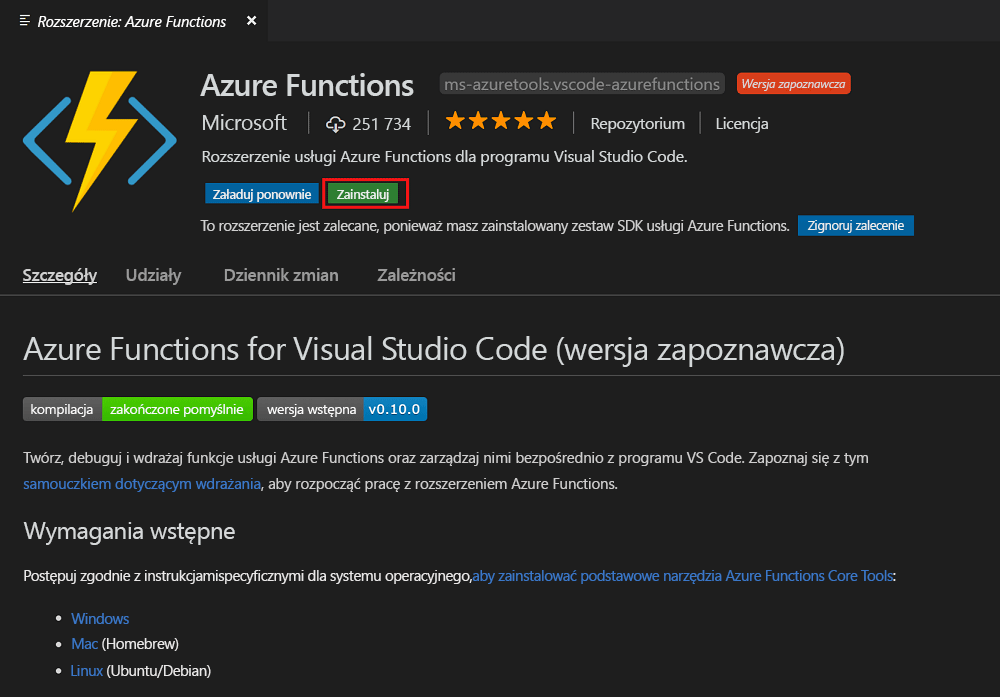
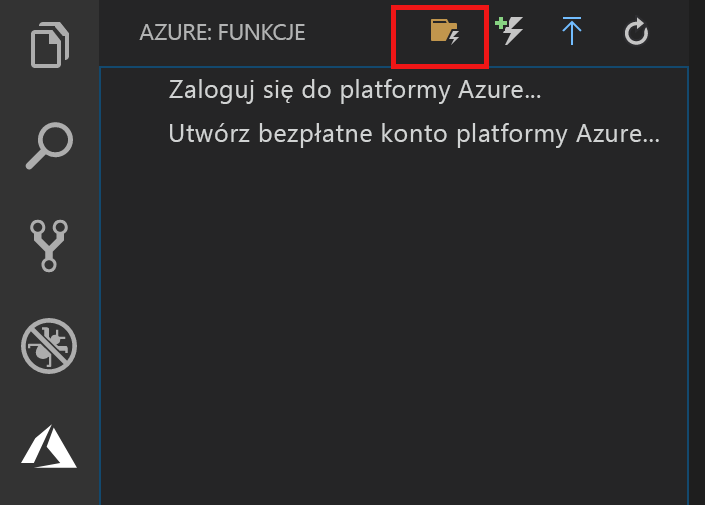
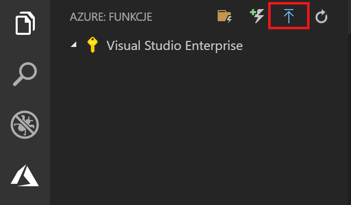
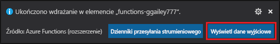
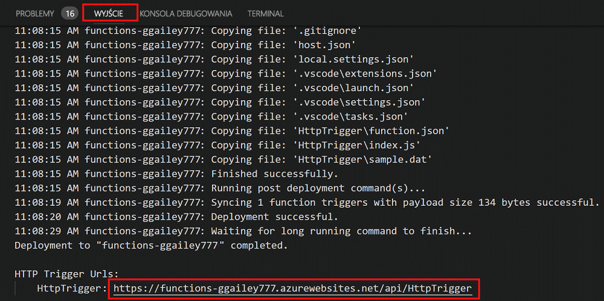

# Tworzenie pierwszej funkcji przy użyciu programu Visual Studio Code

Usługa Azure Functions umożliwia wykonywanie kodu w środowisku [bezserwerowym](https://azure.microsoft.com/solutions/serverless/) bez konieczności uprzedniego tworzenia maszyny wirtualnej lub publikowania aplikacji internetowej.

W tym artykule dowiesz się, jak użyć [Rozszerzenie usługi Azure Functions dla programu Visual Studio Code] do utworzenia i przetestowania funkcji „hello world” na komputerze lokalnym przy użyciu programu Microsoft Visual Studio Code. Następnie opublikujesz kod funkcji na platformie Azure z programu Visual Studio Code.

Rozszerzenie obsługuje obecnie funkcje języka C#, JavaScript i Java. Kroki opisane w tym artykule mogą się różnić w zależności od wybranego języka dla projektu usługi Azure Functions. Rozszerzenie jest aktualnie dostępne w wersji zapoznawczej. Aby dowiedzieć się więcej, zobacz stronę [Rozszerzenie usługi Azure Functions dla programu Visual Studio Code].

## Wymagania wstępne

Aby ukończyć ten przewodnik Szybki start:

* Zainstaluj [program Visual Studio Code](https://code.visualstudio.com/) na jednej z [obsługiwanych platform](https://code.visualstudio.com/docs/supporting/requirements#_platforms). Ten artykuł został opracowany i przetestowany na urządzeniu z systemem macOS (High Sierra).

* Zainstaluj wersję 2.x [pakietu Azure Functions Core Tools](functions-run-local.md#v2), który jest nadal w wersji zapoznawczej.

* Zainstaluj określone wymagania dla wybranego języka:

    | Język | Wewnętrzny |
    | -------- | --------- |
    | **C#** | [Rozszerzenie C# for Visual Studio Code](https://marketplace.visualstudio.com/items?itemName=ms-vscode.csharp) [Narzędzia interfejsu wiersza polecenia platformy .NET Core](https://docs.microsoft.com/dotnet/core/tools/?tabs=netcore2x)*   |
    | **Java** | [Debuger dla języka Java](https://marketplace.visualstudio.com/items?itemName=vscjava.vscode-java-debug) [Java 8](https://aka.ms/azure-jdks) [Maven 3+](https://maven.apache.org/) |
    | **JavaScript** | [Node 8.0+](https://nodejs.org/)  |

    \* Również wymagane przez pakiet Core Tools.

[!INCLUDE [quickstarts-free-trial-note](../../includes/quickstarts-free-trial-note.md)]

## Instalowanie rozszerzenia usługi Azure Functions

Rozszerzenie usługi Azure Functions umożliwia tworzenie, testowanie i wdrażanie funkcji na platformie Azure.

1. W programie Visual Studio Code otwórz pozycję **Extensions** (Rozszerzenia) i wyszukaj ciąg `azure functions` lub [otwórz ten link w programie Visual Studio Code](vscode:extension/ms-azuretools.vscode-azurefunctions).

1. Wybierz pozycję **Install** (Zainstaluj), aby zainstalować rozszerzenie programu Visual Studio Code. 

    

1. Uruchom ponownie program Visual Studio Code, a następnie wybierz ikonę platformy Azure na pasku działań. Powinieneś widzieć obszar usługi Azure Functions na pasku bocznym.

    

## Tworzenie projektu usługi Azure Functions

Szablon projektu usługi Azure Functions w programie Visual Studio Code umożliwia utworzenie projektu, który można opublikować w aplikacji funkcji na platformie Azure. Aplikacja funkcji umożliwia grupowanie funkcji w jednostki logiczne, co ułatwia wdrażanie i udostępnianie zasobów oraz zarządzanie nimi.

1. W programie Visual Studio Code wybierz logo platformy Azure, aby wyświetlić obszar**Azure: Functions**, a następnie wybierz ikonę tworzenia nowego projektu.

    

1. Wybierz lokalizację dla obszaru roboczego projektu, a następnie wybierz pozycję **Select** (Wybierz).

    > [!NOTE]
    > Ten artykuł został zaprojektowany pod kątem wykonania poza obszarem roboczym. W takim przypadku nie wybieraj folderu projektu, który jest częścią obszaru roboczego.

1. Wybierz język dla projektu aplikacji funkcji. W tym artykule użyto języka JavaScript.
    

1. Po wyświetleniu monitu wybierz pozycję **Add to workspace** (Dodaj do obszaru roboczego).

Program Visual Studio Code utworzy projekt aplikacji funkcji w nowym obszarze roboczym. Ten projekt zawiera pliki konfiguracyjne [host.json](functions-host-json.md) i [local.settings.json](functions-run-local.md#local-settings-file), a także wszystkie specyficzne dla języka pliki projektu. W folderze projektu może się także znaleźć nowe repozytorium Git.

## Tworzenie funkcji wyzwalanej przez protokół HTTP

1. Z obszaru **Azure: Functions** wybierz ikonę tworzenia funkcji.

    

1. Wybierz folder z projektem aplikacji funkcji i wybierz szablon funkcji **wyzwalacza HTTP**.

    

1. Wpisz `HTTPTrigger` jako nazwę funkcji i naciśnij klawisz Enter, a następnie wybierz uwierzytelnianie **anonimowe**.

    

    Funkcja zostanie utworzona w wybranym języku i przy użyciu szablonu funkcji wyzwalanej przez protokół HTTP.

    

Do funkcji można dodać powiązania danych wejściowych i wyjściowych, modyfikując plik function.json. Aby uzyskać więcej informacji, zobacz [Pojęcia powiązań i wyzwalaczy usługi Azure Functions](functions-triggers-bindings.md).

Po utworzeniu projektu funkcji i funkcji wyzwalanej przez protokół HTTP można je przetestować na komputerze lokalnym.

## Lokalne testowanie funkcji

Podstawowe narzędzia usługi Azure Functions umożliwiają uruchamianie projektu usługi Azure Functions na lokalnym komputerze deweloperskim. Monit o zainstalowanie tych narzędzi pojawia się przy pierwszym uruchomieniu funkcji w programie Visual Studio Code.  

1. Aby przetestować funkcję, ustaw punkt przerwania w kodzie funkcji, a następnie naciśnij klawisz F5, aby uruchomić projekt aplikacji funkcji. Dane wyjściowe z pakietu Core Tools są wyświetlane na panelu **terminalu**.

1. W panelu **terminalu** skopiuj punkt końcowy adresu URL funkcji wyzwalanej przez protokół HTTP.

    

1. Wklej adres URL żądania HTTP w pasku adresu przeglądarki. Dołącz ciąg zapytania `?name=<yourname>` do tego adresu URL i wykonaj żądanie. Wykonywanie zostanie wstrzymane po osiągnięciu punktu przerwania.

    

1. Jeśli będziesz kontynuować wykonywanie, poniżej przedstawiono odpowiedź w przeglądarce na żądanie GET:

    

1. Aby zatrzymać debugowanie, naciśnij klawisze Shift+F1.

Gdy będziesz mieć pewność, że funkcja działa poprawnie na komputerze lokalnym, możesz opublikować projekt na platformie Azure.

## Logowanie do platformy Azure

Zanim będzie można opublikować aplikację, należy zalogować się do platformy Azure.

1. W obszarze **Azure: Functions** wybierz pozycję **Sign in to Azure...** (Logowanie do platformy Azure...). Jeśli nie masz jeszcze konta, możesz **utworzyć bezpłatne konto platformy Azure**.

    

1. Po wyświetleniu monitu wybierz pozycję **Copy & Open** (Kopiuj i otwórz) lub skopiuj wyświetlany kod i otwórz <https://aka.ms/devicelogin> w przeglądarce.

1. Wklej skopiowany kod na stronie **Logowanie do urządzenia**, sprawdź logowanie dla programu Visual Studio Code, a następnie wybierz pozycję **Kontynuuj**.  

1. Ukończ logowanie przy użyciu poświadczeń konta platformy Azure. Po pomyślnym zalogowaniu możesz zamknąć przeglądarkę.

## Publikowanie projektu na platformie Azure

Program Visual Studio Code umożliwia publikowanie projektu usługi Functions bezpośrednio na platformie Azure. W ramach tego procesu tworzysz aplikację funkcji i powiązane zasoby w subskrypcji platformy Azure. Aplikacja funkcji zapewnia kontekst wykonywania dla Twoich funkcji. Projekt jest pakowany i wdrażany do nowej aplikacji funkcji w ramach subskrypcji platformy Azure. 

W tym artykule założono, że tworzysz nową aplikację funkcji. Publikowanie do istniejącej aplikacji funkcji spowoduje zastąpienie zawartości tej aplikacji na platformie Azure.

1. W obszarze **Azure: Functions** wybierz ikonę wdrażania w aplikacji funkcji.

    

1. Wybierz folder projektu, który jest Twoim bieżącym obszarem roboczym.

1. Jeśli masz więcej niż jedną subskrypcję, wybierz tę, w której chcesz hostować swoją aplikację funkcji, a następnie wybierz pozycję **+ Utwórz nową aplikację funkcji**.

1. Wpisz unikatową w skali globalnej nazwę identyfikującą aplikację funkcji, a następnie naciśnij klawisz Enter. Prawidłowe znaki dla nazwy aplikacji funkcji to `a-z`, `0-9` i `-`.

1. Wybierz pozycję **+ Utwórz nową grupę zasobów**, wpisz nazwę grupy zasobów, taką jak `myResourceGroup`, a następnie naciśnij klawisz Enter. Możesz również użyć istniejącej grupy zasobów.

1. Wybierz pozycję **+ Utwórz nowe konto magazynu**, wpisz globalnie unikatową nazwę nowego konta magazynu używanego przez aplikację funkcji i naciśnij klawisz Enter. Nazwy kont usługi Storage muszą mieć długość od 3 do 24 znaków i mogą zawierać tylko cyfry i małe litery. Możesz także użyć istniejącego konta.

1. Wybierz lokalizację w [regionie](https://azure.microsoft.com/regions/) znajdującym się w pobliżu lub blisko innych usług, do których Twoje funkcje uzyskują dostęp.

    Tworzenie aplikacji funkcji rozpoczyna się po wybraniu lokalizacji. Po utworzeniu aplikacji funkcji i zastosowaniu pakietu wdrożeniowego zostanie wyświetlone powiadomienie.

1. Wybierz przycisk **Wyświetl dane wyjściowe** w powiadomieniach, aby wyświetlić wyniki tworzenia i wdrożenia, łącznie z utworzonymi zasobami platformy Azure.

    

1. Zanotuj adres URL nowej aplikacji funkcji na platformie Azure. Pozwoli on na przetestowanie funkcji po opublikowaniu projektu na platformie Azure.

    

1. Wracając do obszaru **Azure: Functions**, zobaczysz nową aplikację funkcji wyświetlaną w ramach Twojej subskrypcji. Po rozwinięciu tego węzła wyświetlone zostaną funkcje w aplikacji funkcji, a także ustawienia aplikacji i serwery proxy funkcji.

    

    Z poziomu węzła aplikacji funkcji naciśnij klawisz Ctrl, a następnie kliknij (prawym przyciskiem myszy), aby wybrać spośród różnych zadań konfiguracji i zarządzania do wykonania w odniesieniu do aplikacji funkcji na platformie Azure. Możesz również wyświetlić aplikację funkcji w witrynie Azure Portal.

## Testowanie funkcji na platformie Azure

1. Skopiuj adres URL wyzwalacza HTTP z panelu **Dane wyjściowe**. Tak jak poprzednio dołącz ciąg zapytania `?name=<yourname>` na końcu tego adresu URL i wykonaj żądanie.

    Adres URL, który wywołuje funkcję wyzwalaną przez protokół HTTP, powinien mieć następujący format:

        http://<functionappname>.azurewebsites.net/api/<functionname>?name=<yourname> 

1. Wklej nowy adres URL żądania HTTP na pasku adresu przeglądarki. Na poniższym obrazie przedstawiono wyświetloną w przeglądarce odpowiedź na zdalne żądanie GET zwróconą przez funkcję: 

    

## Następne kroki

W programie Visual Studio Code utworzono aplikację funkcji z prostą funkcją wyzwalaną przez protokół HTTP. Aby dowiedzieć się więcej na temat tworzenia funkcji w określonym języku, zapoznaj się z przewodnikami informacyjnymi dla języków [JavaScript](functions-reference-node.md), [.NET](functions-dotnet-class-library.md) lub [Java](functions-reference-java.md).

Warto także dowiedzieć się więcej na temat lokalnego testowania i debugowania z terminalu lub wiersza polecenia przy użyciu pakietu Azure Functions Core Tools.

> [!div class="nextstepaction"]
> [Kodowanie i testowanie lokalnie](functions-run-local.md)

[Azure Functions Core Tools]: functions-run-local.md
[Rozszerzenie usługi Azure Functions dla programu Visual Studio Code]: https://marketplace.visualstudio.com/items?itemName=ms-azuretools.vscode-azurefunctions
