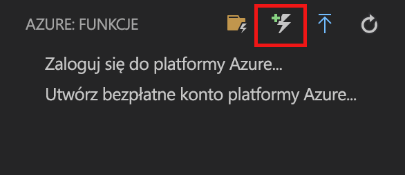
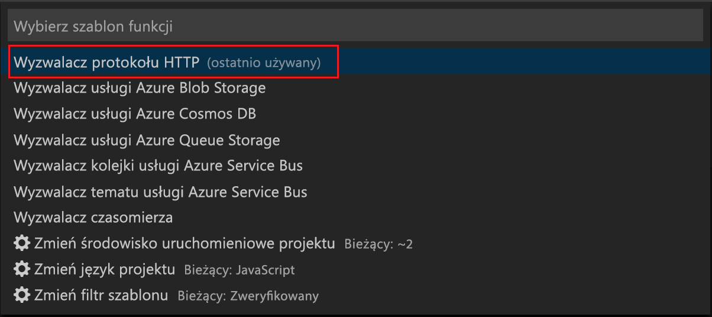
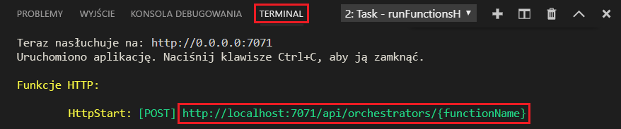

# Tworzenie pierwszej funkcji przy użyciu programu Visual Studio Code

Usługa Azure Functions umożliwia wykonywanie kodu w środowisku [bezserwerowym](https://azure.microsoft.com/solutions/serverless/) bez konieczności uprzedniego tworzenia maszyny wirtualnej lub publikowania aplikacji internetowej.

W tym artykule dowiesz się, jak użyć [Rozszerzenie usługi Azure Functions dla programu Visual Studio Code] do utworzenia i przetestowania funkcji „hello world” na komputerze lokalnym przy użyciu programu Microsoft Visual Studio Code. Następnie opublikujesz kod funkcji na platformie Azure z programu Visual Studio Code.

Obecnie rozszerzenie w pełni obsługuje funkcje języków C#, JavaScript i Java, a obsługa języka Python jest dostępna w wersji zapoznawczej. Kroki opisane w tym artykule mogą się różnić w zależności od wybranego języka dla projektu usługi Azure Functions. Rozszerzenie jest aktualnie dostępne w wersji zapoznawczej. Aby dowiedzieć się więcej, zobacz stronę [Rozszerzenie usługi Azure Functions dla programu Visual Studio Code].

## Wymagania wstępne

Aby ukończyć ten przewodnik Szybki start:

* Zainstaluj [program Visual Studio Code](https://code.visualstudio.com/) na jednej z [obsługiwanych platform](https://code.visualstudio.com/docs/supporting/requirements#_platforms). Ten artykuł został opracowany i przetestowany na urządzeniu z systemem macOS (High Sierra).

* Zainstaluj wersję 2.x [pakietu Azure Functions Core Tools](functions-run-local.md#v2), który jest nadal w wersji zapoznawczej.

* Zainstaluj określone wymagania dla wybranego języka:

    | Język | Wewnętrzny |
    | -------- | --------- |
    | **C#** | [Rozszerzenie C# for Visual Studio Code](https://marketplace.visualstudio.com/items?itemName=ms-vscode.csharp) [Narzędzia interfejsu wiersza polecenia platformy .NET Core](https://docs.microsoft.com/dotnet/core/tools/?tabs=netcore2x)*   |
    | **Java** | [Debuger dla języka Java](https://marketplace.visualstudio.com/items?itemName=vscjava.vscode-java-debug) [Java 8](https://aka.ms/azure-jdks) [Maven 3+](https://maven.apache.org/) |
    | **JavaScript** | [Node 8.0+](https://nodejs.org/)  |

    \* Również wymagane przez pakiet Core Tools.

[!INCLUDE [quickstarts-free-trial-note](../../includes/quickstarts-free-trial-note.md)]

[!INCLUDE [functions-install-vs-code-extension](../../includes/functions-install-vs-code-extension.md)]

[!INCLUDE [functions-create-function-app-vs-code](../../includes/functions-create-function-app-vs-code.md)]

## Tworzenie funkcji wyzwalanej przez protokół HTTP

1. Z obszaru **Azure: Functions** wybierz ikonę tworzenia funkcji.

    

1. Wybierz folder z projektem aplikacji funkcji i wybierz szablon funkcji **wyzwalacza HTTP**.

    

1. Wpisz `HTTPTrigger` jako nazwę funkcji i naciśnij klawisz Enter, a następnie wybierz uwierzytelnianie **anonimowe**.

    

    Funkcja zostanie utworzona w wybranym języku i przy użyciu szablonu funkcji wyzwalanej przez protokół HTTP.

    

Do funkcji można dodać powiązania danych wejściowych i wyjściowych, modyfikując plik function.json. Aby uzyskać więcej informacji, zobacz [Pojęcia powiązań i wyzwalaczy usługi Azure Functions](functions-triggers-bindings.md).

Po utworzeniu projektu funkcji i funkcji wyzwalanej przez protokół HTTP można je przetestować na komputerze lokalnym.

## Lokalne testowanie funkcji

Podstawowe narzędzia usługi Azure Functions umożliwiają uruchamianie projektu usługi Azure Functions na lokalnym komputerze deweloperskim. Monit o zainstalowanie tych narzędzi pojawia się przy pierwszym uruchomieniu funkcji w programie Visual Studio Code.  

1. Aby przetestować funkcję, ustaw punkt przerwania w kodzie funkcji, a następnie naciśnij klawisz F5, aby uruchomić projekt aplikacji funkcji. Dane wyjściowe z pakietu Core Tools są wyświetlane na panelu **terminalu**.

1. W panelu **terminalu** skopiuj punkt końcowy adresu URL funkcji wyzwalanej przez protokół HTTP.

    

1. Wklej adres URL żądania HTTP w pasku adresu przeglądarki. Dołącz ciąg zapytania `?name=<yourname>` do tego adresu URL i wykonaj żądanie. Wykonywanie zostanie wstrzymane po osiągnięciu punktu przerwania.

    

1. Jeśli będziesz kontynuować wykonywanie, poniżej przedstawiono odpowiedź w przeglądarce na żądanie GET:

    

1. Aby zatrzymać debugowanie, naciśnij klawisze Shift+F5.

Gdy będziesz mieć pewność, że funkcja działa poprawnie na komputerze lokalnym, możesz opublikować projekt na platformie Azure.

[!INCLUDE [functions-sign-in-vs-code](../../includes/functions-sign-in-vs-code.md)]

[!INCLUDE [functions-publish-project-vscode](../../includes/functions-publish-project-vscode.md)]

## Testowanie funkcji na platformie Azure

1. Skopiuj adres URL wyzwalacza HTTP z panelu **Dane wyjściowe**. Tak jak poprzednio dołącz ciąg zapytania `?name=<yourname>` na końcu tego adresu URL i wykonaj żądanie.

    Adres URL, który wywołuje funkcję wyzwalaną przez protokół HTTP, powinien mieć następujący format:

        http://<functionappname>.azurewebsites.net/api/<functionname>?name=<yourname> 

1. Wklej nowy adres URL żądania HTTP na pasku adresu przeglądarki. Na poniższym obrazie przedstawiono wyświetloną w przeglądarce odpowiedź na zdalne żądanie GET zwróconą przez funkcję: 

    

## Kolejne kroki

W programie Visual Studio Code utworzono aplikację funkcji z prostą funkcją wyzwalaną przez protokół HTTP. Możesz także dowiedzieć się więcej o [lokalnego testowania i debugowania z Terminal lub wiersz polecenia](functions-run-local.md) przy użyciu podstawowych narzędzi usługi Azure Functions.

> [!div class="nextstepaction"]
> [Włączanie integracji usługi Application Insights](functions-monitoring.md#manually-connect-an-app-insights-resource)

[Azure Functions Core Tools]: functions-run-local.md
[Rozszerzenie usługi Azure Functions dla programu Visual Studio Code]: https://marketplace.visualstudio.com/items?itemName=ms-azuretools.vscode-azurefunctions
