# Tworzenie funkcji wyzwalanej przez magazyn obiektów Blob

Dowiedz się, jak utworzyć funkcję wyzwalaną w momencie przekazania plików do magazynu obiektów Blob platformy Azure lub zaktualizowania w magazynie.

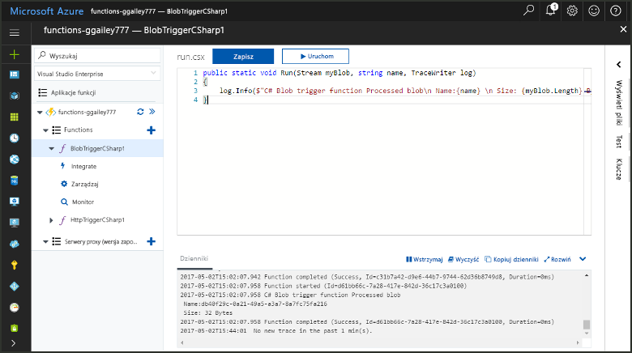

## Wymagania wstępne

+ Pobrać i zainstalować program [Microsoft Azure Storage Explorer](https://storageexplorer.com/).
+ Subskrypcja platformy Azure. Jeśli nie masz subskrypcji, przed rozpoczęciem utwórz [bezpłatne konto](https://azure.microsoft.com/free/?WT.mc_id=A261C142F).

## Tworzenie aplikacji funkcji platformy Azure

[!INCLUDE [Create function app Azure portal](../../includes/functions-create-function-app-portal.md)]

Następnie należy utworzyć funkcję w nowej aplikacji funkcji.

## Tworzenie funkcji wyzwalanej przez magazyn obiektów Blob

1. Rozwiń aplikację funkcji i kliknij przycisk **+** obok pozycji **Funkcje**. Jeśli jest to pierwsza funkcja w aplikacji funkcji, wybierz pozycję **W portalu**, a następnie opcję **Kontynuuj**. W przeciwnym razie przejdź do kroku trzeciego.

   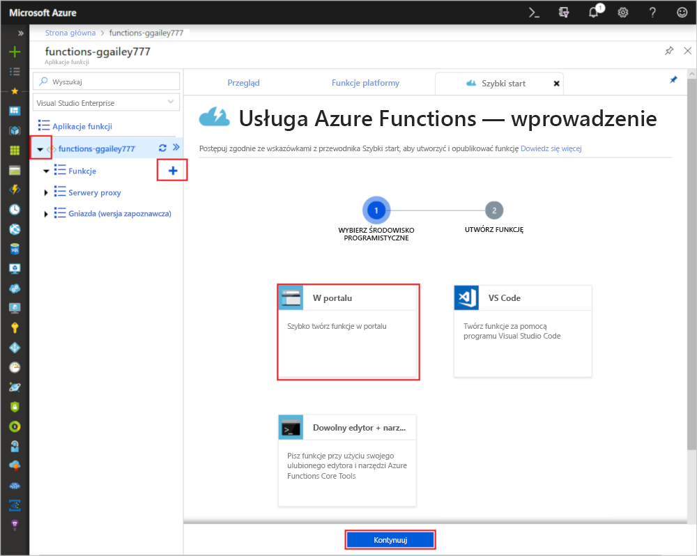

1. Wybierz pozycję **Więcej szablonów**, a następnie pozycję **Zakończ i wyświetl szablony**.

    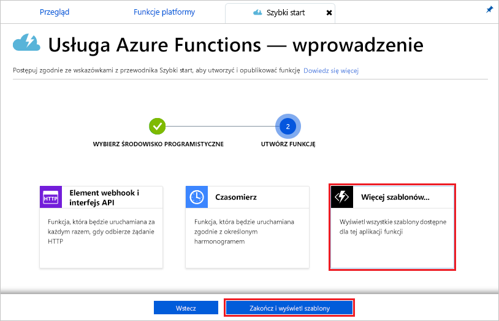

1. W polu wyszukiwania wpisz `blob`, a następnie wybierz szablon **Wyzwalacz obiektu blob**.

1. Jeśli zostanie wyświetlony monit, wybierz pozycję **Zainstaluj** , aby zainstalować rozszerzenie usługi Azure Storage i wszystkie zależności w aplikacji funkcji. Po pomyślnym zakończeniu instalacji wybierz pozycję **Kontynuuj**.

    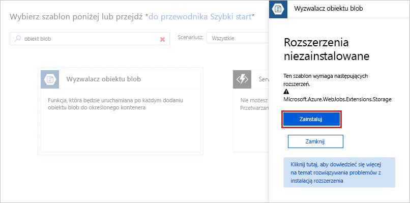

1. Użyj ustawień w sposób określony w tabeli znajdującej się poniżej obrazu.

    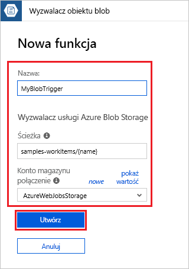

    | Ustawienie | Sugerowana wartość | Opis |
    |---|---|---|
    | **Nazwa** | Unikatowa w obrębie aplikacji funkcji | Nazwa funkcji wyzwalanej przez obiekt blob. |
    | **Ścieżka**   | samples-workitems/{name}    | Lokalizacja w monitorowanym magazynie obiektów Blob. Nazwa pliku obiektu Blob jest przekazywana w powiązaniu jako parametr _nazwa_.  |
    | **Połączenie konta magazynu** | AzureWebJobsStorage | Możesz skorzystać z połączenia konta magazynu już używanego przez aplikację funkcji lub utworzyć nowe.  |

1. Kliknij przycisk **Utwórz**, aby utworzyć funkcję.

Następnie nawiąż połączenie z kontem usługi Azure Storage i utwórz kontener **samples-workitems**.

## Tworzenie kontenera

1. W funkcji kliknij pozycję **Integracja**, rozwiń pozycję **Dokumentacja** i skopiuj wartości pól **Nazwa konta** oraz **Klucz konta**. Te poświadczenia służą do nawiązywania połączenia z kontem magazynu. Jeśli już nawiązano połączenie z kontem magazynu, przejdź do kroku 4.

    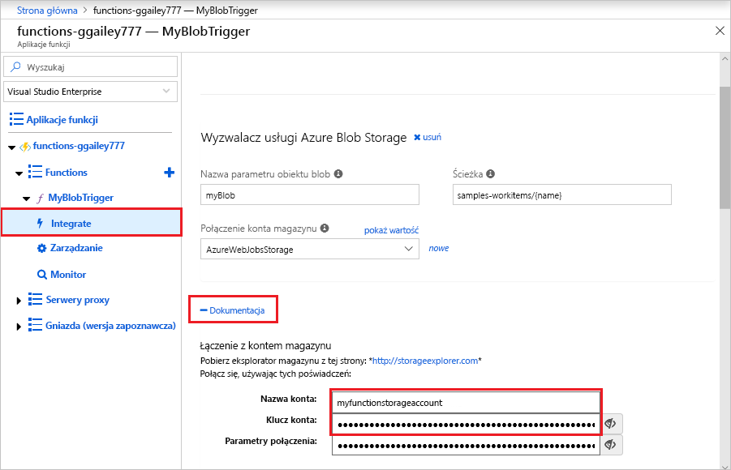

1. Uruchom narzędzie [Microsoft Azure Storage Explorer](https://storageexplorer.com/), kliknij ikonę połączenia po lewej stronie, wybierz pozycję **Użyj klucza i nazwy konta magazynu** i kliknij przycisk **Dalej**.

    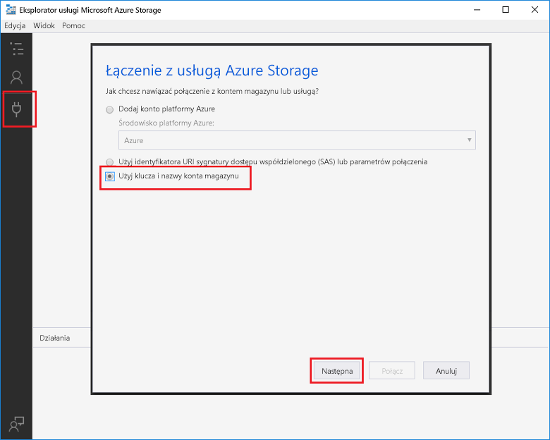

1. Wprowadź wartości **Nazwa konta** i **Klucz konta** z kroku 1, kliknij przycisk **Dalej**, a następnie przycisk **Połącz**. 

    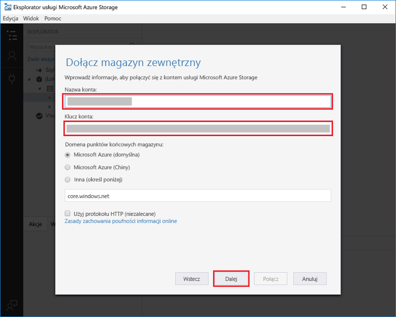

1. Rozwiń dołączone konto magazynu, kliknij prawym przyciskiem myszy **kontenery obiektów BLOB**, kliknij pozycję **Utwórz kontener obiektów blob**, wpisz `samples-workitems`, a następnie naciśnij klawisz ENTER.

    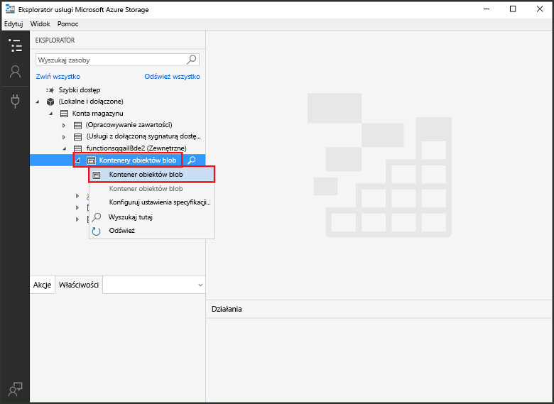

Teraz, gdy masz już kontener obiektów Blob, możesz przetestować funkcję, przekazując plik do kontenera.

## Testowanie funkcji

1. Wróć do witryny Azure Portal, przejdź do swoich funkcji, rozwiń pozycję **Dzienniki** w dolnej części strony i upewnij się, że strumieniowe przesyłanie dzienników nie jest wstrzymane.

1. W Eksplorator usługi Storage rozwiń konto magazynu, **kontenery obiektów BLOB**i **przykłady — elementy robocze**. Kliknij pozycję **Upload** (Przekaż), a następnie pozycję **Upload files...** (Przekaż pliki...).

    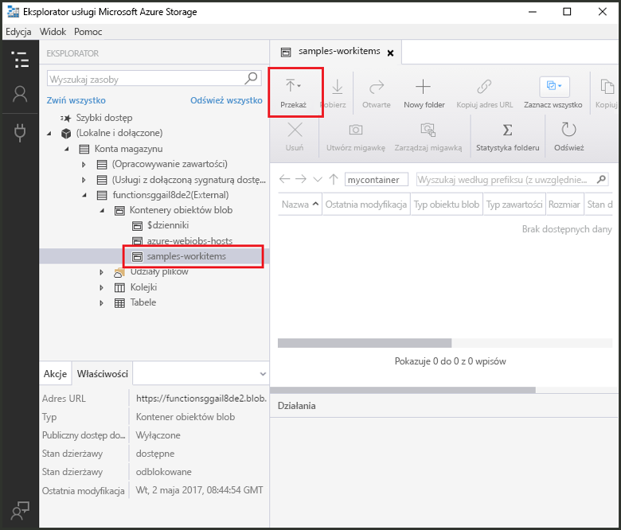

1. W oknie dialogowym **Upload files** (Przekazywanie plików) kliknij pole **Files** (Pliki). Przejdź do pliku na komputerze lokalnym, na przykład pliku obrazu, zaznacz go i kliknij przycisk **Open** (Otwórz), a następnie przycisk **Upload** (Przekaż).

1. Wróć do dzienników funkcji i sprawdź, czy obiekt Blob został odczytany.

   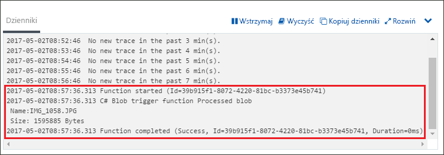

    >[!NOTE]
    > Gdy aplikacja funkcji zostanie uruchomiona w domyślnym planie Zużycie, może wystąpić nawet kilkuminutowe opóźnienie między dodaniem lub zaktualizowaniem obiektu Blob a wyzwoleniem funkcji. Jeśli zależy Ci na małych opóźnieniach w funkcjach wyzwalanych przez obiekty Blob, rozważ uruchomienie aplikacji funkcji w planie usługi App Service.

## Oczyszczanie zasobów

[!INCLUDE [Next steps note](../../includes/functions-quickstart-cleanup.md)]

## Następne kroki

Utworzono funkcję, która jest uruchamiana w momencie dodania obiektu Blob do magazynu obiektów Blob lub zaktualizowania obiektu Blob w magazynie. Aby uzyskać więcej informacji na temat wyzwalaczy magazynu obiektów Blob, zobacz [Powiązania magazynu obiektów Blob w usłudze Azure Functions](functions-bindings-storage-blob.md).

[!INCLUDE [Next steps note](../../includes/functions-quickstart-next-steps.md)]
