# Tworzenie funkcji wyzwalanej przez usługę Azure Queue Storage

Dowiedz się, jak utworzyć funkcję, która jest wyzwalana w momencie przesłania komunikatów do kolejki usługi Azure Storage.

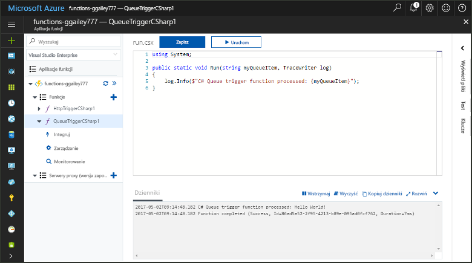

## Wymagania wstępne

- Pobrać i zainstalować program [Microsoft Azure Storage Explorer](https://storageexplorer.com/).

- Subskrypcja platformy Azure. Jeśli nie masz subskrypcji, przed rozpoczęciem utwórz [bezpłatne konto](https://azure.microsoft.com/free/?WT.mc_id=A261C142F).

## Tworzenie aplikacji funkcji platformy Azure

[!INCLUDE [Create function app Azure portal](../../includes/functions-create-function-app-portal.md)]

Następnie należy utworzyć funkcję w nowej aplikacji funkcji.

## Tworzenie funkcji wyzwalanej przez kolejkę

1. Rozwiń aplikację funkcji **+** i kliknij przycisk obok **pozycji Funkcje**. Jeśli jest to pierwsza funkcja w aplikacji funkcji, wybierz pozycję **W portalu**, a następnie opcję **Kontynuuj**. W przeciwnym razie przejdź do kroku trzeciego.

   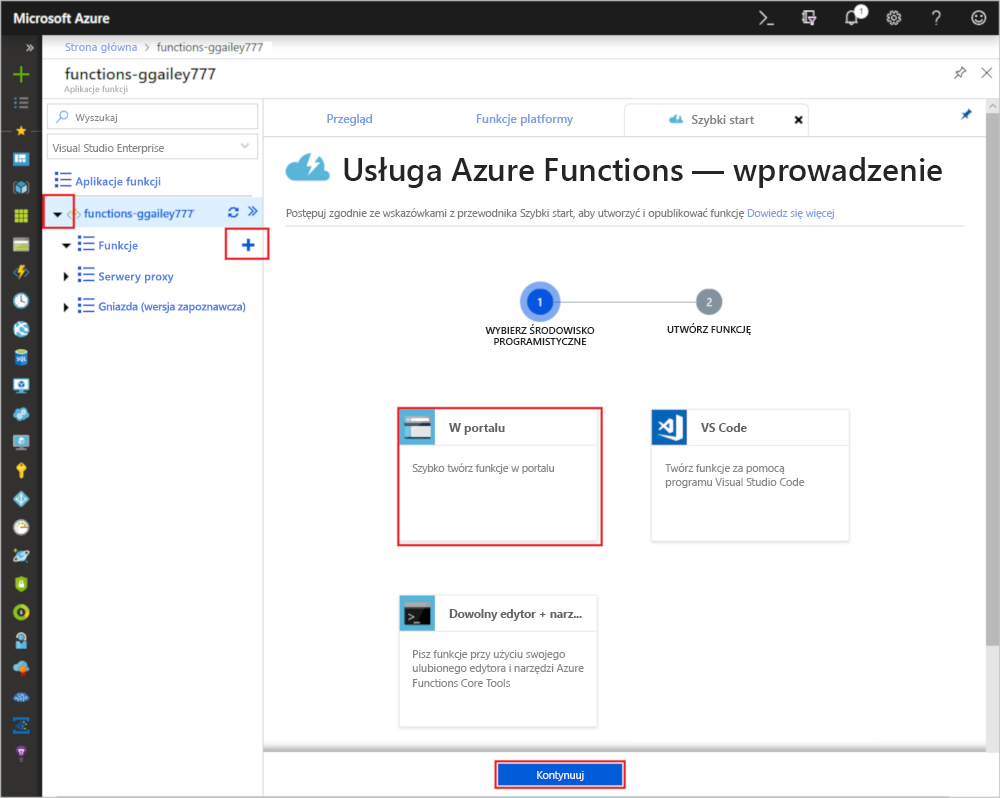

1. Wybierz pozycję **Więcej szablonów**, a następnie pozycję **Zakończ i wyświetl szablony**.

    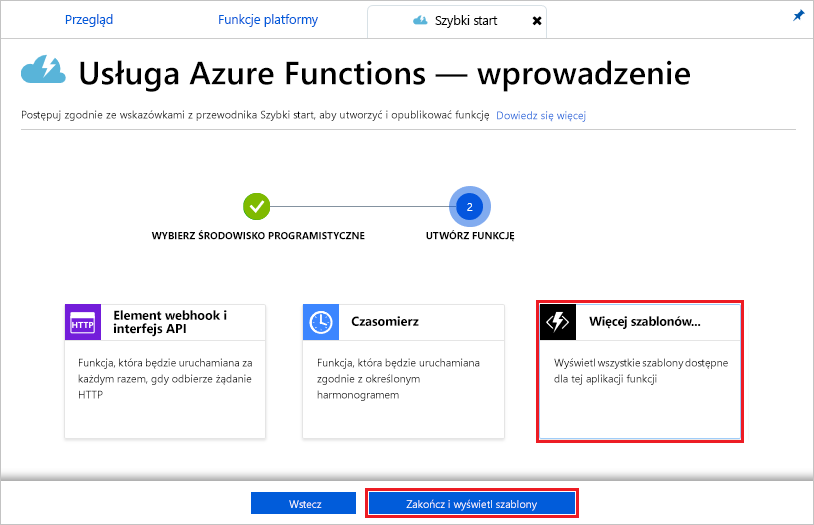

1. W polu wyszukiwania wpisz `queue`, a następnie wybierz szablon **Wyzwalacz kolejki**.

1. Jeśli zostanie wyświetlony monit, wybierz **pozycję Zainstaluj,** aby zainstalować rozszerzenie usługi Azure Storage i wszelkie zależności w aplikacji funkcji. Po pomyślnym zakończeniu instalacji wybierz pozycję **Kontynuuj**.

    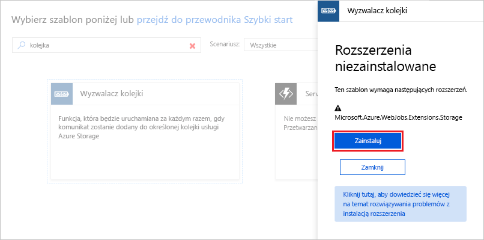

1. Użyj ustawień w sposób określony w tabeli znajdującej się poniżej obrazu.

    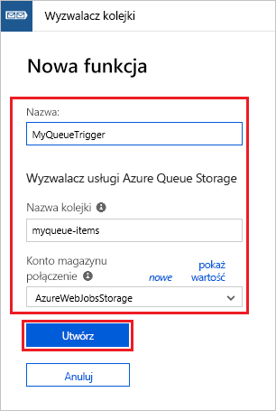

    | Ustawienie | Sugerowana wartość | Opis |
    |---|---|---|
    | **Nazwa** | Unikatowa w obrębie aplikacji funkcji | Nazwa funkcji wyzwalanej przez kolejkę. |
    | **Nazwa kolejki**   | myqueue-items    | Nazwa kolejki, z którą zostanie nawiązane połączenie na koncie magazynu. |
    | **Połączenie konta magazynu** | AzureWebJobsStorage | Możesz skorzystać z połączenia konta magazynu już używanego przez aplikację funkcji lub utworzyć nowe.  |    

1. Kliknij przycisk **Utwórz**, aby utworzyć funkcję.

Następnie nawiąż połączenie z kontem usługi Azure Storage i utwórz kolejkę magazynu **myqueue-items**.

## Tworzenie kolejki

1. W funkcji kliknij pozycję **Integracja**, rozwiń pozycję **Dokumentacja** i skopiuj wartości pól **Nazwa konta** oraz **Klucz konta**. Te poświadczenia służą do nawiązywania połączenia z kontem magazynu w Eksploratorze usługi Azure Storage. Jeśli już nawiązano połączenie z kontem magazynu, przejdź do kroku 4.

    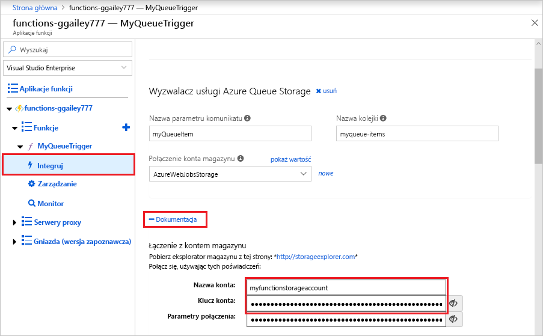

1. Uruchom narzędzie [Microsoft Azure Storage Explorer](https://storageexplorer.com/), kliknij ikonę połączenia po lewej stronie, wybierz pozycję **Użyj klucza i nazwy konta magazynu** i kliknij przycisk **Dalej**.

    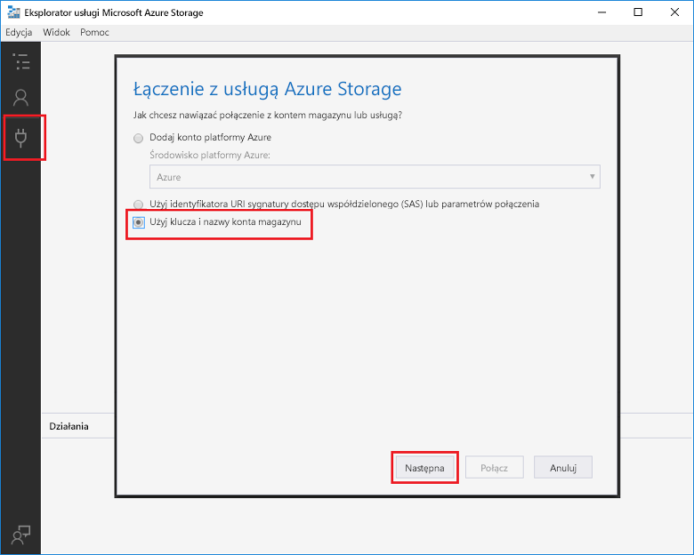

1. Wprowadź wartości **Nazwa konta** i **Klucz konta** z kroku 1, kliknij przycisk **Dalej**, a następnie przycisk **Połącz**.

    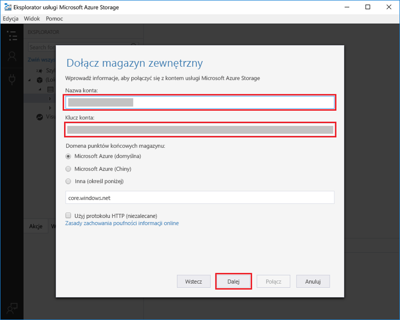

1. Rozwiń dołączone konto magazynu, kliknij prawym przyciskiem myszy `myqueue-items` **pozycję Kolejki,** kliknij polecenie **Utwórz kolejkę**, a następnie naciśnij klawisz Enter.

    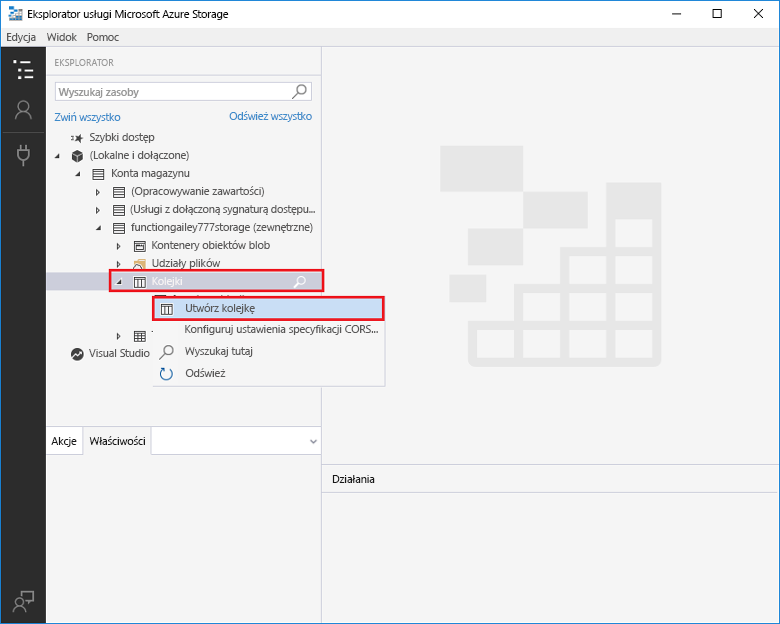

Teraz, gdy masz już kolejkę magazynu, możesz przetestować funkcję, dodając komunikat do kolejki.

## Testowanie funkcji

1. W portalu Azure przejdź do funkcji, rozwiń **dzienniki** u dołu strony i upewnij się, że przesyłanie strumieniowe dziennika nie jest wstrzymane.

1. W Eksploratorze magazynu rozwiń konto magazynu, **kolejki**i **elementy myszy,** a następnie kliknij pozycję **Dodaj wiadomość**.

    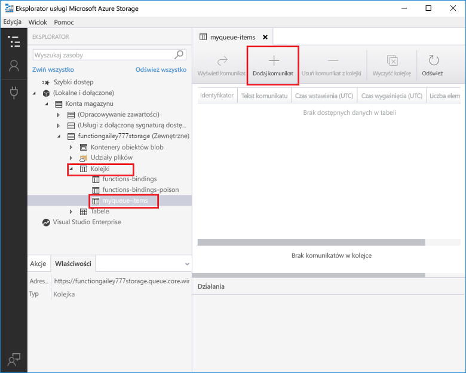

1. Wpisz komunikat „Hello World!” w polu **Message text** (Tekst komunikatu) i kliknij przycisk **OK**.

1. Poczekaj kilka sekund, a następnie wróć do dzienników funkcji i sprawdź, czy nowy komunikat został odczytany z kolejki.

    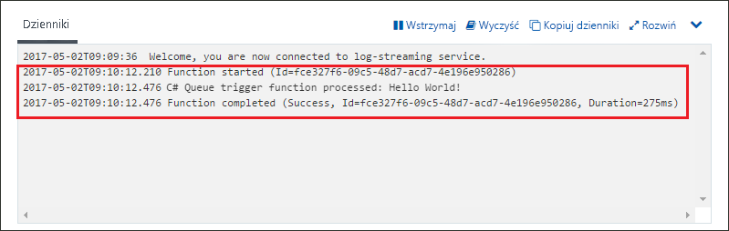

1. Wróć do programu Storage Explorer, kliknij pozycję **Refresh** (Odśwież) i sprawdź, czy komunikat został przetworzony i nie ma go już w kolejce.

## Oczyszczanie zasobów

[!INCLUDE [Next steps note](../../includes/functions-quickstart-cleanup.md)]

## Następne kroki

Utworzono funkcję, która jest uruchamiana w momencie dodania komunikatu do kolejki magazynu. Aby uzyskać więcej informacji na temat wyzwalaczy usługi Queue Storage, zobacz [Powiązania usługi Queue Storage w usłudze Azure Functions](functions-bindings-storage-queue.md).

Teraz, gdy masz już utworzoną swoją pierwszą funkcję, dodajmy do funkcji powiązanie danych wyjściowych, które zapisuje komunikat z powrotem do innej kolejki.

> [!div class="nextstepaction"]
> [Dodawanie komunikatów do kolejki usługi Azure Storage przy użyciu funkcji](functions-integrate-storage-queue-output-binding.md)
