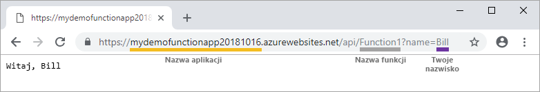

# Tworzenie pierwszej funkcji przy użyciu programu Visual Studio

Usługa Azure Functions umożliwia wykonywanie kodu w środowisku [bezserwerowym](https://azure.microsoft.com/solutions/serverless/) bez konieczności uprzedniego tworzenia maszyny wirtualnej lub publikowania aplikacji internetowej.

W tym artykule dowiesz się, jak używać programu Visual Studio 2019 do lokalnego tworzenia i testowania funkcji "Hello World", a następnie publikować ją na platformie Azure. Ten przewodnik Szybki Start został zaprojektowany z założenia dla programu Visual Studio 2019. Podczas tworzenia projektu funkcji przy użyciu programu Visual Studio 2017 należy najpierw zainstalować [najnowsze narzędzia Azure Functions](functions-develop-vs.md#check-your-tools-version).

## Wymagania wstępne

Aby ukończyć ten samouczek, należy najpierw zainstalować [program Visual Studio 2019](https://azure.microsoft.com/downloads/). Upewnij się, że obciążenie **programowanie na platformie Azure** jest również instalowane.

[!INCLUDE [quickstarts-free-trial-note](../../includes/quickstarts-free-trial-note.md)]

## Tworzenie projektu aplikacji funkcji

[!INCLUDE [Create a project using the Azure Functions template](../../includes/functions-vstools-create.md)]

Program Visual Studio tworzy projekt i klasę, która zawiera kod standardowy dla typu funkcji wyzwalacza HTTP. Atrybut metody ustawia nazwę funkcji, która domyślnie jest `HttpTrigger`. `FunctionName` Ten `HttpTrigger` atrybut określa, że funkcja jest wyzwalana przez żądanie HTTP. Standardowy kod wysyła odpowiedź HTTP zawierającą wartość z treści żądania lub ciągu zapytania.

Możesz rozszerzyć możliwości funkcji za pomocą powiązań wejściowych i wyjściowych przez zastosowanie odpowiednich atrybutów do metody. Aby uzyskać więcej informacji, zobacz sekcję [Triggers and bindings](functions-dotnet-class-library.md#triggers-and-bindings) (Wyzwalacze i powiązania) [dokumentacji usługi Azure Functions dla deweloperów w C#](functions-dotnet-class-library.md).

Po utworzeniu projektu funkcji i funkcji wyzwalanej przez protokół HTTP można je przetestować na komputerze lokalnym.

## Lokalne uruchamianie funkcji

Program Visual Studio integruje się z Azure Functions Core Tools, dzięki czemu można testować funkcje lokalnie przy użyciu środowiska uruchomieniowego Full Functions.  

[!INCLUDE [functions-run-function-test-local-vs](../../includes/functions-run-function-test-local-vs.md)]

Gdy będziesz mieć pewność, że funkcja działa poprawnie na komputerze lokalnym, możesz opublikować projekt na platformie Azure.

## Publikowanie projektu na platformie Azure

Aby opublikować projekt, musisz mieć aplikację funkcji w swojej subskrypcji platformy Azure. Publikacja programu Visual Studio tworzy aplikację funkcji przy pierwszym publikowaniu projektu.

[!INCLUDE [Publish the project to Azure](../../includes/functions-vstools-publish.md)]

## Testowanie funkcji na platformie Azure

1. Skopiuj podstawowy adres URL aplikacji funkcji ze strony profilu publikowania. Część `localhost:port` adresu URL używaną podczas lokalnego testowania funkcji zastąp nowym podstawowym adresem URL. Tak jak poprzednio dołącz ciąg zapytania `?name=<YOUR_NAME>` do tego adresu URL i wykonaj żądanie.

    Adres URL, który wywołuje funkcję wyzwalaną przez protokół HTTP, powinien mieć następujący format:

        http://<APP_NAME>.azurewebsites.net/api/<FUNCTION_NAME>?name=<YOUR_NAME> 

2. Wklej nowy adres URL żądania HTTP na pasku adresu przeglądarki. Na poniższym obrazie przedstawiono wyświetloną w przeglądarce odpowiedź na zdalne żądanie GET zwróconą przez funkcję:

    

## Następne kroki

Używasz programu Visual Studio do tworzenia i publikowania aplikacji C# funkcji na platformie Azure z prostą funkcją wyzwalaną przez protokół http. Aby dowiedzieć się więcej na temat opracowywania funkcji jako bibliotek klas .NET, zobacz [Azure Functions C# ](functions-dotnet-class-library.md)Dokumentacja dla deweloperów.

> [!div class="nextstepaction"]
> [Dodawanie do funkcji powiązania kolejki usługi Azure Storage](functions-add-output-binding-storage-queue-vs.md)
