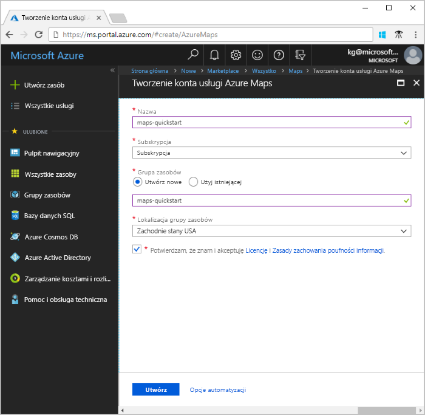
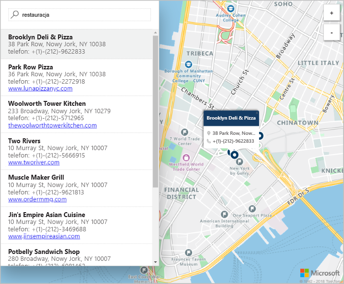

# Tworzenie interaktywnego wyszukiwania na mapie za pomocą usługi Azure Maps

W tym artykule przedstawiono możliwości usługi Azure Maps w zakresie tworzenia mapy umożliwiającej użytkownikom interaktywne wyszukiwanie. Przeprowadza on użytkownika przez następujące podstawowe kroki:
* Tworzenie konta usługi Azure Maps.
* Uzyskiwanie klucza konta do użycia w demonstracyjnej aplikacji internetowej.

Jeśli nie masz subskrypcji platformy Azure, przed rozpoczęciem utwórz [bezpłatne konto](https://azure.microsoft.com/free/?WT.mc_id=A261C142F).

## Logowanie się do witryny Azure Portal

Zaloguj się w witrynie [Azure Portal](https://portal.azure.com/).

## Tworzenie konta i uzyskiwanie klucza

1. W lewym górnym rogu witryny [Azure portal](https://portal.azure.com) wybierz pozycję **Utwórz zasób**.
2. W polu **Wyszukaj w portalu Marketplace** wprowadź wartość **Maps**.
3. Z listy **Wyniki** wybierz pozycję **Maps**. Wybierz przycisk **Utwórz** znajdujący się poniżej mapy.
4. Na stronie **Tworzenie konta usługi Azure Maps** wprowadź następujące wartości:
   - **Nazwa** nowego konta.
   - **Subskrypcja**, która ma być używana dla tego konta.
   - **Grupa zasobów** dla tego konta. Możesz wybrać pozycję **Utwórz nowe** lub **Użyj istniejącego** dla grupy zasobów.
   - Wybierz **warstwę cenową**.
   - Przeczytaj **licencję** i **zasady zachowania poufności informacji**. Zaznacz pole wyboru, aby zaakceptować warunki.
   - Na koniec wybierz przycisk **Utwórz**.

     

5. Po pomyślnym utworzeniu konta otwórz je i znajdź sekcję ustawień menu konta. Wybierz pozycję **Klucze**, aby wyświetlić klucze podstawowe i pomocnicze dla Twojego konta usługi Azure Maps. Skopiuj wartość pola **Klucz podstawowy** do lokalnego schowka do użycia w następnej sekcji.

## Pobieranie aplikacji

1. Pobierz lub skopiuj zawartość pliku [interactiveSearch.html](https://github.com/Azure-Samples/AzureMapsCodeSamples/blob/master/AzureMapsCodeSamples/Tutorials/interactiveSearch.html).
2. Zapisz lokalnie zawartość tego pliku jako **AzureMapDemo.html**. Otwórz ten plik w edytorze tekstów.
3. Wyszukaj ciąg `<Your Azure Maps Key>`. Zastąp go wartością pola **Klucz podstawowy** z poprzedniej sekcji.

## Otwieranie aplikacji

1. Otwórz plik **AzureMapDemo.html** w wybranej przeglądarce.
2. Spójrz na mapę miasta Los Angeles. Powiększ i pomniejsz, aby zobaczyć, jak mapa jest automatycznie renderowana z większą lub mniejszą ilością informacji w zależności od poziomu powiększenia. 
3. Zmień domyślny środek mapy. W pliku **AzureMapDemo.html** wyszukaj zmienną o nazwie **center**. Zastąp parę wartości długości i szerokości geograficznej tej zmiennej nowymi wartościami **[-74.0060, 40.7128]**. Zapisz plik i odśwież przeglądarkę.
4. Wypróbuj funkcję wyszukiwania interaktywnego. W polu wyszukiwania w lewym górnym rogu demonstracyjnej aplikacji internetowej wyszukaj **restauracje**.
5. Przesuń wskaźnik myszy na liście adresów i lokalizacji, które są wyświetlane pod polem wyszukiwania. Zwróć uwagę, jak za pomocą odpowiedniej pinezki na mapie wyświetlane są informacje o tej lokalizacji. Ze względu na ochronę danych prywatnych firm wyświetlono fikcyjne nazwy i adresy.

    

## Oczyszczanie zasobów

W tych samouczkach szczegółowo opisano sposób użycia i konfigurowania usługi Azure Maps dla konta. Jeśli planujesz kontynuować pracę z samouczkami, nie usuwaj zasobów utworzonych w tym przewodniku Szybki start. Jeśli nie planujesz kontynuowania pracy, wykonaj następujące kroki, aby usunąć zasoby:

1. Zamknij przeglądarkę z uruchomioną aplikacją internetową **AzureMapDemo.html**.
2. W menu po lewej stronie w witrynie Azure Portal wybierz pozycję **Wszystkie zasoby**. Następnie wybierz swoje konto usługi Azure Maps. W górnej części okienka **Wszystkie zasoby** wybierz pozycję **Usuń**.

## Kolejne kroki

W tym przewodniku Szybki start utworzyliśmy konto usługi Azure Maps i utworzyliśmy aplikację demonstracyjną. Przyjrzyj się następujące samouczki, aby dowiedzieć się więcej na temat usługi Azure Maps:

> [!div class="nextstepaction"]
> [Wyszukiwanie pobliskich punktów orientacyjnych za pomocą usługi Azure Maps](tutorial-search-location.md)

Aby uzyskać dodatkowe przykłady kodu i zapoznać się z interaktywnym środowiskiem kodowania, przejrzyj następujące przewodniki:

> [!div class="nextstepaction"]
> [Find an address by using the Azure Maps search service (Wyszukiwanie adresu przy użyciu usługi wyszukiwania Azure Maps)](how-to-search-for-address.md)

> [!div class="nextstepaction"]
> [How to use Azure Maps map control (Jak używać kontrolki mapy usługi Azure Maps)](how-to-use-map-control.md)
