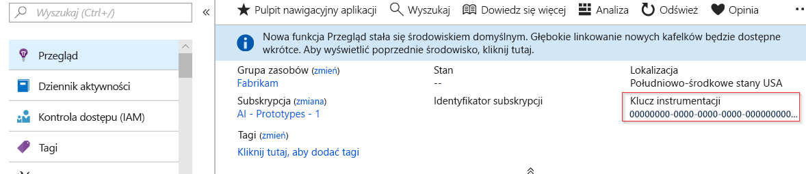
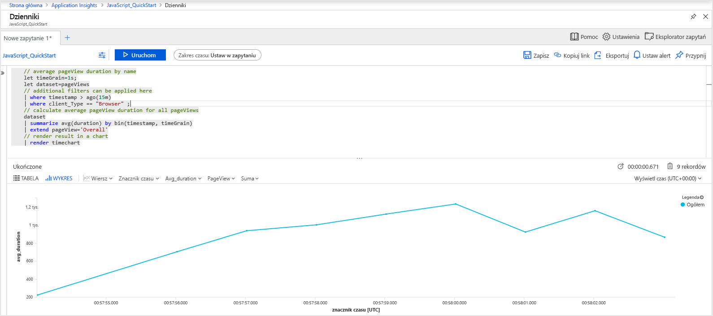
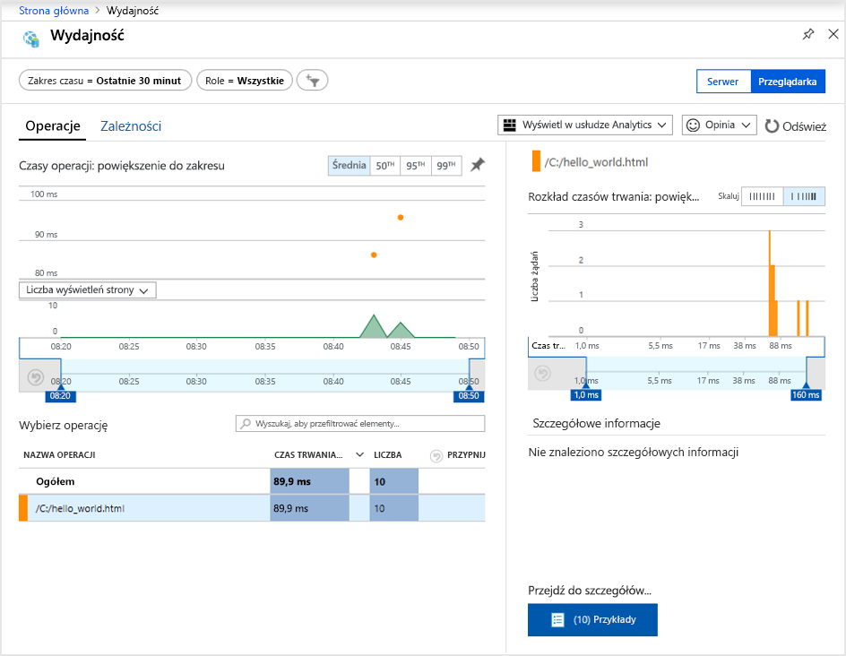
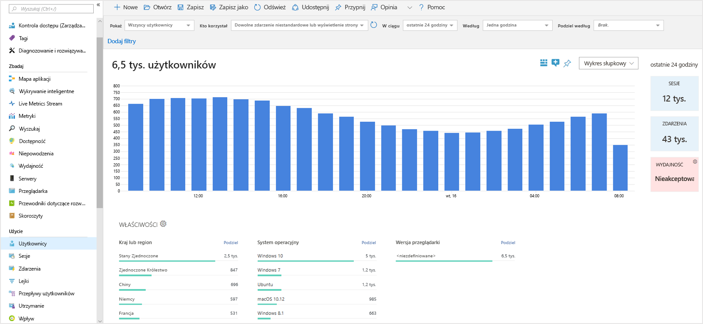
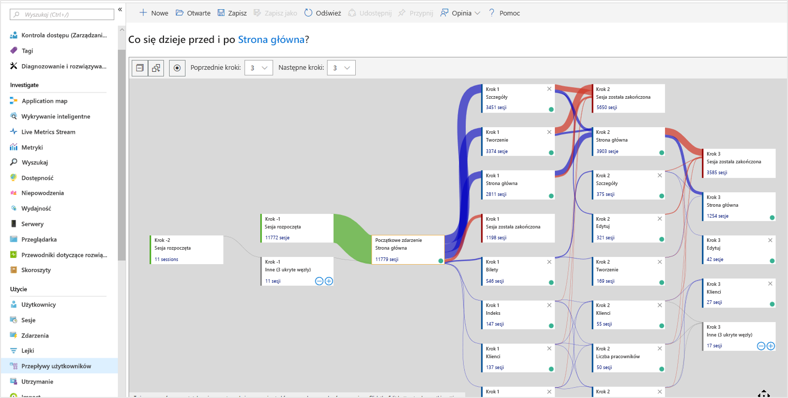

# <a name="start-monitoring-your-website"></a>Rozpoczynanie monitorowania witryny internetowej

Usługa Azure Monitor Application Insights umożliwia łatwe monitorowanie dostępności, wydajności i użycia witryny internetowej. Pozwala też szybko identyfikować i diagnozować błędy w aplikacji bez oczekiwania na zgłoszenie ich przez użytkownika. Usługa Application Insights zapewnia możliwość monitorowania zarówno po stronie serwera, jak i klienta/przeglądarki.

Ten przewodnik Szybki start przeprowadzi Cię przez proces dodawania [zestawu SDK JavaScript usługi Application Insight typu open source](https://github.com/Microsoft/ApplicationInsights-JS), co pozwoli Ci zrozumieć środowisko po stronie klienta/przeglądarki dla użytkowników Twojej witryny internetowej.

## <a name="prerequisites"></a>Wymagania wstępne

Aby ukończyć ten przewodnik Szybki start:

- Konieczna jest subskrypcja platformy Azure.

Jeśli nie masz subskrypcji platformy Azure, przed rozpoczęciem utwórz [bezpłatne](https://azure.microsoft.com/free/) konto.

## <a name="sign-in-to-the-azure-portal"></a>Logowanie się do witryny Azure Portal

Zaloguj się do [portalu Azure](https://portal.azure.com/).

## <a name="enable-application-insights"></a>Włączanie usługi Application Insights

Usługa Application Insights umożliwia zbieranie danych telemetrycznych z dowolnej aplikacji połączonej z Internetem uruchomionej lokalnie lub w chmurze. Aby rozpocząć wyświetlanie tych danych, wykonaj poniższe czynności.

1. Wybierz pozycję **Utwórz zasób** > **Narzędzia do zarządzania** > **Application Insights**.

   > [!NOTE]
   >Jeśli tworzysz zasób Application Insights, możesz dowiedzieć się więcej, odwiedzając artykuł [Tworzenie zasobu Application Insights](https://docs.microsoft.com/azure/azure-monitor/app/create-new-resource) .

   Zostanie wyświetlone okno konfiguracji. Wypełnij pola wejściowe, używając poniższej tabeli.

    | Ustawienia        | Wartość           | Opis  |
   | ------------- |:-------------|:-----|
   | **Nazwa**      | Wartość unikatowa w skali globalnej | Nazwa identyfikująca monitorowaną aplikację |
   | **Grupa zasobów**     | myResourceGroup      | Nazwa nowej grupy zasobów, w której mają być hostowane dane usługi App Insights. istnieje możliwość utworzenia nowej lub użycia istniejącej grupy zasobów. |
   | **Lokalizacja** | Wschodnie stany USA | Wybierz lokalizację w pobliżu Ciebie lub w pobliżu miejsca hostowania aplikacji |

2. Kliknij przycisk **Utwórz**.

## <a name="create-an-html-file"></a>Tworzenie pliku HTML

1. Na komputerze lokalnym utwórz plik o nazwie ``hello_world.html``. W tym przykładzie plik zostanie umieszczony w folderze głównym dysku C: w ścieżce ``C:\hello_world.html``.
2. Skopiuj poniższy skrypt do pliku ``hello_world.html``:

    ```html
    <!DOCTYPE html>
    <html>
    <head>
    <title>Azure Monitor Application Insights</title>
    </head>
    <body>
    <h1>Azure Monitor Application Insights Hello World!</h1>
    <p>You can use the Application Insights JavaScript SDK to perform client/browser-side monitoring of your website. To learn about more advanced JavaScript SDK configurations visit the <a href="https://github.com/Microsoft/ApplicationInsights-JS/blob/master/API-reference.md" title="API Reference">API reference</a>.</p>
    </body>
    </html>
    ```

## <a name="configure-app-insights-sdk"></a>Konfigurowanie zestawu SDK usługi App Insights

1. Wybierz pozycję **Przegląd** > **Podstawy** i skopiuj **klucz instrumentacji** aplikacji.

   

2. Dodaj następujący skrypt do Twojego pliku ``hello_world.html`` przed tagiem zamykającym ``</head>``:

   ```javascript
   <script type="text/javascript">
      var sdkInstance="appInsightsSDK";window[sdkInstance]="appInsights";var aiName=window[sdkInstance],aisdk=window[aiName]||function(e){function n(e){t[e]=function(){var n=arguments;t.queue.push(function(){t[e].apply(t,n)})}}var t={config:e};t.initialize=!0;var i=document,a=window;setTimeout(function(){var n=i.createElement("script");n.src=e.url||"https://az416426.vo.msecnd.net/scripts/b/ai.2.min.js",i.getElementsByTagName("script")[0].parentNode.appendChild(n)});try{t.cookie=i.cookie}catch(e){}t.queue=[],t.version=2;for(var r=["Event","PageView","Exception","Trace","DependencyData","Metric","PageViewPerformance"];r.length;)n("track"+r.pop());n("startTrackPage"),n("stopTrackPage");var s="Track"+r[0];if(n("start"+s),n("stop"+s),n("setAuthenticatedUserContext"),n("clearAuthenticatedUserContext"),n("flush"),!(!0===e.disableExceptionTracking||e.extensionConfig&&e.extensionConfig.ApplicationInsightsAnalytics&&!0===e.extensionConfig.ApplicationInsightsAnalytics.disableExceptionTracking)){n("_"+(r="onerror"));var o=a[r];a[r]=function(e,n,i,a,s){var c=o&&o(e,n,i,a,s);return!0!==c&&t["_"+r]({message:e,url:n,lineNumber:i,columnNumber:a,error:s}),c},e.autoExceptionInstrumented=!0}return t}(
      {
         instrumentationKey:"INSTRUMENTATION_KEY"
      }
      );window[aiName]=aisdk,aisdk.queue&&0===aisdk.queue.length&&aisdk.trackPageView({});
   </script>
   ```

3. Edytuj plik ``hello_world.html`` i dodaj swój klucz instrumentacji.

4. Otwórz plik ``hello_world.html`` w lokalnej sesji przeglądarki. Spowoduje to utworzenie widoku pojedynczej strony. Możesz odświeżyć przeglądarkę, aby wygenerować wiele wyświetleń strony testu.

## <a name="start-monitoring-in-the-azure-portal"></a>Rozpoczynanie monitorowania w witrynie Azure Portal

1. Możesz teraz ponownie otworzyć stronę **Przegląd** usługi Application Insights w witrynie Azure Portal, na której pobrano klucz instrumentacji, w celu wyświetlenia szczegółowych informacji o obecnie uruchomionej aplikacji. Cztery domyślne wykresy na stronie przeglądu są ograniczone do danych aplikacji po stronie serwera. Ponieważ tworzymy instrumentację interakcji po stronie klienta/przeglądarki przy użyciu zestawu SDK języka JavaScript, ten konkretny widok nie ma zastosowania, chyba że mamy również zainstalowany zestaw SDK po stronie serwera.

2. Kliknij pozycję  **Analiza**.  Spowoduje to otwarcie strony **Analiza**, która udostępnia zaawansowany język zapytań na potrzeby analizy wszystkich danych zebranych przez usługę Application Insights. Aby wyświetlić dane dotyczące żądania przeglądarki po stronie klienta, uruchom następujące zapytanie:

    ```kusto
    // average pageView duration by name
    let timeGrain=1s;
    let dataset=pageViews
    // additional filters can be applied here
    | where timestamp > ago(15m)
    | where client_Type == "Browser" ;
    // calculate average pageView duration for all pageViews
    dataset
    | summarize avg(duration) by bin(timestamp, timeGrain)
    | extend pageView='Overall'
    // render result in a chart
    | render timechart
    ```

   

3. Wróć do strony **Przegląd**. Kliknij pozycję **Przeglądarka** z obszaru nagłówka **Zbadaj**, a następnie wybierz pozycję **Wydajność**, gdzie znajdziesz metryki związane z wydajnością własnej witryny internetowej. Istnieje również odpowiedni widok do analizowania błędów i wyjątków w Twojej witrynie internetowej. Możesz kliknąć pozycję **Przykłady**, aby przejść do szczegółowych danych poszczególnych transakcji. Z tego miejsca możesz uzyskać dostęp do środowiska [całościowych szczegółów transakcji](../../azure-monitor/app/transaction-diagnostics.md).

   

4. Aby rozpocząć eksplorację [narzędzi analizy zachowania użytkownika](../../azure-monitor/app/usage-overview.md), wybierz z menu głównego usługi Application Insights pozycję [**Użytkownicy**](../../azure-monitor/app/usage-segmentation.md) w obszarze nagłówka **Użycie**. Ponieważ testujemy z jednego komputera, widzimy tylko dane dla jednego użytkownika. W przypadku witryny internetowej na żywo dystrybucja użytkowników może wyglądać w następujący sposób:

     

5. Jeśli użyliśmy instrumentacji dla bardziej złożonej witryny internetowej z wieloma stronami, innym przydatnym narzędziem są [**Przepływy użytkownika**](../../azure-monitor/app/usage-flows.md). Za pomocą narzędzia **Przepływy użytkownika** możesz śledzić ścieżki, po których poruszają się odwiedzający między różnymi częściami Twojej witryny internetowej.

   

Aby zapoznać się z bardziej zaawansowanymi konfiguracjami do monitorowania witryn internetowych, zobacz [dokumentacja interfejsu API zestawu SDK języka JavaScript](https://github.com/Microsoft/ApplicationInsights-JS/blob/master/API-reference.md).

## <a name="clean-up-resources"></a>Oczyszczanie zasobów

Jeśli planujesz kontynuować pracę z kolejnymi przewodnikami Szybki start lub samouczkami, nie usuwaj zasobów utworzonych w tym przewodniku Szybki start. W przeciwnym razie, jeśli nie planujesz kontynuowania pracy, wykonaj następujące czynności, aby usunąć wszystkie zasoby utworzone w witrynie Azure Portal w ramach tego przewodnika Szybki start.

> [!NOTE]
> Jeśli użyto istniejącej grupy zasobów, poniższe instrukcje nie będą działać i konieczne będzie tylko usunięcie poszczególnych zasobów Application Insights. Należy pamiętać, że usunięcie grupy zasobów powoduje usunięcie wszystkich zasobów underyling, które są członkami tej grupy.

1. W menu znajdującym się po lewej stronie w witrynie Azure Portal kliknij pozycję **Grupy zasobów**, a następnie kliknij pozycję **myResourceGroup**.
2. Na stronie grupy zasobów kliknij pozycję **Usuń**, wpisz w polu tekstowym nazwę **myResourceGroup**, a następnie kliknij pozycję **Usuń**.

## <a name="next-steps"></a>Następne kroki

> [!div class="nextstepaction"]
> [Wyszukiwanie i diagnozowanie problemów z wydajnością](https://docs.microsoft.com/azure/application-insights/app-insights-analytics)
