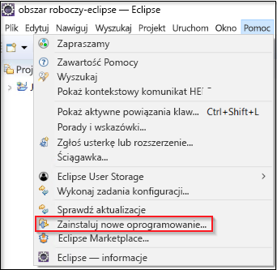
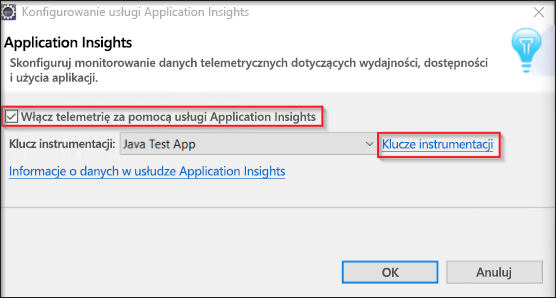

# <a name="start-monitoring-your-java-web-application"></a>Rozpoczynanie monitorowania aplikacji internetowej Java

Usługa Azure Application Insights umożliwia łatwe monitorowanie dostępności, wydajności i użycia aplikacji internetowej. Pozwala też szybko identyfikować i diagnozować błędy w aplikacji bez oczekiwania na zgłoszenie ich przez użytkownika. Zestaw SDK Java usługi Application Insights umożliwia monitorowanie popularnych pakietów innych firm, w tym MongoDB, MySQL i Redis.

Ten przewodnik Szybki start przeprowadzi Cię przez proces dodawania zestawu SDK usługi Application Insights do istniejącego dynamicznego projektu internetowego Java.

## <a name="prerequisites"></a>Wymagania wstępne

Aby ukończyć ten przewodnik Szybki start:

- Instalowanie środowiska JRE w wersji 1.7 lub 1.8
- Zainstaluj [bezpłatne środowisko Eclipse IDE for Java EE Developers](https://www.eclipse.org/downloads/). W tym przewodniku Szybki start jest używane środowisko Eclipse Oxygen (4.7)
- Wymagane są subskrypcja platformy Azure i istniejący dynamiczny projekt internetowy Java
 
Jeśli nie masz dynamicznego projektu internetowego Java, możesz go utworzyć, wykonując instrukcje przedstawione w [przewodniku Szybki start dotyczącym tworzenia aplikacji internetowej Java](https://docs.microsoft.com/azure/app-service-web/app-service-web-get-started-java).

Jeśli nie masz subskrypcji platformy Azure, przed rozpoczęciem utwórz [bezpłatne](https://azure.microsoft.com/free/) konto.

Jeśli wolisz Spring framework, spróbuj [skonfigurować aplikację Spring Boot inicjatora do użycia w przewodniku usługi Application Insights](https://docs.microsoft.com/java/azure/spring-framework/configure-spring-boot-java-applicationinsights)

## <a name="sign-in-to-the-azure-portal"></a>Logowanie się do witryny Azure Portal

Zaloguj się w witrynie [Azure Portal](https://portal.azure.com/).

## <a name="enable-application-insights"></a>Włączanie usługi Application Insights

Usługa Application Insights umożliwia zbieranie danych telemetrycznych z dowolnej aplikacji połączonej z Internetem, niezależnie od tego, czy jest to aplikacja lokalna czy aplikacja w chmurze. Aby rozpocząć wyświetlanie tych danych, wykonaj poniższe czynności.

1. Wybierz pozycję **Utwórz zasób** > **Narzędzia deweloperskie** > **Application Insights**.

   

   

   Zostanie wyświetlone okno konfiguracji. Wypełnij pola wejściowe, używając poniższej tabeli.

    | Ustawienia        | Value           | Opis  |
   | ------------- |:-------------|:-----|
   | **Nazwa**      | Wartość unikatowa w skali globalnej | Nazwa identyfikująca monitorowaną aplikację |
   | **Grupa zasobów**     | myResourceGroup      | Nazwa nowej grupy zasobów hostującej dane usługi App Insights |
   | **Location** | East US | Wybierz lokalizację w pobliżu Ciebie lub w pobliżu miejsca hostowania aplikacji |

2. Kliknij przycisk **Utwórz**.

## <a name="install-app-insights-plugin"></a>Instalowanie wtyczki usługi App Insights

1. Uruchom środowisko **Eclipse**, kliknij pozycję **Help** (Pomoc), wybierz pozycję **Install New Software** (Zainstaluj nowe oprogramowanie).

   

2. Skopiuj adres ```https://dl.microsoft.com/eclipse``` do pola „Work With” (Współdziałanie z), zaznacz pole wyboru **Azure Toolkit for Java** (Zestaw narzędzi platformy Azure dla środowiska Java), wybierz pozycję **Application Insights Plugin for Java** (Wtyczka usługi Application Insights dla środowiska Java)  >  usuń zaznaczenie pola wyboru **Contact all update sites during install to find required software** (Wyszukaj wymagane oprogramowanie we wszystkich witrynach aktualizacji podczas instalacji).

3. Po ukończeniu instalacji pojawi się monit **Restart Eclipse** (Uruchom ponownie środowisko Eclipse).

## <a name="configure-app-insights-plugin"></a>Konfigurowanie wtyczki usługi App Insights

1. Uruchom środowisko **Eclipse**, otwórz **projekt**, kliknij prawym przyciskiem myszy nazwę projektu w widoku **Project Explorer** (Eksplorator projektów), wybierz pozycję **Azure**, a następnie kliknij pozycję **Sign In** (Zaloguj).

2. Wybierz pozycję **Interactive** (Interaktywne) jako metodę uwierzytelniania i kliknij pozycję **Sign In** (Zaloguj). Gdy zostanie wyświetlony monit, wprowadź swoje **poświadczenia platformy Azure** i wybierz **subskrypcję platformy Azure**.

3. Kliknij prawym przyciskiem myszy nazwę projektu w widoku **Project Explorer** (Eksplorator projektów), wybierz pozycję **Azure** i kliknij pozycję **Configure Application Insights** (Konfiguruj usługę Application Insights).

4. Zaznacz pole wyboru **Enable telemetry with Application Insights** (Włącz telemetrię przy użyciu usługi Application Insights), a następnie wybierz zasób usługi App Insights i skojarzony **klucz instrumentacji** do połączenia z aplikacją Java.

   

5. Po skonfigurowaniu wtyczki Application Insights należy jeszcze raz [opublikować/ponownie opublikować](https://docs.microsoft.com/azure/app-service/app-service-web-get-started-java#deploy-the-app) aplikację, zanim będzie mogła ona rozpocząć wysyłanie danych telemetrycznych.

> [!NOTE]
> Zestaw SDK usługi Application Insights dla środowiska Java umożliwia przechwytywanie i wizualizowanie metryk na żywo, jednak po pierwszym włączeniu zbierania danych telemetrycznych dane mogą zacząć pojawiać się w portalu po kilku minutach. W przypadku aplikacji testowej o małym natężeniu ruchu należy pamiętać, że większość metryk jest przechwytywana tylko wtedy, gdy istnieją aktywne żądania lub operacje.

## <a name="start-monitoring-in-the-azure-portal"></a>Rozpoczynanie monitorowania w witrynie Azure Portal

1. Możesz teraz ponownie otworzyć usługę Application Insights **Przegląd** strony w witrynie Azure portal, aby wyświetlić szczegółowe informacje o obecnie uruchomionej aplikacji.

   

2. Kliknij pozycję **Mapa aplikacji**, aby uzyskać wizualny układ relacji zależności między składnikami aplikacji. Każdy składnik przedstawia kluczowe wskaźniki wydajności, takie jak obciążenie, wydajność, błędy i alerty.

   

3.  Kliknij pozycję **analizy aplikacji** ikonę  **Wyświetl w obszarze analiza**.  Spowoduje to otwarcie strony **Analiza usługi Application Insights**, która udostępnia zaawansowany język zapytań na potrzeby analizy wszystkich danych zbieranych przez usługę Application Insights. W tym przypadku jest generowane zapytanie, które renderuje liczbę żądań w formie wykresu. Możesz pisać własne zapytania do analizy innych danych.

   

4. Wróć do strony **Przegląd** i sprawdź grafy kluczowych wskaźników wydajności. Ten pulpit nawigacyjny przedstawia dane statystyczne dotyczące kondycji aplikacji, w tym liczbę żądań przychodzących, czas trwania tych żądań i błędy.

   

   Aby włączyć wykres **Wyświetlenie strony — czas ładowania** z danymi **telemetrycznymi po stronie klienta**, dodaj ten skrypt na każdej stronie, którą chcesz śledzić:

   ```HTML
   <!-- 
   To collect user behavior analytics about your application, 
   insert the following script into each page you want to track.
   Place this code immediately before the closing </head> tag,
   and before any other scripts. Your first data will appear 
   automatically in just a few seconds.
   -->
   <script type="text/javascript">
     var appInsights=window.appInsights||function(config){
     function i(config){t[config]=function(){var i=arguments;t.queue.push(function(){t[config].apply(t,i)})}}var t={config:config},u=document,e=window,o="script",s="AuthenticatedUserContext",h="start",c="stop",l="Track",a=l+"Event",v=l+"Page",y=u.createElement(o),r,f;y.src=config.url||"https://az416426.vo.msecnd.net/scripts/a/ai.0.js";u.getElementsByTagName(o)[0].parentNode.appendChild(y);try{t.cookie=u.cookie}catch(p){}for(t.queue=[],t.version="1.0",r=["Event","Exception","Metric","PageView","Trace","Dependency"];r.length;)i("track"+r.pop());return i("set"+s),i("clear"+s),i(h+a),i(c+a),i(h+v),i(c+v),i("flush"),config.disableExceptionTracking||(r="onerror",i("_"+r),f=e[r],e[r]=function(config,i,u,e,o){var s=f&&f(config,i,u,e,o);return s!==!0&&t["_"+r](config,i,u,e,o),s}),t
    }({
        instrumentationKey:"<instrumentation key>"
    });

    window.appInsights=appInsights;
    appInsights.trackPageView();
   </script>
    ```

5. Kliknij pozycję **Live Stream**. W tym miejscu są wyświetlane metryki na żywo związane z wydajnością aplikacji internetowej Java. Usługa **Live Metrics Stream** obejmuje dane dotyczące liczby żądań przychodzących, czasu trwania tych żądań i błędów. Umożliwia też monitorowanie krytycznych metryk wydajności, takich jak wydajność procesora i pamięci, w czasie rzeczywistym.

   

Więcej informacji na temat monitorowania środowiska Java można znaleźć w [dodatkowej dokumentacji środowiska Java w usłudze App Insights](./../../azure-monitor/app/java-get-started.md).

## <a name="clean-up-resources"></a>Oczyszczanie zasobów

Po zakończeniu testowania, możesz usunąć grupę zasobów i wszystkie pokrewne zasoby. Można więc wykonaj poniższe kroki.

1. W menu znajdującym się po lewej stronie w witrynie Azure Portal kliknij pozycję **Grupy zasobów**, a następnie kliknij pozycję **myResourceGroup**.
2. Na stronie grupy zasobów kliknij pozycję **Usuń**, wpisz w polu tekstowym nazwę **myResourceGroup**, a następnie kliknij pozycję **Usuń**.

## <a name="next-steps"></a>Kolejne kroki

> [!div class="nextstepaction"]
> [Wyszukiwanie i diagnozowanie problemów z wydajnością](https://docs.microsoft.com/azure/application-insights/app-insights-analytics)
