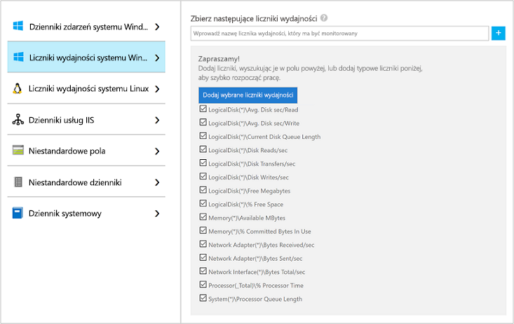

# Zbieranie danych z maszyny wirtualnej platformy Azure za pomocą Azure Monitor

[Azure monitor](../overview.md) może zbierać dane bezpośrednio z maszyn wirtualnych platformy Azure w obszarze roboczym log Analytics w celu uzyskania szczegółowej analizy i korelacji. Zainstalowanie rozszerzenia Log Analytics VM dla [systemów Windows](../../virtual-machines/extensions/oms-windows.md) i [Linux](../../virtual-machines/extensions/oms-linux.md) umożliwia Azure monitor zbieranie danych z maszyn wirtualnych platformy Azure. W tym przewodniku szybki start pokazano, jak skonfigurować i zbierać dane z maszyn wirtualnych z systemem Linux lub Windows przy użyciu rozszerzenia maszyny wirtualnej z kilkoma prostymi krokami.  
 
W tym przewodniku Szybki start przyjęto założenie, że masz już maszynę wirtualną platformy Azure. Jeśli jeszcze jej nie masz, możesz [utworzyć maszynę wirtualną z systemem Windows](../../virtual-machines/windows/quick-create-portal.md) lub [utworzyć maszynę wirtualną z systemem Linux](../../virtual-machines/linux/quick-create-cli.md), wykonując czynności opisane w przewodnikach Szybki start dotyczących maszyn wirtualnych.

## Zaloguj się w witrynie Azure Portal

Zaloguj się do witryny Azure Portal pod adresem [https://portal.azure.com](https://portal.azure.com). 

## Tworzenie obszaru roboczego

1. W witrynie Azure Portal wybierz pozycję **Wszystkie usługi**. Na liście zasobów wpisz **Log Analytics**. Po rozpoczęciu pisania zawartość listy jest filtrowana w oparciu o wpisywane dane. Wybierz **log Analytics obszary robocze**.

       

2. Wybierz pozycję **Utwórz**, a następnie wybierz opcje dla następujących elementów:

   * Podaj nazwę dla nowego **obszaru roboczego usługi Log Analytics**, na przykład *DefaultLAWorkspace*.  
   * Wybierz **Subskrypcję** do połączenia poprzez wybór subskrypcji z listy rozwijanej, jeśli domyślnie wybrana subskrypcja jest niewłaściwa.
   * W obszarze **Grupa zasobów** wybierz istniejącą grupę zasobów, która zawiera co najmniej jedną maszynę wirtualną platformy Azure.  
   * W polu **Lokalizacja** wybierz lokalizację, w której wdrożono maszyny wirtualne.  Aby uzyskać dodatkowe informacje, sprawdź, w których [regionach jest dostępna usługa Log Analytics](https://azure.microsoft.com/regions/services/).
   * W przypadku tworzenia obszaru roboczego w nowej subskrypcji utworzonej po 2 kwietnia 2018 r. zostanie automatycznie użyty plan cenowy *Na GB*, a opcja wyboru warstwy cenowej będzie niedostępna.  W przypadku tworzenia obszaru roboczego dla istniejącej subskrypcji utworzonej przed 2 kwietnia lub dla subskrypcji powiązanej z istniejącą rejestracją umowy EA wybierz preferowaną warstwę cenową.  Aby uzyskać dodatkowe informacje dotyczące konkretnej warstwy, zobacz [Log Analytics — cennik](https://azure.microsoft.com/pricing/details/log-analytics/).
  
         

3. Po podania wymaganych informacji w okienku **obszaru roboczego log Analytics** wybierz pozycję **OK**.  

Podczas weryfikowania informacji i tworzenia obszaru roboczego możesz śledzić postęp w sekcji **Powiadomienia** z poziomu menu. 

## Włączanie rozszerzenia Log Analytics VM Extension

[!INCLUDE [log-analytics-agent-note](../../../includes/log-analytics-agent-note.md)] 

W przypadku wdrożonych już na platformie Azure maszyn wirtualnych z systemem Windows i Linux agent usługi Log Analytics jest instalowany za pomocą rozszerzenia Log Analytics VM Extension. Użycie tego rozszerzenia upraszcza proces instalacji i automatycznie konfiguruje agenta do przesyłania danych do określonego obszaru roboczego usługi Log Analytics. Agent jest również automatycznie uaktualniany po wydaniu nowszej wersji, co gwarantuje, że masz najnowsze funkcje i poprawki. Przed kontynuowaniem sprawdź, czy maszyna wirtualna działa. W przeciwnym razie proces zakończy się niepowodzeniem.  

>[!NOTE]
>Agenta usługi Log Analytics dla systemu Linux nie można skonfigurować w taki sposób, aby przesyłał raporty do więcej niż jednego obszaru roboczego usługi Log Analytics. 

1. W Azure Portal wybierz pozycję **wszystkie usługi** znajdujące się w lewym górnym rogu. Na liście zasobów wpisz **Log Analytics**. Po rozpoczęciu pisania zawartość listy jest filtrowana w oparciu o wpisywane dane. Wybierz **log Analytics obszary robocze**.

2. Na liście obszarów roboczych usługi Log Analytics wybierz utworzony wcześniej obszar *DefaultLAWorkspace*.

3. W menu po lewej stronie w obszarze źródła danych obszaru roboczego wybierz pozycję **maszyny wirtualne**.  

4. Z listy **Maszyny wirtualne** wybierz maszynę wirtualną, na której chcesz zainstalować agenta. Zwróć uwagę, że **Stan połączenia usługi Log Analytics** dla maszyny wirtualnej wskazuje, że jest ona **Niepołączona**.

5. W szczegółach dotyczących maszyny wirtualnej wybierz pozycję **Połącz**. Agent jest automatycznie instalowany i konfigurowany na potrzeby obszaru roboczego usługi Log Analytics. Ten proces trwa kilka minut, podczas gdy **stan** pokazuje **połączenie**.

6. Po zainstalowaniu i połączeniu agenta **Stan połączenia usługi Log Analytics** zostanie zaktualizowany do wartości **Ten obszar roboczy**.

## Zbieranie danych zdarzeń i wydajności

Azure Monitor może zbierać zdarzenia z dzienników zdarzeń systemu Windows lub dziennika systemowego Linux oraz liczników wydajności określonych na potrzeby analizy i raportowania w dłuższym czasie i podejmować działania w przypadku wykrycia określonego warunku. Wykonaj następujące kroki, aby skonfigurować zbieranie zdarzeń z dziennika zdarzeń systemu Windows i dziennika Syslog systemu Linux oraz na początek z kilku typowych liczników wydajności.  

### Zbieranie danych z maszyny wirtualnej z systemem Windows

1. Wybierz pozycję **Ustawienia zaawansowane**.

    

2. Wybierz pozycję **Dane**, a następnie pozycję **Dzienniki zdarzeń systemu Windows**.

3. Dziennik zdarzeń dodaje się przez wpisanie nazwy dziennika.  Wpisz **system** , a następnie wybierz **+** znak plus.

4. W tabeli zaznacz ważności **Błąd** i **Ostrzeżenie**.

5. Wybierz pozycję **Zapisz** w górnej części strony, aby zapisać konfigurację.

6. Wybierz pozycję **Dane wydajności systemu Windows**, aby włączyć zbieranie liczników wydajności na komputerze z systemem Windows.

7. Podczas pierwszej konfiguracji liczników wydajności systemu Windows dla nowego obszaru roboczego usługi Log Analytics można szybko utworzyć kilka typowych liczników. Na liście obok każdego z nich znajduje się pole wyboru.

    

    Wybierz pozycję **Dodaj wybrane liczniki wydajności**.  Są one dodawane i ustawiane wstępnie z dziesięciosekundowym interwałem próbkowania kolekcji.
  
8. Wybierz pozycję **Zapisz** w górnej części strony, aby zapisać konfigurację.

### Zbieranie danych z maszyny wirtualnej z systemem Linux

1. Wybierz dziennik **Syslog**.  

2. Dziennik zdarzeń dodaje się przez wpisanie nazwy dziennika.  Wpisz **Dziennik** systemowy, a następnie wybierz **+** znak plus.  

3. W tabeli Usuń zaznaczenie **informacji o informacjach**dotyczących serwerów, **powiadomienia** i **debugowania**. 

4. Wybierz pozycję **Zapisz** w górnej części strony, aby zapisać konfigurację.

5. Wybierz pozycję **Dane wydajności systemu Linux**, aby włączyć zbieranie liczników wydajności na komputerze z systemem Linux. 

6. Podczas pierwszej konfiguracji liczników wydajności systemu Linux dla nowego obszaru roboczego usługi Log Analytics można szybko utworzyć kilka typowych liczników. Na liście obok każdego z nich znajduje się pole wyboru.

    

    Wybierz pozycję **Zastosuj poniższą konfigurację do moich maszyn** , a następnie wybierz pozycję **Dodaj wybrane liczniki wydajności**.  Są one dodawane i ustawiane wstępnie z dziesięciosekundowym interwałem próbkowania kolekcji.  

7. Wybierz pozycję **Zapisz** w górnej części strony, aby zapisać konfigurację.

## Wyświetlanie zebranych danych

Teraz, po włączeniu zbierania danych, uruchomimy proste przykładowe wyszukiwanie w dziennikach, aby wyświetlić dane z docelowych maszyn wirtualnych.  

1. W wybranym obszarze roboczym w okienku po lewej stronie wybierz pozycję **dzienniki**.

2. Na stronie kwerendy dzienników wpisz `Perf` w edytorze zapytań i wybierz polecenie **Uruchom**.

     

    Na przykład zapytanie na poniższej ilustracji zwróciło 10 000 rekordów wydajności. W Twoim przypadku wyników będzie znacznie mniej.

    

## Oczyszczanie zasobów

Obszar roboczy usługi Log Analytics można usunąć, gdy nie jest już potrzebny. W tym celu wybierz utworzony wcześniej obszar roboczy Log Analytics i na stronie zasób wybierz pozycję **Usuń**.

## Następne kroki

Teraz, kiedy są zbierane dane operacyjne i dane wydajności z maszyn wirtualnych z systemem Windows lub Linux, możesz w prosty sposób rozpocząć eksplorowanie i analizowanie danych oraz wykonywanie działań na *bezpłatnie* zebranych danych.  

Aby dowiedzieć się, jak wyświetlać i analizować dane, przejdź do następnego samouczka.

> [!div class="nextstepaction"]
> [Wyświetlanie i analizowanie danych w usłudze Log Analytics](../../azure-monitor/learn/tutorial-viewdata.md)
