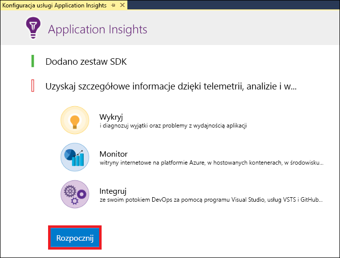
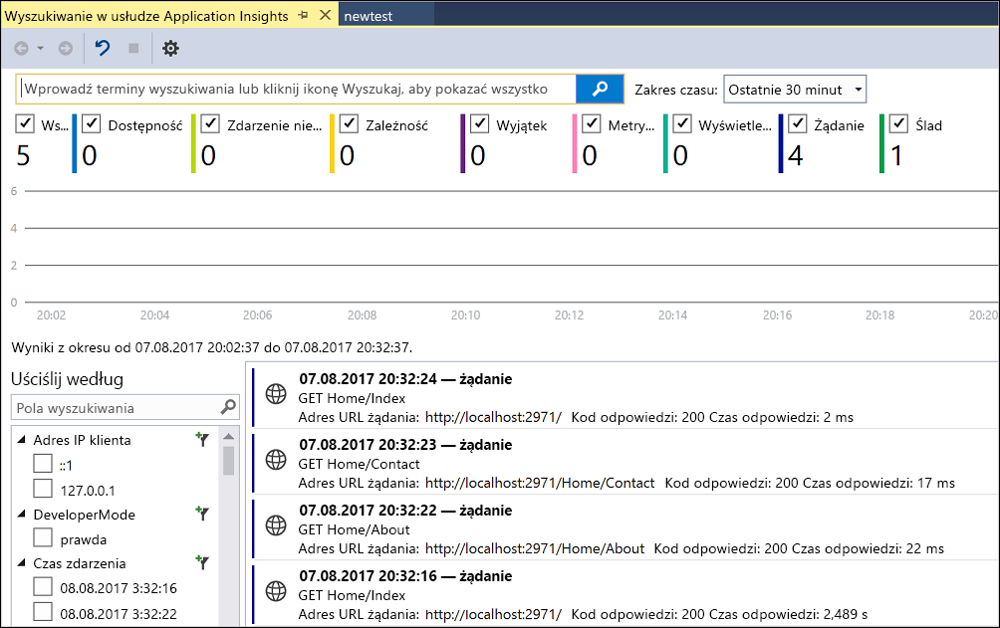
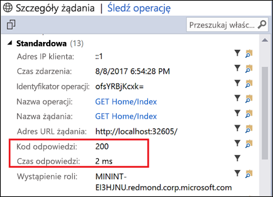

# <a name="start-monitoring-your-aspnet-web-application"></a>Rozpoczynanie monitorowania aplikacji internetowej ASP.NET

Usługa Azure Application Insights umożliwia łatwe monitorowanie dostępności, wydajności i użycia aplikacji internetowej.  Pozwala też szybko identyfikować i diagnozować błędy w aplikacji bez oczekiwania na zgłoszenie ich przez użytkownika.  Dzięki uzyskiwanym za pomocą usługi Application Insights informacjom o wydajności i efektywności aplikacji można dokonywać świadomych wyborów dotyczących konserwacji i udoskonalania aplikacji.

W tym przewodniku Szybki start pokazano, jak dodać usługę Application Insights do istniejącej aplikacji internetowej ASP.NET i rozpocząć korzystanie z jednej z wielu metod analizowania aplikacji — badania statystyk udostępnianych na żywo. Jeśli nie masz ASP.NET aplikacji sieci Web, możesz ją utworzyć po przewodniku [Szybki start aplikacji Tworzenie ASP.NET aplikacji Web App](../../app-service/app-service-web-get-started-dotnet-framework.md).

## <a name="prerequisites"></a>Wymagania wstępne
Aby ukończyć ten przewodnik Szybki start:

- Zainstaluj [program Visual Studio 2019](https://visualstudio.microsoft.com/downloads/?utm_medium=microsoft&utm_source=docs.microsoft.com&utm_campaign=inline+link&utm_content=download+vs2019) z następującymi obciążeniami:
    - Tworzenie aplikacji na platformie ASP.NET i aplikacji internetowych
    - Tworzenie aplikacji na platformie Azure


Jeśli nie masz subskrypcji platformy Azure, utwórz [bezpłatne](https://azure.microsoft.com/free/) konto przed rozpoczęciem.

## <a name="enable-application-insights"></a>Włączanie usługi Application Insights

1. Otwórz swój projekt w programie Visual Studio 2019.
2. Wybierz pozycję **Konfiguruj usługę Application Insights** z menu Projekt. Program Visual Studio doda zestaw SDK usługi Application Insights do aplikacji.

    > [!IMPORTANT]
    > Proces dodawania usługi Application Insights różni się w zależności od typu szablonu platformy ASP.NET. Jeśli używasz szablonu **Pusty** lub **Aplikacja mobilna platformy Azure**, wybierz pozycję **Projekt** > **Dodaj Telemetrię usługi Application Insights**. W przypadku wszystkich pozostałych szablonów platformy ASP.NET zapoznaj się z instrukcjami w powyższym kroku. 

3. Kliknij przycisk **Rozpocznij pracę** (w starszych wersjach programu Visual Studio zamiast tego przycisku znajduje się przycisk **Rozpocznij bezpłatnie**).

    

4. Wybierz swoją subskrypcję i kliknij przycisk **Zarejestruj**.

5. Wybierz**źródło pakietu** > **Pakietów** > Pakietu Programu **Project** > Manage: nuget.org**zaktualizowanie** pakietów zestawu SDK usługi Application Insights do najnowszej stabilnej wersji.

6. Uruchom aplikację, wybierając pozycję **Rozpocznij debugowanie** z menu **Debuguj** lub naciskając klawisz F5.

## <a name="confirm-app-configuration"></a>Potwierdzanie konfiguracji aplikacji

Usługa Application Insights zbiera dane telemetryczne aplikacji niezależnie od tego, gdzie jest ona uruchomiona. Aby rozpocząć wyświetlanie tych danych, wykonaj poniższe czynności.

1. Otwórz aplikację Insights, klikając **pozycję Wyświetl** -> inne**wyszukiwanie w aplikacji systemu****Windows** -> .  Pojawią się dane telemetryczne z bieżącej sesji.<BR><br>

2. Kliknij pierwsze żądanie na liście (w tym przykładzie GET Home/Index), aby wyświetlić jego szczegóły. Zwróć uwagę, że są widoczne kod stanu i czas odpowiedzi, a także inne cenne informacje dotyczące żądania.<br><br>

## <a name="start-monitoring-in-the-azure-portal"></a>Rozpoczynanie monitorowania w witrynie Azure Portal

Możesz teraz otworzyć usługę Application Insights w witrynie Azure Portal i wyświetlić różne szczegółowe informacje o uruchomionej aplikacji.

1. Rozwiń folder **Połączone usługi** (ikona chmury i wtyczki) w Eksploratorze rozwiązań, a następnie kliknij prawym przyciskiem myszy folder Usługi **Application Insights** i kliknij polecenie Otwórz portal **aplikacji .**  Pojawią się wybrane informacje o aplikacji i różne opcje.

    

2. Kliknij pozycję **Mapa aplikacji**, aby uzyskać wizualny układ relacji zależności między składnikami aplikacji.  Każdy składnik przedstawia kluczowe wskaźniki wydajności, takie jak obciążenie, wydajność, błędy i alerty.

    

3. Kliknij ikonę  **w dziennikach (Analytics)** na jednym ze składników aplikacji. Spowoduje to otwarcie **dzienników (Analytics),** który zapewnia bogaty język zapytań do analizowania wszystkich danych zebranych przez usługa Application Insights. W tym przypadku jest generowane zapytanie, które renderuje liczbę żądań w formie wykresu. Możesz pisać własne zapytania do analizy innych danych.

    

4. Kliknij strumień **metryk** na żywo po lewej stronie w obszarze zbadaj. Spowoduje to wyświetlenie danych statystycznych dotyczących uruchomionej aplikacji. Dane te obejmują informacje dotyczące liczby żądań przychodzących, czasu trwania tych żądań i błędów. Można też sprawdzić krytyczne metryki wydajności, takie jak wydajność procesora i pamięci.

    

    Jeśli wszystko jest gotowe do hostowania aplikacji na platformie Azure, można opublikować aplikację. Wykonaj instrukcje opisane w artykule [Create an ASP.NET Web App Quickstart (Przewodnik Szybki Start dotyczący tworzenia aplikacji internetowej ASP.NET)](../../app-service/app-service-web-get-started-dotnet.md#update-the-app-and-redeploy).

5. Jeśli dodajesz monitorowanie w usłudze Application Insights za pomocą programu Visual Studio, możesz automatycznie dodać monitorowanie po stronie klienta. Aby ręcznie dodać do aplikacji monitorowanie po stronie klienta, dodaj do niej następujący kod JavaScript:

```html
<!-- 
To collect user behavior analytics about your application, 
insert the following script into each page you want to track.
Place this code immediately before the closing </head> tag,
and before any other scripts. Your first data will appear 
automatically in just a few seconds.
-->
<script type="text/javascript">
var appInsights=window.appInsights||function(a){
  function b(a){c[a]=function(){var b=arguments;c.queue.push(function(){c[a].apply(c,b)})}}var c={config:a},d=document,e=window;setTimeout(function(){var b=d.createElement("script");b.src=a.url||"https://az416426.vo.msecnd.net/scripts/a/ai.0.js",d.getElementsByTagName("script")[0].parentNode.appendChild(b)});try{c.cookie=d.cookie}catch(a){}c.queue=[];for(var f=["Event","Exception","Metric","PageView","Trace","Dependency"];f.length;)b("track"+f.pop());if(b("setAuthenticatedUserContext"),b("clearAuthenticatedUserContext"),b("startTrackEvent"),b("stopTrackEvent"),b("startTrackPage"),b("stopTrackPage"),b("flush"),!a.disableExceptionTracking){f="onerror",b("_"+f);var g=e[f];e[f]=function(a,b,d,e,h){var i=g&&g(a,b,d,e,h);return!0!==i&&c["_"+f](a,b,d,e,h),i}}return c
  }({
      instrumentationKey:"<your instrumentation key>"
  });

window.appInsights=appInsights,appInsights.queue&&0===appInsights.queue.length&&appInsights.trackPageView();
</script>
```

Aby dowiedzieć się więcej, odwiedź repozytorium GitHub [naszego zestawu SDK typu open-source dla języka JavaScript](https://github.com/Microsoft/ApplicationInsights-JS).

## <a name="video"></a>Film wideo

* Zewnętrzny film krok po kroku dotyczący [konfigurowania usługi Application Insights za pomocą aplikacji .NET od podstaw](https://www.youtube.com/watch?v=blnGAVgMAfA).

## <a name="clean-up-resources"></a>Oczyszczanie zasobów
Po zakończeniu testowania można usunąć grupę zasobów i wszystkie powiązane zasoby. Aby to zrobić, wykonaj poniższe czynności.
1. W menu znajdującym się po lewej stronie w witrynie Azure Portal kliknij pozycję **Grupy zasobów**, a następnie kliknij pozycję **myResourceGroup**.
2. Na stronie grupy zasobów kliknij pozycję **Usuń**, wpisz **myResourceGroup** w polu tekstowym, a następnie kliknij pozycję **Usuń**.

## <a name="next-steps"></a>Następne kroki
W tym przewodniku Szybki start włączono aplikację do monitorowania przez usługę Azure Application Insights.  Przejdź do kolejnych samouczków, aby dowiedzieć się, jak użyć tej usługi do monitorowania statystyk i wykrywania problemów w aplikacji.

> [!div class="nextstepaction"]
> [Samouczki dotyczące usługi Azure Application Insights](tutorial-runtime-exceptions.md)
