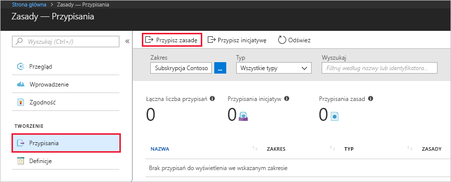
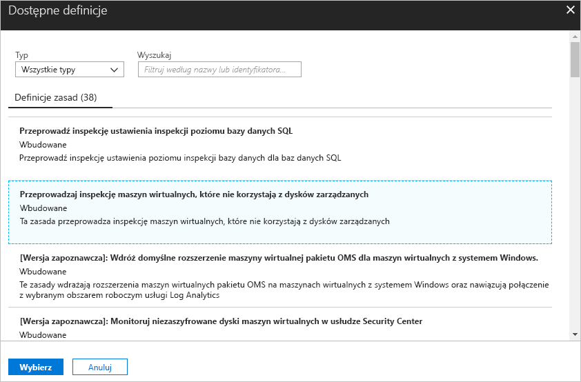
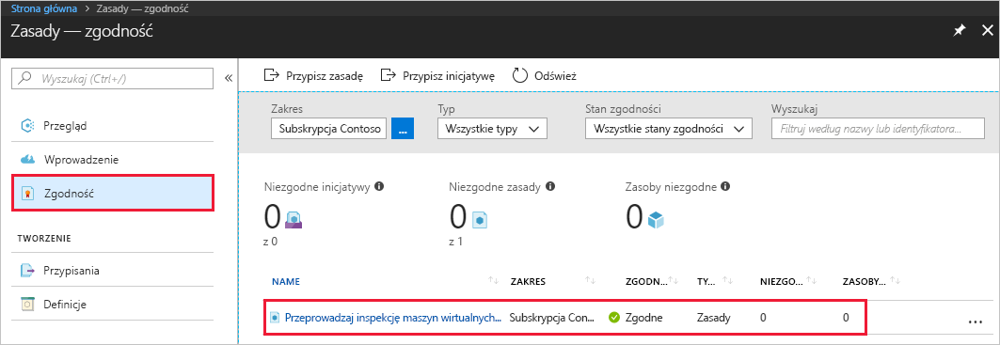
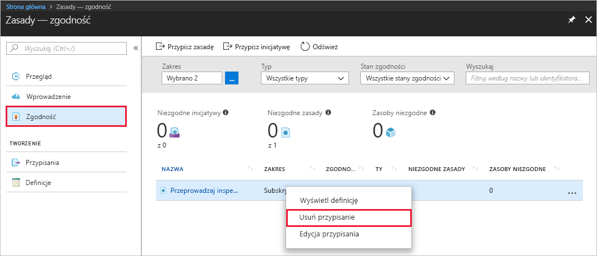

# Tworzenie przypisania zasad w celu zidentyfikowania niezgodnych zasobów w środowisku platformy Azure
Pierwszym krokiem do zrozumienia pojęcia zgodności na platformie Azure jest określenie obecnej sytuacji dotyczącej Twoich zasobów. Ten przewodnik Szybki start przeprowadzi Cię przez proces tworzenia przypisania zasad w celu zidentyfikowania maszyn wirtualnych, które nie korzystają z dysków zarządzanych.

Po zakończeniu tego procesu pomyślnie zidentyfikujesz maszyny wirtualne, które nie korzystają z dysków zarządzanych. Są one *niezgodne* z przypisaniem zasad.

Jeśli nie masz subskrypcji platformy Azure, przed rozpoczęciem utwórz [bezpłatne konto](https://azure.microsoft.com/free/?WT.mc_id=A261C142F).

## Tworzenie przypisania zasad

W tym przewodniku Szybki start utworzysz przypisanie zasad i przypiszesz definicję zasad *Audit Virtual Machines without Managed Disks* (Przeprowadź inspekcję maszyn wirtualnych bez dysków zarządzanych).

1. Wybierz pozycję **Przypisania** w lewym okienku na stronie Azure Policy.
2. Wybierz pozycję **Przypisz zasady** w górnej części okienka **Przypisania**.

   

3. Na stronie **Przypisz zasady** kliknij  obok pola **Zasady**, aby otworzyć listę dostępnych definicji.

   

   Usługa Azure Policy zawiera już wbudowane definicje zasad, których możesz używać. Widoczne są m.in. wbudowane definicje zasad:

   - Enforce tag and its value (Wymuś tag i jego wartość)
   - Apply tag and its value (Zastosuj tag i jego wartość)
   - Require SQL Server Version 12.0 (Wymagaj programu SQL Server w wersji 12.0)

    Aby uzyskać pełną listę wszystkich dostępnych zasad wbudowanych, zobacz [Szablony zasad](json-samples.md).

4. Przeszukaj definicje zasad, aby znaleźć definicję *Audit VMs that do not use managed disks* (Przeprowadź inspekcję maszyn wirtualnych, które nie używają dysków zarządzanych). Kliknij te zasady, a następnie kliknij pozycję **Wybierz**.

   

5. Określ właściwość **Nazwa** przypisania zasad. W tym przypadku można użyć nazwy *Audit VMs that do not use managed disks* (Przeprowadź inspekcję maszyn wirtualnych, które nie używają dysków zarządzanych). Można również dodać opcjonalny **Opis**. Opis zawiera szczegóły dotyczące sposobu identyfikowania przez przypisanie zasad wszystkich maszyn wirtualnych, które nie korzystają z dysków zarządzanych.
6. Zmień warstwę cenową na **Standardowa**, aby upewnić się, że zasady zostaną zastosowane do istniejących zasobów.

   W ramach usługi Azure Policy dostępne są dwie warstwy cenowe — *Bezpłatna* i *Standardowa*. W warstwie Bezpłatna można wprowadzać zasady tylko dla przyszłych zasobów, podczas gdy w warstwie Standardowa można stosować je także do istniejących zasobów, co zapewnia lepsze zrozumienie stanu zgodności z przepisami. Aby dowiedzieć się więcej o cenach, zobacz [Cennik usługi Azure Policy](https://azure.microsoft.com/pricing/details/azure-policy/).

7. Wybierz **Zakres**, do którego chcesz zastosować zasady.  Zakres określa, jakie zasoby lub grupy zasobów są wymuszane w ramach przypisania zasad. Może obejmować zarówno subskrypcje, jak i grupy zasobów.
8. Wybierz wcześniej zarejestrowaną subskrypcję (lub grupę zasobów). W tym przykładzie zastosowano subskrypcję **Azure Analytics Capacity Dev**, ale mogą być dostępne różne opcje. Kliknij pozycję **Wybierz**.

   

9. Pozostaw teraz pole **Wykluczenia** puste, a następnie kliknij pozycję **Przypisz**.

Teraz możesz zidentyfikować niezgodne zasoby, aby poznać stan zgodności Twojego środowiska.

## Identyfikowanie niezgodnych zasobów

Wybierz pozycję **Zgodność** w okienku po lewej stronie i wyszukaj utworzone przypisanie zasad.

Jeśli istnieją jakiekolwiek zasoby niezgodne z nowym przypisaniem, zostaną one wyświetlone w obszarze **Niezgodne zasoby**.

Jeśli warunek zostanie oceniony dla istniejących zasobów i okaże się prawdziwy, zasoby te zostaną oznaczone jako niezgodne z zasadami. Poprzedni przykładowy obraz zawierał niezgodne zasoby. W poniższej tabeli przedstawiono sposób, w jaki różne akcje dotyczące zasad działają w przypadku oceny warunku na potrzeby wynikowego stanu zgodności. Mimo że logika oceny nie jest widoczna w witrynie Azure Portal, wyniki stanu zgodności są wyświetlane. Wynik stanu zgodności może być zgodny lub niezgodny.

| **Stan zasobu** | **Akcja** | **Ocena zasad** | **Stan zgodności** |
| --- | --- | --- | --- |
| Exists | Deny, Audit, Append\*, DeployIfNotExist\*, AuditIfNotExist\* | True | Niezgodne |
| Exists | Deny, Audit, Append\*, DeployIfNotExist\*, AuditIfNotExist\* | False | Zgodne |
| Nowa | Audit, AuditIfNotExist\* | True | Niezgodne |
| Nowa | Audit, AuditIfNotExist\* | False | Zgodne |

\* Akcje Append, DeployIfNotExist i AuditIfNotExist wymagają instrukcji IF z wartością TRUE. Ponadto akcje wymagają, aby warunek istnienia miał wartość FALSE, aby być niezgodnymi. W przypadku wartości TRUE warunek IF wyzwala ocenę warunku istnienia dla powiązanych zasobów.
## Oczyszczanie zasobów

Inne przewodniki w tej kolekcji bazują na tym przewodniku Szybki start. Jeśli planujesz kontynuować pracę z kolejnymi samouczkami, nie usuwaj zasobów utworzonych w tym przewodniku Szybki start. Jeśli nie planujesz kontynuować pracy, wykonaj następujące czynności, aby usunąć wszystkie zasoby utworzone w witrynie Azure Portal w ramach tego przewodnika Szybki start.
1. Wybierz pozycję **Przypisania** w lewym okienku.
2. Wyszukaj utworzone przypisanie, a następnie kliknij je prawym przyciskiem myszy.

   

3.  Wybierz pozycję **Usuń przypisanie**.

## Następne kroki

W tym przewodniku Szybki przypisano definicję zasad do zakresu. Definicja zasad zapewnia, że wszystkie zasoby w ramach zakresu są zgodne, a także określa niezgodne zasoby.

Aby dowiedzieć się więcej na temat przypisywania zasad w celu zapewnienia zgodności zasobów tworzonych w **przyszłości**, przejdź do samouczka:

> [!div class="nextstepaction"]
> [Tworzenie zasad i zarządzanie nimi](./create-manage-policy.md)
