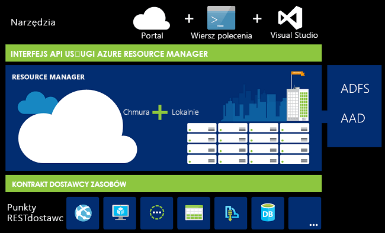
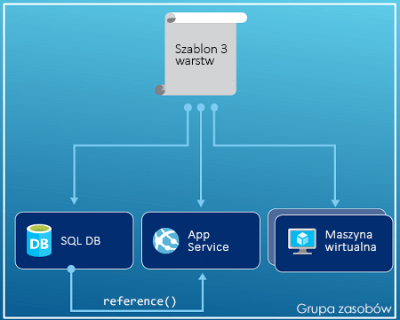
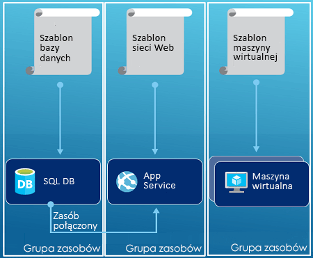

# <a name="azure-resource-manager-overview"></a>Omówienie usługi Azure Resource Manager

Usługa Azure Resource Manager to usługa wdrażania i zarządzania dla platformy Azure. Zapewnia spójną warstwę zarządzania, która umożliwia tworzenie, aktualizowanie i usuwanie zasobów w subskrypcji platformy Azure. Udostępnia także funkcje dostępu, inspekcji i znakowania na potrzeby zabezpieczania i organizowania zasobów po wdrożeniu.

Podczas wykonywania akcji za pomocą portalu, programu PowerShell, wiersza polecenia platformy Azure, interfejsów API REST lub zestawów SDK klienta żądania są obsługiwane przez interfejs API usługi Azure Resource Manager. Ponieważ wszystkie żądania są obsługiwane przez ten sam interfejs API, użytkownik widzi spójne wyniki i możliwości w różnych narzędziach. Wszystkie funkcje, które są dostępne w portalu są również dostępne za pośrednictwem programu PowerShell, interfejsu wiersza polecenia platformy Azure, interfejsów API REST oraz zestawów SDK klienta. Funkcje udostępnione najpierw za pośrednictwem interfejsów API zostaną wprowadzone w witrynie Portal w ciągu 180 dni od początkowego wydania.

Na poniższej ilustracji przedstawiono, jak poszczególne narzędzia wchodzą w interakcję z samym interfejsem API usługi Azure Resource Manager. Interfejs API przekazuje żądania do usługi Resource Manager, która je uwierzytelnia i autoryzuje. Usługa Resource Manager kieruje następnie żądania do odpowiedniej usługi.



## <a name="terminology"></a>Terminologia

Jeśli dopiero zaczynasz korzystać z usługi Azure Resource Manager, oto kilka terminów, których możesz nie znać.

* **Zasób** — dostępny za pośrednictwem platformy Azure element, którym można zarządzać. Przykładami zasobów są maszyny wirtualne, konta magazynu, aplikacje internetowe, bazy danych i sieci wirtualne.
* **Grupa zasobów** — kontener, który zawiera powiązane zasoby rozwiązania dla platformy Azure. Grupa zasobów zawiera zasoby, którymi chcesz zarządzać jako grupą. Użytkownik decyduje o sposobie przydziału zasobów do grup zasobów pod kątem tego, co jest najbardziej odpowiednie dla danej organizacji. Zobacz [Grupy zasobów](#resource-groups).
* **Dostawca zasobów** — usługa dostarczająca zasoby platformy Azure. Na przykład typowym dostawcą zasobów jest **Microsoft.Compute**, który dostarcza zasób maszyny wirtualnej. Innym typowym dostawcą zasobów jest **Microsoft.Storage**. Zobacz [Dostawcy zasobów](#resource-providers).
* **Szablon usługi Resource Manager** — plik w formacie JavaScript Object Notation (JSON) definiujący jeden lub większą liczbę zasobów, które mają zostać wdrożone w grupie zasobów lub subskrypcji. Szablon może służyć do spójnego i wielokrotnego wdrażania zasobów. Zobacz [Wdrażanie na podstawie szablonu](#template-deployment).
* **Składnia deklaratywna** — składnia pozwalająca określić, co zamierzasz utworzyć, bez konieczności pisania w tym celu sekwencji poleceń programistycznych. Przykładem składni deklaratywnej jest szablon usługi Resource Manager. W tym pliku definiuje się właściwości infrastruktury do wdrożenia na platformie Azure.

## <a name="the-benefits-of-using-resource-manager"></a>Zalety korzystania z usługi Resource Manager

Usługa Resource Manager zapewnia kilka korzyści:

* Możliwość grupowego wdrożenia i monitorowania wszystkich zasobów w ramach rozwiązania oraz zarządzania nimi (zamiast obsługiwania zasobów pojedynczo).
* Możliwość wielokrotnego wdrażania rozwiązania w całym cyklu programistycznym z gwarancją spójnego stanu zasobów po każdym wdrożeniu.
* Możliwość zarządzania infrastrukturą przy użyciu szablonów deklaratywnych zamiast skryptów.
* Możliwość definiowania zależności między zasobami, aby wdrażać je w odpowiedniej kolejności.
* Możliwość stosowania kontroli dostępu do wszystkich usług w grupie zasobów dzięki natywnej integracji funkcji kontroli dostępu na podstawie ról z platformą zarządzania.
* Możliwość dodawania tagów do zasobów w celu logicznego uporządkowania wszystkich zasobów w ramach subskrypcji.
* Możliwość wyjaśniania rozliczeń w organizacji przez wyświetlanie kosztów dla grupy zasobów korzystających z tego samego tagu.

## <a name="understand-scope"></a>Objaśnienie zakresu

System Azure oferuje cztery poziomy zakresu: [grup zarządzania](../governance/management-groups/index.md), subskrypcji, [grup zasobów](#resource-groups)i zasobów. Na poniższej ilustracji przedstawiono takie przykładowe warstwy.


Ustawienia zarządzania są stosowane na dowolnych z tych poziomów zakresu. Zasięg zastosowania ustawienia jest określany na podstawie wybranego poziomu. Niższe poziomy dziedziczą ustawienia z wyższych poziomów. Na przykład, po zastosowaniu [zasad](../governance/policy/overview.md) do subskrypcji, zasady są stosowane do wszystkich grup zasobów i zasobów w ramach subskrypcji. Po zastosowaniu zasad w grupie zasobów, które zasady są stosowane grupy zasobów i wszystkie jej zasoby. Jednak w innej grupie zasobów nie ma tego przypisania zasad.

Szablony można wdrażać do grup zarządzania, subskrypcji lub grupy zasobów.

## <a name="guidance"></a>Wskazówki

Poniższe sugestie pomogą Ci w pełni wykorzystać możliwości usługi Resource Manager w pracy z rozwiązaniami.

* Definiuj i wdrażaj infrastrukturę za pomocą składni deklaratywnej w szablonach usługi Resource Manager, a nie za pomocą poleceń imperatywnych.
* Zdefiniuj w szablonie wszystkie etapy wdrażania i konfiguracji. W konfiguracji rozwiązania nie powinno być żadnych etapów ręcznych.
* Korzystaj z poleceń imperatywnych do zarządzania zasobami, np. do uruchamiania i zatrzymywania aplikacji lub maszyny.
* Rozmieść zasoby z tym samym cyklem życia w grupie zasobów. We wszystkich pozostałych operacjach związanych z organizacją zasobów używaj tagów.

Aby uzyskać instrukcje dla przedsiębiorstw dotyczące użycia usługi Resource Manager w celu efektywnego zarządzania subskrypcjami, zobacz [Azure enterprise scaffold - prescriptive subscription governance](/azure/architecture/cloud-adoption-guide/subscription-governance?toc=%2fazure%2fazure-resource-manager%2ftoc.json) (Szkielet platformy Azure dla przedsiębiorstwa — narzucony nadzór subskrypcji).

Aby uzyskać zalecenia dotyczące tworzenia szablonów usługi Resource Manager, zobacz [Best practices for creating Azure Resource Manager templates](template-best-practices.md) (Najlepsze rozwiązania dotyczące tworzenia szablonów usługi Azure Resource Manager).

## <a name="resource-groups"></a>Grupy zasobów
Definiując grupę zasobów, należy wziąć pod uwagę pewne ważne czynniki:

* Wszystkie zasoby w grupie powinny mieć ten sam cykl życia. Są one wdrażane, aktualizowane i usuwane razem. Jeśli jakiś zasób, na przykład serwer bazy danych, ma mieć inny cykl wdrażania, powinien zostać umieszczony w innej grupie zasobów.
* Każdy zasób może znajdować się tylko w jednej grupie zasobów.
* Zasoby w grupie można dodawać i usuwać w dowolnym momencie.
* Zasoby można przenosić między poszczególnymi grupami. Aby uzyskać więcej informacji, zobacz [Move resources to new resource group or subscription](resource-group-move-resources.md) (Przenoszenie zasobów do nowej grupy lub subskrypcji).
* Grupa zasobów może zawierać zasoby, które znajdują się w różnych regionach.
* Grupa zasobów może służyć do określania zakresu kontroli dostępu na potrzeby działań administracyjnych.
* Zasób może wchodzić w interakcję z zasobami znajdującymi się w innych grupach zasobów. Ta interakcja jest typowa, gdy dwa zasoby są ze sobą powiązane, ale nie mają tego samego cyklu życia (na przykład aplikacje internetowe łączące się z bazą danych).

Podczas tworzenia grupy zasobów, należy podać lokalizację dla danej grupy zasobów. Być może zastanawiasz się, „Dlaczego grupa zasobów wymaga określenia lokalizacji? Ponadto dlaczego lokalizacja grupy zasobów jest w ogóle istotna, skoro zasoby mogą znajdować się w innej lokalizacji niż grupa zasobów?” Grupa zasobów przechowuje metadane dotyczące zasobów. Z tego powodu określając lokalizację dla grupy zasobów, określasz miejsce, w którym przechowywane są metadane. Dla zachowania zgodności może być konieczne upewnienie się, że dane są przechowywane w odpowiednim regionie.

Jeśli region grupy zasobów jest tymczasowo niedostępny, nie można zaktualizować zasobów w grupie zasobów, ponieważ metadane są niedostępne. Zasoby w innych regionach będą nadal działać zgodnie z oczekiwaniami, ale nie można zaktualizować. Aby uzyskać więcej informacji na temat tworzenia niezawodnych aplikacji, zobacz [projektowania niezawodnych aplikacji Azure](/azure/architecture/reliability/).

## <a name="resource-providers"></a>Dostawcy zasobów

Każdy dostawca zasobów udostępnia zestaw zasobów i operacji do pracy z tymi zasobami. Na przykład w celu przechowywania kluczy i kluczy tajnych należy użyć dostawcy zasobów **Microsoft.KeyVault**. Ten dostawca zasobów udostępnia typ zasobu o nazwie **magazyny** umożliwiający utworzenie magazynu kluczy.

Nazwa typu zasobu ma następujący format: **{dostawca_zasobów}/{typ_zasobu}** . Typ zasobu dla magazynu kluczy to **Microsoft.KeyVault/magazyny**.

Przed rozpoczęciem wdrażania zasobów należy uzyskać wiedzę na temat dostępnych dostawców zasobów. Znajomość nazw zasobów i ich dostawców pomaga określić zasoby, które mają zostać wdrożone na platformie Azure. Dodatkowo trzeba znać prawidłowe lokalizacje i wersje interfejsów API dla każdego typu zasobu. Aby uzyskać więcej informacji, zobacz [Dostawcy zasobów i ich typy](resource-manager-supported-services.md).

Dla wszystkich operacji oferowanych przez dostawców zasobów zobacz [interfejsy API REST platformy Azure](/rest/api/azure/).

## <a name="template-deployment"></a>Wdrażanie na podstawie szablonu

Usługa Resource Manager umożliwia utworzenie szablonu (w formacie JSON) do definiowania infrastruktury i konfiguracji rozwiązania platformy Azure. Dzięki szablonowi można wielokrotnie wdrażać rozwiązanie w całym jego cyklu życia z gwarancją spójnego stanu zasobów po każdym wdrożeniu.

Aby dowiedzieć się więcej o formacie szablonu i sposobie jego konstruowania, zobacz [Understand the structure and syntax of Azure Resource Manager templates (Omówienie struktury i składni szablonów usługi Azure Resource Manager)](resource-group-authoring-templates.md). Aby wyświetlić składnię JSON dla typów zasobów, zobacz [Define resources in Azure Resource Manager templates](/azure/templates/) (Definiowanie zasobów w szablonach usługi Azure Resource Manager).

Usługa Resource Manager przetwarza szablon jak każde inne żądanie. Szablon jest analizowany, a jego składnia zostaje poddana konwersji do operacji interfejsu API REST dla odpowiednich dostawców zasobów. Na przykład, gdy usługa Resource Manager odbiera szablon o następującej definicji zasobu:

```json
"resources": [
  {
    "apiVersion": "2016-01-01",
    "type": "Microsoft.Storage/storageAccounts",
    "name": "mystorageaccount",
    "location": "westus",
    "sku": {
      "name": "Standard_LRS"
    },
    "kind": "Storage",
    "properties": {
    }
  }
]
```

Konwertuje definicję do następującej operacji interfejsu API REST, która zostaje wysłana do dostawcy zasobów Microsoft.Storage:

```HTTP
PUT
https://management.azure.com/subscriptions/{subscriptionId}/resourceGroups/{resourceGroupName}/providers/Microsoft.Storage/storageAccounts/mystorageaccount?api-version=2016-01-01
REQUEST BODY
{
  "location": "westus",
  "properties": {
  }
  "sku": {
    "name": "Standard_LRS"
  },
  "kind": "Storage"
}
```

Sposób definiowania szablonów i grup zasobów zależy wyłącznie od użytkownika, podobnie jak sposób zarządzania rozwiązaniem. Można na przykład wdrożyć aplikację trójwarstwową za pomocą jednego szablonu do pojedynczej grupy zasobów.



Nie trzeba jednak definiować całej infrastruktury w jednym szablonie. Często dobrym rozwiązaniem jest podział wymagań dotyczących wdrożenia na szablony przeznaczone do określonego celu. Te szablony mogą bez problemu być używane wielokrotnie w różnych rozwiązaniach. Aby wdrożyć dane rozwiązanie, należy utworzyć szablon wzorcowy połączony ze wszystkimi wymaganymi szablonami. Na poniższej ilustracji przedstawiono sposób wdrażania rozwiązania trójwarstwowego za pomocą szablonu nadrzędnego, który zawiera trzy szablony zagnieżdżone.


Jeśli przewidujesz, że warstwy będą miały osobne cykle, możesz wdrożyć trzy warstwy do osobnych grup zasobów. Należy pamiętać, że zasoby mogą nadal być powiązane z zasobami w innych grupach zasobów.



Informacje dotyczące szablonów zagnieżdżonych można znaleźć w temacie [Using linked templates with Azure Resource Manager](resource-group-linked-templates.md) (Używanie szablonów połączonych w usłudze Azure Resource Manager).

Usługa Azure Resource Manager analizuje zależności i sprawdza, czy zasoby są tworzone we właściwej kolejności. Jeśli jeden zasób opiera się na wartości z innego zasobu (na przykład maszyna wirtualna wymagająca konta magazynu na potrzeby dysków), ustawiana jest zależność. Aby uzyskać więcej informacji, zobacz [Defining dependencies in Azure Resource Manager templates](resource-group-define-dependencies.md) (Definiowanie zależności w szablonach usługi Azure Resource Manager).

Szablonu można także używać w celu aktualizacji infrastruktury. Można na przykład dodać zasób do rozwiązania lub dodać reguły konfiguracji dla już wdrożonych zasobów. Jeśli szablon definiuje zasób, który już istnieje, usługa Resource Manager aktualizuje istniejący zasób zamiast tworzyć nowy.

Usługa Resource Manager zapewnia rozszerzenia na potrzeby sytuacji, gdy potrzebne są dodatkowe operacje, które nie są uwzględnione w konfiguracji (np. zainstalowanie konkretnego oprogramowania). Jeśli używasz już usługi do zarządzania konfiguracją, takiej jak DSC, Chef lub Puppet, dzięki rozszerzeniom możesz z nią dalej bez przeszkód pracować. Aby uzyskać informacje o rozszerzeniach i funkcjach maszyn wirtualnych, zobacz [Informacje o rozszerzeniach i funkcjach maszyn wirtualnych](../virtual-machines/windows/extensions-features.md?toc=%2fazure%2fvirtual-machines%2fwindows%2ftoc.json).

W przypadku tworzenia rozwiązania z portalu rozwiązanie automatycznie zawiera szablon wdrożenia. Nie trzeba tworzyć szablonu od początku — można zacząć od szablonu istniejącego rozwiązania i dostosować go do konkretnych potrzeb. Aby zapoznać się z przykładem, zobacz [Szybki start: Tworzenie i wdrażanie szablonów usługi Azure Resource Manager przy użyciu witryny Azure Portal](./resource-manager-quickstart-create-templates-use-the-portal.md). Aby uzyskać szablon dla istniejącej grupy zasobów, można także wyeksportować bieżący stan tej grupy lub skorzystać z szablonu użytego do określonego wdrożenia. Przeglądając [wyeksportowany szablon](./manage-resource-groups-portal.md#export-resource-groups-to-templates), można poznać jego składnię.

Ponadto szablon staje się częścią kodu źródłowego aplikacji. Można go zaewidencjonować w repozytorium kodu źródłowego i aktualizować w miarę rozwijania aplikacji. Do edycji szablonu można używać programu Visual Studio.

Po zdefiniowaniu szablonu można przystąpić do wdrażania zasobów na platformie Azure. Aby wdrożyć zasoby, zobacz:

* [Deploy resources with Resource Manager templates and Azure PowerShell (Wdrażanie zasobów za pomocą szablonów usługi Resource Manager i programu Azure PowerShell)](resource-group-template-deploy.md)
* [Deploy resources with Resource Manager templates and Azure CLI (Wdrażanie zasobów za pomocą szablonów usługi Resource Manager i interfejsu wiersza polecenia platformy Azure)](resource-group-template-deploy-cli.md)
* [Deploy resources with Resource Manager templates and Azure portal (Wdrażanie zasobów za pomocą szablonów usługi Resource Manager i witryny Azure Portal)](resource-group-template-deploy-portal.md)
* [Deploy resources with Resource Manager templates and Resource Manager REST API (Wdrażanie zasobów za pomocą szablonów usługi Resource Manager i interfejsu API REST usługi Resource Manager)](resource-group-template-deploy-rest.md)

## <a name="safe-deployment-practices"></a>Praktyki bezpiecznego wdrażania

Podczas wdrażania złożonej usługi na platformie Azure może być konieczne wdrożenie swojej usługi w wielu regionach i sprawdzenie jej kondycji przed przejściem do następnego kroku. Użyj usługi [Azure Deployment Manager](deployment-manager-overview.md) do koordynowania etapowego wdrażania usługi. Dzięki etapowemu wdrażaniu Twojej usługi możesz znaleźć potencjalne problemy zanim zostanie ona wdrożona we wszystkich regionach. Jeśli nie potrzebujesz tych środków ostrożności, operacje wdrażania w poprzedniej sekcji są lepszym rozwiązaniem.

Usługa Deployment Manager jest obecnie w publicznej wersji zapoznawczej.

## <a name="resiliency-of-azure-resource-manager"></a>Odporność platformy Azure Resource Manager

Usługa Azure Resource Manager jest przeznaczona dla odporności i stałej dostępności. Operacje płaszczyzny Menedżera zasobów i kontroli (żądania wysyłane do management.azure.com) w interfejsu API REST są:

* Rozproszone w wielu regionach. Niektóre usługi są regionalne.

* Rozpowszechniane w różnych strefach dostępności (jak dobrze regiony) w lokalizacjach, które mają w wielu strefach dostępności.

* Nie jest ona zależna od pojedynczego logicznego centrum danych.

* Nigdy niepobrane konserwacyjne.

Odporność to ma zastosowanie do usług, które odbierania żądań przy użyciu usługi Resource Manager. Na przykład usługi Key Vault korzyści związane z tym odporności.

[!INCLUDE [arm-tutorials-quickstarts](../../includes/resource-manager-tutorials-quickstarts.md)]

## <a name="next-steps"></a>Kolejne kroki

W tym artykule przedstawiono sposób wdrażania zasobów na platformie Azure, kontrolowania dostępu do tych zasobów oraz zarządzania nimi za pomocą usługi Azure Resource Manager. Przejdź do następnego artykułu, aby dowiedzieć się, jak utworzyć swój pierwszy szablon usługi Azure Resource Manager.

> [!div class="nextstepaction"]
> [Szybki start: Tworzenie i wdrażanie szablonów usługi Azure Resource Manager przy użyciu witryny Azure Portal](./resource-manager-quickstart-create-templates-use-the-portal.md)
