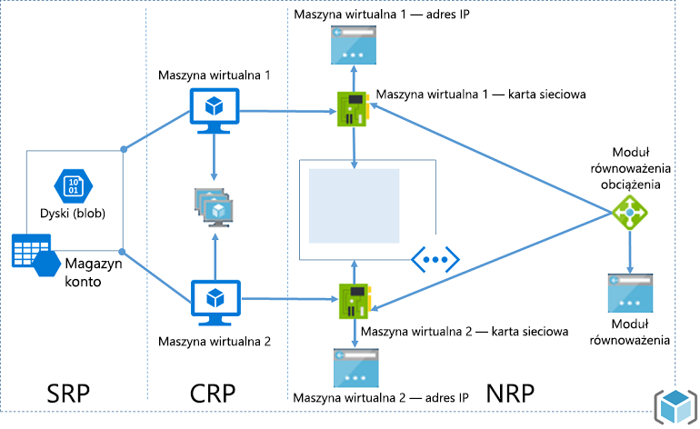
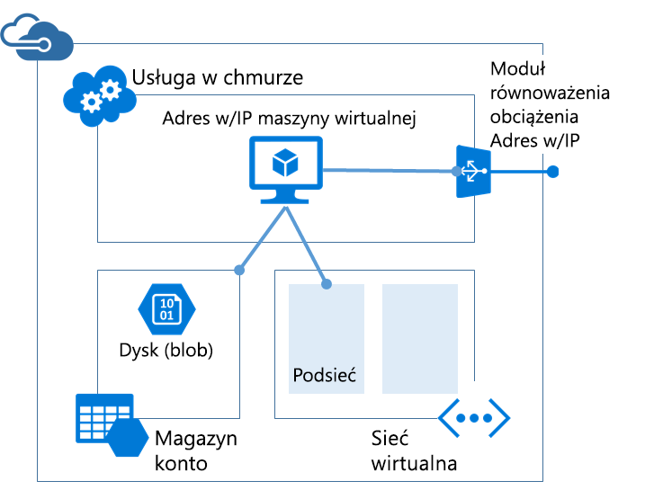

# <a name="azure-resource-manager-vs-classic-deployment-understand-deployment-models-and-the-state-of-your-resources"></a>Porównanie usługi Azure Resource Manager i wdrożenia klasycznego: omówienie modeli wdrażania i stanu zasobów

> [!NOTE]
> Informacje zawarte w tym artykule powinny zostać użyte wyłącznie podczas migracji z klasycznego wdrożenia do wdrożenia w usłudze Azure Resource Manager.

Ten artykuł zawiera informacje o modelu wdrażania przy użyciu usługi Resource Manager i modelu klasycznym. Model wdrażania przy użyciu usługi Resource Manager i model klasyczny to dwa różne sposoby wdrażania rozwiązań platformy Azure i zarządzania nimi. Stosuje się je za pośrednictwem dwóch różnych zestawów interfejsów API, a wdrożone zasoby mogą zawierać znaczące różnice. Te dwa modele nie są ze sobą zgodne. W tym artykule opisano te różnice.

Aby uprościć wdrażanie i zarządzanie zasobami, firma Microsoft zaleca używanie usługi Resource Manager dla wszystkich nowych zasobów. Firma Microsoft zaleca ponowne wdrożenie istniejących zasobów przy użyciu usługi Resource Manager, jeśli to możliwe.

Jeśli dopiero zaczynasz korzystanie z usługi Resource Manager, zapoznaj się najpierw z terminologią określoną w [omówieniu usługi Azure Resource Manager](resource-group-overview.md).

[!INCLUDE [updated-for-az](../../includes/updated-for-az.md)]

## <a name="history-of-the-deployment-models"></a>Historia modeli wdrażania
Pierwotnie na platformie Azure dostępny był tylko klasyczny model wdrażania. W tym modelu każdy zasób istniał niezależnie; nie było możliwości grupowania powiązanych zasobów. Zamiast tego trzeba było ręcznie śledzić, z których zasobów składa się dane rozwiązanie lub aplikacja, i pamiętać o zarządzaniu nimi w sposób skoordynowany. Aby wdrożyć rozwiązanie, trzeba było utworzyć każdy zasób oddzielnie za pośrednictwem portalu lub utworzyć skrypt, który wdrażał wszystkie zasoby w odpowiedniej kolejności. Aby usunąć rozwiązanie, trzeba było usunąć każdy zasób osobno. Nie można było łatwo stosować ani aktualizować zasad kontroli dostępu dla powiązanych zasobów. Nie można było też stosować tagów do zasobów w celu oznaczenia ich terminami ułatwiającymi monitorowanie zasobów i zarządzanie rozliczeniami.

W 2014 roku na platformie Azure dodano usługę Resource Manager, która wprowadziła pojęcie grupy zasobów. Grupa zasobów to kontener dla zasobów mających wspólny cykl życia. Model wdrażania przy użyciu usługi Resource Manager zapewnia kilka korzyści:

* Możliwość grupowego wdrożenia i monitorowania wszystkich usług w ramach rozwiązania oraz zarządzania nimi (zamiast obsługiwania usług pojedynczo).
* Możliwość wielokrotnego wdrażania rozwiązania w całym jego cyklu życia z gwarancją spójnego stanu zasobów po każdym wdrożeniu.
* Możliwość stosowania kontroli dostępu do wszystkich zasobów w grupie zasobów. Te zasady są automatycznie stosowane podczas dodawania nowych zasobów do grupy.
* Możliwość dodawania tagów do zasobów w celu logicznego uporządkowania wszystkich zasobów w ramach subskrypcji.
* Możliwość definiowania infrastruktury rozwiązania za pomocą formatu JavaScript Object Notation (JSON). Plik JSON jest nazywany szablonem usługi Resource Manager.
* Możliwość definiowania zależności między zasobami, aby wdrażać je w odpowiedniej kolejności.

W momencie dodania usługi Resource Manager wszystkie zasoby zostały wstecznie dodane do domyślnych grup zasobów. Jeśli utworzysz teraz zasób przy użyciu klasycznego modelu wdrażania, zasób ten zostanie automatycznie utworzony w domyślnej grupie zasobów dla danej usługi, mimo iż podczas wdrażania nie określono grupy zasobów. Jednak sam fakt istnienia w grupie zasobów nie oznacza, że zasób został przekonwertowany na model usługi Resource Manager.

## <a name="understand-support-for-the-models"></a>Omówienie obsługi modeli

Istnieją trzy scenariusze:

1. Usługi Cloud Services nie obsługują modelu wdrażania przy użyciu usługi Resource Manager.
2. Maszyny wirtualne, konta magazynu i sieci wirtualne obsługują zarówno model wdrażania przy użyciu usługi Resource Manager, jak i model klasyczny.
3. Wszystkie pozostałe usługi platformy Azure obsługują usługę Resource Manager.

Jeśli w przypadku maszyn wirtualnych, kont magazynu i sieci wirtualnych zasób został utworzony przy użyciu modelu klasycznego, należy nadal go używać za pośrednictwem operacji klasycznych. Jeśli maszynę wirtualną, konto magazynu lub sieć wirtualną utworzono przy użyciu wdrożenia usługi Resource Manager, należy kontynuować korzystanie z operacji usługi Resource Manager. To zróżnicowanie może sprawiać trudności, gdy subskrypcja zawiera zarówno zasoby utworzone za pomocą wdrożenia usługi Resource Manager, jak i wdrożenia klasycznego. Taka kombinacja zasobów może dawać nieoczekiwane wyniki, ponieważ zasoby nie obsługują tych samych operacji.

W niektórych przypadkach polecenie usługi Resource Manager może pobrać informacje o zasobie utworzonym przy użyciu wdrożenia klasycznego lub może wykonać zadanie administracyjne takie jak przeniesieni zasobu klasycznego do innej grupy zasobów. Jednak nie powinno to sugerować, że dany typ obsługuje operacje usługi Resource Manager. Na przykład załóżmy, że masz grupę zasobów, która zawiera maszynę wirtualną utworzoną przy użyciu wdrażania klasycznego. Jeśli uruchomisz następujące polecenie programu PowerShell usługi Resource Manager:

```powershell
Get-AzResource -ResourceGroupName ExampleGroup -ResourceType Microsoft.ClassicCompute/virtualMachines
```

Zwróci ono maszynę wirtualną:

```powershell
Name              : ExampleClassicVM
ResourceId        : /subscriptions/{guid}/resourceGroups/ExampleGroup/providers/Microsoft.ClassicCompute/virtualMachines/ExampleClassicVM
ResourceName      : ExampleClassicVM
ResourceType      : Microsoft.ClassicCompute/virtualMachines
ResourceGroupName : ExampleGroup
Location          : westus
SubscriptionId    : {guid}
```

Jednak polecenie cmdlet usługi Resource Manager **Get-AzVM** zwraca tylko maszyny wirtualne wdrożone przy użyciu usługi Resource Manager. Poniższe polecenie nie zwraca maszyny wirtualnej utworzonej przy użyciu wdrożenia klasycznego.

```powershell
Get-AzVM -ResourceGroupName ExampleGroup
```

Tylko zasoby utworzone przy użyciu usługi Resource Manager obsługują tagi. Nie można zastosować tagów do zasobów klasycznych.

## <a name="changes-for-compute-network-and-storage"></a>Zmiany dotyczące zasobów obliczeniowych, sieciowych i magazynu
Poniższy diagram przedstawia zasoby obliczeniowe, sieciowe i magazynu wdrożone przy użyciu usługi Resource Manager.



Pamiętaj o następujących relacjach między zasobami:

* Wszystkie zasoby istnieją w ramach grupy zasobów.
* Maszyna wirtualna jest zależna od określonego konta magazynu zdefiniowanego w dostawcy zasobów magazynu na potrzeby przechowywania dysków w magazynie obiektów blob (wymagane).
* Maszyna wirtualna odwołuje się do określonej karty sieciowej zdefiniowanej w dostawcy zasobów sieciowych (wymagane) i zestawu dostępności zdefiniowanego w dostawcy zasobów obliczeniowych (opcjonalne).
* Karta sieciowa odwołuje się do przypisanego adresu IP maszyny wirtualnej (wymagane), podsieci sieci wirtualnej maszyny wirtualnej (wymagane) i do sieciowej grupy zabezpieczeń (opcjonalne).
* Podsieć sieci wirtualnej odwołuje się do sieciowej grupy zabezpieczeń sieci (opcjonalne).
* Wystąpienie modułu równoważenia obciążenia odwołuje się do puli zaplecza adresów IP, które obejmują kartę sieciową maszyny wirtualnej (opcjonalne), oraz do publicznego lub prywatnego adresu IP modułu równoważenia obciążenia (opcjonalne).

Poniżej przedstawiono składniki oraz ich relacje dla wdrożenia klasycznego:



Klasyczne rozwiązanie dla hostowania maszyny wirtualnej obejmuje następujące elementy:

* Wymagana usługa w chmurze, która działa jako kontener do hostowania maszyn wirtualnych (obliczenia). Maszyny wirtualne są automatycznie udostępniane z kartą sieciową i adresem IP przypisanym przez platformę Azure. Ponadto usługa w chmurze zawiera wystąpienie zewnętrznego modułu równoważenia obciążenia, publiczny adres IP oraz domyślne punkty końcowe umożliwiające korzystanie z ruchu pulpitu zdalnego i ruchu zdalnego programu PowerShell dla maszyn wirtualnych opartych na systemie Windows oraz z ruchu protokołu Secure Shell (SSH) dla maszyn wirtualnych opartych na systemie Linux.
* Wymagane konto magazynu przechowujące wirtualne dyski twarde maszyny wirtualnej, w tym system operacyjny oraz tymczasowe i dodatkowe dyski danych (magazyn).
* Opcjonalna sieć wirtualna działająca jako dodatkowy kontener, w którym można utworzyć podzieloną na podsieci infrastrukturę i wyznaczyć podsieć, na której znajduje się maszyna wirtualna (sieć).

W poniższej tabeli opisano zmiany dotyczące interakcji dostawców zasobów obliczeniowych, sieciowych i magazynu:

| Element | Klasyczny | Resource Manager |
| --- | --- | --- |
| Usługa w chmurze dla maszyn wirtualnych |Usługa w chmurze stanowiła kontener do przechowywania maszyn wirtualnych wymagających dostępności na platformie oraz równoważenia obciążenia. |Usługa w chmurze nie jest już obiektem wymaganym do utworzenia maszyny wirtualnej przy użyciu nowego modelu. |
| Sieci wirtualne |Sieć wirtualna jest opcjonalna dla maszyny wirtualnej. Jeśli sieć wirtualna zostanie uwzględniona, nie będzie można jej wdrożyć przy użyciu usługi Resource Manager. |Maszyna wirtualna wymaga sieci wirtualnej, która została wdrożona przy użyciu usługi Resource Manager. |
| Konta magazynu |Maszyna wirtualna wymaga konta magazynu przechowującego wirtualne dyski twarde systemu operacyjnego oraz tymczasowe i dodatkowe dyski danych. |Maszyna wirtualna wymaga konta magazynu do przechowywania dysków w magazynie obiektów blob. |
| Zestawy dostępności |Dostępność dla platformy była wskazywana przez skonfigurowanie na maszynach wirtualnych takiego samego parametru „AvailabilitySetName”. Maksymalna liczba domen błędów wynosiła 2. |Zestaw dostępności to zasób udostępniany przez dostawcę Microsoft.Compute. Maszyny wirtualne wymagające wysokiej dostępności muszą należeć do zestawu dostępności. Maksymalna liczba domen błędów wynosi obecnie 3. |
| Grupy koligacji |Grupy koligacji były wymagane do tworzenia sieci wirtualnych. Przestały być wymagane wraz z wprowadzeniem regionalnych sieci wirtualnych. |Dla uproszczenia pojęcie grup koligacji nie jest stosowane w interfejsach API udostępnianych za pośrednictwem usługi Azure Resource Manager. |
| Równoważenie obciążenia |Utworzenie usługi w chmurze zapewnia niejawny moduł równoważenie obciążenia dla wdrożonych maszyn wirtualnych. |Usługa Load Balancer stanowi zasób udostępniany przez dostawcę Microsoft.Network. Podstawowy interfejs sieciowy maszyn wirtualnych wymagający równoważenia obciążenia powinien odwoływać się do modułu równoważenia obciążenia. Moduły równoważenia obciążenia mogą być wewnętrzne lub zewnętrzne. Wystąpienie modułu równoważenia obciążenia odwołuje się do puli zaplecza adresów IP, które obejmują kartę sieciową maszyny wirtualnej (opcjonalne), oraz do publicznego lub prywatnego adresu IP modułu równoważenia obciążenia (opcjonalne). |
| Wirtualny adres IP |Po dodaniu maszyny wirtualnej do usługi w chmurze usługom w chmurze zostaje przypisany domyślny adres VIP (wirtualny adres IP). Wirtualny adres IP to adres skojarzony z niejawnym modułem równoważenia obciążenia. |Publiczny adres IP stanowi zasób udostępniany przez dostawcę Microsoft.Network. Publiczny adres IP może być statyczny (zastrzeżony) lub dynamiczny. Dynamiczne publiczne adresy IP można przypisać do modułu równoważenia obciążenia. Publiczne adresy IP mogą być chronione przy użyciu grup zabezpieczeń. |
| Zastrzeżony adres IP |Istnieje możliwość zastrzeżenia adresu IP na platformie Azure i skojarzenia go z usługą w chmurze w celu zapewnienia jego umocowania. |Publiczny adres IP, który można utworzyć w trybie statycznym, zapewnia te same możliwości, co zastrzeżony adres IP. |
| Publiczny adres IP (PIP) dla maszyny wirtualnej |Publiczne adresy IP można również skojarzyć bezpośrednio z maszyną wirtualną. |Publiczny adres IP stanowi zasób udostępniany przez dostawcę Microsoft.Network. Publiczny adres IP może być statyczny (zastrzeżony) lub dynamiczny. |
| Punkty końcowe |Wejściowe punkty końcowe wymagały skonfigurowania na maszynie wirtualnej w celu uzyskania otwartej łączności z określonymi portami. Jednym z często używanych trybów łączenia się z maszynami wirtualnymi jest ustawienie wejściowych punktów końcowych. |Można skonfigurować reguły ruchu przychodzącego translatora adresów sieciowych w usługach Load Balancer w celu uzyskania tej samej możliwości włączania punktów końcowych dla określonych portów na potrzeby połączeń z maszynami wirtualnymi. |
| Nazwa DNS |Usługa w chmurze otrzymuje niejawną, globalnie unikatową nazwę DNS. Na przykład: `mycoffeeshop.cloudapp.net`. |Nazwy DNS są opcjonalnymi parametrami, które można określić w zasobie publicznego adresu IP. W pełni kwalifikowana nazwa domeny (FQDN) ma następujący format: `<domainlabel>.<region>.cloudapp.azure.com`. |
| Interfejsy sieciowe |Podstawowy i pomocniczy interfejs sieciowy oraz ich właściwości zostały zdefiniowane jako konfiguracja sieci maszyny wirtualnej. |Interfejs sieciowy stanowi zasób udostępniany przez dostawcę Microsoft.Network. Cykl życia interfejsu sieciowego nie jest powiązany z maszyną wirtualną. Odwołuje się on do przypisanego adresu IP maszyny wirtualnej (wymagane), podsieci sieci wirtualnej maszyny wirtualnej (wymagane) i do sieciowej grupy zabezpieczeń (opcjonalne). |

Aby dowiedzieć się więcej o łączeniu sieci wirtualnych z różnych modeli wdrażania, zobacz [Łączenie sieci wirtualnych z różnych modeli wdrażania w portalu](../vpn-gateway/vpn-gateway-connect-different-deployment-models-portal.md).

## <a name="migrate-from-classic-to-resource-manager"></a>Migrowanie z wersji klasycznej do usługi Resource Manager
Jeśli wszystko jest gotowe do migracji zasobów z wdrożenia klasycznego do wdrożenia usługi Resource Manager, zobacz:

1. [Rozbudowana technicznie migracja z obsługą platformy od modelu klasycznego do modelu opartego na usłudze Azure Resource Manager](../virtual-machines/windows/migration-classic-resource-manager-deep-dive.md)
2. [Obsługiwana przez platformę migracja zasobów rozwiązania IaaS z wdrożenia klasycznego do usługi Azure Resource Manager](../virtual-machines/windows/migration-classic-resource-manager-overview.md)
3. [Migrowanie zasobów rozwiązania IaaS z modelu klasycznego do modelu opartego na usłudze Azure Resource Manager przy użyciu programu Azure PowerShell](../virtual-machines/windows/migration-classic-resource-manager-ps.md)
4. [Migrowanie zasobów rozwiązania IaaS z modelu klasycznego do modelu opartego na usłudze Azure Resource Manager przy użyciu interfejsu wiersza polecenia](../virtual-machines/virtual-machines-linux-cli-migration-classic-resource-manager.md)

## <a name="frequently-asked-questions"></a>Często zadawane pytania
**Czy mogę utworzyć maszynę wirtualną, używając usługi Resource Manger do przeprowadzenia wdrożenia w sieci wirtualnej utworzonej przy użyciu wdrożenia klasycznego?**

Ta konfiguracja nie jest obsługiwana. Nie można za pomocą usługi Resource Manager wdrożyć maszyny wirtualnej w sieci wirtualnej utworzonej przy użyciu wdrożenia klasycznego.

**Czy mogę utworzyć maszynę wirtualną za pomocą usługi Resource Manager na podstawie obrazu użytkownika, który został utworzony przy użyciu klasycznego modelu wdrażania?**

Ta konfiguracja nie jest obsługiwana. Możesz jednak skopiować pliki wirtualnego dysku twardego z konta magazynu utworzonego przy użyciu klasycznego modelu wdrażania i dodać je do nowego konta utworzonego przy użyciu usługi Resource Manager.

**Jak wpłynie to na limity przydziału dla mojej subskrypcji?**

Limity przydziału dla maszyn wirtualnych, sieci wirtualnych i kont magazynu utworzonych przy użyciu usługi Azure Resource Manager są niezależne od innych limitów przydziału. Każda subskrypcja otrzymuje limity przydziału na tworzenie zasobów przy użyciu nowych interfejsów API. Więcej informacji o dodatkowych przydziałach można znaleźć [tutaj](../azure-subscription-service-limits.md).

**Czy mogę nadal używać moich zautomatyzowanych skryptów do aprowizowania maszyn wirtualnych, sieci wirtualnych i kont magazynu przy użyciu interfejsów API usługi Resource Manager?**

Wszelkie utworzone elementy do automatyzacji oraz skrypty będą nadal działać w przypadku istniejących maszyn wirtualnych i sieci wirtualnych utworzonych w trybie usługi Azure Service Management. Skrypty należy jednak zaktualizować w celu zastosowania nowego schematu tworzenia tych samych zasobów w trybie usługi Resource Manager.

**Gdzie znajdę przykłady szablonów usługi Azure Resource Manager?**

Kompleksowy zestaw szablonów startowych można znaleźć na stronie [Szablony szybkiego startu usługi Azure Resource Manager](https://azure.microsoft.com/documentation/templates/).

## <a name="next-steps"></a>Następne kroki

* Aby zapoznać się z tworzeniem szablonu definiującego maszynę wirtualną, konto magazynu i sieć wirtualną, zobacz [Przewodnik po szablonie usługi Resource Manager](resource-manager-template-walkthrough.md).
* Aby wyświetlić polecenia dotyczące wdrażania szablonu, zobacz [Wdrażanie aplikacji za pomocą szablonu usługi Azure Resource Manager](resource-group-template-deploy.md).

