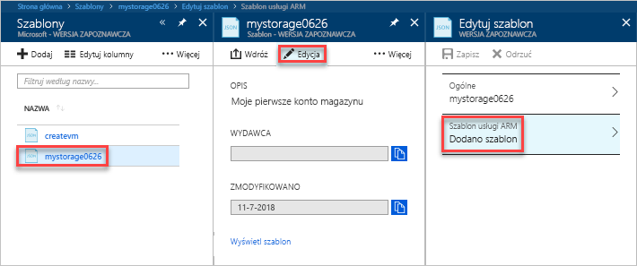

# <a name="quickstart-create-and-deploy-azure-resource-manager-templates-by-using-the-azure-portal"></a>Szybki start: Tworzenie i wdrażanie szablonów usługi Azure Resource Manager przy użyciu witryny Azure portal

Dowiedz się, jak utworzyć swój pierwszy szablon usługi Azure Resource Manager, generując go przy użyciu witryny Azure Portal, oraz jak edytować i wdrożyć ten szablon z poziomu tej witryny.

Szablony usługi Resource Manager są plikami JSON definiującymi zasoby, które należy wdrożyć dla danego rozwiązania. Tworzenia szablonu nie trzeba zawsze zaczynać od podstaw. Ten samouczek zawiera informacje na temat generowania szablonu z poziomu witryny Azure Portal. Następnie możesz dostosować te szablon i wdrożyć go.

Instrukcje w tym samouczku umożliwiają utworzenie konta usługi Azure Storage. Ten sam proces można zastosować do tworzenia innych zasobów platformy Azure.

Jeśli nie masz subskrypcji platformy Azure, przed rozpoczęciem [utwórz bezpłatne konto](https://azure.microsoft.com/free/).

## <a name="generate-a-template-using-the-portal"></a>Generowanie szablonu przy użyciu witryny Azure Portal

W tej sekcji utworzysz konto magazynu przy użyciu witryny Azure Portal. Przed wdrożeniem konta magazynu możesz eksplorować szablon wygenerowany w witrynie Azure Portal na podstawie konfiguracji. Szablon możesz zapisać i użyć go ponownie w przyszłości.

1. Zaloguj się w witrynie [Azure Portal](https://portal.azure.com).
2. Wybierz pozycję **Utwórz zasób** > **Storage** > **Konto usługi Storage — Blob, File, Table, Queue**.

    
3. Wprowadź następujące informacje. Sprawdź, czy wybrano pozycję **Opcje automatyzacji** zamiast **Utwórz** w następnym kroku, dzięki czemu możliwe będzie wyświetlenie szablonu przed jego wdrożeniem.

    - **Nazwa**: nadaj unikatową nazwę kontu magazynu. Na zrzucie ekranu nazwa to *mystorage0626*.
    - **Grupa zasobów**: utwórz nową grupę zasobów platformy Azure o wybranej nazwie. Na zrzucie ekranu nazwa grupy zasobów to *mystorage0626rg*.

    Dla pozostałych właściwości możesz użyć wartości domyślnych.

    

    > [!NOTE]
    > W niektórych z wyeksportowanych szablonów należy wprowadzić pewne zmiany przed ich wdrożeniem.

4. Wybierz pozycję **Opcje automatyzacji** w dolnej części ekranu. W witrynie Azure Portal szablon jest wyświetlany na karcie **Szablon**:

    

    W okienku głównym wyświetlany jest szablon. Jest to plik JSON z czterema elementami najwyższego poziomu. Aby uzyskać więcej informacji, zobacz [Understand the structure and syntax of Azure Resource Manager templates (Omówienie struktury i składni szablonów usługi Azure Resource Manager)](./resource-group-authoring-templates.md).

    W ramach elementu **Parametr** jest zdefiniowanych pięć parametrów. Aby wyświetlić wartości podane podczas wdrażania, wybierz kartę **Parametry**.

    

    Są to wartości skonfigurowane w poprzedniej sekcji. Za pomocą pliku szablonu i pliku parametrów możesz utworzyć konto usługi Azure Storage.

5. Powyżej kart znajdują się trzy elementy menu:

    - **Pobierz**: służy do pobierania pliku szablonu i pliku parametrów na komputer lokalny.
    - **Dodaj do biblioteki**: służy do dodawania szablonu do biblioteki w celu jego ponownego użycia w przyszłości.
    - **Wdróż**: służy do wdrażania konta usługi Azure Storage na platformie Azure.

    W tym samouczku użyta zostanie opcja **Dodaj do biblioteki**.

6. Wybierz pozycję **Dodaj do biblioteki**.
7. Wprowadź wartości w polach **Nazwa** i **Opis**, a następnie wybierz pozycję **Zapisz**.

> [!NOTE]
> Funkcja biblioteki szablonów jest w wersji zapoznawczej. Większość osób decyduje się zapisywać swoje szablony na komputerze lokalnym lub w publicznym magazynie, takim jak Github.  

## <a name="edit-and-deploy-the-template"></a>Edytowanie i wdrażanie szablonu

W tej sekcji zostaną wykonane następujące czynności: otwarcie zapisanego szablonu z biblioteki szablonów, edycja szablonu w witrynie Azure Portal i wdrożenie poprawionego szablonu. Aby edytować bardziej złożony szablon, rozważ użycie programu [Visual Studio Code](./resource-manager-quickstart-create-templates-use-visual-studio-code.md), który zapewnia bardziej zaawansowane funkcje edycji.

Platforma Azure wymaga, aby każda usługa miała unikatową nazwę. Wdrożenie zakończy się niepowodzeniem, jeśli zostanie wprowadzona już istniejąca nazwa konta magazynu. Aby uniknąć tego problemu, można użyć wywołania funkcji szablonu uniquestring() w celu wygenerowania unikatowej nazwy konta magazynu.

1. W witrynie Azure Portal wybierz pozycję **Wszystkie usługi** z menu po lewej stronie, wprowadź wartość **szablon** w polu filtru, a następnie wybierz pozycję **Szablon (wersja zapoznawcza)**.

    
2. Wybierz szablon zapisany w ostatniej sekcji. Nazwa używana na zrzucie ekranu to *mystorage0626*.
3. Wybierz pozycję **Edytuj**, a następnie wybierz pozycję **Dodany szablon**.

    

4. Dodaj element **zmienne**, a następnie dodaj jedną zmienną, jak pokazano na poniższym zrzucie ekranu:

    ```json
    "variables": {
        "storageAccountName": "[concat(uniquestring(resourceGroup().id), 'standardsa')]"
    },
    ```
    

    W tym miejscu są używane dwie funkcje: *concat()* i *uniqueString()*. Funkcja uniqueString() jest pomocna przy tworzeniu unikatowej nazwy zasobu.

5. Usuń parametr **nazwa** wyróżniony na poprzednim zrzucie ekranu.
6. Zaktualizuj element name zasobu **Microsoft.Storage/storageAccounts**, aby użyta została nowo zdefiniowana zmienna zamiast parametru:

    ```json
    "name": "[variables('storageAccountName')]",
    ```

    Ostateczny szablon powinien wyglądać następująco:

    ```json
    {
        "$schema": "https://schema.management.azure.com/schemas/2015-01-01/deploymentTemplate.json#",
        "contentVersion": "1.0.0.0",
        "parameters": {
            "location": {
                "type": "string"
            },
            "accountType": {
                "type": "string"
            },
            "kind": {
                "type": "string"
            },
            "httpsTrafficOnlyEnabled": {
                "type": "bool"
            }
        },
        "variables": {
            "storageAccountName": "[concat(uniquestring(resourceGroup().id), 'standardsa')]"
        },
        "resources": [
            {
                "apiVersion": "2018-02-01",
                "name": "[variables('storageAccountName')]",
                "location": "[parameters('location')]",
                "type": "Microsoft.Storage/storageAccounts",
                "sku": {
                    "name": "[parameters('accountType')]"
                },
                "kind": "[parameters('kind')]",
                "properties": {
                    "supportsHttpsTrafficOnly": "[parameters('httpsTrafficOnlyEnabled')]",
                    "encryption": {
                        "services": {
                            "blob": {
                                "enabled": true
                            },
                            "file": {
                                "enabled": true
                            }
                        },
                        "keySource": "Microsoft.Storage"
                    }
                },
                "dependsOn": []
            }
        ]
    }
    ```
7. Wybierz przycisk **OK**, a następnie wybierz przycisk **Zapisz**, aby zapisać zmiany.
8. Wybierz pozycję **Wdróż**.
9. Wprowadź następujące wartości:

    - **Subskrypcja**: wybierz subskrypcję platformy Azure.
    - **Grupa zasobów**: nadaj grupie zasobów unikatową nazwę.
    - **Lokalizacja**: wybierz lokalizację grupy zasobów.
    - **Lokalizacja**: wybierz lokalizację konta magazynu.  Możesz użyć tej samej lokalizacji co w przypadku grupy zasobów.
    - **Typ konta**: wprowadź wartość **Standard_LRS** na potrzeby tego przewodnika Szybki start.
    - **Rodzaj**: wprowadź wartość **Storage** na potrzeby tego przewodnika Szybki start.
    - **Włączone tylko dla ruchu HTTPS**.  Wybierz wartość **false** na potrzeby tego przewodnika Szybki start.
    - **Wyrażam zgodę na powyższe warunki i postanowienia**: (wybierz)

    Poniżej przedstawiono zrzut ekranu przedstawiający przykładowe wdrożenie:

    

10. Wybierz pozycję **Kup**.
11. Wybierz ikonę dzwonka (powiadomienia) w górnej części ekranu, aby wyświetlić stan wdrożenia.

    

12. W okienku powiadomień wybierz pozycję **Przejdź do grupy zasobów**. Zobaczysz ekran podobny do poniższego:

    

    Możesz zobaczyć, że stan wdrożenia został oznaczony jako zakończony pomyślnie, natomiast w grupie zasobów jest tylko jedno konto magazynu. Nazwa konta magazynu jest unikatowym ciągiem wygenerowanym przez szablon. Aby dowiedzieć się więcej o korzystaniu z kont magazynu platformy Azure, zobacz przewodnik [Szybki start — przekazywanie, pobieranie i wyświetlanie listy obiektów blob za pomocą witryny Azure Portal](../storage/blobs/storage-quickstart-blobs-portal.md).

## <a name="clean-up-resources"></a>Oczyszczanie zasobów

Gdy zasoby platformy Azure nie będą już potrzebne, wyczyść wdrożone zasoby, usuwając grupę zasobów.

1. W witrynie Azure Portal wybierz pozycję **Grupy zasobów** w menu po lewej stronie.
2. Wprowadź nazwę grupy zasobów w polu **Filtruj według nazwy**.
3. Wybierz nazwę grupy zasobów.  Zostanie wyświetlone konto magazynu w grupie zasobów.
4. Wybierz pozycję **Usuń grupę zasobów** w górnym menu.

## <a name="next-steps"></a>Następne kroki

W tym samouczku przedstawiono sposób generowania i wdrażania szablonu w witrynie Azure Portal. Szablon używany w tym przewodniku Szybki start to prosty szablon z jednym zasobem platformy Azure. Gdy szablon jest złożony, do jego tworzenia łatwiej jest użyć programu Visual Studio Code lub Visual Studio. W kolejnym przewodniku Szybki start pokazano również sposób wdrażania szablonów przy użyciu programu Azure PowerShell i interfejsu wiersza polecenia (CLI) platformy Azure.

> [!div class="nextstepaction"]
> [Tworzenie szablonów przy użyciu programu Visual Studio Code](./resource-manager-quickstart-create-templates-use-visual-studio-code.md)
