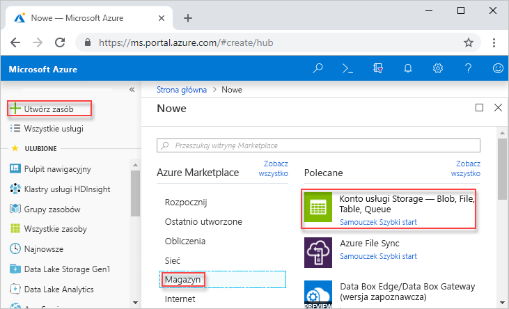
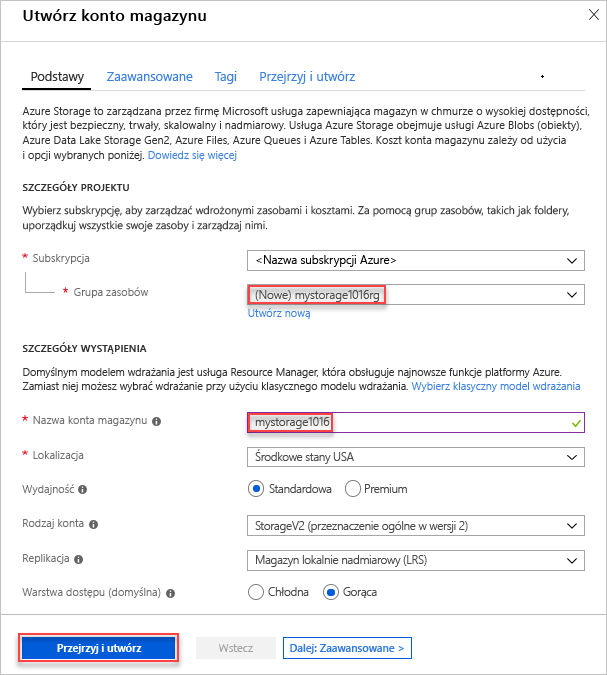
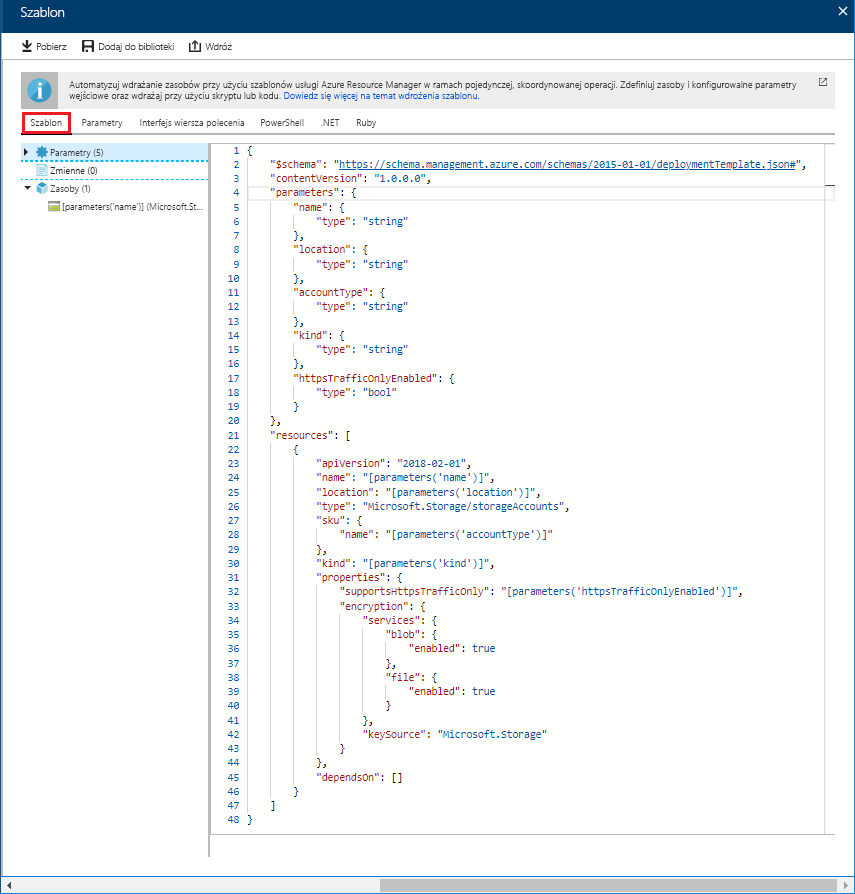
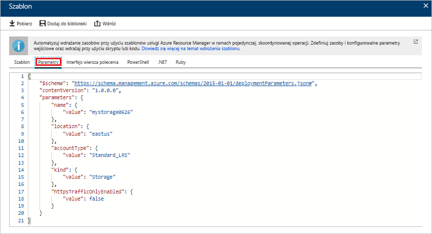
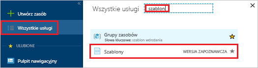
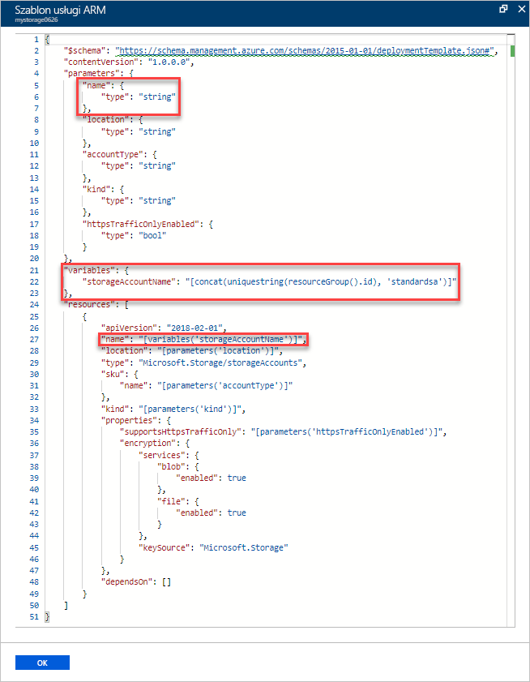
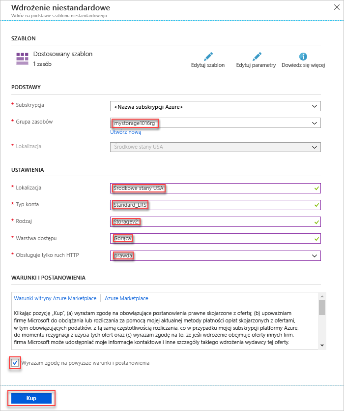
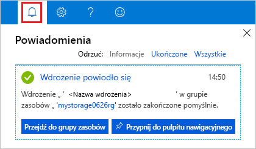
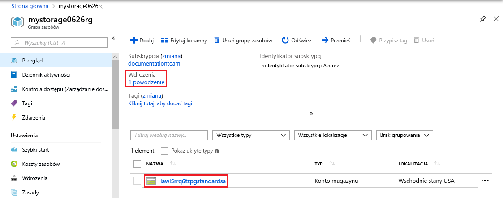

# <a name="quickstart-create-and-deploy-azure-resource-manager-templates-by-using-the-azure-portal"></a>Szybki start: Tworzenie i wdrażanie szablonów usługi Azure Resource Manager przy użyciu witryny Azure portal

Dowiedz się, jak wygenerować szablon usługi Resource Manager przy użyciu witryny Azure Portal, oraz poznaj proces edytowania i wdrażania tego szablonu z poziomu portalu. Szablony usługi Resource Manager są plikami JSON definiującymi zasoby, które należy wdrożyć dla danego rozwiązania. Aby zrozumieć pojęcia związane z wdrażaniem rozwiązań platformy Azure i zarządzaniem nimi, zobacz [Usługa Azure Resource Manager — omówienie](resource-group-overview.md).


Po ukończeniu tego samouczka zostanie wdrożone konto usługi Azure Storage. Ten sam proces umożliwia wdrażanie innych zasobów platformy Azure.

Jeśli nie masz subskrypcji platformy Azure, przed rozpoczęciem [utwórz bezpłatne konto](https://azure.microsoft.com/free/).

## <a name="generate-a-template-using-the-portal"></a>Generowanie szablonu przy użyciu witryny Azure Portal

Tworzenie szablonu Menedżer zasobów od podstaw nie jest łatwym zadaniem, szczególnie jeśli jesteś nowym wdrożeniem platformy Azure, a nie masz doświadczenia z formatem JSON. W witrynie Azure Portal możesz skonfigurować zasób, na przykład konto usługi Azure Storage. Przed przystąpieniem do wdrażania zasobu możesz wyeksportować konfigurację do szablonu usługi Resource Manager. Szablon możesz zapisać i użyć go ponownie w przyszłości.

Wielu doświadczonych deweloperów szablonów używa tej metody do generowania szablonów podczas próby wdrożenia zasobów platformy Azure, których nie znają. Aby uzyskać więcej informacji na temat eksportowania szablonów przy użyciu portalu, zobacz [Eksportowanie grup zasobów do szablonów](./manage-resource-groups-portal.md#export-resource-groups-to-templates). Innym sposobem znalezienia szablonu roboczego jest korzystanie z [szablonów szybkiego startu platformy Azure](https://azure.microsoft.com/resources/templates/).

1. W przeglądarce internetowej przejdź do [Azure Portal](https://portal.azure.com) i zaloguj się.
2. Z menu Azure Portal wybierz pozycję **Utwórz zasób**.

    

3. Wybierz pozycję **magazyn** > **konto magazynu**.

    
1. Wprowadź następujące informacje:

    |Nazwa|Wartość|
    |----|----|
    |**Grupa zasobów**|Wybierz pozycję **Utwórz nową** i podaj wybraną nazwę grupy zasobów. Na zrzucie ekranu nazwa grupy zasobów to *mystorage1016rg*. Grupa zasobów jest kontenerem zasobów platformy Azure. Grupa zasobów ułatwia zarządzanie zasobami platformy Azure. |
    |**Nazwa**|nadaj unikatową nazwę kontu magazynu. Nazwa konta magazynu musi być unikatowa we wszystkich wersjach systemu Azure i zawierać tylko małe litery i cyfry. Nazwa musi mieć długość od 3 do 24 znaków. Jeśli zostanie wyświetlony komunikat o błędzie informujący o tym, że "nazwa konta magazynu" mystorage1016 "jest już zajęta, spróbuj użyć **&lt;swojej nazwy > magazynu&lt;dzisiejszej daty w MMDD >** , na przykład **johndolestorage1016**. Aby uzyskać więcej informacji, zobacz [reguły nazewnictwa i ograniczenia](/azure/cloud-adoption-framework/ready/considerations/naming-and-tagging#resource-naming).|

    Dla pozostałych właściwości możesz użyć wartości domyślnych.

    

    > [!NOTE]
    > W niektórych z wyeksportowanych szablonów należy wprowadzić pewne zmiany przed ich wdrożeniem.

5. Wybierz pozycję **Przeglądanie + tworzenie** w dolnej części ekranu. Nie wybieraj opcji **Utwórz** w następnym kroku.
6. Wybierz pozycję **Pobierz szablon do automatyzacji** w dolnej części ekranu. W portalu zostanie wyświetlony wygenerowany szablon:

    

    W okienku głównym wyświetlany jest szablon. Jest to plik JSON z sześcioma elementami najwyższego poziomu — `schema`, `contentVersion`, `parameters`, `variables`, `resources` i `output`. Aby uzyskać więcej informacji, zobacz [Understand the structure and syntax of Azure Resource Manager templates (Omówienie struktury i składni szablonów usługi Azure Resource Manager)](./resource-group-authoring-templates.md).

    Istnieje sześć zdefiniowanych parametrów. Jeden z nich jest nazywany **storageAccountName**. Druga wyróżniona część na poprzednim zrzucie ekranu pokazuje, jak odwoływać się do tego parametru w szablonie. W następnej sekcji będziesz edytować szablon w celu użycia wygenerowanej nazwy konta magazynu.

    W szablonie zdefiniowany jest jeden zasób platformy Azure. Typ jest `Microsoft.Storage/storageAccounts`. Zapoznaj się z definicją zasobu i strukturą definicji.
7. Wybierz pozycję **Pobierz** w górnej części ekranu.
8. Otwórz pobrany plik zip, a następnie Zapisz **szablon Template. JSON** na komputerze. W następnej sekcji użyjesz narzędzia do wdrażania szablonu do edycji szablonu.
9. Wybierz kartę **Parametr**, aby zobaczyć wartości podane dla parametrów. Zapisz te wartości, ponieważ będą potrzebne w następnej sekcji podczas wdrażania szablonu.

    

    Korzystając z pliku szablonu i pliku parametrów, można utworzyć zasób, w tym samouczku, koncie usługi Azure Storage.

## <a name="edit-and-deploy-the-template"></a>Edytowanie i wdrażanie szablonu

Witryna Azure Portal może służyć do wykonywania niektórych podstawowych czynności edycji szablonu. W tym przewodniku Szybki start użyjesz narzędzia portalu o nazwie *Wdrożenie szablonu*. Narzędzie *Wdrożenie szablonu* jest używane w tym samouczku, aby umożliwić ukończenie całego samouczka przy użyciu jednego interfejsu — witryny Azure Portal. Aby edytować bardziej złożony szablon, rozważ użycie programu [Visual Studio Code](./resource-manager-quickstart-create-templates-use-visual-studio-code.md), który zapewnia bardziej zaawansowane funkcje edycji.

> [!IMPORTANT]
> Wdrożenie szablonu udostępnia interfejs do testowania prostych szablonów. Nie zaleca się korzystania z tej funkcji w środowisku produkcyjnym. Zamiast tego należy przechowywać szablony na koncie usługi Azure Storage lub w repozytorium kodu źródłowego, takim jak GitHub.

Platforma Azure wymaga, aby każda usługa miała unikatową nazwę. Wdrożenie może zakończyć się niepowodzeniem, jeśli zostanie wprowadzona już istniejąca nazwa konta magazynu. W celu uniknięcia tego problemu zmodyfikuj szablon, aby użyć wywołania funkcji szablonu `uniquestring()` do wygenerowania unikatowej nazwy konta magazynu.

1. W menu Azure Portal lub na stronie **głównej** wybierz pozycję **Utwórz zasób**.
2. W obszarze **Przeszukaj witrynę Marketplace** wpisz **wdrożenie szablonu**, a następnie naciśnij klawisz **ENTER**.
3. Wybierz pozycję **Wdrożenie szablonu**.

    
4. Wybierz pozycję **Utwórz**.
5. Wybierz pozycję **Utwórz własny szablon w edytorze**.
6. Wybierz pozycję **Załaduj plik**, a następnie postępuj zgodnie z instrukcjami, aby załadować plik template.json pobrany w poprzedniej sekcji.
7. Wprowadź następujące trzy zmiany w szablonie:

    

   - Usuń parametr **storageAccountName** , jak pokazano na poprzednim zrzucie ekranu.
   - Dodaj jedną zmienną o nazwie **storageAccountName** , jak pokazano na poprzednim zrzucie ekranu:

       ```json
       "storageAccountName": "[concat(uniqueString(subscription().subscriptionId), 'storage')]"
       ```

       W tym miejscu są używane dwie funkcje szablonów: `concat()` i `uniqueString()`.
   - Zaktualizuj element name zasobu **Microsoft.Storage/storageAccounts**, aby użyta została nowo zdefiniowana zmienna zamiast parametru:

       ```json
       "name": "[variables('storageAccountName')]",
       ```

     Ostateczny szablon powinien wyglądać następująco:

     ```json
     {
       "$schema": "https://schema.management.azure.com/schemas/2015-01-01/deploymentTemplate.json#",
       "contentVersion": "1.0.0.0",
       "parameters": {
           "location": {
               "type": "string"
           },
           "accountType": {
               "type": "string"
           },
           "kind": {
               "type": "string"
           },
           "accessTier": {
               "type": "string"
           },
           "supportsHttpsTrafficOnly": {
               "type": "bool"
           }
       },
       "variables": {
           "storageAccountName": "[concat(uniqueString(subscription().subscriptionId), 'storage')]"
       },
       "resources": [
           {
               "name": "[variables('storageAccountName')]",
               "type": "Microsoft.Storage/storageAccounts",
               "apiVersion": "2018-07-01",
               "location": "[parameters('location')]",
               "properties": {
                   "accessTier": "[parameters('accessTier')]",
                   "supportsHttpsTrafficOnly": "[parameters('supportsHttpsTrafficOnly')]"
               },
               "dependsOn": [],
               "sku": {
                   "name": "[parameters('accountType')]"
               },
               "kind": "[parameters('kind')]"
           }
       ],
       "outputs": {}
     }
     ```
8. Wybierz pozycję **Zapisz**.
9. Wprowadź następujące wartości:

    |Nazwa|Wartość|
    |----|----|
    |**Grupa zasobów**|Wybierz nazwę grupy zasobów utworzoną w ostatniej sekcji. |
    |**Lokalizacja**|Wybierz lokalizację dla konta magazynu. Na przykład **Środkowe stany USA**. |
    |**Typ konta**|wprowadź wartość **Standard_LRS** na potrzeby tego przewodnika Szybki start. |
    |**Natur**|wprowadź wartość **StorageV2** na potrzeby tego przewodnika Szybki start. |
    |**Warstwa dostępu**|wprowadź wartość **Gorąca** na potrzeby tego przewodnika Szybki start. |
    |**Ruch https jest włączony tylko**| Wybierz wartość **true** na potrzeby tego przewodnika Szybki start. |
    |**Wyrażam zgodę na powyższe warunki i postanowienia**|zaznaczenia|

    Poniżej przedstawiono zrzut ekranu przedstawiający przykładowe wdrożenie:

    

10. Wybierz pozycję **Kup**.
11. Wybierz ikonę dzwonka (powiadomienia) w górnej części ekranu, aby wyświetlić stan wdrożenia. Powinien zostać wyświetlony komunikat **Wdrożenie jest w toku**. Poczekaj na zakończenie wdrożenia.

    

12. W okienku powiadomień wybierz pozycję **Przejdź do grupy zasobów**. Zobaczysz ekran podobny do poniższego:

    

    Możesz zobaczyć, że stan wdrożenia został oznaczony jako zakończony pomyślnie, natomiast w grupie zasobów jest tylko jedno konto magazynu. Nazwa konta magazynu jest unikatowym ciągiem wygenerowanym przez szablon. Aby dowiedzieć się więcej o korzystaniu z kont magazynu platformy Azure, zobacz przewodnik [Szybki start — przekazywanie, pobieranie i wyświetlanie listy obiektów blob za pomocą witryny Azure Portal](../storage/blobs/storage-quickstart-blobs-portal.md).

## <a name="clean-up-resources"></a>Oczyszczanie zasobów

Gdy zasoby platformy Azure nie będą już potrzebne, wyczyść wdrożone zasoby, usuwając grupę zasobów.

1. W witrynie Azure Portal wybierz pozycję **Grupy zasobów** w menu po lewej stronie.
2. Wprowadź nazwę grupy zasobów w polu **Filtruj według nazwy**.
3. Wybierz nazwę grupy zasobów.  Zostanie wyświetlone konto magazynu w grupie zasobów.
4. Wybierz pozycję **Usuń grupę zasobów** w górnym menu.

## <a name="next-steps"></a>Następne kroki

W tym samouczku przedstawiono sposób generowania i wdrażania szablonu w witrynie Azure Portal. Szablon używany w tym przewodniku Szybki start to prosty szablon z jednym zasobem platformy Azure. Gdy szablon jest złożony, do jego tworzenia łatwiej jest użyć programu Visual Studio Code lub Visual Studio. Aby dowiedzieć się więcej na temat tworzenia szablonów, zobacz naszą nową serię samouczków dla początkujących:

> [!div class="nextstepaction"]
> [Samouczki początkującego](./template-tutorial-create-first-template.md)