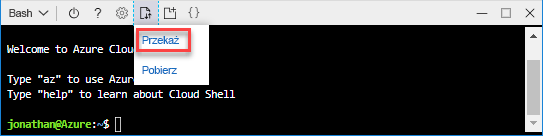
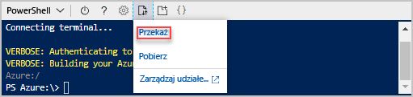

# <a name="quickstart-create-azure-resource-manager-templates-by-using-visual-studio-code"></a>Szybki Start: Tworzenie szablonów Azure Resource Manager przy użyciu Visual Studio Code

Dowiedz się, jak tworzyć i edytować szablony Azure Resource Manager przy użyciu programu Visual Studio Code i rozszerzenia narzędzi Azure Resource Manager. Szablony Menedżer zasobów można utworzyć w Visual Studio Code bez rozszerzenia, ale rozszerzenie zawiera opcje Autouzupełniania, które upraszczają programowanie szablonów. Aby zrozumieć koncepcje związane z wdrażaniem rozwiązań platformy Azure i zarządzaniem nimi, zobacz [Azure Resource Manager omówienie](resource-group-overview.md).

W tym przewodniku szybki start wdrożono konto magazynu:


Jeśli nie masz subskrypcji platformy Azure, przed rozpoczęciem [Utwórz bezpłatne konto](https://azure.microsoft.com/free/) .

## <a name="prerequisites"></a>Wymagania wstępne

Do wykonania tego artykułu są potrzebne następujące czynności:

- [Visual Studio Code](https://code.visualstudio.com/).
- Rozszerzenie narzędzi Menedżer zasobów. Aby przeprowadzić instalację, wykonaj następujące kroki:

    1. Otwórz Visual Studio Code.
    2. Naciśnij **klawisze CTRL + SHIFT + X** , aby otworzyć okienko rozszerzenia
    3. Wyszukaj **Azure Resource Manager narzędzia**, a następnie wybierz pozycję **Zainstaluj**.
    4. Wybierz pozycję **Załaduj ponownie** , aby zakończyć instalację rozszerzenia.

## <a name="open-a-quickstart-template"></a>Otwórz szablon szybkiego startu

Zamiast tworzyć szablon od podstaw, należy otworzyć szablon z [szablonów szybkiego startu platformy Azure](https://azure.microsoft.com/resources/templates/). Szablony szybkiego startu platformy Azure to repozytorium szablonów Menedżer zasobów.

Szablon używany w tym przewodniku szybki start nazywa się [Tworzenie konta magazynu w warstwie Standardowa](https://azure.microsoft.com/resources/templates/101-storage-account-create/). Szablon definiuje zasób konta usługi Azure Storage.

1. W obszarze Visual Studio Code wybierz pozycję **plik**>**Otwórz plik**.
2. W polu **Nazwa pliku**wklej następujący adres URL:

    ```url
    https://raw.githubusercontent.com/Azure/azure-quickstart-templates/master/101-storage-account-create/azuredeploy.json
    ```

3. Wybierz pozycję **Otwórz** , aby otworzyć plik.
4. Wybierz pozycję **plik**>**Zapisz jako,** aby zapisać plik AS **azuredeploy. JSON** na komputerze lokalnym.

## <a name="edit-the-template"></a>Edytuj szablon

Aby dowiedzieć się, jak edytować szablon przy użyciu Visual Studio Code, należy dodać jeden element do sekcji `outputs` w celu wyświetlenia identyfikatora URI magazynu.

1. Dodaj jeden element wyjściowy do wyeksportowanego szablonu:

    ```json
    "storageUri": {
      "type": "string",
      "value": "[reference(variables('storageAccountName')).primaryEndpoints.blob]"
    }
    ```

    Gdy skończysz, sekcja Outputs będzie wyglądać następująco:

    ```json
    "outputs": {
      "storageAccountName": {
        "type": "string",
        "value": "[variables('storageAccountName')]"
      },
      "storageUri": {
        "type": "string",
        "value": "[reference(variables('storageAccountName')).primaryEndpoints.blob]"
      }
    }
    ```

    Jeśli skopiowano i wklejono kod wewnątrz Visual Studio Code, spróbuj ponownie wpisać element **Value** , aby skorzystać z funkcji IntelliSense rozszerzenia narzędzi Menedżer zasobów Tools.

    

2. Wybierz pozycję **plik**>**Zapisz** , aby zapisać plik.

## <a name="deploy-the-template"></a>Wdróż szablon

Istnieje wiele metod wdrażania szablonów. Usługa Azure Cloud Shell jest używana w tym przewodniku Szybki Start. Usługa Cloud Shell obsługuje interfejs wiersza polecenia platformy Azure i Azure PowerShell. Użyj selektora kart, aby wybrać między interfejsem wiersza polecenia a programem PowerShell.

[!INCLUDE [updated-for-az](../../includes/updated-for-az.md)]

1. Logowanie się do [usługi Azure Cloud Shell](https://shell.azure.com)

2. Wybierz preferowane środowisko, wybierając opcję **PowerShell** lub **bash**(CLI) w lewym górnym rogu.  Po przełączeniu jest wymagane ponowne uruchomienie powłoki.

    # <a name="clitabcli"></a>[Interfejs wiersza polecenia](#tab/CLI)

    

    # <a name="powershelltabpowershell"></a>[Narzędzia](#tab/PowerShell)

    

    ---

3. Wybierz pozycję **pliki do przekazania/pobrania**, a następnie wybierz pozycję **Przekaż**.

    # <a name="clitabcli"></a>[Interfejs wiersza polecenia](#tab/CLI)

    

    # <a name="powershelltabpowershell"></a>[Narzędzia](#tab/PowerShell)

    

    ---

    Wybierz plik zapisany w poprzedniej sekcji. Nazwa domyślna to **azuredeploy. JSON**. Plik szablonu musi być dostępny z poziomu powłoki.

    Opcjonalnie można użyć polecenia **ls** i **Cat** polecenia, aby sprawdzić, czy plik został pomyślnie przekazany.

    # <a name="clitabcli"></a>[Interfejs wiersza polecenia](#tab/CLI)

    

    # <a name="powershelltabpowershell"></a>[Narzędzia](#tab/PowerShell)

    

    ---
4. W usłudze Cloud Shell Uruchom następujące polecenia. Wybierz kartę, aby wyświetlić kod programu PowerShell lub kod interfejsu wiersza polecenia.

    # <a name="clitabcli"></a>[Interfejs wiersza polecenia](#tab/CLI)
    ```azurecli
    echo "Enter the Resource Group name:" &&
    read resourceGroupName &&
    echo "Enter the location (i.e. centralus):" &&
    read location &&
    az group create --name $resourceGroupName --location "$location" &&
    az group deployment create --resource-group $resourceGroupName --template-file "$HOME/azuredeploy.json"
    ```

    # <a name="powershelltabpowershell"></a>[Narzędzia](#tab/PowerShell)

    ```azurepowershell
    $resourceGroupName = Read-Host -Prompt "Enter the Resource Group name"
    $location = Read-Host -Prompt "Enter the location (i.e. centralus)"

    New-AzResourceGroup -Name $resourceGroupName -Location "$location"
    New-AzResourceGroupDeployment -ResourceGroupName $resourceGroupName -TemplateFile "$HOME/azuredeploy.json"
    ```

    ---

    Zaktualizuj nazwę pliku szablonu, jeśli zapiszesz plik pod nazwą inną niż **azuredeploy. JSON**.

    Poniższy zrzut ekranu przedstawia przykładowe wdrożenie:

    # <a name="clitabcli"></a>[Interfejs wiersza polecenia](#tab/CLI)

    

    # <a name="powershelltabpowershell"></a>[Narzędzia](#tab/PowerShell)

    

    ---

    Nazwa konta magazynu i adres URL magazynu w sekcji dane wyjściowe są wyróżnione na zrzucie ekranu. W następnym kroku potrzebna jest nazwa konta magazynu.

5. Uruchom następujące polecenie interfejsu wiersza polecenia lub programu PowerShell, aby wyświetlić listę nowo utworzonego konta magazynu:

    # <a name="clitabcli"></a>[Interfejs wiersza polecenia](#tab/CLI)
    ```azurecli
    echo "Enter the Resource Group name:" &&
    read resourceGroupName &&
    echo "Enter the Storage Account name:" &&
    read storageAccountName &&
    az storage account show --resource-group $resourceGroupName --name $storageAccountName
    ```

    # <a name="powershelltabpowershell"></a>[Narzędzia](#tab/PowerShell)

    ```azurepowershell
    $resourceGroupName = Read-Host -Prompt "Enter the Resource Group name"
    $storageAccountName = Read-Host -Prompt "Enter the Storage Account name"
    Get-AzStorageAccount -ResourceGroupName $resourceGroupName -Name $storageAccountName
    ```

    ---

Aby dowiedzieć się więcej o korzystaniu z kont usługi Azure Storage, zobacz [Szybki Start: przekazywanie, pobieranie i wyświetlanie listy obiektów BLOB przy użyciu Azure Portal](../storage/blobs/storage-quickstart-blobs-portal.md).

## <a name="clean-up-resources"></a>Czyszczenie zasobów

Gdy zasoby platformy Azure nie są już potrzebne, Oczyść wdrożone zasoby, usuwając grupę zasobów.

1. Z Azure Portal z menu po lewej stronie wybierz pozycję **Grupa zasobów** .
2. Wprowadź nazwę grupy zasobów w polu **Filtruj według nazwy** .
3. Wybierz nazwę grupy zasobów.  Zobaczysz łącznie sześć zasobów w grupie zasobów.
4. W górnym menu wybierz pozycję **Usuń grupę zasobów** .

## <a name="next-steps"></a>Następne kroki

Głównym celem tego przewodnika Szybki Start jest użycie Visual Studio Code do edytowania istniejącego szablonu z szablonów szybkiego startu platformy Azure. Wiesz również, jak wdrożyć szablon przy użyciu interfejsu wiersza polecenia lub programu PowerShell w usłudze Azure Cloud Shell. Szablony z szablonów szybkiego startu platformy Azure mogą nie zapewniać wszystkiego, czego potrzebujesz. Aby dowiedzieć się więcej na temat tworzenia szablonów, zobacz naszą nową serię samouczków dla początkujących:

> [!div class="nextstepaction"]
> [Samouczki początkującego](./template-tutorial-create-first-template.md)
