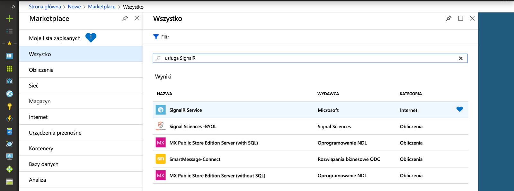
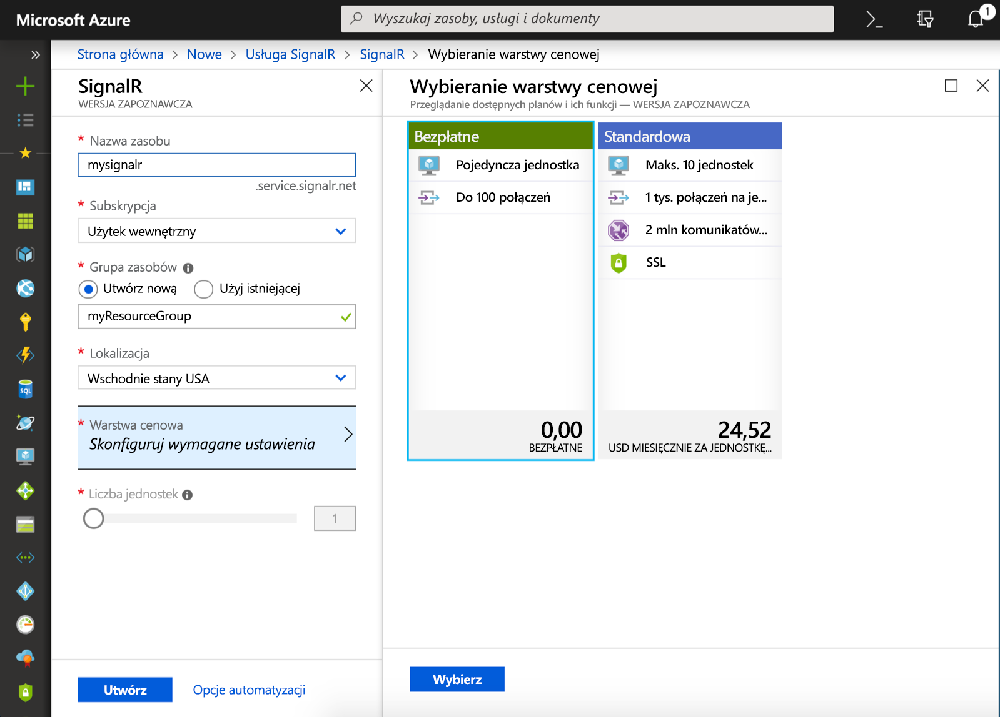

## Tworzenie wystąpienia usługi Azure SignalR Service

Twoja aplikacja nawiąże połączenie z wystąpieniem usługi SignalR na platformie Azure.

1. Wybierz przycisk Nowy znajdujący się w lewym górnym rogu witryny Azure Portal. Na ekranie Nowy wpisz nazwę *SignalR Service* w polu wyszukiwania, a następnie naciśnij klawisz Enter.

    

1. Wybierz pozycję **SignalR Service** w wynikach wyszukiwania, a następnie wybierz pozycję **Utwórz**.

1. Wprowadź następujące ustawienia.

    | Ustawienie      | Sugerowana wartość  | Opis                                        |
    | ------------ |  ------- | -------------------------------------------------- |
    | **Nazwa zasobu** | Nazwa unikatowa w skali globalnej | Nazwa identyfikująca nowe wystąpienie usługi SignalR Service. Prawidłowe znaki to `a-z`, `0-9` i `-`.  | 
    | **Subskrypcja** | Twoja subskrypcja | Subskrypcja, w ramach której jest tworzone to nowe wystąpienie usługi SignalR Service. | 
    | **[Grupa zasobów](../../azure-resource-manager/management/overview.md)** |  myResourceGroup | Nazwa nowej grupy zasobów, w której ma zostać utworzone wystąpienie usługi SignalR Service. | 
    | **Lokalizacja** | Zachodnie stany USA | Wybierz [region](https://azure.microsoft.com/regions/) blisko siebie. |
    | **Warstwa cenowa** | Bezpłatna | Wypróbuj bezpłatnie usługę Azure SignalR Service. |
    | **Liczba jednostek** |  Nie dotyczy | Liczba jednostek określa liczbę połączeń, które może akceptować wystąpienie usługi SignalR Service. Można to skonfigurować tylko w warstwie Standardowa. |
    | **Tryb serwisowy** |  Praca bezserwerowa | Do użytku z usługą Azure Functions lub REST API. |

    

1. Wybierz pozycję **Utwórz**, aby rozpocząć wdrażanie wystąpienia usługi SignalR Service.

1. Po wdrożeniu wystąpienia otwórz je w portalu i znajdź jego stronę Ustawienia. Zmień ustawienie trybu usługi na *Serverless* tylko wtedy, gdy używasz usługi Azure SignalR za pośrednictwem powiązania usługi Azure Functions lub interfejsu API REST. Pozostaw go w *klasycznym* lub *domyślnym* w inny sposób.